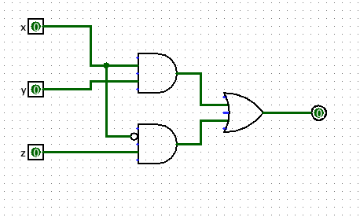

# A2

## Q1

### Propositional Symbols

$t$: the train arrives late  
$s$: there are taxis at the station  
$j$: john is late for his meeting  

### Premises

i) $(t\land\neg s)\rightarrow j$  
ii) $\neg j$  
iii) $t$

### Conclusion

i) $s$

### Validity

Proof by contradiction.

Assume  
$$
(t\land\neg s)\rightarrow j = 1 \quad (1) \\
\neg j=1 \quad (2) \\
t=1 \quad (3) \\
s = 0 \quad (4)
$$

By (4) we have $(\neg s)^t = 1$.  
By (1) we have $j^t = 1$ by definition since $(t\land\neg s)^t = 1$ from (3) and (4).  
We have a contradiction with (2), since $j^t=0$ is a tautological consequence of $(\neg j)^t = 1$.

Thus, this argument is valid.

## Q2

Suppose that there does not exist a propositional formula $A$, s.t. $\Sigma_1\vDash A$ and
$\Sigma_2\vDash(\neg A)$. Then, \Sigma_1\cup\Sigma_2$ must be satisfiable, since any
formula for any formula $B$ that satisfies $\Sigma_1\vDash B$, it must also satisfy
$\Sigma_2\vDash B$. Thus, $A$ must exist such that $\Sigma_1\vDash A$ and
$\Sigma_2\vDash(\neg A)$.

## Q3a)

$B = (x\land y\land z)\lor(x\land\neg y\land \neg z)\lor(\neg x\land y\land \neg z)\lor
(\neg x\land \neg y\land\neg z)$

## Q3b)

$C' = (x\land y\land\neg z)\lor(x\land\neg y\land z)\lor(\neg x\land y\land z)\lor
(\neg x\land\neg y\land z)$

## Q3c)

$C = (\neg x\lor\neg y\lor z)\land(\neg x\lor y\lor\neg z)\land(x\lor\neg y\lor\neg z)
\land(x\lor y\lor\neg z)$

## Q3d)

$$
(\neg r\lor\neg p)\land(\neg q\leftrightarrow r)\land(\neg s\leftrightarrow p)\land
\neg(q\lor s) \\
(\neg r\lor\neg p)\land((\neg q\land r)\lor(q\land\neg r))\land((\neg s\land p)\lor
(s\land\neg p))\land\neg(q\lor s);\quad (a\leftrightarrow b)\vDash
(a\land b)\lor(\neg a\land\neg b) \\
(\neg r\lor\neg p)\land((\neg q\land r)\lor(q\land\neg r))\land((\neg s\land p)\lor
(s\land\neg p))\land\neg q\land\neg s;\quad \text{Demorgan's Law} \\
(\neg r\lor \neg p)\land(\neg q\lor q)\land(\neg q\lor\neg r)\land(r\land q)\land
(r\lor\neg r)\land(\neg s\lor s)\land(\neg s\lor \neg p)\land(p\lor s)\land(p\lor\neg p)
\land\neg q\land\neg s;\quad \text{Distribution} \\
$$

## Q4a)

The truth table for $\rightarrow$ is:
| a | b | c |
| --- | --- | --- |
| 1 | 1 | 1 |
| 1 | 0 | 0 |
| 0 | 1 | 1 |
| 0 | 0 | 1 |

By definition, since $g_{13}$ satisfies row 2, then it is adequate for propositional logic.

## Q4b)

## Q5a)

$$
\begin{aligned}
& xyz + \bar{x}yz + xy\bar{z}+\bar{xy}z & \\
& yz(x + \bar{x}) + xy\bar{z} + \bar{xy}z & \text{Distributive Law} \\
& yz + xy\bar{z} + \bar{xy}z & \text{Complement Law, Identity Law} \\
& y(z + x\bar{z}) + \bar{xy}z & \text{Distributive Law} \\
& y(z + x) + \bar{xy}z & \text{Absorption Law} \\
& yx + yz + \bar{xy}z & \text{Distribution} \\
& yx + z(y + \bar{xy}) & \text{Distributive Law} \\
& yx + z(y + \bar{x}) & \text{Absorption Law} \\
& yx + z\bar{x} + zy & \text{Distribution} \\
& yx + z\bar x & \text{Consensus Law}
\end{aligned}
$$

## Q5b)

## Q6

a) Dead code because $x < y$, but it asserts $x > 3 > 2 > y$.  
b) Not dead code. Let $x = 0, y=1$.  
c) Not dead code. Let $x = 8, y = 10$.  
d) Not dead code. Let $x = 10000000, y = 8$.  
e) Dead code, since $2\times12\mod 8 = 0$  
f) Dead code since $a^2$ is always an even number. The only exception is when $a=1$. However,
when $x=1, y=1$, we get $2 % 4 != 3$, and for any other number, since it will be even, it will
be at most remainder 2.

