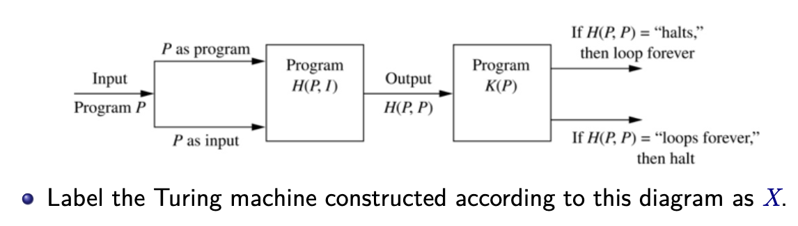
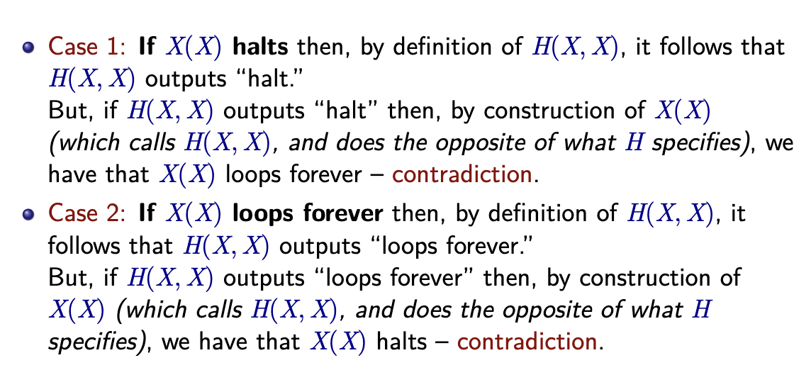

# Final Exam Notes

## Tautological Equivalence

$a\to b\vDash \neg a\lor b$

## Unique Readability Theorem

Every formula in Form$(\mathcal L^p)$ is of exactly one of six forms: an atom,
$(\neg B), (B\lor C), (B\land C), (B\to C)$ or $B\leftrightarrow C$.

## Duality Theorem

Suppose $A$ is a formula in Form$(\mathcal L^p)$ composed only of atoms and
the connectives $\neg,\land,\lor$. Suppose $\Delta(A)$ is the results from 
simultaneously swapping $\land$ with $\lor$ and vice versa, and each atom
with its negation. Then $\Delta(A)\vDash\neg A$.

## DNF and CNF

Can get DNF from truth table using all the true valuations, and $\lor$ing them
together.

Can get CNF from truth table using duality theorem.

1. Use truth table for $(\neg f)$ to find its DNF$(\neg f)$|=|$(\neg f)$.
2. Compute the negation of DNF$(\neg f)$ with duality theorem.
3. $\Delta(\text{DNF}(\neg f))|=|\neg\text{DNF}(\neg f)|=|\neg(\neg f)|=|f$

## Boolean Algebra Laws

Identity, Complement, Associativity, Commutativity, Distributivity

## Half-Adder

|x|y|s|c|
|---|---|---|---|
|1|1|0|1|
|1|0|1|0|
|0|1|1|0|
|0|0|0|0|

## Formal Deduction Rules

1. (Ref) $A\vdash A$. (Reflexivity)
2. ($+$) If $\Sigma\vdash A$ then $\Sigma,\Sigma'\vdash A$.
(Addition of Premises)
3. ($\neg -$) If $\Sigma,\neg A\vdash B$ and $\Sigma,\neg A\vdash\neg B$ 
then $\Sigma\vdash A$. ($\neg$ elimination)
4. ($\to -$) If $\Sigma\vdash A\to B$ and $\Sigma\vdash A$ then
$\Sigma\vdash B$. ($\to$ elimination)
5. ($\to +$) If $\Sigma, A\vdash B$ then $\Sigma\vdash A\to B$ 
($\to$ introduction)
6. ($\land -$) If $\Sigma\vdash A\land B$ then $\Sigma\vdash A$ 
and $\Sigma\vdash B$. ($\land$ elimination)
7. ($\land +$) If $\Sigma\vdash A$  and $\Sigma\vdash B$  then
$\Sigma\vdash A\land B$ ($\land$ introduction)
8. ($\lor -$) If $\Sigma, A\vdash C$ and $\Sigma, B\vdash C$ then $\Sigma, A\lor B\vdash C$
. ($\lor$ elimination)
9. ($\lor +$) If $\Sigma\vdash A$ then $\Sigma\vdash A\lor B$ and $\Sigma\vdash B\lor A$.
($\lor$ introduction)
10. ($\leftrightarrow -$) If $\Sigma\vdash A\leftrightarrow B$ and $\Sigma\vdash A$ then
$\Sigma\vdash B$ (and vice versa). ($\leftrightarrow$ elimination)
11. ($\leftrightarrow +$) If $\Sigma, A\vdash B$ and $\Sigma,B\vdash A$ then
$\Sigma\vdash A\leftrightarrow B$. ($\leftrightarrow$ introduction)

## Formal Deduction Stategies

If there is $A\to B$ in the conclusion, try using $(\to +)$.  
If there is a $A\lor B$ in the premise, try using $(\lor +)$. (Proof by cases)  
If you need to prove $C\vdash D$, try proving contrapositive $\neg D\to \neg C$.  
Otherwise, try proof by contradiction $(\neg -)$.

## Consistency and Satisfiability

A set of formulas $\Sigma$ is **consistent** if there is no formula $F$ s.t.
$\Sigma\vdash F$ and $\Sigma\vdash\neg F$.

If a system of formal deduction is sound and complete, then a set of $\Sigma$ of
formulas is satisfiable iff $\Sigma$ is consistent.

## Resolution

Only allowed disjunctive clauses.  

To prove $A_1,A_2,\ldots A_n\vDash C$ is valid, prove $\{A_1,A_2,\ldots,A_n,\neg C\}$
is not satisfiable by proving it is not consistent.

Resolution is the formal deduction rule $C\lor p, D\lor\neg p\vdash_r C\lor D$
where $C$ and $D$ are disjunctive clauses and $p$ is a literal.

## Resolution Strategies

### Set-of-Support

Separate into auxiliary set and set of support. Aux set is formed to be consistent.
It is usually just the set of premises and set of support is negation of the
conclusion.

Do not derive contradictions from the aux set.

### Davis Putnam Procedure (DPP)

Given $p_1,\ldots,p_n$, repeat the following:

1. Remove all clauses with both $q$ and $\neg q$.
2. Choose a $p$ in one of the clauses.
3. Add to the set of clauses all possible resolvents using resolution on $p$.
4. Discard all parent clauses with $p$ or $\neg p$ in them.
5. Discard any duplicate clauses.

## First-Order Logic

Concepts:  
Domain, individuals (of domain), variables (ranging over domain)  
Functions  
Relations  
Logical Connectives  
Quantifiers  
Punctuation

Atomic Formulas consists of a relation name followed by an argument list
in parentheses. Take true/false values.

e.g.
$$
\text{Human}(u)=\begin{cases}
1, & \text{if } u \text{ is a human} \\
0, & \text{o/w}
\end{cases}
$$

Universal and existential quantifier. Limited by the domain it is called in.

Variables appearing in the quantifier is said to be bound. If not bound, is free.

Bound variables are local to the scope of the quantifier.

How to translate "only". E.g. "Only dogs bark" where the domain is the set of all
animals.  
Reword this to "It barks only if it is a dog", "If it is not a dog, it does not bark",
or its contrapositive "If it barks, then it is a dog". Or,
$\forall x(\text{barks}(x)\to\text{dog}(x))$

### Quantifier Negations

#### $\forall$ quantifier

$\neg\forall xP(x)$ |=| $\exists x\neg P(x)$

#### $\exists$ quantifier

$\neg\exists xP(x)$ |=| $\forall x\neg P(x)$

### Nested Quantifiers

Order of the quantifier matters.

## FoL Syntax

Term is used to refer to either an individual or a variable.

Atomic Formulas are either:  
$F(t_1,t_2,\ldots,t_n),n\geq 1$ where $F$ is an $n$-ary relation symbol and 
$t_1,t_2,\ldots,t_n$ are terms.  
$\approx(t_1,t_2)$

Formulas are either:

1. An atom
2. A negation of a formula
3. $(A\land B),(A\lor B),(A\to B), (A\leftrightarrow B)$
4. $\forall xA(x)$ and $\exists xA(x)$

## FoL Semantics

A valuation of first-order language $\mathcal L$ must contain sufficient information
to determine whether each formula in $\text{Form}(\mathcal L)$ is true or false.

### Value of a Term

The value of a term $t$ under valuation $v$ over a domain $D$, $t^v$ is defined as:

1. If $t=a$ is an individual symbol $a$, then its value is $a^v\in D$.  
If $t=u$ is a free variable $u$, then its value is $u^v\in D$.
2. If $t=f(t_1,t_2,\ldots,t_m),m\geq 1$ where $f$ is an $m$-ary function symbol,
and $t_i\in\text{Term}(\mathcal L), 1\leq i\leq m$, then
$f(t_1,t_2,\ldots,t_m)^v=f^v(t_1^v,t_2^v,\ldots,t_m^v)$.

### Value of a Quantified Formula

$
\forall xA(x)^v = \begin{cases}
1 & \text{if } A(u)^{v(u/d)} = 1\text{ for every }d\in D \\
0 & \text{otherwise}
\end{cases}
$  

$
\exists xA(x)^v = \begin{cases}
1 & \text{if } A(u)^{v(u/d)} = 1\text{ for some }d\in D \\
0 & \text{otherwise}
\end{cases}
$

### Value of a Formula

1. $R(t_1,\ldots,t_n)^v = 1,n\geq 1,\text{ iff } (t_1^v,\ldots,t_n^v)\in R^v\sube D^n$
2. $(\neg A)^v=1$ iff $A^v=0$
3. $(B\lor C)^v=1$ if both $B^v=1$ and $C^v=1$ (or both)
4. $(B\land C)^v = 1$ if both $B^v=1$ and $C^v=1$
5. $(B\to C)^v = 1$ if both $B^v=0$ and $C^v=1$ (or both)
6. $(B\leftrightarrow C)^v = 1$ if $B^v=C^v$

### Satisfiability

A formula is:

* Satisfiable if there exists a valuation $v$ s.t. $A^v=1$
* Universally valid if for all valuations $v$ we have $A^v=1$
* Unsatisfiable if it is not satisfiable, that is, if $A^v=0$ for all valuations $v$

## Logical Consequence: Argument Validity in FoL

Similar to propositional logic. $\vDash$ denotes both tautological and logical
consequences.

$\Sigma\vDash A$ iff for any valuation $v$ with $\Sigma^v=1$, we have $A^v=1$.

To prove universally valid formulas in FoL, prove that $\empty\vDash A$.

### Duality in FoL

Similar to propositional logic, but also swap quantifiers.

## Formal Deduction

New rules:

Let $t$ be any term.

12. $(\forall -)$ If $\Sigma\vdash\forall xA(x)$ then $\Sigma\vdash A(t)$
13. $(\forall +)$ If $\Sigma\vdash A(u)$ and $u$ does not occur in $\Sigma$
then $\Sigma\vdash \forall xA(x)$.
14. $(\exists -)$ If $\Sigma,A(u)\vdash B$ and $u$ does not occur in $\Sigma$ or in $B$
then $\Sigma,\exists xA(x)\vdash B$.
15. $(\exists +)$ If $\Sigma\vdash A(t)$ then $\Sigma\vdash\exists xA(x)$ where
$A(x)$ results from $A(t)$ replacing some occurrences of $t$ by $x$.
16. $(\approx -)$ If $\Sigma\vdash A(t_1)$ and $\Sigma\vdash t_1\approx t_2$ then
$\Sigma\vdash A(t_2)$ where $A(t_2)$ results from $A(t_1)$ by replacing some
occurrences of $t_1$ by $t_2$.
17. $(\approx +)$ $\empty\vdash u\approx u$.

## Resolution in FoL

Prenex Normal Form: $Q_1x_1\;Q_2x_2\;\dots\;Q_nx_n\;B$.

Get PNF form:

1. Eliminate all $\to$ and $\leftrightarrow$
2. Move all negations inward, s.t. negations only appear as part of literals.
3. Standardize the variables apart.
4. PNF obtained by moving all quantifiers to the front.

Standardizing the variables apart is renaming variables in a formula s.t.
distinct bound variables have distinct names.

We can get $\exist$-free PNF via the following:

1. Transform in PNF. Set $i=1$.
2. Repeat:  
Assume $A_i$ is of the form $A_i=\forall x_1\forall x_2\ldots\forall x_n\exists yA$.  
If $n=0$, then $A_i=\exists yA$. Then $A_{i + 1} = A'$ where $A'$ is the obtained
$A$ by replacing all occurrences of $y$ by the individual symbol $c$ where $c$
is a symbol not in $A_i$.  
If $n>0,A_{i+1} = \forall x_1\forall x_2\ldots\forall x_nA'$ where $A'$ is obtained
from $A$ by replacing all occurrences of $y$ by a skolem function where $f$ is a 
new function symbol.

Note:

Skolem functions is not, in general, logically equivalent to the original sentence.

An argument in FoL, $\Sigma\vDash A$ is valid iff the set
$$
(\bigcup_{F\in\Sigma}C_F)\cup C_{\neg A}
$$
is unsatisfiable.

## Logic and Computation

### The Halting Problem

Doe s there exist an algorithm that operates as follows:

Input: A program $P$, and an input $I$ to the program.  
Output: "Yes" if the program $P$ halts on input $I$ and "No" o/w.

It is an unsolvable program.

Proof: By contradiction.

Assume that there is a solution to the Halting Problem, $H(P, I)$ that can determine
whether or not a program halts, as follows:

* $H(P, I)$ takes two inputs, a program $P$ and an input (to $P$).
* $H(P, I)$ outputs:
  * the string "halt" (Yes) if the program $P$ halts on I, and
  * the string "loops forever" (No) if $P$ never stops on input $I$

Construct $K(P)$ which calls $H(P,P)$, where $K(P)$ does the opposite of what the
output of $H(P, P)$ specifies.

If we call $X(X)$, we get:

To prove that a problem is undecidable, simply reduce a known undecidable problem
(Halting Problem) to the problem.

## Peano Arithmetic

