# CS 350

## Lecture 1: Introduction

The operating system provides a layer of abstraction between the applications and the hardware.

It provides protection by preventing one process/user from clobbering another.

**Pre-emption:**
Give application a resource, take it away if needed elsewhere.

**Interposition/mediation:**
Place OS between application and the hardware (like memory).

Track all pieces that applications are allowed to use.

**Kernel/User Mode:**
Protection operations can only be done in privileged mode.

## Lecture 2: Processes
A process is an instance of a program running.

Multiple processes can increase CPU utilization, reduce latency.

Each process has its own view of the machine. Its own address space, its open files, its own virtual CPU (through preemptive multitasking)

#### Implementing Processes
OS keeps data structure for each process.
- Process Control Block (PCB)
- Called *proc* in Unix, *task_struct* in Linux

Tracks *state* of the process
- Running, ready, blocked etc.

Includes information necessary to run
- Registers, virtual memory mappings, etc.
- open files (including memory mapped files)

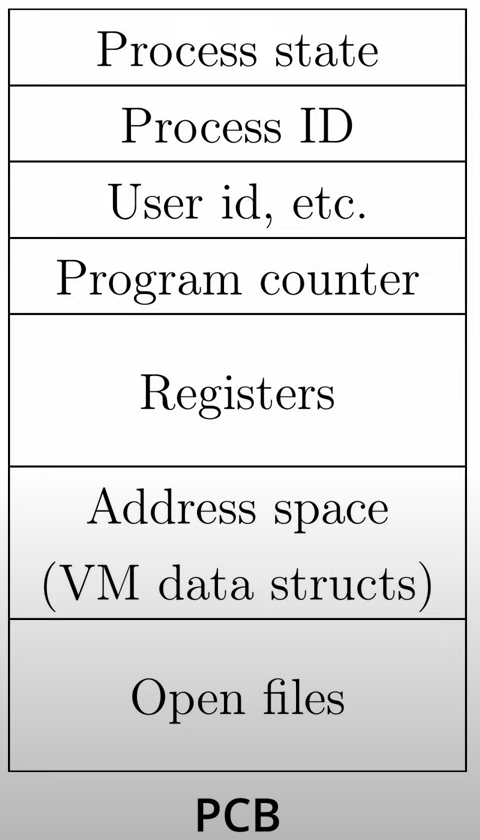

#### Preemption
Can preempt a process when kernel gets control.

Running process can vector control to kernel
- System call, page fault, illegal instruction etc.
- May put current process to sleep (read from disk)
- May make other process runnable (fork, write to pipe)

Periodic timer interrupt

Device interrupt
- Disk request completed, or packet arrived on network
- Previously waiting process becomes runnable
- Schedule if higher priority than current running process.

Changing the running process is called a *context switch*.

Context switching is very machine dependent.

Typically includes:
- save program counter and integer registers (always)
- save floating point or other special registers.
- Save condition codes.
- Change virtual address translations.

Non-negligible cost 
- Save/restore floating point registers is expensive.
  - Can optimize by only save if process used floating point
- May require flushing TLB (memory translation hardware)
- Usually increases cache misses.

## Lecture 3: Threads
A thread is a schedulable execution context (PC, registers, stack (local variables))

Multi-threaded programs share the address space (global variables, heap, ...)

More popular for concurrency.
- Lighter-weight abstraction than processes
- All threads in one process share memory, file descriptors, etc.
- Allows one process to use multiple CPUs or cores
- Allows program to overlap I/O and computation
  - Same benefit as OS running emacs and gcc simultaneously
- Most kernels have threads too. Typically at least one kernel thread for every process

#### Limitations of kernel-level threads
Every thread operations must go through kernel
- create, exit, join, synchronize, or switch for any reeason
- Syscall takes 100 cycles, function call 2 cycles
- Result: threads 10x-30x slower when implemented in kernel
- Worse today because SPECTRE/Meltdown mitigations

One-size fits all thread implementation
- Kernel threads must please all people, fancy features like priority which you might not need causes extra overhead.

General heavy-weight memory requirements
- Requires a fixed-size stack within kernel
- Other data structures designed for heavier-weight processes

<br>

An alternative to kernel level threads is user level threads.
One kernel thread per process. Instead of making a system call everytime
we want to do something, we can implement them as library calls.

How do we implement user-level threads?
- Allocate a new stack for each pthread_create
- Keep a queue of runnable threads
- Replace blocking system calls (read/write/etc) with a runnable thread
  - Normally when a thread calls read/write it will go to sleep waiting
    for the syscall to complete
- Schedule periodic timer signal
  - Switch to another thread on timer signals
- Multi-threaded web server exmaple:
  - Thread calls *read* to get data from remote web browser
  - "Fake" *read function* makes *read syscall* in non-blocking mode.
    - Non-blocking mode means it just returns data if its available immediately.
        Otherwise the process will let another thread run instead.
  - No data? Schedule another thread
  - On timer or when idle check with connections have new data.

#### Limitations of user-level threads
Can't take advantage of multiple CPUs or cores.

A blocking system call blocks all threads
- Can replace *read* to handle network connections
- But usually OSes don't let you do this for disk
- So one uncached disk read blocks all threads
- A page fault blocks all threads
- Possible deadlock if one thread blocks another

We can solve this using n:m threading.  
User threads implemented on kernel threads.
- Multiple kernel-level threads per process
- Maintain library functions to avoid syscalls.

Typically one kernel thread per CPU core. Each running 1 or more user level thread.

Scheduler in the kernel will decide which user level threads to run.

#### Limitations of n:m threading
Many of the same problems as n:1 threading, including blocked threads, deadlock, ...

Hard to keep the same # of kernel threads as available CPUs.
- This occurs because kernel knows how many CPUs are available
- Kernel knows which kernel-level threads are blocked
  - Kernel may create more kthreads to run on available CPUs while some are blocked
- Tries to hide things from applications for transparency
- User-level thread scheduler might think a thread is running while underlying kernel thread is blocked.

Kernel doesn't know relative importance of threads
- Might preempt a kthread in which library holds important lock

## Lecture 4: Concurrency
**Sequential consistency:**  
When the result of execution is as if all operations were executed ons some sequential order, and the operations of each processor occurred in the order specified by the program.

TL;DR: Maintains program order on individual processors and ensuring write atomicity.

Most hardware does not provide sequential consistency.  
- Complicates write buffers (Read flag1 before flag2 written through in Program A)
- Can't re-order overlapping write operations
  - Concurrent writes to different memory modules
  - Coalescing writes to same cache line
- Complicates non-blocking reads
  - Prefetching data before it is needed
- Makes cache coherence more expensive
  - Must delay write completion until invalidation/update
  - Can't allow overlapping updates if no gloablly visible order.
  
SC thwarts compiler optimizations
- Code motion
- Caching value in register
  -  Collapse multiple loads/stores of same address into one operation
-  Common subexpression elimination
   -  Could cause memory location to be read fewer times
-  Loop blocking
   -  Re-arrange loops for better cache performance
-  Software pipelining
   -  Move instructions across iterations of a loop to overlap instruction latency with branch cost

#### x86 atomicity
- lock - prefix makes a memory instruction atomic
  - Usually locks bus for duration of instruction. (expensive!)
  - Can avoid locking if memory already exclusively cached
  - All lock instructions totally ordered
  - Other memory instructions cannot be re-ordered w/ locked ones.
- xchg - Exchange instruction is always locked (without the prefix)
- cmpxchg - Compare and exchange is also locked (without the prefix)
- Special fence instructions can prevent re-ordering

### Peterson's Solution

Assuming SC.

Assume two thread, $T_0$, $T_1$.

* `int not_turn; // not this threads turn to enter CS`
* `bool wants[2]; // wants[i] indicates if T_i wants to enter CS`

```{C}
for (;;) {
  wants[i] = true;
  not_turn = i;
  while(wants[1 - i] && not_turn == i) {}
    // Other thread wants in and not our turn
  Critical_section();
  wants[i] = false;
  Remainder_section();
}
```

`pthread_cond_t` to signal threads to wake up and lock until condition is unlocked.  
Condition variables are of type `cond_t`.

Always re-check condition on wake-up, since `cond_wait` does not reacquire the lock
atomically with the wake up. Thus, another thread can come and acquire the lock
and make changes to the CS.

### Semaphores

Initialized with an integer $N$.

`int sem_init(sem_t *s, ..., unsigned int n)`  
`sem_wait(set_t *s)`  
`sem_signal(sem_t *s)`

`sem_wait` will only return $N$ more times than `sem_signal` called.

`sem_wait` is basically locking. It decrements internal count. If internal count is zero,
the calling thread will not return from the call to `sem_wait()` (is blocked) until it either
locks the semaphore, or the call is interrupted.

`'sem_signal` increments count, basically unlocking.

## Lecture 5: Synchronization

### Fine-grained locking vs Coarse-grained locking

* Coarse-grained locking bad for frequent access
* Fine-grained locking is a lot more CPU overhead

### Spinlocks

* Meant for quick lock and unlocking in short periods.
* Blocks interrupts. Don't want the thread to go to sleep for above reason.

### C11 Atomics: Basics

* portable support for synchronization
* New atomic type: `_Atomic(int) foo`
  * All standard ops become sequentially consistent
* `atomic_flag` is a special type
  * Atomic boolean value with support for loads and stores
  * Must be implemented lock-free
  * All other types might require locks
* Fences also available to replace inline assembly.

Can explicitly choose memory ordering.

Suppose thread 1 releases and thread 2 acquires.

T1's preceding writes cannot move past the release store.
T2's subsequent reads can't move before the acquire load.

e.g.

```{C}
struct message msg_buf;
_Atomic(_Bool) msg_ready;
void send(struct message *m) {
  msg_buf = *m;
  atomic_thread_fence(memory_order_release);
  atomic_store_explicit(&msg_ready, 1, memory_order_relaxed);
}

struct message *recv(void) {
  _Bool ready = atomic_load_explicit(&msg_ready, memory_order_relaxed);
  if (!ready) {
    return NULL;
  }
  atomic_thread_fence(memory_order_acquire);
  return &msg_buf;
}
```

In the producer/consumer example above, in the `send` function,
the `atomic_thread_fence` with `memory_order_release` ensures that the
preceding write, `msg_buf = *m` cannot move past.

In the consumer, `recv`, the `memory_order_acquire` ensures the read
to `&msg_buf` does not move before the fence.

This can also be done by moving the release and acquire semantics into
the load and store of the `msg_ready` flag.

With this, spinlocks can be easily implemented:

```{C}
void spin_lock(atomic_flag *lock) {
  while(atomic_flag_test_and_set_explicit(lock, memory_order_acquire)) {}
}

void spin_unlock(atomic_flag *lock) {
  atomic_flag_clear_explicit(lock, memory_order_release);
}
```

### Hardware Perspective

* Coherence
  * concerns access to a single memory location
  * makes sure stale copies do not cause problems
* Consistency
  * Concerns apparent ordering between multiple locations

### Multicore Caches

* Performance requires caches.
* Cores can disagree about memory
* Bus-based approaches
  * "Snoopy" protocols, each CPU listens to memory bus
  * Use write through and invalidate when you see write bits
  * Bused-based schemes limit scalability
* Modern CPUs use networks (hypertransport, UPI)
* Cache is divided into chunks of bytes called cache lines
  * 64-bytes is a typical size

3-state coherence protocol (MSI Protocol):

Each cache line is one of three states:

* Modified
* Shared
* Invalid

Transitions between states can take 100-2000 cycles

Core has 3 actions it can do:

* Load
  * Read without intent to modify, data can come from memory or another cache
  * Cacheline enters shared state
* Store
  * Read with intent to modify, must invalidate all other cache copies
  * Cachline in stared
* Evict
  * Writeback contents to memory if modified
  * Discard if in shared state

### Implications for multithreaded design

1. Avoid false sharing
  * Processor shares data in cache line chunks
  * Avoid placing data used by different threads in the same cache line
2. Align structures to cache lines
  * Place related data you need to access together
  * Alignment in C11/C++11: `alignas(64) struct foo f;`
3. Pad data structures
  * Arrays of structures lead to false sharing
  * Add unused fields to ensure alignment
4. Avoid contending on cache lines.
  * Reduce costly cache coherence traffic
  * Advanced algorithms spin on a cache line local to a core (e.g. MCS Locks)

### Deadlocks

View acquisition of resources as a graph. Do not contain any cycles. Try not to
request too many resources at once.

## Lecture 6: System Calls and Interrupts

System calls are an interface between the application and the operating system.

e.g.
`fork(), waitpid(), open(), close()`

more complex calls:
`sysctl(), ioctl()`

Hardware provides multiple protection modes:

1. Kernel Mode

Access all restricted CPU features.  
Modify the TLB  
Control sys call interface  
Enable/disable interrupts

2. User Mode

Cannot read/write kernel memory  
Cannot directly call kernel functions

### Mode transitions

Kernel mode can only be entered through well defined entry points.

1. Interrupts
2. Exceptions

Interrupts and exceptions cause hardware to transfer control to the
interrupt/exception handler, a fixed entry point in the kernel.

Interrupts are raised by devices. Interrupt handler is a function in the kernel
to service a device request.

Exceptions are conditions encountered during execution of a program.

System calls are a class of exceptions!

How system calls work.

1. Application calls into library (e.g. C's `write()`)
2. Library executes the `syscall` instruction
3. Kernel exception handler `0x8000_0080` (2GB + 128 bytes address) runs
4. switches to kernel stack.
5. creates trapframe which contains the program state
6. Determine type of exception, then type of system call.
7. Run the function in the kernel (e.g. sys_write())
8. Restore the application from the trap frame
9. Return from exception
10. Library function returns to the application.

Application Binary Interface (ABI) defines the contract between the functions
in an application and system calls.

Operating Systems and Compilers must obey these rules, referred to as the
calling convention.

### Execution Contexts

The environment where functions execute including their arguments, local variables
and memory.

Context is a unique set of CPU registers and a stack pointer.

Different types of execution contexts:

* Application Context
* Kernel Context
* Interrupt Context (usually same as kernel)

Context transitions:

* Context switch: A transition between contexts
* Thread switch: A transition between threads

### Preemption

A process where the kernel gets control.

Running process can vector control to kernel.

* Syscall, page fault, illegal instruction, etc.
* May put current process to sleep e.g. to read from disc
* May make other process runnable e.g. fork, write to pipe

Periodic timer interrupt

* If running process used up quantum, schedule another

Device interrupt

* Disk request completed, or packet arrived on network
* Previously waiting process becomes runnable
* Schedule if higher priority than current running proc.

Changing running process is called a context switch.

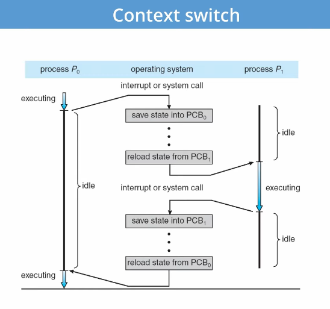

Note: Thread switch is occurring in the operating system.

Context switching is expensive.

May require flushing TLB, usually causes more cache misses.

## Lecture 7: Virtual Memory Hardware

### Drawbacks in sharing physical memory

* Protection
* Transparency
* Resource exhaustion

### Goals of virtual memory

* Give each program its own "virtual" address space.
* At run time, Memory-Management Unit relocates each load, store to actual memory...
App doesn't see physical memory.
* Also enforce protection
* Allow programs to see more memory than exists.

### Advantages

* Can relocate program while running
  * Run partially in memory, partially on disk.
* Most of a process's memory may be idle (80/20) rule.
  * Write idle parts to disk until needed.
  * Let other processes use memory of idle part.
  * Like CPU virtualization, when process not using CPU, switch.

VM is an extra layer of hardware and software, so it might be slower.

### Load-time linking

* Linker patches addresses of symbols like `printf`.
* Idea: Link when process executed, not at compile time.
* Problems:
  * Does not enforce protection
  * How to move once already in memory
  * What if not contiguous free region fits program?

### Base + bound register

* Two special privileged registers: base and bound
* On each load/store
  * Physical address = virtual address + base
  * Check $0\leq\text{virtual address}< \text{bound}$, else trap to kernel.
* How to move process in memory?
* What happens on context switch?
  * OS must re-load base and bound register.

### Segmentation

* Allows processes to have many base-bound registers.
* Can share/protect memory at segment granularity
* Must specify the segment as part of the virtual address

Each process has a segment table.

* Each VA indicates a segment and offset:
  * Top bits of addr select segment number, lower bits select offset
  * Segments selected by instruction or operand

#### Trade-offs

Advantages:

* Multiple segments per process
* Allows sharing
* Don't need entire process in memory

Disadvantages:

* Requires translation hardware, which could limit performance on smaller
devices.
* Segments are not completely transparent to the program.
* $n$ byte segment needs $n$ contiguous bytes of physical memory. Fragmentation
becomes a serious real problem.

### Fragmentation

Inability to use free memory.

Over time:

* Variable-sized pieces = many small holes (external fragmentation).
* Fixed-size pieces = no external holes, but force internal waste (internal
fragmentation).

### Paging

Logical conclusion of segmentation.

* Divide memory into small pages. Usually 4KB.
* Map virtual pages to physical pages
  * Each process has separate mapping
* Allow OS to gain control on certain operations.
  * Read-only pages trap to OS on write.
  * Invalid pages trap to OS on read or write.
  * OS can change mapping and resume application.
* Other features sometimes found:
  * HW can set accessed and dirty bits
  * Control page execute permission separately from read/write
  * Control caching or memory consistency of page

#### Trade-offs

* Eliminates external fragmentation.
* Simplifies allocation, free, backing storage (swap)
* Average internal fragmentation of 0.5 pages per "segment"

Allocate any physical page to any process.
Can store idle virtual pages on disk.

Very similar data structure to segmentation.

Instead of a segment table, we have a page table.

* Since each page is fixed size (usually 4KB), least significant 12 bits
of address are page offset. (12 since $\log_2(4K)$)
* MSB are page number.
* Page table maps VPN to PPN.
* Also includes protection bit, validity, etc.

On memory access: Translate VPN to PPN, then add offset.

### MMU Types

* HW Mangaged
  * Reloads TLB with pages from a page table
  * Typically HW page tables are Radix Trees
  * Requires complex hardware
* SW Managed
  * Simpler HW and asks SW to reload pages
  * Requires fast exception handling and optimized software
  * Enables more flexibilty in the TLB

### x86 Paging

* Paging is enabled by bits in `%cr0`
* Normally 4KB Pages.
* `%cr3` points to 4KB page directory.
* Page directory: 1024 PDEs (page directory entries)
  * Is a 4 KB page by itself
* Page table: 1024 PTEs (page table entries)
  * Each page table represents 4MB of virtual memory


#### Page translation

  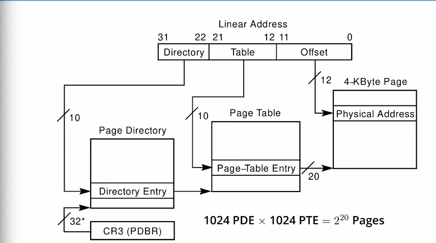

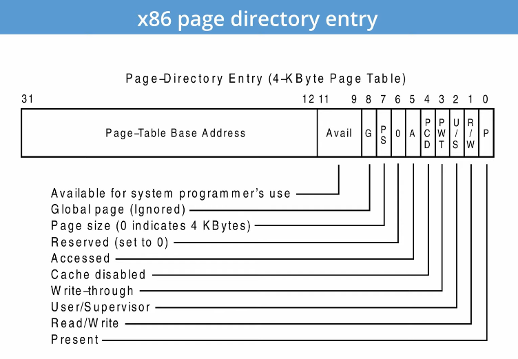

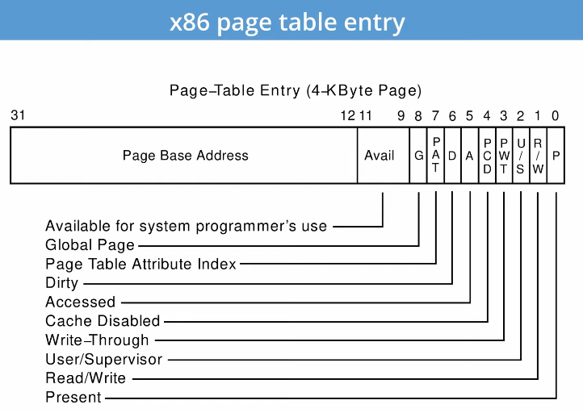

#### x86 hardware segmentation

* Also supports segmentation
  * Segment register base + pointer val = linear address
  * Page translation happens on linear addresses
* Two levels of protection and translation check
  * Segmentation model has four privilege levels (CPL 0-3)
  * Paging only two, so 0-2 = kernel, 3 = user

Why do you want both paging and segmentation?

* Usually don't, it is extra overhead.
* Can sometimes be useful, mostly for security.

### Making Paging Fast

x86 PTs require 3 memory references per load/store. SLOW!

1. Look up PT address in page directory
2. Look up PPN in page table
3. Actually access physical page corresponding to the virtual address

For speed, CPU caches recently used translations in the TLB.

Typically 64-2K entries, 4-way to fully associative, 95% hit rate.

Each TLB entry maps a VPN -> PPN + protection information.

On each memory reference, check TLB, if entry present get physical address
fast. If not, walk page tables, insert into TLB for next time.

### TLB

* Operates at CPU pipeline speed
* What to do when switch address space?
  * Flush TLB on context switch
  * Tag each entry with associated process's ID
* In general, OS must manually keep TLB valid
* More complex on multiprocessor

### Where does the OS live?

Lives in the same address space as the processes. We use protection bits to
prohibit user code from writing kernel.

### Software Managed MMU

HW has 64-entry TLB, very small. References to addresses not in TLB trap 
to kernel.

Each TLB has: Virtual page, PID, page frame, No Cache (NC), Dirty (D), Valid
(V), Global

Kernel itself is unpaged, all physical memory contiguously mapped in high
VM. Kernel uses these pseudo-addresses that usually map to low physical address.

User TLB fault handler is very efficient, usually has its own software cache
(hash table), usually written in hand-written assembly.

OS is free to choose page table format!

PID allows multiple processes to coexist. Don't need to flush TLB on context
switch.

Global bit used for pages shared across all address spaces in kseg2 or useg.  
Tells TLB to ignore PID field.

MIPS co-processor 0 (COP0) provides the TLB functionality.

* `tlbwr`: TLB write a random slot
* `tlbwi`: TLB write a specific slot
* `tlbr`: TLB read a specific slot
* `tlbp`: Probe the slot containing an address

For each of these instructions you must load the following registers:

* `c0_entryhi`: high bits of TLB entry
* `c0_entrylo`: low bits
* `c0_index`: TLB index

TLB exceptions:

* UTLB Miss: Generated when accessing useg without matching TLB entry.
  * Very frequent since only 64-entrys, 4KB entry means 256 KB process can fit
  in TLB. Very small! So many UTLB Miss exceptions are expected.
  * Separate from the general exception handler.
* TLB Miss: Generated when accessing kseg2 without matching entry
* TLB Mod: Generated when writing to read-only

## Lecture 9: Virtual Memory OS

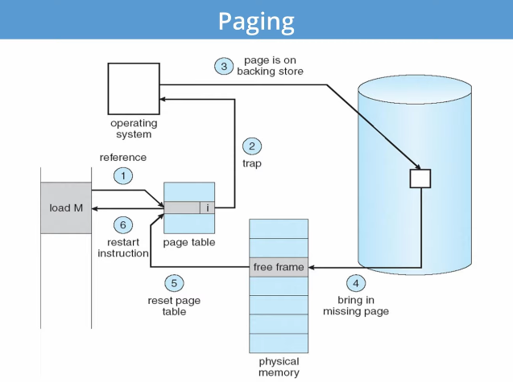

Can use disk/ssd to simulate more memory than available.

80/20 rule: 20% of memory gets 80% of memory accesses.

Keep hot 20% in physical memory, cold 80% on disk.

### Goals

* Resume a process after a fault.
* What to fetch from disk
* What to evict/eject when run out of memory?

Pre-fetch surrounding pages.  
Pre-zero unused pages in idle loop.

### Belady's Anomaly

More physical memory doesn't always mean fewer faults

### Clock Algorithm

Use accessed bit supported by most hardware.

Linearly scans over all pages in the page table and scans for the access bit.

Resets the bit. If bit is already 0, then can evict that page.

Second-chance replacement.

Problem: Memory is very large, linear scan is slow.

Sol: Second clock hand.  
Leading hand clears access bit.  
Second hand evicts pages with A=0.  
Moves in lockstep.

Can also take advantage of hardware dirty bit. (Unaccessed, clean), (Unaccessed, dirty),
(Accessed, Clean), (Accessed, Dirty)

Consider clean pages for eviction before dirty.

Can also use n-bit count instead of access bit (A).

### Other algorithms

* Random eviction
* LFU eviction
* MFU eviction
* Neither LFU or MFU is used very commonly.

### Page Buffering

Keep buffer of evicted pages, to reduce # of I/O.

* Can resume execution after writing in the requested page.
* Can recycle evicted page if faulted to a page in the buffer.

### Page Allocation

* Can be global or local.
* Global allocation doesn't consider page ownership.
  * e.g. with LRU, evict least recently used page of any process.
  * Works well if $P_1$ needs $20%$ of memory and $P_2$ needs $70%$.
  * Does not protect from memory pigs.
* Local allocation isolates processes.
  * Separately determine how much memory each process should have.
  * Then use LRU/clock/etc. to determine which pages to evict within
  each process.

### Thrashing

When application is in a constantly swapping in and out preventing
the application from making forward progress at any reasonable rate.

* Processes require more memory than system.
  * Each time one page is brought in, another page whose contents will
  soon be referenced is thrown out.
  * Results in I/O taking all system utilization. Processes will spend
  all their time blocked, waiting for pages to be fetched from disk.

#### Causes

* Access pattern has no temporal locality.
* Hot memory does not fit in physical memory.
* Each process fits individually, but too many for system.

#### Approaches

* Working set
  * Only run processes whose memory requirements can be satisfied.
  * How much memory does the process need in order to make reasonable
  progress?
* Page fault frequency = page faults / instructions executed.

### Early VM system calls

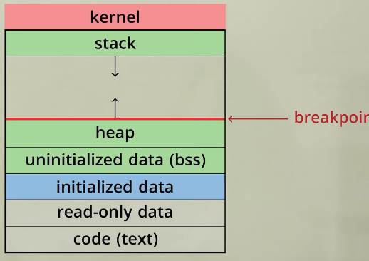

OS keeps "breakpoints" - top of heap. Access to memory between
breakpoint and stack fault on access.

`char *brk (const char *addr)`  
Set and return new value of breakpoint

`char *sbrk (int incr)`  
Increment value of the breakpoint and return old value.

### Memory mapped files

Process space can be sparse with various memory mapped regions representing files
or arbitrary memory use by the heap or the stack.

`void *mmap(void *addr, size_t len, int prot, int flags, int fd, off_t offset)`

Map file specified by `fd` at virtual address `addr`  
If `addr` is null, let kernel choose the address

`prot` - protection of region  
OR of prot_exec, prot_read, prot_write, prot_none

`flags`  
map_anon - anonymous memory (`fd` should be -1)  
map_private - modifications are private (to process)  
map_shared - modifications seen by everyone (to other processes)

### Overview

Windows and most UNIX systems separate the VM system into to main parts

* VM PMap: Manages the hardware interface (TLB)
* VM Map: Machine independent representation of memory

VM Map consists of one or more objects  
Each object consists of a contiguous `mmap()`  
Can be backed by files and/or shared between processes  
VM PMap manages the hardware (often caches mappings).

Calls into `mmap(), munmap(), mprotect()`

* Update the VM Map, update a set of objects in the kernel that describe
the layout of the address space of a process
* VM Map routines then call into the VM PMap to invalidate and update the TLB
if necessary.

Page faults

* Exception handler calls into the VM PMap to load the TLB
* If the page isn't in the PMap, we call the VM Map code.

Low memory options

* PMap is a cache and can be discarded during a low memory condition
* VM Map is the original source of truth. VM Map describes memory, PMap
provides abstraction for the hardware so it can be run on multiple architectures.

### 4.4 BSD VM system

Each process has a vmspace structure containing

* `vm_map` - machine-independent virtual address space
* `vm_pmap` - machine dependent data structures
* statistics

`vm_map` is a linked list of `vm_map_entry` structs

* `vm_map_entry` covers contiguous virtual memory
* points to `vm_object` struct

`vm_object` is a source of data (created when first called `mmap()`)

* e.g. vnode object for mmap file
*  points to list of `vm_page` structs (one per mapped page)
* shadow objects point to other objects for copy on write.
  * WHen a VM object is duplicated (e.g. at fork) a shadow obj is created.
  * Initially empty and points to underlying object.
  * When the contents of a page of a shadow obj is modified, the page
  is copied and inserted in the list of pages for the shadow object.
  * A series of shadow objects pointing to shadow objects is a shadow chain.

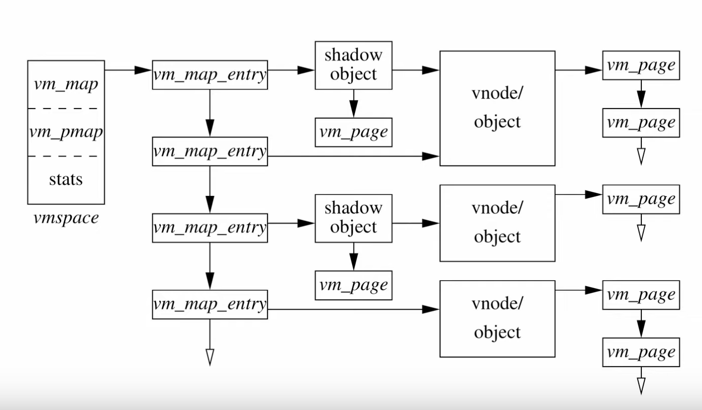

* Pmap layer holds architecture-specific VM code
* VM layer invokes pmap layer
  * On page faults to install mappings
  * To protect or unmap pages
  * To ask for dity/accessed bits
* Pmap layer is lazy and can discard mappings
  * No need to notify VM layer
  * Process will fault and VM layer must reinstall mapping
* Pmap handles restrictions imposed by cache

Example uses:

`vm_map_entry` structs for a process

* r/o text segment $\to$ file object
* r/w data segment $\to$ shadow object $\to$ file object
* r/w stack $\to$ anonymous object

On fork:

* Share text segment directly
* Share data through two new shadow objects: one for the parent
and one for the child that point to the original shadow object.
This shares pre-fork data, but does not share post-fork changes in
the child and parent.
* Share stack through two new shadow objects
* Must discard/collapse superfluous shadows
  * e.g. when child process exits

### What happens on a fault?

Starts in pmap code. Get a fault and it figures out we do not have the
memory, or the permissions are wrong. Calls to VM Map code. Traverses
`vm_map_entry` list to get appropriate entry. To get the entry that
represents the memory that we received the fault on. If no entry, 
invalid pointer -> seg fault.

Then traverse list of shadow objects. Check at each shadow object level
if a `vm_page` is present that represents the specific address that we're asking
for within this object. If yes, hand it to pmap code and have it mapped in.

Caveat: If taking write fault on page that is not on the first shadow.

## Lecture 9: Memory Allocation

### Dynamic memory allocation

* Eases development and improves functionality.
* Can have a huge impact on performance.
* Can have data grow as a function of input size.

Most operating systems have multiple allocators for different purposes.
There is no "one size fits all" allocator.

### Important decisions

* Placement choice: Where in free memory to place the request block?
* Split free blocks to satisfy smaller requests?
* Coalescing free blocks to yield larger blocks

How much fragmentation should we tolerate?

Let $M$ = bytes of liv edata, $n_{min}$ = smallest allocation, $n_{max}$ = 
largest. How much gross memory required?

* Bad allocator: $M\cdot(n_{max}/n_{min})$
* Good allocator: $\approx M\cdot\log(n_{max}/n_{min})$

Best fit and first fit algorithms are pretty good, around 20% fragmentation
for most workloads.

### Best fit

Minimize fragmentation by allocating space from blocks that leaves smallest
fragment.

* Data structure: Heap is a list of free blocks, each has a header holding
block size and pointers to next.
* Search freelist for block closest in size to the request.
* During free (usually) coalesce adjacent blocks.

Problem: Sawdust

* Remainder so small that over time left with small free blocks everywhere
* Can be fixed by having minimum size for allocation.

### First fit

Pick the first block that fits

Lots of different implementations: LIFO, Address sort, FIFO

### Data allocation patterns

* Ramps: accumulate data monotonically over time
* Peaks: allocate many objects, use briefly, then free all
* Plateaus: Allocate many objects, use for long time, than free

#### Ramps

Ramp = no free, usually no fragmentation.

#### Peaks

Fragmentation is a real danger.

Note that peak phases alloc a lot, then free everything.

Arena allocation is a solution. It is a linked list of large chunks
of memory. Alloc is a pointer increment. No wasted space for tags
or list pointers.

#### Plateaus

Segregation = reduced fragmentation:

* Allocated at same time $\sim$ freed at same time
* Different type $\sim$ freed at different type

Implementation observations:

* Programs allocate small number of different sizes
* Fragmentation at peak use more important than at low
* Most allocations are small

### Slab allocation

* Kernel allocates many instances of same structures.
* Often want contiguous physical memory (for DMA)
* Slab allocation optimizes for this case
  * A slab is multiple pages of contiguous physical memory
  * A cache contains one or more slabs
  * Each cache stores only one kind of object (fixed size)
* Each slab is full, empty, or partial

### Segregated free lists

* Array of free lists for small sizes, tree for larger
  * Place blocks of same size on same page
  * Have count of allocated blocks: if goes to zero, can return page
* Pro: segregate sizes, no size tag, fast small alloc
* Con: Worst case waste: 1 page per size even w/o free, after pessimal free waste 1
page per object.

### Garbage Collection

Ex. Stop-and-copy garbage collection.

Runtime knows about all pointers. (Look at java eden garbage collection)

### Concurrent garbage collection

Stop-and-copy without the stop.

* Mutator thread runs program, collector concurrently does GC

When collector invoked:

* Protect from space & unscanned to space from mutator
* Copy objects in registers into to space, resume mutator
* All pointers in scanned to space point to to space
* If mutator accesses unscanned area, fault, scan page, resume

### Reference counting

Each object has "ref count" of pointers to it.
Increment when pointer set to it.  
Decremented when pointer killed.  

Does not work for circular data structure. Leads to lost memory.

Fix: Manual intervention.

No need to halt program to run collection. However, can be less efficient
because no need to write ref count each time.

## Lecture 10: Scheduling

Goals:

* Throughput
* Turnaround time
* Response time
* CPU utlilization
* Waiting time

Ex. FCFS Scheduling: Run jobs in order they arrive.

Easy to implement. Scheduling algorithm can reduce turnaround time. Minimizing
waiting time can improve response and turnaround time.

Jobs contain I/O and computation.

To maximize throughput, must maximize CPU utilization and I/O device utilization.

Can do this by overlapping I/O & computation from multiple jobs.

Response time is very important for I/O intensive jobs: I/O device will be idle
until job gets small amount of CPU to issue next I/O request.

Should treat I/O device as another core in your system.

### Shortest-Job First Scheduling

Attempts to minimize turnaround time (TT).

Two schemes:

* Non-preemptive - once CPU given to the process it cannot be preempted until
completes its CPU burst.
* Preemptive - if a new process arrives with CPU burst length less than remaining
time of current executing process, prempt

SJF gives the minimum average waiting time for a given set of processes. Thus,
minimizes response time.

Can lead to unfairness or starvation. Also cannot predict the future, but can be 
predicted (EMA).

### Round Robin Scheduling

* Solution to fairness and starvation.
  * Preempt job after some time slice or *quantum*
  * When preempted, move to back of FIFO queue
* Advantages:
  * Fair allocation of CPU across jobs
  * Low average waiting time when job lengths vary
  * Good responsiveness if small number of jobs
* Disadvantages:
  * If same size jobs, context switching just introduces extra overhead.

#### What is the cost of context switch?

Brute CPU time cost in kernel:

* Save and restore registers
* Switch address spaces (expensive instructions)

Indirect costs: cache, buffer cache and TLB misses

How to pick quantum?

We want much larger than context switch cost.

Majority of bursts should be less than quantum, but not so large it reverts
to FCFS.

Typically 10-100msec.

### Priority Scheduling

Associate a numeric priority with each process.

Give CPU to the process with highest priority

SJF is a priority scheduling where priority is the predicted next CPU burst time.

Starvation - low priority processes may never execute.

Solution: Aging increases a process's priority as it waits

### Multilevel feedback queues (BSD)

* Every runnable process on one of 32 run queues
  * Kernel runs process on highest-priority non-empty queue
  * Round-robins among processes on same queue
* Process priorities dynamically computed
  * If a process gets higher priority than running process, preempt it

`p_nice` - user-settable weighting factor  
`p_estcpu` - per-process estimated CPU usage

* Incremented whenever timer interrupt found proc. running
* Decayed every second while process runnable

`p_estcpu`$\leftarrow(\frac{2\cdot\text{load}}{2\cdot\text{load} + 1})$`p_estcpu`+`p_nice`

Load is sampled average of length of run queue plus short-term sleep queue over last minute.

* Run queue determined by `p_usrpri`/4

`p_usrpri`$\leftarrow50+(\frac{\text{p estcpu}}{4}) + 2\cdot$`p_nice`

(value clipped if over 127)

Sleeping process increases priority

`p_estcpu` not updated while asleep. Instead, `p_slptime` keeps count of 
sleep time.

`p_estcpu`$\leftarrow(\frac{2\cdot\text{load}}{2\cdot\text{load} + 1})^{\text{p slptime}}\times$
`p_estcpu`

### Multiprocessor scheduling issues

* Must decide on more than which processes to run
  * Must decide on which CPU to run which process
* Moving between CPU has more costs: More cache misses, (sometimes) more TLB misses
* Affinity scheduling - try to keep threads on same CPU
  * Do cost-benefit analysis when deciding to migrate
  * Work-stealing algorithm used by cilk? (Although this is only for a single process)

#### Thread dependencies

Priority inversion: H has high priority, L has low priority, acquires lock l.

* Scenario 1: H tries to acquire l, fails, spins. L never runs.
* Scenario 2: H tries to acquire l, fails, blocks. M enters system at med priority, L never
runs.

A thread's importance should increase with the importance of those that depend on it.

#### Priority Donation

Lock is boosted to the highest priority of threads that depend on it.

### Borrowed Virtual Time Scheduler

Many modern schedulers employ a notion of virtual time.

Idea: Equalize virtual CPU time consumed by different processes.

Ex. Linux CFS

Run process w. lowest effective virtual time.

* $A_i$ - actual virtual time consumed by process $i$.
* effective virtual time $E_i = A_i - (\text{warp}_i ? W_i : 0)$

Supports real-time applications:

* Warp factor allows borrowing against future CPU time
* Allows an application to temporarily violate fairness

Lots of context switches as a result. Not good!

Introduce: Context switch allowance $C$

* Only switch from $i$ to $j$ if $E_j\leq E_i - C/w_i$
* C is wall-clock time (>> context switch cost), so must divide by $w_i$
* Ignore $C$ if $j$ just became runnable.

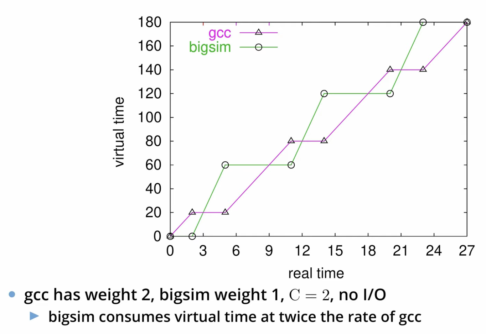

### Sleep/Wakeup

* Lower priority after wakeup (otherwise will starve other processes)
* Bound lag with Scheduler Virtual Time (SVT)
  * SVT is min($A_j$) for all runnable threads $j$.
  * WHen waking $i$, $A_i\leftarrow \text{max}(A_i, SVT)$

Don't reset $A_j$ to SVT after page fault.  
Faulting thread needs to catch up  
Reset to SVT after socket read though.

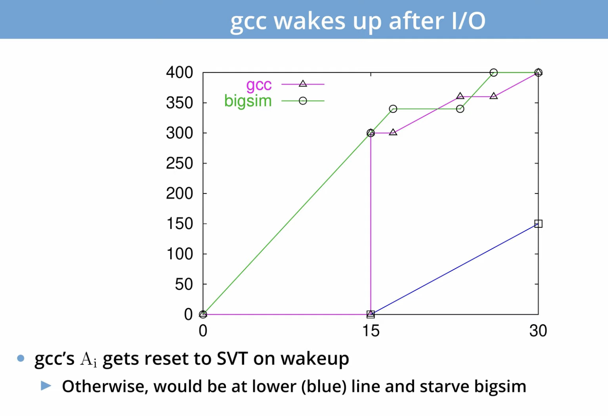

### Real-time threads

Also want to support soft real-time threads

e.g. mpeg player must run every 10 clock ticks

* $W_i$ is warp factor - gives thread precedence.
* Just give mpeg player $i$ large $W_i$ factor
* Will get CPU whenever runnable
* But long term CPU share won't exceed $w_i/\sum_j w_j$

$W_i$ only matters when warp$_i$ is true

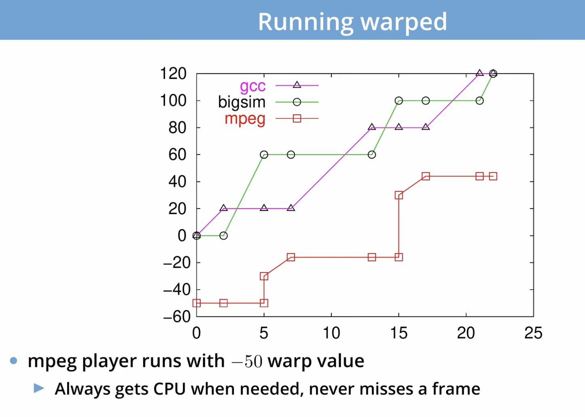


