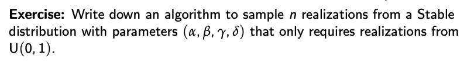

# STAT 340

### System and Model

A *system* is a set of elemnts which interact as a whole to achieve a goal. In
order to study a system, we can expirement with, or study the behaviour of
*models* of the system.

A *model* of a system tries to capture its **key characteristics**, aspects,
or functions.

* Models *never* perfectly capture *all aspects* of the underlying system.
* *Model risk* is the risk of using inadequate/toosimplistic/too complex model
* andis *always* present.
  * e.g understimate future losses of a bank due to inappoririate choice of assumptions.
  * overestimate the capcity of an airplae as a result of using a too
      simplistic airplane model.
* If an *analytical solution* (i.e. mathematically exact, closed form,
   obtained through symbolic manipulation) to the problem or question of
   interest in not available, **simulation** can provide answers.

For us, simulation is sampling from a stochastic model.

### Types of simulations or models

A *simulation model* is a model used for simulation.

* static (not depending on time)
* dynamic (evolving over time)
* deterministic (having no or negligible random elmenets underlying)
* stochastic (based on random elements)

**Focus*:* static, stochastic simulations and models based on random variables and random vectors.

#### Advantages

* can provide answers about the behavior of a system when the real system
  cannot be engaged and models are not analytically tractable.
* Faster than real time
* Allows control over conditions.

#### Pitfalls

* incorrect model assumptions
* Theoretical hurdles
* incorrect software or incorrect use of software
* undetected numerical issues
* no use of seeds

### Random vs pseudo-random

Random variates from U(0,1) are called random numbers (RNs)
A RNG is an algorithm for generating RNs

"Random" is hard to define, and not ideal, due to difficult reproducibility and measurement errors.

Instead, we generate PRNs using PRNGs.

look random, but are in fact deterministic.

A good PRNG should:

* produce PRNs apprearing to be independent U(0,1) (or $U(0,1)^d$)
* allow to set a seed for reproducibility
* have a large period
* can generate sifficuently long streams of PRNs
* PRNG is fast and requires little storage
* PRNG (reasonably) easy to understand and implement

[*lehmer1951] introduced (for c = 0) **linear congruential generators (LCGs)** which are PRNGs recursively defined by
$$
x_n = (ax_{n-1}+c)\;mod \;m, n \in\N
$$
with multipler $a\in\{1,\dots,m-1\}$, increment $c\in\{0,\dots,m-1\}$ modulus $m\in\N$ and seed $x_0\in\{0,\dots,m-1\}$

To obtain PRNs, one typically uses $u_n=\frac{x_n+1}{m+1}\in(0,1), n\in\N$.

#### Lemma 1 (Modular arithmetic)

Let $a,b\in\Z,m\in\N$. We have:

a)$(a + km)\;mod\;m = a\;mod\;m$ for all $k\in\Z$;

b) i) $(a+b)\;mod\;m = (a\;mod\;m + b\;mod\;m)\;mod\;m$

   ii) $(ab)\;mod\;m = ((a\;mod\;m)(b\;mod\;m))\;mod\;m$

c) i) $(a + b)\;mod\;m = (a + b\;mod\;m)\;mod\;m$

ii) $(ab)\;mod\;m = (a (b\;mod\;m))\;mod\;m$

By induction, the recurrence relation of an LCG leads to
$$
x_n = \begin{cases}
   (a^nx_0+c\frac{a^n-1}{a-1})\;mod\;m &\text{if } a \neq 1, \\
   (x_0 + nc)\;mod\;m &\text{if } a = 1
\end{cases}
$$

All $x_n$'s are determined by a, c, m $x_0$.

Note: $u_n\in\{\frac{1}{m+1},\dots,\frac{m}{m+1}\} \rArr u_n$'s are not perfect $U(0,1)$ realizations.

Whenever $x_n$ takes the same value a second time, the same sequence of numbers
is generated again and this cycle repeats. The length of this cycle can depend
on the seed $x_0$. We call the smallest cycle length over all seeds is the
**period** of the LCG or PRNG.

Since $x_n\in\{0,\dots, m-1\}$, LCGs have period of at most m. If it is m, the
LCG has full period.

Question: How to choose a, c, m s.t. the LCG has full period?

* Can check all seeds $x_0$ to determine if LCG has full period. This is extremely time consuming.
* A criterion to choose a, c, m to ensure a full period is given in the following.

#### Theorem 1 ([**holldobell1962]; How to choose a, c, m?)

An LCG $x_n = (ax_{n-1} + c)\;mod\;m, n\in\N$ has full  period iff

* c and m are relatively prime, i.e. gcd(c,m) = 1 (if $n\in\N, n | c, n|m$,
   then $n\stackrel{!}{=} 1$, so the only postive integer (factor) that divides
   c and m is 1; note that $n | 0$ for all $n\in\N$ since $n\cdot0=0$);
* a - 1 is divisibly by all prime factors of m
* If $4|m$, then a - 1 is divisible by 4

Most PRNGs are based on 32-bit integer arithmetic. Although there are $2^{32} \approx 4.29$ B distinct integers, one neds to expect ties. i.e. equal numbers indenendently of the period.

#### Lemma 1 (Expected number of ties)

The expected number of ties when drawing n independent k-bit integers is
$$
n - 2^k(1 - (\frac{2^k-1}{2^k})^n)
$$

From this, we expect 116 ties when drawing 1M PRNs on a 32-bit architecture.
How large should k be that we expect at most 1 tie? When n = 1 mio. (wtf is a mio???).

**Combined generators** combine 2 PRNGs to improve statistical properties of PRNs.

One example is L'Ecuyer's combined multiple recursive generator which combines 2 LCGs.

#### Review: CDF

If $X$ is any random variable, the CDF of $X$ is $F_X(x) = F(x) = P(X \leq x), \; x\in\R$

* $lim_{x\to-\infty}F(x) = 0$
* $lim_{x\to\infty}F(x) = 1$
* F is non-decreasing
* F is right continuous

### Inversion Method

* Inversion method is the only universal method as it applies to any cdf F.
* It s based on the quantile function $F^\leftarrow$ of F:

#### Quantile Function

The quantile function $F^\leftarrow$ of a df F si defined by
$$
F^\leftarrow(y) = inf\{x\in\R:F(x)\geq y\},\;y\in[0,1]
$$

* Quantile functions characterize distributions (like densitites or moment-generating functions if they exist, caracteristic functions etc.)
* If F is continuous and strictly increasing, $F^\leftarrow = F^{-1}$ (the ordinary inverse of F obtained by solving F(X) = y w.r.t. x)
* The graph of $F^\leftarrow$ can be obtained by mirroring the graph of F at the line y = x, where jumps (flat parts) of F turn into flat aprts (jumps) of $F^\leftarrow$: Note that F is right-continuous whereaas $F^\leftarrow$ is left-continuous.
* One can often work with $F^\leftarrow$ as with $F^{-1}$ but $F(F^\leftarrow(y)) = y$ not always true (but $F(F^\leftarrow(y)) \geq y$ is!).

The inversion method relies on the following:

#### Proposition 1 (Quantile Transformation)

If F is a df and $U \sim U(0,1)$, then $X := F^\leftarrow(U) \sim F$.

Proof:
We know $U \sim U(0,1) \text{ has cdf } F_U(u) = u$ for $u \in [0,1]$.
$X := F^{-1}(u)$ has cdf
$$
P(F^{-1}(u) \leq x) = P(F(F^{-1}(u)) \leq F(x)) \\
= P(u \leq F(x)) \\
= F_u(F(x)) \\
= F(x)
$$
Hence, $X\sim F$.

That is, if $U\sim U(0, 1)$ and $F^\leftarrow$ is the quantile function of F, then $F^\leftarrow(U) \sim F$. This motivates the following.

#### Algorithm 1 (inversion method)

a) Sample $U\sim U(0,1)$

b) Return $F^\leftarrow(U)$

The inversion method can (in theory) be applied to any df F.

Exampel: Sampling from Exp($\lambda$).

* Assume we are interested in sampl in from the exponential distribution Exp($\lambda$)
* Since the df $F(x) = 1- e^{-\lambda x}, x \geq 0$, is continuous and strictly increasing, we find

$$
F^\leftarrow(y) = F^{-1}(y) = -\frac{log(1 - y)}{\lambda}
$$

* By the inversion method, we can sample from Exp($\lambda$) via:

a) Sample $U \sim U(0,1)$
b) Return X = $-\frac{log(1 - U)}{\lambda}$

Since $1 - U \sim U(0,1)$ could be replaced by "Return $X = -\frac{log(u)}{\lambda}$"

#### Stochastic Representation

A **stochastic representation** for a rv $X \sim F$ is a representation of $X$ in terms of other, simpler, rv or building blocks.

* Let $U \sim U(0, 1)$

$$
X = F^\leftarrow(U)
$$
is a stochastic representation of a random variable $X\sim F$ in terms of the uniform distribution.

**Stochastic representations** are often extremely useful in constructing sampling algorithms.

#### Inversion method on discrete RV

Suppose $X$ takes values $x_1 < x2 < \dots$ with probabilities
$p1,p2,\dots > 0$ with $\sum_{k=1}^\infty p_k=1$. The pmf satistifes
$f(x_k) = P(X=x_k) = p_k$ for $k\in\N$. The df $F$ has jumps at
$x_1 < x_2 < \dots$ of heights $p1,p2,\dots > 0$.

By the inversion method, one can generate $X\sim F$ via
$$
X = \begin{cases}
   x_1, &\ U\in[0, p_1] \\
   x_2, &\ U\in(p1, p_1+p_2] \\
   . \\
   .\\
   x_j, &\ U\in(\sum_{k=1}^{j-1}p_k, \sum_{k=1}^jp_k]
   .\\
   .\\
   .\\
\end{cases}
$$

We have $P(X=x_j) = p_j$

e.g. if U falls in the jth-smallest bucket, we return the jth smallest of the x's.

This sampling method is only efficient for F with finite support or light-tailed F. For $n\gg 1$ we could sort the U's first. R's findInterval() can be used to find the "buckets".

#### Sampling from Geo(p)

Suppose you repeat an experiment with constant success probability p independently until you observe the first success. Denote by $X$ the number of trials needed, then $X \sim Geo(p)$ with probability mass function

$$
p_k = P(X=k)=(1-p)^{k - 1}p,\quad k\in\N
$$

From the inversion method, we can deduce:
$$
X = \Big\lceil \frac{log(U)}{log(1 - p)}\Big\rceil \sim Geo(p)
$$

### Probability transformation

If $U\sim U(0,1)$ and F is any df, then $F^\leftarrow(U) \sim F$.

If $X \sim F$,what about the distribution of F(X)?

#### Proposition 2 (Porbability transformation)

If F is a continuous df and $X \sim F$, then $U := F(X)\sim U(0,1)$.

* Continuity is required here as otherwise, not all values in (0,1) are attainable by $F(X)$.
* Useful for assessing whether gien realizations from from a certain continuous distribution F.

#### Conditional distributions of continuous distributions

Suppose we are interested in sampling from $X | X\in[a,b]$ for $-\infty\leq a \lt b \leq \infty$ and $P(X\in(a,b]) > 0$ where $X \sim F$ is continuous.

We could repeatedly sample $X \sim F$ and only accept those points that line in $[a, b]$ which would be inefficient. We simply apply the inversion method and express the cdf of $X | X \in [a,b]$ in terms of the cdf $F$ of $X$.

#### Minima and Maxima of continuous distributions

If $X_1,\dots, X_n\overset{ind.}{\sim} F$ where $F$ is strictly increasing and continuous, interest may lie in sampling from

$$
X_{(1)} = min\{X_1,\dots,X_n\} \;\; \text{and} \;\; X_{(n)} = max\{X_1,\dots,X_n\}
$$

One could sample n variates from $F$, and then return the minimum/maximum

Instead, we can sample from $max\{X_1,\dots,X_n\}$ directly via

a) Sample $U \sim U(0,1)$

b) Return $F^{-1}(U^{1/n})$

For $min\{X_1, \dots,X_n\}$ we can sample by returning $F^{-1}(1 - (1 - U)^{1/n}) \sim F_{X_{(1)}}$

### Product distributions

Let $F(x) = F_1(x)\cdots F_d(x)$ where $F_1,\dots,F_d$ are distribution functions.

How can one sample from $X\sim  F$ if we have access to $F_j^\leftarrow$ for $j=1,\dots,d$?

Can sample from $F(x) = \prod_{j=1}^dF_j(x)$ by:

a) Sample $U_1,\dots,U_d \overset{ind.}{\sim} U(0,1)$

b) Set $X_j = F_j^\leftarrow(U_j)$ for $j=1,\dots,d$

c) Return $X = max\{X_1,\dots,X_d\}$

### Stable distributions

Appear as limiting distributions in the Generalized CLT (iid v, but no second moment required).

let $\alpha\in(0,2],\beta\in[-1,1],\gamma>0$ and $\delta\in\R$. A random variable
$X \sim \sect(\alpha,\beta,\gamma;1)$ has stochastic representation:
$$
X = \gamma Z_{\alpha, \beta} + \delta + \beta\frac{2}{\pi}\gamma log(\gamma) \boldsymbol{1}_{\{\alpha=1\}}
$$

where, for $\theta_{\alpha,\beta} = \frac{1}{\alpha}\arctan(\beta\tan(\frac{\pi}{2}\alpha))$
and independent $T \sim U(-\frac{\pi}{2},\frac{\pi}{2})$ and $W \sim Exp(1)$,

#### Final comments on Inversion Method

* Can theoretically be applied to sample any univariate distribution F.
* The normal distribution has neither cdf nor quantile function in closed form, however, they are easily approximated with very high acuracy, so they are often treated as known.
* Problem: $F^\leftarrow(y)$ may not be available analytically.
* If the cdf F(x) can be computed/approximated well, we could use root finding (e.g.,uniroot() in R) to solve for F(x) = y numerically to find $x = F^\leftarrow(y)$
  * This might involve numerical integration to find F(x) first.
* If $n \gg 1$ observations are required and numerical root finding is used, can help to sort $U_1,\dots,U_n$ first and then undo the sorting later.
  * The solution for $F^\leftarrow(U_1)$ could then be as a starting value to find $F^\leftarrow(U_2)$ etc.

### Rejection Method

Let f be a density and assume we are interested in sampling $X\sim f$.

If the target density f is had to sample from ($F^\leftarrow$ not available/expensive to calculate), we can sample from a different envelope density g that is easy to sample form and correct the distribution by acceptance/rejection.

#### Conditioning

Let X and Y be rv with joint pdf/pmf $f_{X,Y}$ and let X have marginal pdf/pmf $f_X$. The conditional pdf/pmf of Y given X is then:

$$
f_{Y|X}(y|x) = \frac{f_{X,Y}(x,y)}{f_X(x)}, \forall x~\text{such that} f_X(x) > 0
$$

Key in many application is the **,law of total probability**. If $A\sube\Omega$ (measurable) and let $B_1,B_2,\dots$ be some partition of $\Omega$ and $b_i \cap B_j = \emptyset$ for $i\neq j$ and $P(B_i) > 0$ for all $i$. Then

$$
P(A) = \sum_{i = 1}^\infty P(A\cup B_i) = \sum_{i = 1}^\infty P(A|B_i)P(B_i)
$$

#### Propisition 1 (Rejection)

Let f (target) and g (envelope density) be densities such that $f(x) \leq cg(x) =:h(x)$ (envelope)for all $x\in\R$ for some $c \geq 1$. If $Y\sim g$ and $U\sim U(0,1)$ are independent, then with constant $c$,

$$
X = Y | (Ucg(Y) \leq f(Y)) \sim f
$$

#### Algorithm 1 (Rejection method)

Under the assumptions of Proposition 1, sample from f via:

a) Repeat sampling independent $Y\sim g$ and $U \sim U(0,1)$ until $Ucg(Y) \leq f(Y)$ (acceptance condition).
b) Return Y

#### Lemma 1 (Rejection constant)

The expected number of iterations until acceptance ins Step a) is c.

#### Comments

* g should be easy to sample from.
* Choose c as small as possible:
  * For given f, g, the smallest possible c is $c = sup_x\frac{f(x)}{g(x)}$
since $f(x) \leq cg(x)$ for all $x \rArr c \geq \frac{f(x)}{g(x)}$
for all $x \rArr c \geq sup_x\frac{f(x)}{g(x)}$. This can sometimes be minimized over parameters of g
* Observe that the rejection method avoids sampling from f and only requires to evaluate f.
* Also applies to discrete distributions with pdfs replaced by pmfs.

#### How to find envelopes?

How to find g and h?

a) Use available inequalities to find integrable upper bounds to f
(then divide by their integral to obtain the density g).

b) if f has compact support $supp(f) = \{x\in\R:f(x) > 0\} \sube[a,b]$:

* If $f\leq M$ on [a,b], then $f(x) \leq M\bold{1}_{[a,b]}(x) = M(b-a)\frac{1}{b-a}\bold1_{[a,b]}(x) = cg(x)$ for $c = M(b-a)$, so the smaller M or [a,b], the better.
* Rejection algorithm: Repeat sampling independent  $Y\sim g$ (via $Y = a+(b-a)U'$ for $U'\sim U(0,1)$) and $U \sim U(0,1)$ until $UM \leq f(Y)$

c) f with $supp(f) \sube [0,\infty)$, f decreasing: Then $f(x) \leq \frac{1}{x}$ since $xf(x) = (x - 0)f(x)\leq \int_0^xf(z)dz \leq \int_0^\infty f(z)dz = 1$. This can be used locally to construct the envelope.

#### Rejection sampling for the discrete uniform distribution

* Interest often lies in sampling from $U({1,2,\dots,m})$

One can sample $\lceil \log_2(m)\rceil$ bits at random and reject numbers $> m.

### Sampling from a convex combination

Ex. Gamma Distribution for shape $\alpha\in(0,1)$.

The function $f(x) = \frac{\beta^\alpha}{\Gamma(\alpha)}x^{\alpha - 1}e^{(-\beta x)}$, x > 0 is the pdf of the *Gamma distribution* $\Gamma(\alpha,\beta)$ with shape $\alpha > 0$ and $\beta > 0$.

$\Gamma(z) = \int^\infty_0x^{z-1}e^{-x} dx$ denotes the *Gamma function*.

To sample $X \sim \Gamma(\alpha,\beta)$, it suffices to sample $Z \sim \Gamma(\alpha,1)$ as $X\stackrel{d}{=} Z/\beta$.

We only consider $\alpha\in(0,1)$. We bound as follows:
$$
f(x) = \frac{1}{\Gamma(\alpha)}x^{\alpha - 1}e^{-x} \leq h(x) := \begin{cases}
\frac{1}{\Gamma{\alpha}x^{\alpha - 1}}, &\ x\in(0,1) \\
\frac{1}{\Gamma{\alpha}}e^{-x}, &\ x\geq 1
\end{cases}
$$

We now need to find $c = \int^\infty_0h(x) dx$.

* Then g(x) = h(x)/c is a valid density and we have $f(x) \leq cg(x) = c\frac{h(x)}{c} = h(x)$ as desired.

$$
c = \frac{1}{\Gamma(\alpha)}\frac{e+\alpha}{\alpha e}
$$

$$
\therefore g(x) = \frac{h(x)}{c} =
\begin{cases}
\frac{e}{e + \alpha}\alpha x^{\alpha - 1}, &\ x\in(0,1) \\
\frac{\alpha}{e+\alpha}e^{-x + 1}, &\ x\geq 1
\end{cases}
$$
so a **convex combination** with $p = \frac{e}{e+\alpha}, g_1(x)=\alpha x^{\alpha - 1}1_{(0,1)}(x), g_2(x)=e^{-x+1}1_{(1,\infty)}(x)$.

Then get the df of g, G(x).

G can be easily sampled here with the **composition method**.

### Composition Method

If we are interested in sampling from
$$
F(x) = \sum_{k=1}^\infty p_kF_k(x)
$$

where $\sum_{k=1}^\infty p_k = 1$ and $F_k$ is a df for $k\in\N$, the composition method can be applied:

#### Proposition 2 (Composition)

Let $Z$ be a discrete r.v. with pmf $p_k = P(Z=z_k), k\in\N$ and let $F_k, k\in\N$ be dfs. If $X|Z=z_k\sim F_k,k\in\N$, then $X\sim F(x)=\sum_{k=1}^\infty p_kF_k(x)$

#### Algorithm 2 (Composition Method)

Sample $Z = z$ and return $X\sim F_{X|Z=z}$

Ex.  
Given $F(x) = \frac{1}{6}x(1 + 3x+2x^2), x\in[0,1]$,  
apply the composition method to sample from F.  

* Note that $F(x) = \sum_{k=1}^3p_kF_k(x)$ where $p_1=1/6,p_2=1/2,p_3=1/3,p_k>0$ for $k\in{1,2,3}$ and $\sum_{k=1}^3p_k=1$.
* The functions $F_k(x) = x^k$ for $k\in\{1,2,3\}$ are dfs on [0,1] with $F_k^\leftarrow(y)=y^{1/k}$.
* The composition method consists of sampling a realization $z$ from $Z$ with $P(Z=k)=p_k$ for $k\in\{1,2,3\}$ and then returning $X\sim F_z$

Thus, a sampling algorithm for F is:

1) Sample $V,U\stackrel{ind.}{\sim}U(0,1)$ and set $z=\begin{cases}1,&\ V\in(0,\frac{1}{6}) \\ 2,&\ V\in(\frac{1}{6},\frac{1}{6}+\frac{1}{2}]\\ 3, &\ V\in(\frac{1}{6}+\frac{1}{2}, 1]\end{cases}$
2) Return $X=F_z^\leftarrow(U) = U^{1/z}$.

This is much easier than trying inversion on F directly.

The composition method also applies to **continuous** mixtures
$$
F(x) = \int_{-\infty}^\infty F_{X|Z=z}(x)dF_Z(z)
$$

If $F_k$ has a density $f_k$ for all k, then F has density $F(x)=\sum_{k=1}^\infty p_kf_k(x)$

The composition method is widely used and especially useful because it allows to use $F_k$'s with non-overlapping supports and then apply a specific sampling algorithm on that support (divide and conquer).

### Table look-up method

The table look-up method provides an efficient sampling algorithm for discrete distributions with finite support.

If $p_k = P(X=x_k)=i_k/M,k=1,\dots,K$ for some $M,i_k,K\in\N$, a table look-up is used for sampling.

#### Algorithm 3 (Table look-up method)

a) Setup: Create an M-vector T containing $i_k$-many $x_k$ for all $k$.  
b) Sample $N\sim U(\{1,\dots,M\})$  
c) Return $T_N$

### Multivariate Distributions

Given a d-dimensional random vector $X = (X_1,\dots,X_d)$ with joint cdf, we sample realizations of F. These are typically stored in an (n,d) matrix: the jth row consists of the realization $x_j$.  
Typically more complicated as it requires additionally modelling the dependence between $X_1,\dots,X_d$.

If the components of $X$ are all independent, sampling is straightforward. (Just use univariate algorithms).

### Lemma 1

If $X\sim N_d(\mu,\Sigma), B\in\R^{k\times d},b\in\R^k$, then
$$
BX+b\sim N_k(B\mu+b,B\Sigma B^T)
$$
Proof:  
The stochastic representation of a $X\sim N_d(\mu,\Sigma)$ is $\mu + AZ$ where A is a $d\times d$ matrix where $AA^T=\Sigma$ and $Z\sim N_d(0,I_d)$.

Then, a stochastic representation of $Y = BX+b$ is given by:  
$$
B(\mu + AZ) + b \\
= B\mu + BAZ + b \\
= B\mu + b + BAZ
$$
This is the stochastic representation of $N_k(B\mu+b, (BA)(BA)^T) = N_k(B\mu + B, B\Sigma B^T)$.

### Cholesky Factor

In many applications, it is required to have a matrix decomposition, such as $\Sigma = AA^T$ where $A$ is lower triangular (Cholesky decomposition).  
There are efficient algorithms computing A from given $\Sigma$ (in R use t(chol(sigma))).  
Do not need to know how to compute $A$ from $\Sigma$.

### Normal Variance mixtures

The multivariate normal is one of the most widely used distributions.  
It is also the building block of many other classes of distributions, such as *normal variance mixtures*.

Let $\mu$ and $\Sigma=AA^T$ as before; let $Z\sim N_d(0,I_d)$ independent of the scalar rv $W\sim F_W$ with $W\geq 0$. $X$ is a normal variance mixture, if, in distribution:
$$
X=\mu+\sqrt{W}AZ
$$

The scalar rv $W$ affects all components $X_1,\dots,X_d$ and conditional $W, X | W\sim N_d(\mu W\Sigma)$.  
W can be seen as a "shock" mixing the covariance matrix of a multivariate normal.

Sampling from normal variance mixtures is straightforward based on the stochastic representation.

Basically:

* Sampling $X = (X_1,\dots,X_d)$ where $X_j\sim F_j$ are independent
  * Sample $X_j$ using independent uniforms and return $(X_1,\dots,X_d)$
* Sampling from $X = (X_1,\dots,X_d)\sim N_d(\mu,\Sigma)$
  * Sample $Z_1,\dots,Z_d\stackrel{ind.}{\sim}N(0,1)$,return $\mu+AZ$.
* Sampling $X = (X_1,\dots,X_d)$ is a NVM
  * Sample $Z_1,\dots,Z_d\stackrel{ind.}{\sim}N(0,1)$ independently of W, return $\mu+\sqrt{W}AZ$.

### Rosenblatt transform aka Conditional Distribution Method

Idea in 2 dimension:  
Suppose we want to sample $(X_1,X_2)\sim F.$  
a) Sample $U_1,U_2\stackrel{ind.}{\sim}U(0,1)$.  
b) Set $Y_1=F_1^\leftarrow(U_1) (\text{then }Y_1\sim F_1)$; say we get observation $y_1$.  
c) Compute the distribution function of $X_2|X_1=y_1$, say
$$
F_{2|X_1=x_1}(x_2) = P(X_2\leq x_2|X_1=x_1)
$$  
d) Set $Y_2 = F_{2|X_1=y_1}^\leftarrow(U_2)$  
e) Return $(Y_1, Y_2)$  
Then $(Y_1, Y_2)$ output by this algorithm has a distribution function $F$ of, say, $(X_1, X_2)\sim F$

So far:

* Sampling random vectors with independent components
* Sampling rv based on stochastic representation
* Sampling rv vased on the Rosenblatt transform.

But how can we build models?

Notion of **copulas** will be useful here.

### Copulas

The key for sampling joint distributions is the notion of a copula, which captures the dependence among the components in $X$.

Recall that:  
a) if $F$ is any univariate df, then $X := F^\leftarrow(U)\sim F$ for $U\sim(0,1)$  
b) if F is any continuous, univariate df and $X\sim F$, then $F(X)\sim U(0,1)$

For the remainder of this section, only consider the case where the margins $F_j$ are continuous.

For any rv $X=(X_1,\ldots,X_d)$ with continuous margins, the probability-transformed vector $U=(F_1(X_1),\dots,F_d(X_d))$ is such that

* $U_j \sim U(0,1)$ for $j=1,\ldots,d$
* The joint distribution of $U_1,\ldots,U_d$ determines the dependence among $X_1,\ldots,X_d$.

#### Definition: Copula

A **copula** is a d-dimensional distribution function with $U(0,1)$ marginal distributions.

Ex.
$C(u_1,\ldots,u_d)=\prod_{j=1}^du_j$ is the independence copula.

Key in copula modelling is:

#### Sklar's Theorem

a) If $F$ is a df with continuous margins $F_1,\ldots, F_d$, then there is a unique copula $C$ such that
$$
F(x) = C(F_1(x_1),\ldots,F_d(x_d)), x\in\R^d \qquad (1)
$$
The copula $C$ is given by
$$
C(u)=F(F_1^\leftarrow(u_1),\ldots,F_d^\leftarrow(u_d)), u\in[0,1]^d 
$$
Furthermore,
$$
U=(F_1(X_1),\ldots,F_d(X_d))\sim C, X\sim F.
$$
(aka $U$ has uniform margins and joint cdf $C$)  
b) Conversely, if $U\sim C$ for a copula $C$ and $F_1,\ldots,F_d$ are continuous dfs, then $F$ is defined in (1) is a df with copula $C$ and margins $F_1,\ldots,F_d$. Furthermore,
$$
X = (F_1^\leftarrow(U_1),\ldots,F_d^\leftarrow(U_d))\sim F \quad\text{for}\;U=(U_1,\ldots,U_d)\sim C
$$

#### Consequences

If the goal is to sample from a multivariate df $F$, the following 3 steps follow from Sklar's Theorem:

1. Find the copula $C$ of $F$.
2. Sample $U = (U_1,\ldots,U_d)\sim C$
3. Return $X=(F_1^\leftarrow(U_1),\ldots,F_d^\leftarrow(U_d))$

That is, the problem of sampling from $F$ is reduced to the problem of sampling from $C$.

How do you sample from $C$?

#### Special Copulas

#### Independence Copula

The components of $X$ are independent iff $C(u)=\prod_{j=1}^du_j$. We call the copula
$$
\prod(u)=\prod_{j=1}^du_j,\quad u\in[0,1]^d
$$
the independence copula. Sampling from te independence copula is straightforward based on $(U_1,\ldots,U_d)\sim\prod$ for $U_1,\ldots,U_d\stackrel{ind.}{\sim}U(0,1)$

#### Comonotonicity Copula

The "most positive dependence" is obtained for the copula
$$
M(u)=min\{u_1,\ldots,u_d\},\quad u\in[0,1]^d
$$
It is easily verified that $U=(U,\ldots,U)\sim M\text{ for } U\sim U(0,1)$. The copula M is called comonotonicity copula or upper Frechet Hoeffding bound.

#### Countermonotonicity Copula

In $d=2$, the "most negative dependence" is obtained for the copula
$$
W(u) = max\{u_1 + u_2 - 1, 0\},\quad u\in[0,1]^2
$$
and it is easily verified that $U=(U,1-U)\sim W\text{ for } U\sim U(0,1)$. The copula $W$ is called countermonotonicity copula or lower Frechet Hoeffding bound.

The copulas $\prod, M$ and $W$ have a special meaning:

* $\prod$ models independence
* $M$ models perfect positive dependence
* $W$ (only in $d=2$) models perfect negative dependence

These copulas are straightforward to sample from.

Copulas derived from Sklar's Theorem from known F, so called *implicit copulas* can be sampled from based on Sklar's Theorem: Sample $X\sim F$, return $U=(F_1(X_1),\ldots,F_d(X_d))$.

Implicit copulas can be sampled from based on Sklar's Theorem:

1. Sample $X=(X_1,\ldots,X_d)\sim F$
2. Return $U=(F_1(X_1),\ldots,F_d(X_d))$

#### A general sampling algorithm: The conditional distribution method

For a general copula $C$, the only known sampling algorithm is the conditional distribution method (CDM).

#### Theorem 3.24 (CDM)

If $C$ is a d-dimensional copula and $V_1,\ldots,V_d\stackrel{ind.}{\sim}U(0,1), \text{ then }, U\sim C$ where
$$
U_1 = V_1 \\
U_2 = C_{2|1}^-(V_2|U_1) \\
\vdots \\
U_d = C_{d|1,\ldots,d-1}^-(V_d | U_1\ldots,U_{d-1})
$$

While this algo works in principle for every copula, since the quantile functions $C^-_{j|1,\ldots,j-1}$ may not be explicit, the algorithm becomes slow. For specific copulas such as special copulas and some implicit copulas like the Gaussian or t copula, there are better sampling algorithms based on stochastic representation.

**Note:** $P(V\leq v|U=u)=\lim_{h\downarrow 0}\frac{C(u+h,v)-C(u,v)}{h}=\frac{\partial}{\partial u}C(u,v)$

#### Theorem 3 (Invariance Principle)

Let $(X_1,\ldots,X_d)$ have continuous margins $F_1,\ldots,F_d$ and copula $C$. Let $G_1,\ldots,G_d : \R\rightarrow\R$ be strictly increasing. Then the random vector $(Y_1,\ldots,Y_d) = (G_1(X_1),\dots,G_d(X_d))$ also has copula $C$.

Proof:

### Sampling stochastic processes

#### Poisson process

Counts the number of events that took place between time 0 and time t.

In order for a stochastic process to be considered a homogeneous Poisson process with parameter $\lambda$, it must satisfy:

1. $N_0=0$
2. $(N_t)_{t\geq 0}$ has independent increments
3. $N_t\sim Poi(\lambda t)$

One of the properties of the poisson process that is very useful when comes time to sample a Poisson process, is that the amount of time between successive jumps (new events) are iid rv's that have an exponential distribution with parameter $\lambda$. (So the expected amount of time between 2 successive jumps is $1/\lambda$).

#### Brownian Motion

Here, we focus on a standard Brownian motion $\{W_t, t \geq 0\}$, which is a stochastic process in continuous time that takes values over the real numbers and has the following properties:

1. $W_0=0$
2. for all $n\in\N$ and $0\leq t_0 < t_1 < \ldots < t_n <\infty$, the increments $W_1 -W_0,\ldots,W_{t_n}-W_{t_{n-1}}$ are independent
3. for all $0\leq s<t, W_t - W_s\sim N(0,t-s)$
4. its sample paths $t\mapsto W_t(\omega)$ are almost surely continuous (so there is no jump).

Note that (3) implies that $W_t\sim N(0,t)$.

With this notation, we can describe the well-known Black-Scholes model for a stock price at time $t$, denoted $S(t)$. Given the price at time $S(0)$, it is given by

$$
S(t) = S(0)e^{(\mu-\sigma^2/2)t+\sigma W_t},t>0
$$

where $\mu$ and $\sigma$ are the drift and volatility of the model, respectively. The drift gives us an indication of the rate at which $S(t)$ increases, while the volatility of $\sigma$ gives an indication of the magnitude of the random movements that affects the price.

In particular, since $W_t\sim N(0,t)$, it means that $\ln S(t)$ is normally distributed, or equivalently, $S(t)$ has a lognormal distribution.

If we want to generate the sample path of a Brownian motion on a computer, we need to discretize time. i.e. sample at times $0=t_0 < t_1 < \ldots < t_d$.

Based on the properties of the Brownian motion, we know that each increment $W_{t_k} - W_{t_{k - 1}}$, for $k=1,\ldots,d$ follows a $N(0,t_k - t_{k - 1})$. Therfore, we can sample these increments by sampling $Z_1,\ldots,Z_d\stackrel{ind.}{\sim}N(0,1)$ and letting $W_{t_k}-W_{t_{k-1}} = \sqrt{t_k - t_{k=1}}Z_k$, for $k=1,\ldots,d$. Hence,
$$
W_{t_k}=W_{t_{k-1}} + \sqrt{t_k - t_{k-1}}Z_k = \sum_{i=1}^k\sqrt{t_i-t_{i-1}}Z_i,k=1,\ldots,d.
$$

Typically, we choose the $t_k$'s to be equally spaced.

## Monte Carlo Simulation

Monte Carlo integration is a technique for estimating analytically interactable (but existing) expectations by simulation.

It has a wide range of applications, such as estimating probabilities or conditional expectations.

### Monte Carlo Estimator

The (crude) Monte Carlo estimator $\hat\mu^{MC}_n$ of the expectation
$$
\mu=\int_{R^d}g(x)dF(x)=E(g(X)),\;X\sim F
$$
is
$$
\hat\mu^{MC}_n=\frac{1}{n}\sum_{i=1}^ng(X_i),\;X_1\ldots,X_n\stackrel{ind.}{\sim}F
$$

Ex. Estimating $\pi$

Note that $\frac{\pi}{4} = \int_0^1\sqrt{1-x^2}dx = E(\sqrt{1 - U^2}) \text{ for } U\sim U(0,1)$  
Thus, we can estimate $\mu=\pi$ via the MC estimator
$$
\hat\mu_n^{MC}=\frac{1}{n}\sum_{i=1}^n4\sqrt{1-U_1^2},\;U_i\sim U(0,1)
$$

### Properties of MC Estimator

Since $\mu=E(g(X))$, If $E(g(|X|)) < \infty$, the MC estimator is unbiased
since:
$$
E(\hat\mu_n^{MC})=E(\frac{1}{n}\sum_{i=1}^ng(X_i))=\frac{1}{n}\sum_{i=1}^nE(g(X_i)) = \frac{1}{n}\sum_{i=1}^n\mu=\frac{1}{n}\cdot n\cdot\mu = \mu
$$
If $\sigma^2=Var(g(X) <\infty$, then $Var(\hat\mu_n^{MC})=\frac{\sigma^2}{n}$

### Theorem 1 (SLLN)

If $(X_n)_{n\in\N}$ is a sequence of iid random variables with $\mu=E(X)$, then $\hat\mu_n^{MC}=\frac{1}{n}\sum_{i=1}^ng(X_i)\stackrel{a.s.}{\rightarrow} \mu$ as $n\rightarrow\infty$. Or, equivalently, $P(\lim_{n\rightarrow\infty}\hat\mu_n^{MC}=\mu)=1$

The continuous mapping theorem (CMT) implies that
$$
h(\hat\mu_n^{MC})\stackrel{a.s.}{\rightarrow}h(\mu) \text{ as } n\rightarrow\infty \text{ for all }h\text{ cont at }\mu
$$

### Asymptotic normality and rate of convergence of $\hat\mu_n^{MC}$

A sequence of rvs $(X_n)_{n\in\N}$ converges in distribution to a rv $X\sim F$ if $\lim_{n\rightarrow\infin}XF_{X_n}(x)=F(x)$ for all $x$ where $F$ is cont.

Thus, if $X_n$ converges in distribution to $X$, and $n$ is large, then we have $F_{X_n}(x) = F(x)$

### Central Limit Theorem

If $(X_n)_{n\in\N}$ is a sequence of independent rvs with df $F$, and if $\mu=E(X_1)$ and $\sigma^2=Var(X_1)<\infin$, then
$$
\sqrt{n}\frac{\frac{1}{n}\sum_{i=1}^nX_i-\mu}{\sigma}\stackrel{d}{\rightarrow}N(0,1), n\rightarrow\infin
$$

Plugging in $X_i=g(X_i)$ immediately gives that $\hat\mu_n^{MC}\sim N(\mu,\frac{\sigma^2}{n})$.  
that is, $\hat\mu_n^{MC}$ is asymptotically normal with convergence rate
$$
sd(\hat\mu_n^{MC})=\frac{\sigma}{\sqrt{n}}
$$

In comparison to numerical integration, this is rather slow (the trapezoidal rule for d=1 has an error of order $O(\frac{1}{\sqrt{n}}))$ but the MC convergence rate does not depend on d.

### Proposition 1 (Delta Method)
If $h:\R\rightarrow\R$ is continuously differentiable with $h'(\mu)\neq0$ then
$$
\sqrt{n}\frac{h(\hat\mu_n^{MC})-h(\mu)}{\sigma h'(\mu)}\stackrel{d}{\rightarrow}N(0,1) \text{ as }n\rightarrow\infin
$$

Thus,
$$
h(\hat\mu_n^{MC})\underset{\text{large n}}{\sim}N(h(\mu),\frac{(\sigma h'(\mu))^2}{n}),\text{ where } \sigma^2 = Var(g(X))
$$

### Asymptotic CI for $\mu$

$$
[\hat\mu_n^{MC} \pm 1.96\times sd(\hat\mu_n^{MC})]
$$

However, $\sigma = sd(\hat\mu_n^{MC})$ is unknown.  
Solution: Replace $\sigma$ by the sample standard deviation
$$
S_n=\sqrt{\frac{1}{n-1}\sum_{i=1}^n(g(X_i) - \hat\mu_n^{MC})^2}
$$

### MC Integration

When estimating an unknown integral $\int_{[0,1]}f(x) dx$, we call the process
MC integration, which can be reformulated as a MC simulation problem.

If $\mu=\int_0^1g(x)dx$, then $\mu=E(g(U))$ for $U\sim U(0,1)$.
$$
\hat\mu^{MC}_n=\frac{1}{n}\sum_{i=1}^ng(U_i), U_1,\dots,U_n\stackrel{ind.}{\sim}U(0,1)
$$
If the domain is not [0,1], we can use a change of variables to write $\mu$ as an
expectation with respect to the uniform distribution.

e.g. If $\mu=\int^a_bg(x)dx$, then substitute $u=\frac{x-a}{b-a}$:
$$\mu=\int_b^ag(x)dx=(b-a)\int_0^1g(a+(b-a)u)du=(b-a)E(g(a+(b-a)U))$$

If $\mu=\int_0^\infin g(x)dx$, then we could substitute $u=\frac{1}{1+x}$.
$$
\mu=E\Big(g\Big(\frac{1-U}{U}\Big)\frac{1}{U^2}\Big)
$$

If $\mu=\int_{-\infin}^\infin g(x)dx$, then could substitute $u=\frac{1}{1-x}$:
$$
\mu=E\Big(\Big(g\Big(-\frac{1-U}{U})+g\Big(\frac{1-U}{U}\Big)\Big)\frac{1}{U^2}\Big)
$$

The inversion method also provides us with such a type of transformation since
$$
\mu=\int_\R g(x)dF(x)=E(g(X))=E(g(F^\leftarrow(U)))=\int_0^1g(F^\leftarrow(u))du
$$
All of this holds in the multivariate case!
$$
\mu = \int_{[0,1]^d}f(x)dx = E(f(U)),U\sim\prod
$$
where $\prod$ is the independence copula.

Ex. Let $\mu=\int_0^\infin x^{-1/2}e^{-x/2}dx$. Write $\mu$ as an expectation
with respect to the standard uniform ditribution and provide the crude MC
estimator for $\mu$.

From above, we can sub $u=\frac{1}{1+x}$ to get
$\mu=E\big(g\big(\frac{1-U}{U}\big)\frac{1}{U^2}\big)$. Do rest as exercise.

### MC Estimation of Probabilities

Let $X\sim F$ and suppose we are interseted in estimating $\mu=P(X\in A), A\subset\R^d$.  
With $g(x)=1_{\{x\in A\}}$ we obtain
$$
\mu=E(g(X))=E(1_{\{X\in A\}})=1\cdot P(X\in A) + 0
$$
yielding the MC estimator
$$
\hat\mu^{MC}_n=\frac{1}{n}\sum_{i=1}^n1_{\{X_i\in A\}}, \; X_1,\ldots,X_n\stackrel{ind.}{\sim}F
$$
Note $g(X)=1_{\{X\in A\}}\sim \text{Bin}(1,\mu)$, hence,. $\sigma^2=Var(g(X))=\mu(1-\mu)$
In order to estimate $\sigma$, one can use:

* $\hat\sigma=\sqrt{\hat\mu^{MC}_n(1-\hat\mu^{MC}_n)}$
* $\hat\sigma= 1/2$ as a conservative upper bound since $\sqrt{\mu(1-\mu)}\leq 1/2$ for all $\mu\in[0,1]$

If $g$ is an indicator, one typically does not use $S_n$ as an estimator for $\sigma$.

There are different ways to obtain MC estimators, which each have different variances.
The variance reduction factor (VRF) is $\frac{\hat\mu_n^{MC(1)}}{\hat\mu^{MC(2)}_n}$.

Ex. A European call option on a stock with a value $S_t$ at time $t\geq0$ provides the buyer
the right (but not the obligation) to buy the stock from the option seller at maturity $T$
(the expiration date in years) for the strike K (predetermined price). The buyer pays the
option prince for this right.

The expected value ofth epayoff (from the buyer's perspective) of the call option at time
$0\leq<T$ (in years) is:
$$
V_t=E(e^{-r(T-t)})max({\{S_T-K,0\}})
$$
The max function if $>0$ ("in the money") exercising the option leads to the profit $S_T-K$.
where $r$ is the continuously compounded annual risk-free interesnt rate.

The Black-Scholes model assumes that $(S_t)_{t\geq0}$ follows a GBM with drift $\mu=r-\frac{\sigma^2}{2}$. where $\sigma\gt0$ is the volatility, so that
$$
S_T\sim LN(log(S_t) + (r - \frac{\sigma^2}{2})(T-t),\sigma^2(T-t)) =: F
$$
Since $V_t=E(g(S_T)),\;S_T\sim F, \quad g(s)=e^{-r(T-t)}{max{\{s-K,0\}}}$
we obtain the MC estimator for $V_t$ as
$$
\hat\mu^{MC}_n = \frac{1}{n}\sum_{i=1}^ne^{-r(T-t)}max{\{S_i - K, 0\}}, \;S_i\stackrel{ind.}{\sim}F
$$

An analytical solution is given by the **Black-Scholes formula**
$$
V_t=S_t\varPhi(d_1)-Ke^{-r(T-t)}\varPhi(d_2)
$$
where
$$
D_1=\frac{\log{\frac{S_t}{K}}+(r + \frac{\sigma^2}{2})(T-t)}{\sigma\sqrt{T-t}},\;d_2=d_1-\sigma\sqrt{T-t}
$$
This formula is based on the log-normal assumption of $S_T$ including the constant $\sigma$.  
Both assumptions can be relaxed in simulations.  
For put options (right, but not the obligation to sell), replace $S_T=K$ by $-(S_T - K)$

Other call options (no analytical formulas known in general):
Asian options:
$$
V_t=E(e^{-r(T-t)}max{\{\bar{S}_T - K, 0\}})
$$
for $\bar{S}_T=\frac{1}{T-t}\int_t^TS_sds$ (path dependent MC).

Basket options:
$$
V_t=E(e^{-r(T-t)}max{\{\sum_{j=1}^dw_jS_{Tj}-K, 0\}})
$$
for a portfolio of stocks $S_{t,1},\ldots,S_{t,d}$ with weights $w_1,\ldots,w_d$ (MC based on multivariate distributions)

### Sample size calculations

Q: How large should the sample size $n$ be such that $P(|\hat\mu_n^{MC}-\mu|>\epsilon)\leq\alpha$
for a given absolute error $\epsilon>0$ and error probability $\alpha\in(0,1)$?

#### Proposition 1: (Choice of sample size according to CLT)

Let $\epsilon>0$ and $\alpha\in(0,1)$, If $n$ is sufficiently large and
$n\geq(z_{1-\alpha/2}\frac{\sigma}{\epsilon})^2$, then
$P(|\hat\mu^{MC}_n-\mu|>\epsilon)\leq\alpha$

If $\sigma$ is unknown, we replace it by the sample standard deviation $S_n$.

Sometimes interset lines in the relative error $|\frac{\hat\mu_n^{MC}-\mu}{\mu}|$ instead
of absolute error $|\hat\mu^{MC}_n-\mu|$.

In this case, we can use $P(|\frac{\hat\mu^{MC}_n-\mu}{\mu}|>\epsilon)=P(|\hat\mu^{MC}_n-\mu|>\epsilon|\mu|)$

Thus, replace $\epsilon$ in (1) by $\epsilon|\mu|\approx\epsilon|\hat\mu^{MC}_n|$

### Relative error in rare event simulation

If $\mu=P(X\in A)\ll 1$, the relative error can almost surely be arbitrariliy large,
even if the absoulte error is small.

### The Non-parametric Bootstrap

For CI, remember:

* If $n$ is large, we can use CLT to obtain approximate CIs for $\mu$.
* If $n$ is small (or large) and $g(X_1),\ldots,g(X_n)\stackrel{ind.}{\sim}N(\mu,\sigma^2)$,
then one can use the $t$ distribution to obtain CIs for $\mu$.

Q: What if $n$ is small and $g(X_1),\ldots,g(X_n)$ are not normal?

* Can use nonparametric Bootstrap. For simplicity, we write $X_i$ instead of $g(X_i)$
in what follows.

#### SETUP:

Given $X_1,\ldots,X_n\stackrel{ind.}{\sim}F$ where $F$ is unknown, the goal is to estimate
a quantity $\theta=\theta(F)$ depending on $F$.  
Can estimate $\theta$ by $\hat\theta(\hat{F_n})$ based on the edf $\hat{F_n}(x)=\frac{1}{n}\sum_{i=1}^n1_{\{X_i\leq x\}}$.  
What about $Var(\hat{\theta_n})$? What about a CI for $\theta(F)$?

#### Problem:

We cannot simulate from the unknown $F$ to obtain more realizations.

#### Idea:

Obtain $B$ realizations of $\hat\theta_n$ by sampling from $\hat F_n$
(as an approximation to $F$)  
More precisely, the **nonparemetric bootstrap** treats $\hat F_n$ as the true df $F$
(this is approximation error 1; cannot be controlled as $n$ is fixed) and by
sampling $B$ times samples of size $n$ from $\hat F_n$ in order to approximate the
distribution of $\hat\theta_n$ or $Var(\hat\theta_n)$ etc. (this is approximation error 2;
can be controlled by choosing a larger B).

Recall from earlier that sampling from edf $\hat F_n$ is equivalent to sampling
with replcament from ${\{X_1,\ldots,X_n\}}$

### Algorithm 1 (The nonparemetric bootstrap)

a) Fix the number $b\in\N$ of bootstrap replications.  
b) For $b=1,\ldots,B$, do:  
&emsp;i) Sample $X_{b,1},\ldots,X_{b,n}$ from $X_1,\ldots,X_n$ with replacement  
&emsp;ii) Compute $\hat\theta_{b,n}=\theta(\hat F_{b,n})$ where $\hat F_{b,n}$
is the edf of $X_{b,1},\ldots,X_{b,n}$. In other words, estimate $\theta(F)$
from $X_{b,1},\ldots,X_{b,n}$.  
c) The bootstrap sample $\hat\theta_{b,n}, b=1,\ldots,B$ is a sample from $\hat\theta_n=\theta(\hat F_n)$ and considered as an approximate sample from $\theta=\theta(F)$.

The bootstrap is also valid for $d>1$.

#### About error 1

Approximation error 1 is due to using $\hat F_n$ instead of the true df $F$.  
If n is sufficiently large, then error 1 will go down by the SLLN.  
Even uniform convergence holds, by the Glivenko-Cantelli Theorem:
$$
\underset{x}{\text{sup}}||\hat F_n(x) - F(x)||\stackrel{a.s.}{\rightarrow}0.
$$
Note that one even knows the distribution of $\hat F_n$ since
$$
n\hat F_n(x)=\sum_{i=1}^n1_{\{X_i\leq x\}}\sim B(n,F(x))
$$

### Variance Reduction Techniques

The probabilistic error is of order $\frac{\sigma}{\sqrt{n}}$ (cf asymptotic CIs).
In order to make the error smaller, we can:  

* Improve the convergence order $1/\sqrt{n}$
* decrease $\sigma$ or equivalently $\sigma^2$

Variance reduction techniques essentially aim at finding a function $\tilde{g}$ such that
$$
\mu=E(g(X))=E(\tilde{g}(Y)))
$$
where $Y\sim\tilde{F}$ (could be the same as F), but:
$$
\tilde{\sigma^2}=Var(\tilde g(Y))\leq\sigma^2
$$

Motivating Example:  
Let $\mu=\int_0^1x^2dx=E(g(U))$ for $U\sim U(0,1)$ and $g(x)=x^2$. The crude MC
estimator for $\mu$ is
$$
\hat\mu^{MC}_n=\frac{1}{n}\sum_{i=1}^nU_i^2,\;U_1,\ldots,U_n\stackrel{ind.}{\sim}U(0,1)
$$
with variance $Var(\hat\mu^{MC}_n=\sigma^2/n)$ for $\sigma^2=Var(g(U))=Var(U^2)=4/45$

If $U\sim U(0,1)$, then $1-U\sim U(0,1)$. Hence, $\mu=E(g(1-U))$. Thus, we have
$\tilde g(x) = (g(x) + g(1 - x)) / 2$. Then, $\mu=E(\tilde g(U)) as well!.  
Note: $Var(\tilde g(U)) = 1/180 \ll \sigma^2$.

The hope is that by average g(U) and g(1-U), departures from the mean cancel, resulting
in a better estimator.

The efficiency o f an estimator $\hat\mu$ is defined as:
$$
\text{Eff}(\hat\mu) =\frac{1}{MSE(\hat\mu)\cdot C(\hat\mu)}
$$
where $\text{MSE}(\hat\mu)=\text{Var}(\hat\mu)+\text{B}^2(\hat\mu)=E(\hat\mu-\mu)^2$  
$\text{B}(\hat\mu)=E(\hat\mu)-\mu$ (bias)  
$C(\hat\mu)=$expected computational cost for $\hat\mu$.

### Antithetic Variates

Let $\mu=E(g(X))$ for $X\sim F$ with crude MC estimator $\hat\mu^{MC}_n$. Let n be even.  
The idea of anthetitic variates is to replace $n$ independent observations $g(X_i)$ by
$n/2$ pairs of antithetic observations $(g(X_i) + g(\tilde X_i))/2$ where $X_i$ and
$\tilde X_i$ are negatively correlated, and the pairs $(X_i, \tilde X_i)$ are still
independent of each other.

The antithetic (AV) estimator for $\mu$ is
$$
\hat\mu^{AV}_n=\frac{1}{n/2}\sum_{i=1}^{n/2}\frac{g(X_i) + g(\tilde X_i)}{2}
$$
where $X_i\stackrel{ind.}{\sim}F$ are negatively correlated with $\tilde X_i\sim F$.

We use $n/2$ observations so that the number of function evaluations $g$ is the
same for the crude MC estimator and the AV estimator for fair comparision as
this yields to a total number of $n$ function evaluations.

#### Variance of the AV estimator

When will the AV do better than crude MC?

AV will do better than crude MC when $\text{Cor}(g(X), g(\tilde X))\leq 0$.

#### Approximate CI based on AV

How to construct an approximate CI for $\mu$ based on our AV estimator?
$$
\Bigg[\hat\mu^{AV}_n\pm z_{1-\alpha/2}\frac{\sigma_{AV}}{\sqrt{n/2}}\Bigg]
$$
where $\sigma^2_{AV} = Var(Y). We can estimate $\sigma_{AV}$ by:
$$
\widehat{\sigma_{AV}}=\sqrt{\frac{1}{n/2 - 1}\sum^{n/2}_{i=1}\Big(\frac{g(X_i)+g(\tilde X_i)}{2}-\hat\mu^{AV}_n\Big)^2}
$$

#### Inducing negative correlation

For uniform distributions, we can sample the antithetic pair (U, 1 - U) to induce negative
correlation.

Although $U$ and $1 - U$ are negatively correlated, this does not necessarily mean that
$f(U)$ and $f(1 - U)$ are negatively correlated.

A sufficient condition for this approach to work is that $f$ must be monotone in
each of its arguments.

This makes using inversion to sample $X$ really good since it samples from CDF which
is monotone in its arguments.

This condition makes a strong case for using inversion to sample $X$, because it can
be shown that if $X,\tilde X\sim F$, then the most negatively correlated pair $(X,\tilde X)$
is obtained as $(F^-(U),F^-(1-U))$. That is, to sample two rv's from $F$ in such a way
that they have minimum correlation, we should use inversion with $U\sim U(0,1)$.

#### Using AV when sampling from the normal distribution

For the special case when our vector $X$ contains $N(0,1) rv's it is easy to apply AV
because by the symmetry of the normal distribution, we know that $\varPhi^{-1}(U)=-\varPhi^{-1}(1-U)$.

### Control Variates

Similar to AV, we want to use correlation to reduce variance of the crude MC estimator.
With control variates, we instead try to find a variable $C$ that is related to our
simulation model and correlated with $Y$, but for which $\mu_c=E(C)$ is known. It has
the form:
$$
\hat\mu^{CV}_n = \frac{1}{n}\sum^n_{i=1}(Y_i + \beta(\mu_c - C_i))
$$
where $Y_i$ and $C_i$ are two iid samples obtained from the $i^\text{th}$ simulation run,
and $\beta$ is a constant to be determined.

Think of $\beta(\mu_c-C_i)$ as a correction factor. First, suppose $Y$ and $C$ are positively
correlated. In that case, if $C_i > \mu_C$, then probably we also have $Y_i>\mu$ and therefore
we should adjust $Y_i$ by subtracting a certain positive value related to the observed difference
$C_i - \mu_c$.

Note: For a fixed $\beta$, the control variate estimator is unbiased.
$$
E(Y_i + \beta(\mu_c - C_i))=E(Y_i) + \beta(\mu_c - E(C_i)) = E(Y_i) + \beta\times0=\mu
$$

#### Variance of the control variate estimator

To determine which value of \beta should be used, recall that our goal is to produce an
estimator $\hat\mu^{CV}_n$ whose variance is smaller than the crude Monte Carlo estimator
$\hat\mu^{MC}_n$. So we want $\beta$ that minimizes $\text{Var}(\hat\mu^{CV}_n)$.

Using the first and second derivative test, we get
$$
\beta=\beta^*:=\frac{\text{Cov}(Y_i, C_i)}{\text{Var}(C_i)}
$$

### Stratified Sampling

Basically partition our sample space $\Omega$ into $m$ stratas. Then, sample a
random variable $W$, and we have $\mu=E(g(X))=\sum_{j=1}^mp_jE(g(X) | W\in S_j)$
where $p = P(W\in S_j)$.

We have our stratified estimator:
$$
\hat\mu^{SS}_n=\sum_{j=1}^mp_j\hat\mu_j,\;\hat\mu_j=1\N_j\sum_{i=1}^{N_j}g(X_j,i)
$$

Note that $N_1 + N_2 + \dots + N_m = n$ and that since $E(G(X_{j,i+})) = E(g(X) | W\in S_j)$
we have that $\hat\mu^{SS}_n$ is unbiased.

The variance of $\hat\mu^{SS}_n = \sum_{j=1}^mp_j^2\frac{\sigma^2}{N_j}$ where $\sigma^2=Var(g(X) | W\in S_j)$.

#### Choice of $N_j$'s

1. Proportional allocation: Choose $N_j=np_j$. This gives:
$$
Var(\hat\mu^{SS,prop}_n)=\frac{1}{n}\sum_{j=1}^mp_j\sigma^2_j
$$
This is smaller than the variance $\text{Var}(g(X))/n$ of the crude MC estimator.

2. Optimal allocation

Find values for the $N_j$ such that the variance of $\hat\mu^{SS}_n$ is minimized.

We can use a Lagrange multiplier $\lambda$ and rewrite the problem as being the minimization of
$$
\sum_{j=1}^mp_j^2\frac{\sigma^2_j}{N_j}+\lambda(N_1 + \ldots + N_m - n)
$$
Taking the derivative with respect to each $N_j$ and putting them equal to 0, we get
$$
-\frac{p_j^2}{N_j^2}\sigma^2_j+\lambda=0\quad\text{for } j = 1,\ldots,m
$$
which means we must have
$$
N_j=\frac{p_j\sigma_j}{\sqrt{\lambda}}\quad\text{for } j = 1,\ldots,m
$$
and $\lambda$ is determined so that $N_1 + \ldots + N_m = n$, yielding
$$
\lambda = \Big(\frac{p_1\sigma_1 + \ldots + p_m\sigma_m}{n}\Big)^2
$$
Thus, the optimal allocation is to choose
$$
N_j=\frac{np_j\sigma_j}{\sum_{l=1}^mp_l\sigma_l},\quad j=1,\ldots,m
$$

