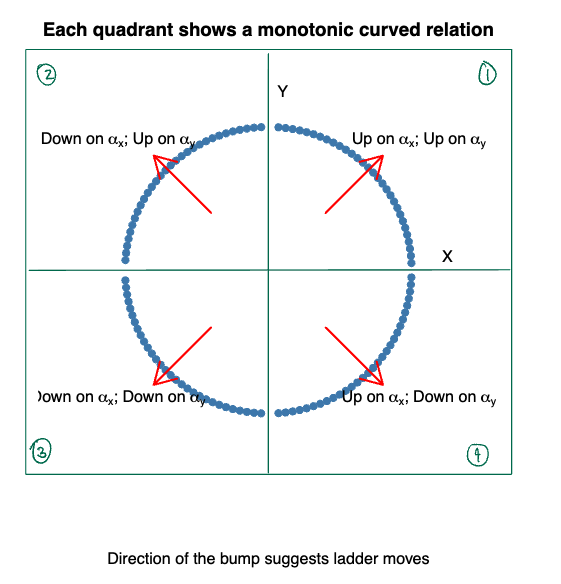
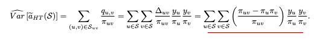
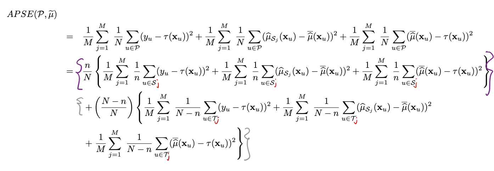

# STAT 341

### Lecture 1

#### Population attributes
* A **population** is a finite set $\mathcal P$ of elements.
  * Elements of a population are called **units** $\in \mathcal P$
  * **Variates** are functions $x(u), y(u)$ or $x_{u}, y_{u}$ etc. on the individual units $u \in \mathcal P$.
* **Population attributes** are summaries describing characteristics of the population.

$$
a(\Rho) = f(y_1, \dots, y_N)
$$

* In general, attributes can be numerical or graphical - as long as they summarize the whole population
  * A histogram of $y_u$ values

#### Location Attributes
These attributes measure or describe the centre of the distribution of variate values in a dataset.
- The population average
$$
a(P) = \bar{y} = \frac{1}{N}\sum_{u\in P}y_u
$$
- The population proportion
$$
a(P) = \frac{1}{N}\sum_{u\in P}I_A(y_u)
$$
- The mode/median

#### Spread Attributes
These attributes measure variability or spread of the variate values in a data set.
- The population variance
$$
a(P) = V_P(y) = \frac{1}{N}\sum_{u\in P}(y_u - \bar{y})^2
$$
- The population standard deviation
$$
a(P) = SD_P(y) = \sqrt{V_P(y)}
$$
- Coefficent of variation:
$$
a(P) = \frac{SD_P(y)}{\bar{y}}
$$

**Note:** the pop var and sd could also be defined using N - 1 in the denominator.

#### Order Statistics
Population attributes can also be based on an indexed collection of values
$$
y_{(1)} \leq y_{(2)} \leq\ldots\leq y_{(n)}
$$
which are the variate values $y_u\in P$ ordered from smallest to largest.

#### Skewness Attributes
These are measures of asymmetry in a population. A symmetric distribution of pupulation values should result in a skewness attribute of zero.
- Pearson's moment coefficient of Skewness:
$$
a(P) = \frac{\frac{1}{N}\sum_{u\in P}(y_u - \bar{y})^3}{[SD_P(y)]^3}
$$
- Pearson's second skewness coefficient (median skewness):
$$
a(P) = 3 \times \frac{(\bar{y} - median_{u\in P}y_u)}{SD_P(y)}
$$
- Bowley's measure of skewness based on the quartiles:
$$
a(P) = \frac{(Q_3 + Q_1)/2 - Q_2}{(Q_3 - Q_1)/2}
$$

Bowley's measure of skewness based on the quartiles is an order statistic analogue of the median skewness.

## Attribute Properties
We examine the behaviour of an attribute when we change the units in some way, or when we replicate the population.

A population attribute is a function of measured variates $y_u$.

We are interested in how an attribute changes
- when we change the units of measurements
- when we change the population

Sometimes only the scale of the measurement is changed.

Sometimes only the location of the zero for that measurement is changed.

Sometimes both the location and the scale change.

Sometimes the change involves more than just a chjange in location and/or scale of measurement.

#### Location Invariance and Equivariance
For an attribute $a(P)$ we say that for any $m > 0\;\text{and}\;b\in\R$, that the attribute is
* **location invariant** if
$$
a(y_1 + b, \dots, y_n + b) = a(y_1, \dots, y_n)
$$

* **location equivariant** if 
$$
a(y_1 + b, \dots, y_n + b) = a(y_1, \dots, y_n) + b
$$

#### Scale Invariance and Equivariance
For an attribute $a(P)$ we say that for any $m < 0\;\text{and}\;b\in\R$, that the attribute is
* **scale invariant** if
$$
a(m\times y_1, \dots, m\times y_n) = a(y_1, \dots, y_n)
$$
* **scale equivariant** if
$$
a(m\times y_1, \dots, m\times y_n) = m \times a(y_1, \dots, y_n)
$$

#### Replication
Another invariance/equivariance property of interest for population attributes is **replication invariance** and **replication equivariance**.
- If a population P is duplicated *k-1* times, how does the attribute change on this new populationn denoted $P^k$.
$P^k = \{y_1, \dots, y_n, y_1, \dots, y_n, \dots, y_1, \dots, y_n\} = \{x_1, x_2, \dots, x_{kn}\}$
- The attribute a(P) is
  - **replication invariant** whenever $a(P^k) = a(P)$
  - **replication equivariant** whenever $a(P^k) = k\times a(P)$

## Influence, Sensitivity Curves and Breakdown Points

If we wish to evaluate a population attribute $a(P)$ we could consider the effect of adding or removing a single unit from the population $P$.

To quantify this effect, we could look at the change in the attribute's value when the unit's variate value is added (*sensitivity*) or removed (*influence*).

We also consider a special form of sensitivty called the *breakdown point*.

#### Influence

Basically outlier detection.
If we removed variate $y_u$ then the influence of that variate on the population attribute is quantified by
$$
\triangle(a,u) = a(y_1, \dots, y_{u-1}, y_u, y_{u + 1}, \dots, y_N) = a(y_1, \dots, y_{u-1}, y_{u + 1}, \dots, y_N)
$$
Ideally, no single unit's value should have greater influence than any other.

If a unit has larger influence than the rest;

- It would require further investigation as it might be an error
- it might be the most interesting unit in the population.

#### Sensitivity Curve

We can also examine the effect on an attribute when we add a variate. To examine this effect,

* Suppose we have a population of size $N - 1$ and
* add a variate with the value $y$.
* Then our new population with $N$ elements is $\{y_1, \dots, y_{N - 1}, y\}$

We define the sensitivity curve of an attributer as
$$
SC(y;a(P)) = \frac{a(P^*) - a(P)}{\frac{1}{N}} \\
N[a(P^*) - a(P)]
$$
where:

* $P^*$ is the population without y, and $P$ is the population with y and $\star$ is the proportion of data that is new.

We can then plot the curve as a function of the new variate y.

* It gives a scaled measure of the effect that a single variate value y has on the value of a population attribute $a(P)$

We can explore the sensitivity curve for any attribute. These can be determined mathematically in general, but can also be determined computationally for any particular population and any particular attribute.

The sensitivity curve here gets higher (or lower) without bound as $y \to \infty$

A single observation can cahnge the average by a huge (even infinite) amount.

Averages may not be the best choice for a population attribute representing the location of a population.

#### Breakdown Points
Another measure of robustness that exists is called the breakdown point.
- It gives an assessment of just how large a proportion of the data must be contaminated before the statistic breaks down (and becomes useless)

The breakdown point of a statistic is the smallest possible fraction of the observations that can be changed to something very extreme to make the error large.

e.g. the breakpoint for
- the average is $1/N$
- the median is $1/2$

Attributes with high breakdown points are called resisitant or robust.

## Graphical Attributes
Population attributes can also be entirely graphical.
- Histograms of $y_u$ values
- bar plots
- box plots
- scatter-plots of pairs $(x_u, y_u)$

Each of these plots summarizes the entire population, so they're all attributes.

#### Histograms
Consider the population $P$.
- Partition the range of the population into $k$ non-overlapping intervals, called bins, $I_j = [a_{j - 1}, j),\;j = 1,2,\dots,k$ and then calculate the number or proportion of observations in the $j^{th}$ bin.
- Histograms help determine how the values are concentrated.

We can define bins two ways
- bins of equal size
- bins with equal number of elements, but varying size

Rules for the Number of Buns
* Sturges rule:  
  the number of bins should be $\lceil \log_2(N) + 1\rceil$
* Freedman-Diaconis rule:  
Bin size = $2\frac{IQR(x)}{N^{1/3}}$
* Scott's rule:  
Bin size = $3.5\frac{\sigma}{N^{1/3}}$

#### Scatter-plots
A scatter-plot is a plot of the points $(x_u, y_u)$ for all units in the population.

It is used to see whether two variates $x$ and $y$ are related in some way

## Power Transformations
For any variate $y$ it is sometimes helpful to re-expresss the values in a non-linear way via a transformation $T(y)$ so that on the transformed scale location/scale attributes are easier to define, to understand, or to simply determine.

A commonly used transformation when $y > 0$ is the family of **power transformations** which is indexed by a power $\alpha$. The general form is

$$
T_\alpha(y) = \begin{cases}
y^\alpha &\ \alpha > 0 \\
log(y) &\ \alpha = 0
\end{cases}
$$

These transformations are monotonic, in the sense that $y_u < y_v \iff T_\alpha(y_u) < T_\alpha(y_v)$

They preserve order of the variate values.

They change relative positions dramatically.

Different values of $\alpha$ change the "spacing" between observations.

Changing the spacing impacts how symmetric the histogram is.

An alternative mathematical form for, called the Box-cox transformation, $T_\alpha(y)$ is
$$
T_\alpha(y) = \frac{y^\alpha - 1}{\alpha} \;\;\forall\;\alpha
$$

Note that the following limit gives rise to $\alpha = 0$ case above:
$$
lim_{\alpha\to 0}T_\alpha(y) = log(y)
$$

Another power transformation specification (with minimal potential for calculation errors) is the following:
$$
T_\alpha(y) = \begin{cases}
y^\alpha &\ a > 0 \\
log(y) &\ \alpha = 0 \\
-(y^\alpha) &\ a < 0
\end{cases}
$$

Decrease $\alpha$ moves bump on histogram to right

Increase $\alpha$ bump on histogram moves left

How to choose $\alpha$?

##### Bump Rule 1: Making histograms more symmetric
If the bump is on "lower" values, then move "lower" on the ladder

If it is on "higher" values, then move "higher" on the ladder.

##### Bump Rule 2: Straightening Scatter-plots
A scatter plot of $(x_u, y_u)$ for $u\in P$ may be "straightened" by appling (possibly) different power transforms to each coordinate $(T_{\alpha_{X}}(x), T_{\alpha_Y}(y))$.

Now there are 2 ladders, for $x$ and $y$.

## Order, Rank and Quantiles
Order statistics are ordered values of the variate values $y_u \in P$.

Rank statistics are the ranks of the variates $y_u \in P$, represented as $r_1, \dots, r_N$.

If $y_i = y_{(k)}$, then $y_i$ is the kth smallest value, so $y_i$ has rank $r_i = k$. 
This means that $y_{(r_u)} = y_u\; \forall u\in P$

#### Quantiles
Rather than using ranks, it can be more convenient to use the proportion of units in the population having a value $\leq$ y.

So instead of plotting the pairs $(r_u, y_u)$ we could equivalently plot the pairs $(p_u, y_u)$ where
$$
p_u = \frac{r_u}{N}
$$
is the proportion of the units $i\in P$ whose values $y_i \leq y_u$.

Strictly speaking, the plotted points are $(p, Q_y(p))$ where
- $p\in\{\frac{1}{N},\frac{2}{N}, \dots, 1\}$
- $Q_y(p)$ is the pth quantile of $y$, $Q_y(p) = y_{(N\times p)}$ and is sometimes called the **quantile function** of $y$, for all $p\in[\frac{1}{N}, 1]$.

The quantile function for any p locates the variate values in the population.

Most location measures try to capture central tendency.

##### Quantiles that measure center
- The median $Q_y(1/2)$
- the mid-hinge (average of first and third quartiles)
- the mid-range (average of the minimum and maximum)
- the trimean

##### Quantiles that measure spread
The quantile function can also be used to provide some natural measures of spread for the variate $y$:
- The range $Q_y(1) - Q_y(1/N)$
- Inter-quartile range $IQR_y = Q_y(3/4) - Q_y(1/4)$
- central 100 $\times p\%$ range

Alternatively the difference between any two quantiles might be divided by the difference in the corresponding $p$ values.

## The Minimum of a Function
In most practical situations we are interested in a (possibly vector-valued) attribute $\pmb{\theta}$ which minimizes some function $p(\pmb{\theta}; P)$ of the variates in the population.

That is, we want the value $\hat{\pmb\theta}$ which satisfies
$$
\hat{\pmb\theta} = \argmin_{\pmb{\theta}\in\Omega} p(\hat{\pmb\theta}; P)
$$
where the possible values of $\pmb\theta$ may be constrained to some set $\Omega$.

Note that maximizing a function is the same as minimizing its negation.

##### Simple Linear Regression
Given $y_u = \alpha + \beta(x_u - c) + r_u\;\forall\;u\in P$ The attribute of interest is $\pmb{\theta} = (\alpha,\beta)$.

$$
\hat\alpha = \bar y - \hat\beta(\bar x - c) \\~\\
\hat\beta=\frac{\sum_{u\in P}(x_u - \bar x)(y_u - \bar y)}{\sum_{u\in P}(x_u - \bar x)^2}
$$

The resulting estimates of $\alpha,\beta$ determine the least-squared fitted line:
$$
y = \hat\alpha+\hat\beta(x-c)
$$

The residuals are:
$$
\hat r_u = y_u - \hat\alpha-\hat\beta(x_u - c)
$$
Each residual is the signed vertical distance between the real and estimate.

## Dealing with Influential Units in Linear Regression

Remove the units  
weighted linear regression  
use a method to find the regression line which is robust to potential outliers

#### Weighted Linear Regression

$$
(\hat\alpha, \hat\beta) = \argmin_{(\alpha,\beta\in\R^2)}w_u(y_u - \alpha - \beta(x_u - c))^2
$$
$w_u$ is assumed to be known.

It is common to set c = 0, or define c to be the weighted average of the $x_u$ values.

#### Robust Regression

$$
(\hat\alpha, \hat\beta) = \argmin_{(\alpha,\beta\in\R^2)}\rho(y_u - \alpha - \beta(x_u - c))^2
$$
where different forms of the function $\rho(\cdot)$ give rise to different fitted lines.

We want to modify the loss function $\rho(\cdot)$ so that
- It gives lower weight than least squares to units with large residuals
- It is quadratic near 0 and hence behaves similarly to LS for units with small residuals

The **Huber Loss Function** achieves these goals by combining the quadratic and absolute value functions
$$
\rho_k(r) = \begin{cases}
\frac{1}{2}r^2 &\ \text{for} |r|\leq k \\
k|r|-\frac{1}{2}k^2 &\ \text{for} |r| > k
\end{cases}
$$
As k increases, the robust regression with Huber function imposes a larger penalty on larger residuals, hence approaches the least squares fit.

Another form is the least absolute deviations (LAD):
$$
(\hat\alpha,\hat\beta) = \argmin_{\alpha,\beta\in\R^2}\sum_{u\in P}|y_u - \alpha - \beta(x_u - c)|
$$

When the attribute of interest is $\hat{\pmb{\theta}}$ but the definition of $\rho(\cdot)$ is difficult, we can use the following optimization methods:
- Gradient Descent
- Newton-Raphson
- Iteratively reweighted least-squares

## Gradient Descent
Given an implicitly defined attribute of interest $\pmb{\theta}$, the goal is
to construct an interative procedure which produces a sequence of iterates,
$\hat{\pmb{\theta}}_1, \hat{\pmb{\theta}}_2,\dots,\hat{\pmb{\theta}}_i,\hat{\pmb{\theta}}_{i+1},\dots$
such that this sequence converges to $\hat{\pmb{\theta}}$.

Ideally, each iterate is closer than the one before it.

#### Direction and Step Size
If $\rho(\theta;P)$ is a differentiable function of $\theta = (\theta_1, \dots, \theta_k)\in\R^k$, then we can calculate the gradient for any value of $\theta$:
$$
g = g(\theta) = \nabla\rho(\theta;P) = \begin{bmatrix}
\frac{\partial\rho(\theta;P)}{\partial\theta_1} \\
\frac{\partial\rho(\theta;P)}{\partial\theta_2} \\
\dots \\
\frac{\partial\rho(\theta;P)}{\partial\theta_k} \\
\end{bmatrix}
$$

At iteration i, when $\hat{\pmb{\theta_i}}$ is our best guess at the solution, we denote the gradient by $g_i = \bold{g}(\hat{\pmb{\theta_i}})$

The normalized gradient
$$
d_i = \frac{g_i}{\begin{Vmatrix}g_i\end{Vmatrix}}
$$
provides the direction in which $\rho(\theta;P)$ increases or decreases fastest.

$d_i$ gives steepest ascent.

$-d_i$ gives steepest descent

We iterate and obtain a new estimate of $\pmb{\theta}$ by
* moving in the direction of $-d_i$ and
* taking a step of size $\lambda_i > 0$
$$
\hat{\pmb{\theta_{i+1}}} = \hat{\pmb{\theta}} - \lambda_i d_i
$$

We can choose the step size $\lambda$ at each iteration in different ways:
1. We could choose a fixed value for all $i$ such as $\lambda_i = 0.1$
2. We could define a fixes sequence
3. We could perform a line search and algorithmically choose the value of $\lambda_i$ that minimizes $\rho(\hat{\pmb{\theta}} - \lambda_i d_i)$ (aka which step size in the direction $-d_i$ away from $\hat{\pmb{\theta_i}}$ minimizes $\rho(\hat{\pmb{\theta_{i+1}}};P)$)

#### The Gradient Descent Algorithm
Given some initial value $\hat{\pmb{\theta_0}}$
1. Initialize $i \leftarrow 0$
2. LOOP
   1. Find gradient $g_i$
   2. Find gradient direction $d_i=\frac{g_i}{||g_i||}$
   3. Line search for $\hat\lambda_i$ using $\hat\lambda_i=\argmin_{\lambda>0}\rho(\hat\theta -\lambda_id_i)$
   4. Update the iterate
   5. Converged?
3. Return $\hat{\pmb{\theta}} = \hat{\pmb{\theta_i}}$

#### Batch Gradient Descent
In practice, many of the objective functions minimized during statistical analyses have the following form:
$$
\rho(\pmb{\theta};P)=\sum_{u\in P}(\pmb{\theta};u)
$$
in which case the graduent g can simply be written as te sum of the unit-specific contributions to the objective function.
$$
\bold{g} = \bold{g}(\pmb{\theta}) = \nabla\rho(\pmb{\theta};P) = \sum_{u\in P}\nabla\rho(\pmb{\theta};u) = \sum_{u\in P}\bold{g}(\pmb{\theta};u)
$$
Thus, when $\rho(\cdot)$ is a sum over $u \in P$:
- the gradient **g** is composed by N 'smaller' independent gradient calculations
- these indiviudal gradient calclulations can be done in any order (parallel computing can solve this faster)

#### Gradient Descent using subsets of the population
In such situations, when estimating the gradient using $M < N$ units, we do not optimize the step size $\lambda$ and instead use a fixed step size $\lambda^*$.

We do this because the gradients are just an approximation, so we don't optimize for step size in a potentially wrong direction.

$\lambda^*$ is called the learning rate.

Two common approaches:
- Batch sequential

Suppose we can divide the population of size $N$ to $H$ batches of size $M$, i.e. $N = H \times M$ and $P - \{B_1,\dots,B_H\}$

In this approach we sequentially move through the H batches and update our estimate $\hat{\pmb{\theta}}$ after eachg batch.
- Note that this is different from ordinary batch gradient descent; in that case the gradients are still calculated in batches, but $\hat{\pmb{\theta}}$ is only updated after observing all batches.

If convergence takes more than $H$ iterations, then the batches are iteratively sequenced through until convergence.

- Batch stochastic

In this approach, each iteration of the gradient is calculated from a sample (batch) $S$ selected randomly from the population $P$.
- Like batch-sequential gradient descent, the estimate $\hat{\pmb{\theta}}$ is updated after each batch.

## Systems of Equations

### Overview

We provide an alternative definition of implicitly defined attributes: **the solution to an equation or a set of equations**

* We consider how to use Newton's Method to numerically solve such systems of equations.

We have defined an implicit attribute $\theta$ as the solution to an optimization problem. Until now, we have cast such as optimization problem as the minimization of some approriately defined objective function $\rho(\theta;P)$:
$$
\hat\theta=\argmin_{\theta\in\Theta}\rho(\theta;P)
$$
In all situations, we saw that such a solution was obtained by solving
$$
\nabla\rho(\pmb{\theta};P) = \pmb{0}
$$
When the dimension of the vector valued attribute $\pmb\theta$ is $k$, such asn equation is actually a system of $k$ independent equations with $k$ unknowns. Thus an implicit attribute $\pmb\theta\in\pmb\Theta$ can be defined slightly more generally as the solution to a system of equations
$$
\varPsi(\pmb\theta;P)=\sum_{u\in P}\varPsi(\pmb\theta;u)=\pmb0
$$
The attribute of interest $\pmb{\hat\theta}$ is the value $\pmb\theta\in\pmb\Theta$ that solves the above equation.

#### Ex: Least Squares

$$
\varPsi(\pmb\theta;P) = \sum_{\u\in P}\varPsi(\pmb\theta;u)=\sum_{u\in P}r_u=\sum_{u\in P}(y_u-\alpha-\beta(x_u-c))\begin{pmatrix}
1 \\
x_u - c
\end{pmatrix}=\pmb0
$$

Not sure where the vector comes from.

### Newton's Method

Suppose we have a diff function $f(x)$ and we wish to find $x=x^*$ which solves $f(x)=0$.

Given an initial value x_0

* We can use a linear function to approximate $f(x)$ in the vicinity of $x_0$

$$
f(x)\approx f(x_0)+f'(x)(x_0)(x-x_0)
$$
^First order Taylor approximation

* then we can find the root of the linear approximation to iterate to the next value of $x$:

$$
0=f(x_0)+f'(x_0)(x-x_0)\Rightarrow x_1=x_0-\frac{f(x_0)}{f'(x_0)}
$$

* We continue in this way until $x_{i+1}$ does not differ much from $x_i$.

For our purposes, $f(x) = \varPsi(\theta;P)$ and $x=\theta$.

#### The Newton Algorithm

Given initial value $\hat\theta_0$

1. Initialize $i\leftarrow0$
2. LOOP:

a. Update the iterate:

$$
\hat\theta_{i+1}\leftarrow\hat\theta_i-\frac{\varPsi(\hat\theta_i;P)}{\varPsi'(\hat\theta_i;P)}
$$

b. Converged?  
      if the iterates are not changing return  
      else $i\leftarrow i+1$

3. Return $\hat\theta=\hat\theta_i$

## Samples

### Overview

Here we consider what happens when you have a sample instead of the whole population

If we have a **sample** or a subset $S$ of $n\ll N$ units,

* Then the attribute $a(S)$ calculated based on this sample is an estimate of its population counterpart $a(P)$.

$$
a(S)=\hat{a(P)}=a(\hat P)
$$

When using a sample instead of the entire population, we might consider

* sample error
* Fisher consistency.

## Sample Error

Any difference between the actual values of the estimate $a(S)$ and the quantity being estimated (the estimand) $a(P)$ is an error.

$$
s.e.=a(S)-a(P)
$$

The nature of this error will depend on the sample and the attribute.

Quantifying error for:

* numerical attributes: mathematically determined
* graphical attribute: not precise, but generally applicable.

The sample error for a sample $S$ of size $n$ is:

$$
a(S) - A(P) = \frac{1}{n}\sum_{u\in S}y_u-\frac{1}{N}\sum_{u\in P}y_u
$$

The average sample error (aka bias) over all possible samples of size $n$ is

$$
\text{bias}=\Big(\frac{1}{M}\sum_{i=1}^Ma(S_i)-a(P)\Big)
$$

where M is the number of possible samples.

The nature of sample error depends largely on sample size. As n increases, the sample approaches the population and attribute values will concentrate even more around the population value.

The concentration around the true value indicates some kind of consistency for this particular attribute.

To quantify this concentration we could look at
$$
||a(S)-a(P)||_1=\Bigg|\Bigg|\frac{1}{n}\sum_{u\in S}y_u-\frac{1}{N}\sum_{u\in P}y_u\Bigg|\Bigg|_1<c,\text{ for some } c > 0
$$

Then we could calculate the proportion of samples that satisfy this.

Consider a population $P$ of size $N < \infty$.

For each $n$, we can construct the set of all possible samples.  
For any $c>0$,
$$
P_a(c,n)=\{S:S\subset P_S(n)\text{ and } ||a(S)-a(P)||_1<c\}
$$
and define the proportion
$$
p_a(c,n)=\frac{|P_a(c,n)|}{|P_S(n)|}
$$

As $c$ increases,the proportion $p_a(c,n)\rightarrow1$ for all $n$. But it does so much more quickly for large $n$. This signifies the sample attributes clister more tightly around the true pop attribute for larger samples.

### Comparisons across attributes

We compare different attributes with a relative measure of consistency instead of absolute.

Absolute sample error -> evaluate impact of a sample size on concentration

However, if we want to compare different attributes, we use relative absolute sample error. For any $c>0$, let
$$
P_a^*(c,n)=\{S:S\subset P_S(n)\text{ and }\frac{||a(S)-a(P)||_1}{||a(P)||_1} <c\}
$$
and define the corresponding proportion, for all $c>0$ and $n\leq N$
$$
p_a^*(c,n)=\frac{|P_a^*(c,n)|}{|P_S(n)|}
$$

$p_a^*(c,n)$ measures the consistency of the sample attribute with respect to the same population attribute.  
When making comparisons between attributes, we are evaluating each attribute on how well its sample value tracks its population value on the same scale.

## Fisher Consistency

If the sample $S$ is equal to the population $P$ then there is no sample error.

This would mean that the estimation is consistent.

This type of consistency is sometimes called Fisher consistency.

There are $\begin{pmatrix}N \\ n\end{pmatrix}$ different possible samples $S$ of size $n$.

## Selecting Samples

What do we do if it is too difficult to generate all possible samples?  
We can randomly select a subset of all possible subsets.

Given that sample error exists, we want to understand the magnitude of error that can be expected.

The **sampling distribution** of the attribute $a(S)$ gives insight into this. Properties of this distribution can be determined:

* **exactly**, when all possible samples are available
* **approximately** when a subset is considered
* **in expectation** when a pobabilistic sampling mechanism is used to draw a single sample.

### Randomly Selecting $m$ Samples

The population $P_S$ of all samples with size $n$ has size $M=\begin{pmatrix}N \\ n\end{pmatrix}$ and is denoted
$$
P_S=\{S_1,S_2,\ldots,S_M\}
$$

Any attribute $a(S_i)$ is now just a variate on that unit!

So our sampling distribution is:
$$
P_{a(S)}=\{a(S_1),\ldots,a(S_M)\}
$$

In general, it can be computationally expensive to calculate all possible samples.

Instead, we can randomly select m samples $S_{u_1|,\ldots,S_{u_m}}$ from the population $P_S$ of $M$ possible samples.

Interesting aside:  
Suppose the histogram based on all possible samples has $K$ bins,
$$
B_1=(b_0,b_1],\ldots,B_K=(b_{K-1}, b_K)
$$
where the kth bin $B_K$ contains $M_K\geq0$ of the attribute values $a(S_i)$ and $\sum_{k=1}^KM_k=M$.

Now suppose we select $m$ samples at random from $P_S$ with probability $1/M$. Let $m_k$ be the number of the $m$ selected samples whose attributes falls into $B_k$, with $m=\sum_{k=1}^Km_k$.

The probability of any particular histogram arising from a random selection of $m$ samples is a multivariate hypergeometric probability.
$$
\frac{\binom{M_1}{m_1}\binom{M_2}{m_2}\dots\binom{M_K}{m_K}}{\binom{M}{m}}
$$
which, when $m\ll M$, can be approximated by the multinomial probability
$$
\binom{m}{m_1\;m_2\;\dots\;m_K}p_1^{m_1}p_2^{m_2}\dots p_K^{m_K}
$$
with probabilities $p_k=\frac{M_K}{M}$ for $k=1,\ldots,K$.

From the multinomial, the expected value of the number of attribute values in each bin $B_k$ is proportional to $M_k$ i.e. $mp_k=\frac{m}{M}M_k=E(m_k)$

The frequency histogram based on $m$ samples is a scaled version of that of all possible samples.

The density histrogram based on m samples is identical to that of all possible samples.

### Quantifying Sample Error

In principle, we select a sample $S$ from the population $P_S$ containing all possible samples

For any sample $S\in P_S$, we have its sample error $a(S)-a(P)$.

We can quantify the concentration of sample errors un expectation using quantities such as sampling bias, sampling variance and sampling mean squared error.

By sampling $S$ randomly from $P_S$ with probability $p(S)$ we define the sampling bias as:
$$
\text{Sampling Bias}=E[a(S) - a(P)] = E[a(S)] - a(P) \\
= \sum_{S\in P_S}a(S)p(S)-a(P)
$$

Sampling bias is just the expected sample error induced by the repeated random sampling of $S$ from $P_S$. If $p(S)=1/M$, the sampling bias is identical to the average sample error of $a(P)$.

If sampling bias is 0, then $a(S)$ is called an unbiased estimator of $a(P)$.

Sampling variance is defined as:
$$
Var[a(S)]=E[(a(S)-E[a(S)])^2]
$$
This quantifies the dispersion in the sample errors.

Sampling standard deviation is the square root of the variance.

Mean suqared error can be used to quantify the expected squared distance between these two quantities
$$
\text{MSE}[a(S)]=Var[a(S)] + [\text{Sampling Bias}]^2
$$

Thinking of the sampling distribution of an attribute $a(S)$ gives rise to the notion of an attribute as an estimator.

We can introduce a random variable, say $A=\hat{a(S)}$, that takes values $a$ frm distinct values of $a(S)$ for all $S\in P_S$. The induced probability distribution is:

$$
P(A=a)=\sum_{S\in P_S}p(S)\times I(a(S)=a)
$$ 
where I is the indicator function (1 if cond, o/w 0).

A is a discrete random variable.

### Sampling Mechanisms

Instead of selecting $S\in P(S)$ with probability $p(S)$, we can select $n$ units directly from the poopulation of units $P$.

A sequence of the first $k$ units $u_i$, selected from $P$ is
$$
s_k = (u_i, u_{i_2},\ldots,u_{i_k})
$$

A sampling mechanism is defined by the probabilities
$$
Pr(u) \text{ and } Pr(u | k, s_{k-1})
$$
The first unit is selected with probability $Pr(u)$.

To determine $p(S)$ from a sampling mechanism:

* Recognize that the order in which the units appear does not matter.
* Thus $p(S)$ is the sum of $Pr(s_n)$ over all permutations of $s_n$.

#### SRSWOR

The sampling mechanism is
$$
Pr(u)=\frac{1}{N} \text{ and } Pr(u | k,s_{k-1})=\frac{1}{N-k+1}
$$

The probability of the sequence $s_n$ is:
$$
Pr(s_n)=\frac{1}{N}\times\frac{1}{N-1}\times\frac{1}{N-2}\times\dots\times\frac{1}{N-n+1}
$$
which is the same for all $n!$ permutations, so
$$
p(S)=n!\times Pr(s_n)=\frac{n!}{N(N-1)(N-2)\dots(N-n+1)}=\frac{1}{\binom{N}{n}}=\frac{1}{M}
$$

This probability is the same as we had before for selection $n$ dist4icnt units from a population of $n$ distinct units.

However, we no longer have to enumerate over all $M$ possible samples in $P(S)$.

#### SRSWR

The sampling mechanism is
$$
Pr(u)=\frac{1}{N} = Pr(u|k,s_{k-1}) \\
\text{and } Pr(s_n)=\Big(\frac{1}{N}\Big)^n
$$
unlike SRSWOR, we typically treat each $s_n$ as an ordered sample and so
$$
p(S)=Pr(s_n)=\frac{1}{N^n}
$$

If we treat each $s_n$ as an unordered sample similar to SRSWOR we obtain
$$
p(S)=Pr(s_n)\times\frac{n!}{n_1!n_2!\dots n_N!}
$$
where $n_u$ is the number of duplicates of unit $u$ in the sample.

#### SWRSWH

Suppose we perform SRSWR except we remove any duplicate units.

* The samples produced will have sizes anywhere from 1 to $n$ according to how many distinct units were selected in a sample.

### Unit Inclusion Probabilities

The marginal inclusion probability for unit $u$ is the probability of unit $u$ being included in the sample.
$$
\pi_u=Pr(u\in S)=\sum_{S\in P_S}p(S)\times I(u\in S)
$$

Such inclusion probabilites are of interest to calculate in addition to $p(S)$ and they may be derived from $p(S)$.

Now, consider the random variable
$$
D_u=\begin{cases}
1 &\ \text{u}\in S \\
0 &\ o/w
\end{cases}
$$

The expectation of this random variable is
$$
E[D_u]=1\times P(D_u=1)+0\times P(D_u=0) \\
=P(u\in\mathcal{S}) \\
=\pi_u
$$
with variance
$$
Var[D_u] = E[D_u^2] - E[D_u]^2 \\
=\pi_u(1-\pi_u)
$$

#### SRSWOR

Inclusion probability is:
$$
\pi_u=n/N
$$
Joint inclusion probability is
$$
\pi_{uv}=Pr(u\in S \;\cap\; v\in S)=\frac{n(n-1)}{N(N-1)}
$$

#### SRSWR

Inclusion probability is:
$$
\pi_u=1-\Big(\frac{N-1}{N}\Big)^n
$$

Joint inclusion probability:
$$
\pi_{uv}=1-2\Big(\frac{N-1}{N}\Big)^n+\Big(\frac{N-2}{N}\Big)^n
$$

#### SRSWH

Identical to SRSWR

### Estimating Totals

#### Horvitz-Thompson Estimate

A natural estimate of a population total
$$
a(P)=\sum_{u\in P}y_u
$$
is the Horvitz-Thompson Estimate. defined as:
$$
\widehat{a(P)}=a_{HT}(S)=\sum_{u\in S}\frac{y_u}{\pi_u}
$$
where the contribution for each unit in the sample weighted inversely by $\pi_u$.
If the probability of inclusion is small, weight is high. If large, then weight low.

#### Horvitz-Thompson Estimator

Estimator is the random variable.

##### Bias, Variance and MSE

It can be shown that variance of the HT estimator is:
$$
Var[\tilde a_{HT}(S)]=\sum_{u\in P}\sum_{v\in P}Cov(D_u,D_v)\frac{y_u}{\pi_u}\frac{y_v}{\pi_v}
$$
This variance can be equivalently written in Yates-Grundy formulation
$$
Var[\tilde a_{HT}(S)]=-\frac{1}{2}\sum_{u\in P}\sum_{v\in P}Cov(D_u,D_v)\Big(\frac{y_u}{\pi_u}\frac{y_v}{\pi_v}\Big)^2
$$

Note that because the HT estimator is unbiased, the MSE is simply just the variance.

##### The HT Estimate of the Variance of the HT Estimator

For the HT estimate we will need the following quantity:
$$
q_{u,v}=\triangle_{uv}\frac{y_u}{\pi_u}\frac{y_v}{\pi_v}
$$
defined over $P_{uv}$ which is the population of all pairs $(u,v)$ where $u,v\in P$.
Thus, the variance of the HT estimator can be rewritten as $\sum_{(u,v)\in P_{uv}}q_{u,v}$

As you can see, variance is just a total!

The HT estimate of the variance of the HT estimator is:

The square root of this variance estimate is called standard error of the estimate.

Useful because:

1. Many attributes are totals or functions of totals and so the HT framework provides an intuitive and effective means of estimation.
2. We can now quantify and understand properties of a sampling distribution with just a single sample!

### Sampling Design

The pair $(P_S,p(S))$ is called a sampling design.

Together, they determine which samples are possible and with what probability they are selected.

The SRSWOR, SRSWR and SRSWH frameworks provide examples of different sampling designs.

We can choose our sampling design:

* Can choose $P_S$ s.t. values $a(S)$ for $S\in P_S$ are constrained to be near $a(P)$.
* Can choose $p(S)$ so that samples $S\in P_S$ that have $a(S)$ close to $a(P)$ have higher probability $p(S)$ of being selected.

## Inductive Inference

Probabilistic reasoning can be used to quantify magnitude of a sample error when a sample is used to describe a population. (Provided that a probabilistic sampling mechanism is used)

The sampling behaviour of any population can be examined by repeatedly drawing samples according to the sampling mechanism and calculating the attribute of samples.

The sampling behaviour of that attribute can be summarized by its sampling bias and sampling variance.

### Sources of Error

Study error, sample error, measurement error.

## Comparing Sub-Populations

### Preamble and Intuition

Often times, interest lies in comparing two or more sub-populations

e.g. treatment vs control arms of a clinical trial, two different versions of a webpage.

Can compare by difference or ratio.

If graphical, we can compare figures/plots.

When the attribute is a measure of location, compare with difference, if measure of spread, compare by ratio.

#### Randomly mixing sub-populations

If two sub-populations are essentially the same, than swapping units in between them would not dramatically change the features of the resulting sub-populations.

### anatomy of a Significance Test

We would like to quantify, numerically, how unusual the difference between $a(P_1)$ and 
$a(P_2)$ is relative to randomly mixed sub-populations.

1. We suppose the sub-populations were randomly drawn from the same population. (null hypothesis, $H_0$).
2. We could construct a discrepancy measure/test statistic that quantifies how inconsistent our dats is with the null hypothesis
3. We obtain the observed dicrepency by calculating the test statistic on the two observed sub-pops.
4. To evaluate the extremity of the observed discrepancy, we compare its value to an approximation of the sampling distribution. We obtain this approximation through repeated random shuffling. This comparison is formalized with a p-value.
5. Finally, we obtain the observed p-value by calculating

small p-value = evidence against the null hypothesis.

#### The Null Hypothesis

$H_0$: $P_1$ and $P_2$ are indistinguishable.

#### The Discrepancy Measure/Test Statistic

A discrepancy measure $D(P_1,P_2)$ quantifies how inconsistent our data is with the null hypothesis, and is defined so that large values indicate evidence against the null hypothesis.

The form of our test statistic $D(P_1,P_2)$ depends on how we want to compare $P_1$ and $P_2$.

Location = Difference  
Spread = Ratio  

#### The Observed p-value

The observed p-value is the probability that a randomly shuffled sub-population has a discrepancy measure at least as large as the observed discrepancy
$$
\text{p-value}=Pr(D\geq d_{obs}|H_0 \text{ is true})
$$

### A t-like test statistic

When comparing two sub-pops on the basis of a measure of location, one particularly useful test statistic is
$$
D(P_1,P_2)=\frac{a(P_1)-a(P_2)}{SD[a(P_1) - a(P_2)]}
$$

This discrepancy measure is "physically dimensionless" and thus, scale-invariant.

The challenge is determining the denominator of the discrepancy measure.

Suppose we are interested in differences in averages:

In this case $a(P_i)=\bar{Y_i}$ and $P_i$ has size $N_i, i=1,2$

The test statistic is:
$$
D(P_1,P_2)=\frac{\bar{Y_1}-\bar{Y_2}}{\sqrt{\tilde{\frac{\sigma^2}{N_1}}-\tilde{\frac{\sigma^2}{N_2}}}}
$$
where $\tilde\sigma$ is the combined estimator of the standard deviation of the $Y$ values in the population $P=\{P_1,P_2\}$
$$
\tilde\sigma=\Bigg(\frac{(N_1 - 1)\tilde\sigma_1^2+(N_2-1)\tilde\sigma_2^2}{(N_1-1)+(N_2-1)}\Bigg)^\frac{1}{2}
$$
^Student's t-test

If it were inappropriate to assume the variability in the two sub-populations was equivalent we could instead use the denominator (Welch's t-test)
$$
\sqrt{\frac{\tilde\sigma_1^2}{N_1}+\frac{\tilde\sigma_2^2}{N_2}}
$$

## Multiple Testing

Here we consider how to combine several discrepancy measures into a single test of significance.

When a family of statistical inferences is considered simultaneously, one encounters the
multiple testing problem.

* The more inferences made, the more likely an error is going to occur.
* Even if $H_0$ is true, the more discrepancy measures we consider, the more likely it
becomes that one of them will erroneously suggest that the null hypothesis should be rejected.
(Type 1 error)

If a single test has probability $\alpha$ of yielding type 1 error, then this probability becomes
inflated when considering $K$ simultaneous tests.

Identified by 2 metrics:

* **Family-wise error rate (FWER)** is the probability of making a type 1 error on any of the $K$
tests
* **False discovery rate (FDR)** is the expected number of Type I errors in K tests.

### Combining Information Across Tests

To consider the $p$-values collectively we might consider the smallest of them as measuring the
combined evidence against $H_0$.

The smaller the value of $p\text{-value}_{min}$ the greater the evidence against the null
hypothesis.

Our test-statistic/discrepancy measure is: $D^*=1 - p\text{-value}_{min}$

If the observed value of $D^*$ is $d^*_{obs}$ then, the $p$-value that describes this combined
evidence is denoted by: $p\text{-value}^*=Pr(D^*\geq d_{obs}^*|H_0\text{ is true})$

Note $p\text{-value}^*\geq p\text{-value}_{min}$ because $p-\text{-value}_{min}$ exaggerates the
evidence against the null hypothesis and is misleading as a $p$-value.

#### Estimating $d^*_{obs}$

Suppose we have $K$ discrepancy measures.

* The combined discrepancy measure is $D^*=1-p\text{-value}_{min}$
* For $i=1,\ldots,M_{inner}$, and each discrepancy $k=1,\dots,K$
    * Randomly mis the two sub-populations, calculate $d_{k,i}=D_k(P^*_{1,i}, P^*_{2,i})$
    * Then we estimate our $p$-value labelled as $p_k$ with $\hat p_k=\frac{1}{M_{inner}}\sum_{i=1}^{M_{inner}}I(d_{k,i}\geq d_{obs,k})$
    * Finally, we estimate $p\text{-value}_{min}$ and hence $d^*_{obs}$: with $\hat d^*_{obs}=1-\min_{k=1,\ldots,K}\hat p_k$

#### Estimating $p\text{-value}^*$

In order to estimate $p\text{-value}^*$ we need to generate a distribution for $D^*$ so that
$p\text{-value}^*$ can be estimated.

This can be achieved by repeating the steps above over and over again.

* Conceptually this requires nested loop where the inner loop calculates $\hat d^*_{obs}$ and
an outer loop to generate a distribution $\hat d_{obs}^*$ values.
    * Repeat the following steps $M_{outer}$ times:
    * estimate $d^*_j$ by the same procedure used to calculate $d^*_{obs}$
* Then we estimate the $p\text{-value}^*$ with:
$$
\widehat{p\text{-value}^*}=\frac{1}{M_{outer}}\sum_{i=1}^{M_{outer}}I(d_i^*\geq \hat{d_{obs}^*})
$$

## Interval Estimation

### Revisiting Sampling Distributions

Recall that when we look at $a(S)$ for all possible samples $S$ of some size $n$ from a
population $P$ and that the values of $a(S)$ have a distribution called the sampling
distribution $\tilde a(S)$.

One way to quantify the spread is creating a histogram using all known samples. However,
when not all possible samples are available, then we can:

* Approximate the sampling distribution using a large number of possible samples
* Approximate the sampling distribution via the normal distribution
* Approximate the sampling distribution using resampling techniques such as the bootstrap

### Random vs Observed Intervals

Suppose the attribute of interest $a(P)$ is the population average $\mu$.

Recall that an estimator for the population average $\tilde a(S) = \tilde\mu = \bar{Y}$ has
the following properties:  
$E[\bar{Y}] = \mu$ and $Var[\bar{Y}] = \frac{\sigma^2}{n}$

If the normality assumption holds (this may be appropriate due to CLT), then the estimator
$\tilde a(P) = \bar{Y}\sim N(\mu,\frac{\sigma^2}{n})$.

We can standardize this variable using:
$$
Z = \frac{\bar{Y} - \mu}{\sigma/\sqrt{n}}\sim N(0,1)
$$

Since we are dealing with a finite population, our variance term should also include the
finite population correction $\frac{N - n}{N - 1}$:
$$
Var[\bar{Y}] = \frac{\sigma^2}{n}(\frac{N - n}{N - 1})
$$
Normally, when $N\gg n$, we have the $\text{FPC} = 1$, so we can ignore the term,
however, for completeness, we should note that the FPC should be included in both the
variance of the normal distribution of $\bar{Y}$ and the standardized distribution 
should include the FPC in the denominator.

#### Random Intervals

Using standardized random variable and speicifed $p\in(0,1)$, we can find a constant
$c > 0$ s.t.
$$
1 - p = P(-c\leq Z \leq c) \\
1 - p = P\Big(-c \leq \frac{\bar{Y}-\mu}{\frac{\sigma}{\sqrt{n}}\sqrt{\frac{N - n}{N - 1}}} \leq c\Big) \\
= P\Bigg(\bar{Y} - c \times\frac{\sigma}{\sqrt{n}}\sqrt{\frac{N - n}{N - 1}}\leq\mu\leq\bar{Y}+c\times\frac{\sigma}{\sqrt{n}}\sqrt{\frac{N - n}{N - 1}}\Bigg)
$$

Rearranging this statement yields a random varialbe which contains $\mu$ with probability $1 - p$.
$$
\Bigg[\bar{Y}-c\times\frac{\sigma}{\sqrt{n}}\sqrt{\frac{N - n}{N - 1}},\bar{Y}+c\times\frac{\sigma}{\sqrt{n}}\sqrt{\frac{N - n}{N -1}}\Bigg]
$$

This interval is considered random because it's never actually observed - it is defined in terms
of random variables.

However, observed intervals calculated by substituting $\bar{Y}$ with $\bar{y}$ are guaranteed
to contain $\mu$, $100(1-p)\%$ of the time.

Thus, we have:

* $1-p$ is called the converage probability
* $\mu$ is contained (or covered by) such an interval $100(1-p)\%$ of the time
* All these intervals have the same width, they just have different random centres.

#### Determining $c$

The normal distribution is symmetric about its mean $\mu$ so $p$ and $c$ are related through
$$
1-p = P(-c\leq Z\leq c) \\
= 1 - p/2 = P(Z\leq c)
$$

Therefore, given any $p\in(0,1)$ the value of $c$ can be determined from the quantile
function of a standard normal random variable:
$$
c=Q_z(1-\frac{p}{2})
$$
$c\approx1.96$ when $1-p=0.95$ for a standard normal rv.

#### Observed Intervals

In practice, we will have only one sample, and thus a single numerical average $\bar{y}$.
And thus, a single instance of these randomly generated intervals.

Such observed intervals are caleld confidence intervals and you must take care to
distinguish them conceptually from a random interval. Particularly:

* In the context of random intervals, probabilistic statements are sensible.
* However, an observed CI interval is not random - it either contains $\mu$ or it doesn't

Probability statements are in reference to the method used to generate the intervals, NOT
to the particular interval we have observed.

If the normality assumption holds up, $100(1-p)\%$ of such intervals will contain $\mu$,
we thus have some confidence that our particular observed interval will contain $\mu$ as well,
but unfortunately we'll never know if it does.

The larger $1-p$, the more confident we are that our observed interval will contain $\mu$.

### Student $t$ Based Intervals

#### Standard Error vs. Standard Deviation

In the previous section, the confidence intervals we calculated assumed $\text{SD}[\bar{Y}]$
was known. This is rarely the case.

However, for many sample attributes $a(S)$, we can estimate the standard deviation of the
sampling distribution of $\tilde a(S)$.

Thus, we can instead use $\frac{a(S) - a(P)}{\text{SE}[\tilde{a(S)}]}$ as a pivotal quantities
in our confidence intervals instead.

Note that this increases the variance of our random intervals, since we are estimating 
standard deviation as well.

**Definition: Pivotal Quantity** is a function of sample data and unknown parameter
$\mu$ and its sampling distribution is completely known.

So far, we've been using the $N(0,1)$ to approximate our data, but a $t-1$ distribution
may be a better approximation.

If we suppose that
$$
\frac{\tilde{a}(S) - a(P)}{\text{SD}[\tilde{a}(S)]}\sim t_{n-1}
$$
Then we can choose a $p\in(0,1)$ and a corresponding $c>0$ with
$$
1-p=P\Bigg(-c\leq]\frac{\tilde a(S)-a(P)}{\text{SD}[\tilde a(S)]}\leq c\Bigg) \\
= P\Big(\tilde a(S)-c\times\widetilde{\text{SD}}[\tilde a(S)]\leq\mu\leq\tilde a(S)+c\times\widetilde{\text{SD}}[\tilde a(S)]\Big)
$$
This random interval has both a random center and a random length.
The value of $c$ is determined using the $t$ distribution with $n-1$ df.

In the special case that $a(P)=\bar Y$ is the population average, then the sd is:
$$
\text{SD}[\tilde a(S)] = \frac{\sigma}{\sqrt{n}}\times\sqrt{\frac{N - n}{N - 1}}
$$
and the standard deviation estimator is:
$$
\widetilde{\text{SD}}[\tilde a(S)] = \frac{\tilde\sigma}{\sqrt{n}}\times\sqrt{\frac{N - n}{N - 1}}
$$
and the standard error is:
$$
\widehat{\text{SD}}[\tilde a(S)] = \frac{\hat\sigma}{\sqrt{n}}\times\sqrt{\frac{N - n}{N - 1}}
$$

Thus, the random interval in this case is:
$$
\Bigg[\bar Y\pm c\times\frac{\tilde\sigma}{\sqrt{n}}\sqrt{\frac{N-n}{N-1}}\Bigg]
$$
And the corresponding observed confidence interval is:
$$
\Bigg[\bar y\pm c\times\frac{\hat\sigma}{\sqrt{n}}\sqrt{\frac{N-n}{N-1}}\Bigg]
$$
Note that $\sigma$ denotes the population sd, which may be estimated in a sample using
$$
\hat\sigma=\sqrt{\frac{\sum_{u\in S}(y_u-\bar y)^2}{n}}
$$

#### A Note on Pivotal Quantities

They are the basis for constructing random intervals.  
Many random intervals are constructed via pivotal quantities such as
$$
\frac{\tilde a(S) - a(P)}{\widetilde{\text{SD}}[\tilde a(S)]}
$$
The term *pivot* comes from the fact that with this quantitiy (which is both a function of $S$
and $P$) we are able to pivot and isolate for $a(P)$.

This particular pivotal is $t$-like pivotal, but its not the only form of pivotal quantity.

* One common pivotal quantity used for scalar attributes $s(\cdot)$ are of the form
$$
\frac{\tilde s(S)}{s(P)}
$$

So far we have learned:

* Random intervals for population attributes can be construced by picking an appropriate
pivotal quantity and pivoting.
* The corresponding CI is obtained by substituting sample estimates for estimators.
* However, this all assumes we know the distribution of the pivotal quantity.

## Resampling

### Intuition

As shown in previous sections, understanding the sampling behaviour of sample
attributes is essential in making inferences about any population attribute.

For example, knowing the sampling distribution of a discrepancy measure allows us to
test hypotheses. Knowing the sampling distribution of a pivotal quantity allows us to
construct confidence intervals.

Instead, to perform inference, we draw a sample $\mathcal{S}$ of size $n$ from a study
population $\mathcal{P}$ according to some sampling mechanism, then calculate the
sample attribute $a(\mathcal{S})$ to estimate its population counterpart $a(\mathcal{P})$.

To understand the sampling distrubtion of $a(\mathcal{S})$:

* We draw $M$ samples $\mathcal S_1,\ldots, \mathcal{S}_M$ and use the values $a(\mathcal{S}_1),
\ldots,a(\mathcal S_M)$ to inform us about the sampling distribution of $a(\mathcal S)$.

This requires undertaking repeated sampling from our population.

In practice, however, the population from which our sample was taken cannot generally be
repeatedly sampled from. Thus, we only have one sample.

Resampling methods aim to mimic this process by repeatedly sampling $\mathcal S$ as if it
were $\mathcal P$.

In particular, we draw $B$ samples with replacement, $\mathcal{S}^*_1,\ldots,\mathcal{S}_B^*$
of size $n$ independently from a population $\mathcal P^* = \mathcal S$.

### The Bootstrap Method

The distribution of any attribute over the boostrap sample $\mathcal{S}^*_i(i=1,2,\ldots,B)$
from $\mathcal{P}^*$ is a bootstrap estimate of the distribution of the same attribute over
all possible samples $\mathcal{S}_i$ from $\mathcal{P}$.

In general, the accuracy of our bootstrap estimate depends on whether our $\mathcal{P}^*$ is
a good proxy for $\mathcal{P}$.

The bootstrap estimate is, at best, as good as $a(\mathcal{S})$ because if $\mathcal S$ is 
weird, then $a(\mathcal{S})$ might be far from $a(\mathcal{P})$.

#### Bootstrap Standard Deviation

$$
\widehat{\text{SD}_*}[\tilde a(\mathcal{S}^*)]=\sqrt{\frac{\sum_{b=1}^B(a(\mathcal{S}^*_b)-\bar{a}^*)^2}{B - 1}}
$$
where $\bar{a}^*=\frac{1}{B}\sum_{b=1}^B a(\mathcal{S}^*_b)$ is the average of the attribute
over the bootstrap samples $\mathcal{S}^*_1,\ldots,\mathcal{S}^*_B$

Since $B$ is usually large it does not make any practical difference whether we use
$B$ or $B - 1$ in the denominator of the standard deviation.

This is an estimate of standard deviation of the sampling distribution for the attribute 
$a(\mathcal{S})$, so it is the bootstrap standard error.

##### Special case: Inference for a Population Average

In the special case of the arithmetic average $a(\mathcal{S}) = \frac{1}{n}\sum_{u\in S}y_u$
the bootstrap estimate of its standard deviation is
$$
\widehat{\text{SD}}_*[\bar Y]=\sqrt{\frac{\sum_{b=1}^B(\bar{y}_b^*-\bar{y}^*)^2}{B-1}}
$$
where $\bar{y}^*=\frac{1}{B}\sum_{b=1}^B\bar{y}^*_b$

##### A comment on $n$ Versus $n - 1$

For bootstrap confidence intervals calculations you can use:
$$
\hat\sigma=\sqrt{\frac{\sum_{u\in\mathcal{S}}(y_u-\bar{y})^2}{n}}
$$
Or, we can use
$$
\hat\sigma=\sqrt{\frac{\sum_{u\in\mathcal{S}}(y_u-\bar{y})^2}{n-1}}
$$
In bootstrap confidence interval calculations, a divisor of $n$ is preferred.

* This version is replication invariant
* Replication invariant estimates are preferred and are often called **plug in estimates**
in the bootstrap literature

However, when $n$ is reasonably large, there will be very little practical difference
between the two.

#### What are Bootstrap Distributions Good For?

1. Estimating (and correcting for) Sampling Bias

Recall that sampling bias of an attribute is defined as:
$$
\text{Sampling Bias}=\text{E}[\tilde a(\mathcal{S})] - a(\mathcal P)
$$

We can use the bootstrap to estimate sampling bias via
$$
\widehat{\text{Sampling Bias}} = \text{average bootstrap sample error} = \bar{a}^*-a(\mathcal{S})
$$
where $\bar a^*=\frac{1}{B}\sum_{b=1}^Ba(S^*_b)$ is the average of the attribute over the
bootstrap samples.

When an estimator is biased, we would like to "correct" it.

In theory, if $a(\mathcal{S})$ was biased and we know the bias, then we could subtract the
correction from our attribute to make $a^*(\mathcal{S})$ that is unbiased.

However, we don't typically know the sampling bias, so we can instead use a bootstrap estimate
of it.
$$
a(\mathcal{S})-\widehat{\text{Sampling Bias}}[a(\mathcal{S})] = a(\mathcal{S}) - [\bar a^*-a(\mathcal{S})] = 2a(\mathcal S) - \bar a^*
$$

2. CI and Hypothesis Tests

Since the sampling distribution of an attribute is integral in calculating confidence
intervals for their pivot quantities, we can create bootstrap confidence intervals to
perform hypothesis tests based on bootstrap estimates of the sampling distribution.

### Bootstrap Confidence Intervals

The bootstrap distribution provides a proxy for the sampling distribution for any sample
attribute $a(\mathcal{S})$. So, we can use it to construct confidence intervals for the
unknown population attribute $a(\mathcal{P})$.

#### Naive Normal-Theory Intervals

A 95% naive normal theory bootstrap interval for $a(\mathcal{P})$ is
$$
a(\mathcal{S})\pm1.96\widehat{\text{SD}}_*[a(\mathcal{S})]
$$
where $\widehat{\text{SD}}_*$ is the bootstrap estimate of the standard deviation.

#### Bootstrap-$t$ Confidence Intervals

When $a(\mathcal{S}) = \bar{y}$ we have seen that $Z$ is approximately pivotal and
its sampling distribution is well approximated by the $t$-density.

Thus, using simulation by generating $\mathcal{S}_1,\ldots,\mathcal{S}_M$, then for each
sample calculating $Z_i=\frac{a(\mathcal{S}_i) - a(\mathcal{P})}{\widehat{\text{SE}}[a(\mathcal{S}_i)]}=\frac{a(\mathcal{S}_i)a(\mathcal{P})}{\widehat{\text{SD}}[\tilde a(\mathcal{S}_i)]}$

Then is an estimate of $t_{n-1}$ can be constructed with $\{Z_1,\ldots,Z_M\}$ where
$$
SE[\tilde{a}(\mathcal{S}_i)]=\widehat{\text{SD}}[\tilde{a}(\mathcal{S}_i)]=\frac{\hat\sigma}{\sqrt{n}}\times\sqrt{\frac{N-n}{N -1}}
$$

Thus, our confidence interval is simply:
$$
a(\mathcal{S})\pm c\times\widehat{\text{SD}}[\tilde{a}(\mathcal{S})]
$$

The $t$-distribution approximation of sampling distribution may work for certain attributes,
but not all of them. This requires $\tilde a(\mathcal{S})$ to be approximately normal over
all possible samples.

* If $a(\mathcal{P})$ is the median or a measure of skewness, we would not expect the
$t$-distribution to be a good approximation.

Instead of approximating the sampling distribution with a $t$-distribution, we suppose
that
$$
Z=\frac{\tilde{a}(\mathcal{S})-a(\mathcal{P})}{\widetilde{\text{SD}}[\tilde{a}(\mathcal{S})]}\sim F
$$
Then a confidence interval can be constructed with
$$
[a(\mathcal{S})- f_{upper/lower}\times\widehat{\text{SD}}[\tilde{a}(\mathcal{S})]]
$$
where $f_{lower/upper}$ are quantiles of $F$.

We can estimate $F$ by simulation by

* Generating $\mathcal{S}_1,\ldots,\mathcal{S}_M$
* Then, for each sample calculate
$$
Z_i=\frac{a(\mathcal{S}_i)-a(\mathcal{P})}{\widehat{\text{SD}}[\tilde{a}(\mathcal{S}_i)]}\in\R
$$
* Then, an estimate of $F$ can be constructed with $\{Z_1,\ldots,Z_M\}$
* Again, we need the standard error.

We have seen the bootstrap may be used to approximate the sampling distribution of $\tilde{a}(\mathcal{S})$.

This requires computation, but the bootstrap automatically adjusts its shape
to the form of $\tilde a(\mathcal{S})$.

To use the bootstrap to approximate the sampling distribution of $Z$, we
have:

#### The General Approach

Given a sample $\mathcal{S}$, attribute $a(\mathcal{S})$ and standard error
$\widehat{\text{SD}}[\tilde{a}(\mathcal{S})]$

1. Calculate $a(\mathcal{S})$ and the standard error.
2. The sample $\mathcal{S}$ with the bootstrap sample $\mathcal{S}^*$
3. Then generate our bootstrap samples and calculate our pivotal quantity
$$
z^*_b=\frac{\tilde a(\mathcal{S}^*_b) - a(\mathcal{S})}{\widehat{\text{SD}}[\tilde a(\mathcal{S}^*_b)]}
$$
4. The bootstrap estimate of the sampling distribution is $\{z^*_1,\ldots,z^*_B\}$
5. Then using a $p\in(0,1)$ and the bootstrap estimate of the sampling
distribution we can find our upper and lower quantiles for $z$.
$$
1-p=P(c_{lower}\leq Z^*\leq c_{upper})\approx P(c_{lower}\leq Z\leq c_{upper})
$$
where $c_{lower}=Q_z(p/2),\;c_{upper}=Q_z(1-p/2)$  
6. Then a confidence interval using the bootstrap estimate of the pivotal quantity
is
$$
[a(\mathcal{S})-c*_{upper}\times\widehat{\text{SD}}[\tilde{a}(\mathcal{S})],a(\mathcal{S}-c*_{lower}\times\widehat{\text{SD}}[\tilde a(\mathcal{S})])]
$$

**A Note** on standard errors:
This method requires an analytical form to calculate standard error.  
When this is not available, we can create another interval using the
bootstrap estimate of the standard error.

### The Double Bootstrap

When $a(\mathcal{S})=\bar{y}$ we have an analytical form for its standard
deviation. We also have an analytical form for when $a(\mathcal{S})$ is the
HT estimate.

However, very often an analytical solution is not available for $\widehat{\text{SD}}[\tilde a(\mathcal{S})]$.

In this case, an estimate can be obtained by using the bootstrap by generating
our bootstrap estimates of our sample and calculating
$$
\widehat{\text{SD}}_*[\tilde a(\mathcal{S})]=\sqrt{\frac{\sum_{b=1}^B(a(\mathcal{S}^*)-\bar{a}^*)^2}{B-1}}
$$
where $\bar{a}^*=\frac{1}{B}\sum_{b=1}^Ba(\mathcal{S}^*_b)$.

But in the bootstrap-$t$ we need an estimate of $\text{SD}[\tilde{a}(\mathcal{S}^*_b)]$ for each bootstrap sample.

To apply a bootstrap within a bootstrap for each bootstrap sample

* Generate $D$ bootstrap samples with replacement for each bootstrap sample.
* The standard deviation of the corresponding values will provide the estimate
$\widehat{\text{SD}}_*[a(\mathcal{S}^*_b)]$

Sub this estimate into the general approach for bootstrap-$t$ confidence
intervals.

The bootstrap-$t$ intervals are best suited for attributes which measure
"location parameters" like the average, median, quantiles etc.

For attributes that do not measure location, it may be necessary to first
transform the attribute to a scale that produces bootstrap-$t$ intervals
that have good coverage probabilities, or consider using the percentile method.

### The Percentile Method

The percentile method for bootstrap CI is the following:

1. For a given sample $\mathcal{S}$ generate $B$ bootstrap samples.
2. For the $b^{th}$ bootstrap sample calculate $a_b=a(\mathcal{S}^*_b)$
3. From the values $a_1,\ldots,a_B$, find $a_{lower}=Q_a(p/2)$ and
$a_{upper}=Q_a(1-p/2)$
4. Our confidence interval is $[a_{lower},a_{upper}]$.

This approach is $1:1$ transformation equivariant of the attribute, say
$T(a(\mathcal{P}))$

For an increasing function $T(\cdot)$, the corresponding interval for
$T(a(\mathcal{P}))$ is simply $[T(a_{lower}),T(a_{upper})]$.

For a decreasing function, $[T(a_{upper}),T(a_{lower})]$

This approach is simple, and transformation equivariant, however, the
coverage probability is often incorrect if the distribution of the estimator
is not nearly symmetric.

## Accuracy of Prediction

Oftentimes interest lies in predicting the value of a variate (the response variate) given the values of one or more explanatory variates.

We build a response model that encodes how that prediction is to be carried out
$$
y=\mu(x) + \text{error}
$$
* The explanatory variates $x = (x_1 ,\ldots , x_p )$ are used to explain
or predict the values of the response.
* We use our observed data to estimate the function $\mu(x)$, yielding the
predictor function $\hat\mu(x)$.
* This predictor function $\mu(x)$ is then use to predict $y$ at any given value $x$.

Ex. SLR can be estimated using $\hat\mu(x)=\hat\alpha +\hat\beta x$

We can measure the accuracy of a model by measuring the inaccuracy of model's
predictions.

One measure is the average prediction squared error (APSE):
$$
\frac{1}{N}(y_u-\hat\mu(x_u))^2
$$
This is proportional to the familiar residual sum of squares
$$
\sum_{i=1}^N\hat r_i^2=\sum_{i=1}^N(y_i-\hat\mu(x))^2
$$
aka residual mean squared error.

This represents the average squared distance between a response observation and
its corresponding prediction.

In general, as we increase model complexity the predictor function becomes highly
tuned to every subtle variation in the data. However, as the complexity increases
the improvement becomes minimal, so we should choose a complexity that balances
parsimony and accuracy.

### Measuring Inaccuracy (Fairly)

APSE only measures accuracy of the predictor function using the exact same set of
observations.

This only provides quantification of how $\hat\mu$ fits the observed data, but
underestimates the APSE for predictions at values of $x$ not observed.

This leads to overfitting.

Ideally, to provide a fair evaluation of prediction accuracy, we would use
different data to train vs test the model and our measure of inaccuracy would
reflect this.

We should estimate a predictor function using a sample $\mathcal{S}$ AND measure
the inaccuracy over the population $\mathcal{P}$, or over the units in the
population not included in the sample $\mathcal{T}=\mathcal{P}\backslash\mathcal{S}$

Note:
$$
APSE(\mathcal{P},\hat\mu_\mathcal{S}) = (\frac{n}{N})\text{APSE}(\mathcal{S},\hat\mu_\mathcal{S}) + (\frac{N-n}{N})\text{APSE}(\mathcal{T},\hat\mu_\mathcal{S})
$$
Where $\mathcal{T}$ is the test set.  
Given that interest often lies in the quality of the predictions outside the sample

* We might exclusively calculate average prediction squared error over $\mathcal{T}$
$$
\text{APSE}(\mathcal{T},\hat\mu_\mathcal{S})=\frac{1}{N-n}\sum_{u\in\mathcal{T}}(y_u=\hat\mu_\mathcal{S}(x_u))^2
$$
* If $n\ll N$ the value $\text{APSE}(\mathcal{T},\hat\mu_\mathcal{S})$ will not be that
difference than $\text{APSE}(\mathcal{P},\hat\mu_\mathcal{S})$.

As model complexity increases, $\text{APSE}(\mathcal{T},\hat\mu_\mathcal{S})$ increases
and $\text{APSE}(\mathcal{S},\hat\mu_\mathcal{S})$ decreases. This effect is called
overfitting, where the predictor function has been too closely tailored to the
peculiarities of the sample.

### The Importance of a Good Sample

Since $\hat\mu_\mathcal{S}(x)$ is based on a single sample, the quality of the
predictor function depends crucially on the quality of the sample.  
e.g. If the sample is not a good/fair representation of the population, then
any predictor function is bound to perform poorly.

In practice, we tend to assume our sample is a good representation of the population.
Simpler is often better.

## Prediction Over Multiple Samples

### Calculating APSE Over Many Samples

The inaccuracy of a predictor function is measured by its APSE
$$
\text{APSE}(\mathcal{P},\hat\mu_\mathcal{S})=\frac{1}{N}\sum_{u\in\mathcal{P}}(y_u-\hat\mu_\mathcal{S}(x_u))^2
$$
$\hat\mu_\mathcal{S}$ is an estimate of $\mu(x)$ based on the single sample $\mathcal{S}$
and its performance depends highly on the particular choice of sample and can vary
quite a lot from one sample to another.

We want a predictor function that performs well no matter which sample was used
to estimate it.

One approach is given many samples $\mathcal{S}_j$ for $j=1,\ldots,M$, we can calculate
$\text{APSE}(\mathcal{P},\hat\mu_{\mathcal{S}_j})$ and use the average APSE over
all $M$ samples as a better measure of the quality of the predictor.
$$
\text{APSE}(\mathcal{P},\tilde\mu)=\frac{1}{M}\sum_{j=1}^M\text{APSE}(\mathcal{P},\hat\mu_{\mathcal{S}_j})
$$
Note the estimator notation of $\tilde\mu$ to emphasize that the function is looking
at the values of $\hat\mu$ over many samples.

### Decomposing $\text{APSE}(\mathcal{P},\tilde\mu)$

#### Preamble

There may be uncertainty if, for example, the population contains duplicate $x$
values that produce different $y$ values.

Assume $y=\tau(x)$. We can define $\tau(x)$ to be the conditional average of
$y$ given $x$. Suppose that there are $K$ different values of $x$ in the population.
Thus, the population can be partitioned according to the different
values of $x$ as:
$$
\mathcal{P}=\bigcup_{k=1}^KA_k
$$
where $A_k=\{u\;:\;u\in\mathcal{P},x_u=x_k\}$ (units that all share the same $x$ value)

The conditonal average $\tau(x)$ can thus be expressed for each distinct $x_k$ as
$$
\tau(x_k)=\frac{1}{n_k}\sum_{u\in A_k}y_u
$$
Defined in this way, the conditonal average $\tau(x)$ is in fact the piecewise
constanct function.

#### The Decomposition

$$
\text{APSE}(\mathcal{P},\tilde\mu)=\\\sum_{k=1}^K\frac{n_k}{N}\sum_{u\in A_k}\frac{1}{n_k}(y_u-\tau(x_k))^2+\frac{1}{M}\sum_{j=1}^M\frac{1}{N}\sum_{u\in\mathcal{P}}(\hat{\mu_{\mathcal{S}_j}}(x_u)-\bar{\hat\mu}(x_u))^2+\frac{1}{N}\sum_{u\in\mathcal{P}}(\bar{\hat\mu}(x_u)-\tau(x_u))^2 \\
\equiv Ave_x(Var[Y|x]) + Var[\tilde u] + Bias^2[\tilde u]
$$
where

* $Ave_x(Var[Y|x])$ is the average of the conditional variance of the response $y$
* $Var[\tilde u]$ is the variance of the estimator
* $Bias^2(\tilde u)$ is the squared bias of the estimator

$Ave_x(Var[Y|x])$ is independent of $\mu(x)$ and thus will not change for different
specifications of the predictor function.

### Taking the Decomposition One Step Further

In other words, we can write:
$$
\text{APSE}(\mathcal{P},\tilde\mu) = \Big(\frac{n}{N}\Big)(\widehat{\text{APSE}}(\mathcal{P},\tilde\mu)) \text{ based on training sets } \mathcal{S}_j)\\+\Big(\frac{N-n}{N}\Big)(\mathcal{P},\tilde\mu)) \text{ based on test sets } \mathcal{T}_j)
$$
Notice that if $n\ll N$ then the second term dominates. Regardless of the size
of $n$, we want to focus on the second term, since this is the evaluation based
only on values not used in the actual estimation process.

### Understanding Each of These Pieces

#### Intuition of $\tau(x)$

A $Var(Y|x) = 0$ means that either

1. All x-values are unique (no duplicate explanatory variables) or
2. y-values for duplicate x-values are the same.

#### Intuition of $Var[\tilde\mu]$

Sampling variability exists, and increases as the model complexity increases.
In general, $Var[\tilde\mu]$ increases with model complexity.

#### Intuition of $Bias[\tilde\mu]$

Bias decreases as complexity increases.

#### Bias-Variance Tradeoff

This is the phenomenon whereby APSE is large for uncomplicated models
due to increased bias AND APSE is large for very complicated models
due to increased variance. The optimal complexity is the one that minimizes
APSE and hence balances bias and variance.

## Predictions With a Single Sample

Predictive accuracy provides insight into the performance of a predictor
function and can be used to choose between competing ones.

The key to this usefulness, however, is that the predictive accuracy can
be measured on population $\mathcal{P}$ about which we want to make inference.

But we never have the entire $\mathcal{P}$! (and $\mathcal{T}$ by extension!)
and all of our APSE calculations assume we have $\mathcal{P}$...

To solve this, we can use inductive inference.

### Predictive Accuracy as a Population Attribute

$$
a_1(\mathcal{P})=\text{APSE}(\mathcal{P},\hat\mu_\mathcal{S})=\frac{1}{N}\sum_{u\in\mathcal{P}}(y_u-\hat\mu_\mathcal{S}(x_u))^2
$$
is the attribute we care about in the single subset paradigm, meaning
it relies on a single sample $\mathcal{S}$.

We also care about
$$
a_2(\mathcal{P})=\text{APSE}(\mathcal{P},\tilde\mu)=\frac{1}{M}\sum_{j=1}^M\text{APSE}(\mathcal{P},\hat\mu_{\mathcal{S}_j})
$$
in the mulitple subset paradigm. Relies on many (perhaps all) samples, $\mathcal{S}_1,\ldots,\mathcal{S}_M$.

We are usually more concerned about how well our predictor function performs
on the population which was not used to construct the estimate. Thus, we also
have:
$$

a_1(\mathcal{P})=\text{APSE}(\mathcal{T},\hat\mu_\mathcal{S})=\frac{1}{N-n}\sum_{u\in\mathcal{T}}(y_u-\hat\mu_\mathcal{S}(x_u))^2 \\
a_2(\mathcal{P})=\text{APSE}(\mathcal{T},\tilde\mu)=\frac{1}{M}\sum_{j=1}^M\text{APSE}(\mathcal{T}_j,\hat\mu_{\mathcal{S}_j})
$$

### The Single Subset Version

Suppose we are interested in:
$$
a_1(\mathcal{P})=\text{APSE}(\mathcal{T},\hat\mu_\mathcal{S})=\frac{1}{|\mathcal{T}|}\sum_{u\in\mathcal{T}}(y_u-\hat\mu_\mathcal{S}(x_u))^2 \\
$$
where $|\mathcal{T}|$ is the cardinality.

If we only get $\mathcal{S}$ from $\mathcal{P}$, we can estimate our population
using our sample using $\mathcal{S}=\hat{\mathcal{P}}$, $\hat{\mathcal{S}}=\mathcal{S}_0,\hat{\mathcal{T}}=\mathcal{T}_0$.

The sample estimate of $\text{APSE}(\mathcal{T},\hat\mu_{\mathcal{S}})$ is:
$$
\widehat{\text{APSE}}(\mathcal{T},\hat{\mu}_{\mathcal{S}})
= \text{APSE}(\hat{\mathcal{T}},\hat{\mu}_{\hat{\mathcal{S}}})
= \text{APSE}(\mathcal{T}_0,\hat{\mu}_{\mathcal{S}_0})
= \frac{1}{|\mathcal{T}|}\sum_{u\in\mathcal{T}_0}(y_u-\hat{\mu}_{\mathcal{S}_0}(x_u))^2
$$
Similarly, if we wanted to estimate $\mathcal{P}$, we can use
$$
\widehat{\text{APSE}}(\mathcal{P},\hat{\mu}_{\mathcal{S}})
= \text{APSE}(\hat{\mathcal{P}},\hat{\mu}_{\hat{\mathcal{S}}})
= \text{APSE}(\mathcal{P}_0,\hat{\mu}_{\mathcal{S}_0})
= \frac{1}{|\mathcal{P}|}\sum_{u\in\mathcal{P}_0}(y_u-\hat{\mu}_{\mathcal{S}_0}(x_u))^2
$$

### The Multiple Subset Version

Suppose we are interested in estimating the average performance over $M$
possible samples
$$
\text{APSE}(\mathcal{T},\tilde\mu)=\frac{1}{M}\sum_{j=1}^M\text{APSE}(\mathcal{T}_j,\hat{\mu}_{\mathcal{S}_j})
$$

Similar to the Single Subset Version
$$
\widehat{\text{APSE}}(\mathcal{T},\tilde\mu)=\frac{1}{M}\sum_{j=1}^M\text{APSE}(\mathcal{T}_{0,j},\hat\mu_{\mathcal{S}_{0,j}})
$$

### Choosing subsets

#### Single Subset Version

It is not always obvious how to pick $\mathcal{S}_0$ and $\mathcal{T}_0$ in a
given situation.

One guide is that the method of selecting $\mathcal{S}_0$ from $\mathcal{P}_0$
should be similar to that of selecting $\mathcal{S}$ from $\mathcal{P}$. e.g.
Use the same sampling mechanism.

Concerns:

1. Should the sampling be done with or without replacement?
2. How large should $\mathcal{S}_0$ be?
3. Should $\mathcal{T}_0$ be the full complement of $\mathcal{S}_0$ or just
a sample from the complement? And if just a sample from the complement, then
how large should $\mathcal{T}_0$ be?

#### The Sampling Mechanism

If predictive accuracy is meant to be an "out-of-sample" assessment, it would
seem prudent to restrict ourselves to sampling without replacement.

* There is a clear distinction between the training and test set.
* Sampling without replacement reduces the possibility of overestimating the
predictor's accuracy.

Sampling with replacement would require redefining APSE to include duplicates
in the sample.

#### Picking a Training Set Size

We can gain insight into how large the training set should be from the fact
that the predicted errors are averaged.

Recall that $\text{SD}(\bar{Y})=\frac{\sigma}{\sqrt{n}}$.  
If the test set $\mathcal{T}_0$ contains $|\mathcal{T}_0|$ units, then
the standard deviation of the APSE will decrease proportionately to
$\frac{1}{\sqrt{|\mathcal{T}_0|}}$

Thus, the larger $|\mathcal{T}_0|$ is, the better due to less variance
and will be our estimate of the APSE.

Conversely, the larger $|\mathcal{T}_0|$ is, the smaller $\mathcal{S}_0$ will be.

The smaller the training set is, the lower the quality of the estimated predictor
function $\hat\mu_{\mathcal{S}_0}(x)$. (This could easily lead to systematically
underestimating the predictor accuracy for the full population)

Choosing a sample size requires some trade-off between the variability and
the bias of the estimate predictor function. General recommendation is
$80\%$ of $\mathcal{S}$ becomes $\mathcal{S}_0$ and $20\%$ becomes $\mathcal{T}_0$.

### Multiple Subset Version

The concerns for the single subset version extends to the multiple subset
version as well. But now, we must also consider:

1. How many samples of $\mathcal{S}_{0,j}$ should we take?

A simple way to create a collection of samples $\mathcal{S}_{0,j}$ is to
partition $\mathcal{P}_0$ into pieces, or groups, then select some groups
to form $\mathcal{S}_{0,j}$ and the remainder to form $\mathcal{T}_{0,j}$.

Typically, $\mathcal{P}_0$ is partitioned into $k$ disjoint groups
$G_1,\ldots,G_k$ of equal size. We call this a $k$-fold partition of
$\mathcal{P}_0$.

Selecting any set of groups of groups from the partition will define a
sample $\mathcal{S}_{0,j}$ and the remaining groups will define its
complement $\mathcal{T}_{0,j}$. The most common method is to select
$k-1$ groups to form $\mathcal{S}_{0,j}$ and the remaining group forms
$\mathcal{T}_{0,j}$.

Note that $M = k$ in this case.

Calculating
$$
\widehat{\text{APSE}}(\mathcal{T},\tilde\mu)=\frac{1}{M}\sum_{j=1}^M\text{APSE}(\mathcal{T}_{0,j},\hat\mu_{\mathcal{S}_{0,}})
$$
using sampling that selects all $k-1$ groups from a $k$-fold partition is
called $k$-fold cross-validation in the literature.

#### Remaining Questions

1. How should the partition be constructed?  
Simple random sampling is the obvious choice, but there may be contexts where
other sampling protocols might also be considered (e.g. time series)

2. What value should $k$ take?  
$k=5$ or $k=10$ based on experience and literature often works well to
balance bias-variance trade-off.

* A large value of $k$ would produce a larger sample of $\mathcal{S}_{0,j}$, but
a smaller test set. A predictor based on a large training set would lead
to a smaller $T_{0,j}$ and thus, a less precise estimate of the prediction
error
* A predictor based on a smaller $\mathcal{S}_{0,j}$ should perform more
poorly (since smaller training set = lower quality predictor function) so
they tend to systematically overestimate prediction error.

