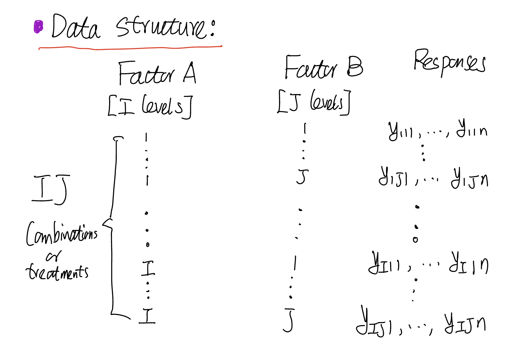
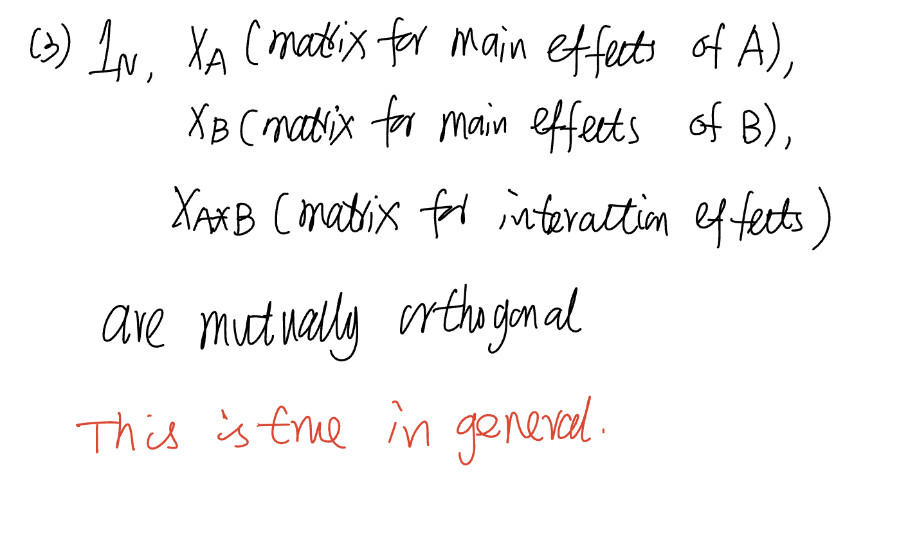
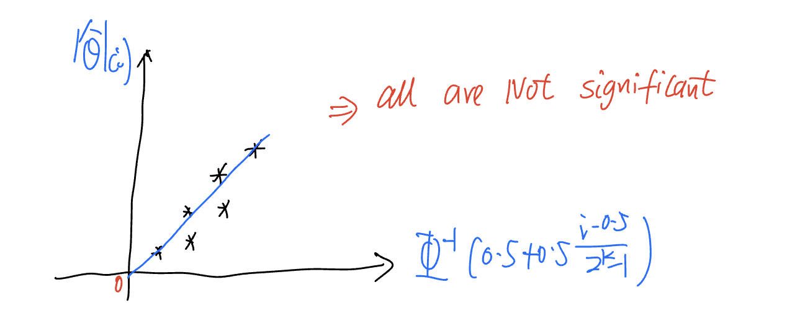
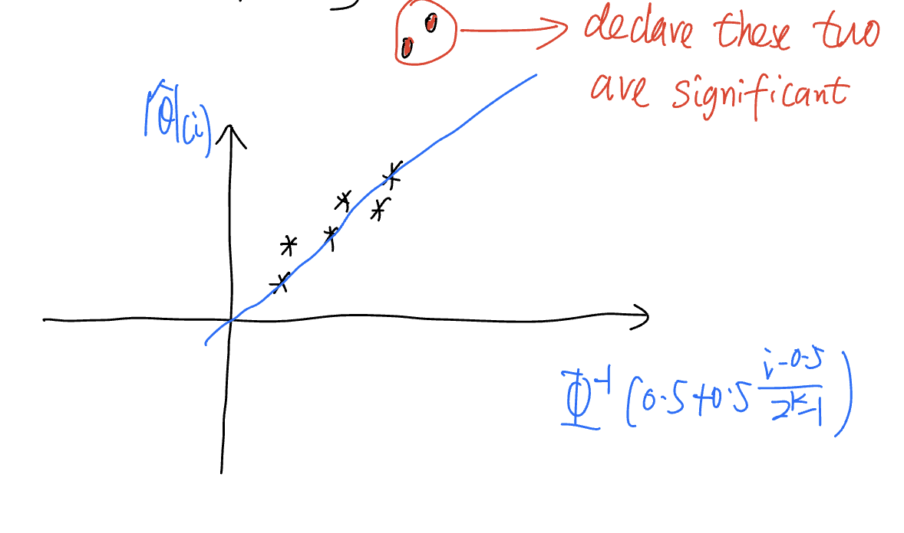
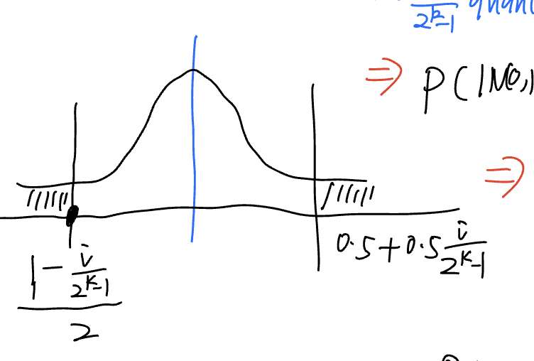

# STAT 430

### Pass Requirement

* 50% overall
* 50% in the final exam

### Coverage

How to design an experiment to answer a scientific question?  
In this step, we try to collect the data in a correct and efficient way.  
But we do not have data.  

After we collect, then we analyze the data and draw conclusion.

#### Part 1

1. We cover the principles that we need to follow when designing an experiment.
2. We consider several useful designs.

#### Part 2

Use linear regression model to understand design ideals and analyze data.

# Chapter 0:  Review of Linear Regression Model

Data: $\{y_i;x_{i1},\ldots,x_{iN}\}_{i=1}^N$

$y_i$: Response for the $i$th observation.  
$x_{i1},\ldots,x_{ip}$: $p$ covariates for $i$th observation.  
$N$: num of observations

Linear model: $y_i = \beta_0 + \beta_1x_{i1}+\dots+\beta_px_{ip} + \varepsilon_i$

$\varepsilon_i$ is error.

### Assumptions:

$\varepsilon_i\stackrel{iid}{\sim}N(0,\sigma^2)$

Equivalently, $y_i\sim N(\beta_0 + \beta_1x_{i1} + \dots + \beta_px_{ip}, \sigma^2)$.  
$y_1,\ldots,y_N$ are independent.

Matrix Form:

$Y=\begin{pmatrix}y_1 \\ \vdots \\ y_N\end{pmatrix}_{N\times1}$  
$X=\begin{pmatrix}1 & x_11 & \dots & x_{1p} \\
\vdots & \vdots & \vdots & \vdots \\
1 & x_{N1} & \dots & x_{Np}
\end{pmatrix}_{N\times (p + 1)}$  
$\beta = \begin{pmatrix}\beta_0 \\ \vdots \\ \beta_N\end{pmatrix}_{1\times(p+1)}$  
$\varepsilon = \begin{pmatrix}\varepsilon_1 \\ \vdots \\ \varepsilon_N \end{pmatrix}_{N\times 1}$  
$Y = X\beta + \varepsilon$

Ex: Suppose we are interested inthe relationship between STAT430/830 score and  
1. Which course the student is in: 430 & 830
2. Primary Plane: STAT and non-STAT

We code the binary covariate to be (-1, +1).

Model: $y = \beta_0 + \beta_1x_1+\beta_2x_2+\varepsilon$

$Y = \begin{pmatrix}74 \\ 79 \\ 85 \\ 91\end{pmatrix}$
$X = \begin{pmatrix}1 &  -1 &  -1 \\
1 & -1 & 1 \\
1 & 1 & -1 \\
1 & 1 & 1
\end{pmatrix}$
$\beta = \begin{pmatrix}\beta_0 \\ \beta_1 \\ \beta_2 \end{pmatrix}$
$\varepsilon = \begin{pmatrix}\varepsilon_1\\ \varepsilon_2 \\ \varepsilon_3 \\ \varepsilon_4 \end{pmatrix}$

## Estimation

In linear model: $Y=X\beta+\varepsilon$, we have $\beta$ and $\sigma^2$ unknown.

We can use least square estimation method.

Idea: Minimize the sum of error squares to get estimators and estimates.

$\sum_{i=1}^N\varepsilon_i^2=\sum_{i=1}^N(y_i-\beta_0-\beta_1x_{i1}-\ldots-\beta_px_{ip}\stackrel{\Delta}{=}S(\beta)$

* Least square estimator of $\beta$: LSE of $\beta$.

$\hat\beta=\underset{\beta}{\argmin}S(\beta)$

Explicit form of $\hat\beta=(X^TX)^{-1}X^TY$

Ex1 cont:  

$X^TX=4\begin{pmatrix}1 & 0 & 0 \\ 0 & 1 & 0 \\ 0 & 0 & 1\end{pmatrix}$  
$X^TY=\begin{pmatrix}329\\23\\11\end{pmatrix}$  
$\hat\beta=(X^TX)^{-1}X^TY=\frac{1}{4}\begin{pmatrix}329\\23\\11\end{pmatrix}=\begin{pmatrix}82.25\\5.75\\2.75\end{pmatrix}$

Estimation of $\sigma^2=E[\varepsilon_i^2]=Var(\varepsilon_i)\rightarrow E(\varepsilon_i) = 0$

Some notation:

1) Fitted Values for $i$th observation  
$\hat y_i=\hat\beta_0+\hat\beta_1x_{i1} + \ldots +\hat\beta_p x_{ip}$  
$\hat Y=\begin{pmatrix}\hat y_1 \\\hat y_2 \\\vdots \\\hat y_N\end{pmatrix} = X\hat\beta$  

2) Residuals  
$r_i=y_i-\hat y_i, i=1,\ldots,N$  
$r=Y-\hat Y=\begin{pmatrix}r_1\\\vdots\\r_N\end{pmatrix}$

3) Estimation of $\sigma^2$  
$\hat\sigma^2=\sum_{i=1}^N\frac{r_i^2}{(N-1-p)}$ $p$ is number of covariates.  
$r_i$: estimator of $\varepsilon_i$  
$N-1-P$: We have $p+1$ degrees of freedom to estimate $\beta$ and $N-1-P$ is the
remaining degrees of freedom.

Ex1 continued:

$\hat y_1=\hat\beta_0+\hat\beta_1x_{11}+\hat\beta_2x_{12}=\hat\beta_0-\hat\beta_1-\hat\beta_2=73.75$  
$r_1=y_1-\hat y_1=0.25$

Do rest of calc urself retard.

$\hat Y=\begin{pmatrix}73.75 \\ 79.25 \\ 85.25 \\ 90.75\end{pmatrix}, r=\begin{pmatrix}0.25\\-0.25\\-0.25\\0.25\end{pmatrix}$

Always check that $\sum_{i=1}^4r_i=0$ and $\sum_{i=1}^4r_i\hat y_i=0$ (residuals $\perp$ fitted values)

$\hat\sigma^2=\sum_{i=1}^4r_i^2/(N-1-p)=4\times 0.25^2=0.25$

## Statistical Properties of $\hat\beta$ and $\hat\sigma^2$

Recall $\hat\sigma^2$ is just the $MSE=\frac{SSE}{\text{df of residuals}}$

1. $\hat\beta\sim MN(\beta,\sigma^2(X^TX)^{-1})$  
diagonal element = variance  
off-dagional element = covariance  
$\implies\hat\beta_j\sim N(\beta_j,\sigma^2(X^TX)^{-1}_{jj})\implies E(\hat\beta_j)=\beta_j$  
$(X^X)^{-1}_{jj}=(j,j)$th element of $(X^TX)^{-1}$  
$(p+1)\times(p+1)$ matrix. Label starts with 0 though.
2. $\hat\sigma^2(N-1-p)/\sigma^2\sim\chi^2_{N-1-p}$  
$E[\hat\sigma^2(N-1-p)/\sigma^2]=N-1-p\implies E[\hat\sigma^2]=\sigma^2$ Unbiased estimate.
3. $\hat\beta_j$ and $\hat\sigma^2$ are independent  
$\hat\beta$ and $\hat\sigma^2$ are independent  
$t\text{-distribution}=\frac{N(0,1)}{\sqrt{\chi^2_{df}/df}}$ note that the numerator and denominator
distributions are independent.
4. $\alpha^T\hat\beta\sim N(\alpha^T\beta,\sigma^2\alpha^T(X^TX)^{-1}\alpha)$ (linearity)

## Hypothesis Testing

Model: $y_i=\beta_0+\beta_1x_{i1}+\dots+\beta_px_{ip}+\varepsilon_i$

1) Test: $H_0:\beta_1=\beta_2=\dots=\beta_p=0$ vs $H_A$ at least one of $\beta_1,\dots,\beta_p\ne 0$  
ANOVA and F-test
2) test: $H_0:\beta_j=0$ vs $H_A:\beta_j\ne0$  
t-test  
General form = estimator/se(estimator)
3. test: $H_0:\alpha^T\beta=0$ vs $H_A:\alpha^T\beta\ne 0$ for a given $\alpha$.

In example 1: $y=\beta_0+\beta_1x_1+\beta_2x_2+\varepsilon$  
$H_0:\beta_1=\beta_2 \leftrightarrow H_0:\beta_2-\beta_1=0$, $\alpha=\begin{pmatrix}0\\-1\\-1\end{pmatrix}$, $\beta=\begin{pmatrix}\beta_0\\\beta_1\\\beta_2\end{pmatrix}$  
$H_0:\alpha^T\beta=0$
4. Model $y_i=\beta_0 + \beta_1x_{i1}+\dots+\beta_ix_{ip}+\varepsilon_i$  
test $H_0:\beta_{q+1}=\dots=\beta_p=0$ for some $q<p$  
Partial F-test

### Case 1: Test if all covariates are not important.  

Tool: ANOVA and F-test

1) ANOVA: analyze the variation in $Y,\hat Y,r$  
a) Variation in $Y$  
CTSS = $\sum_{i=1}^N(y_i-\bar y)^2$  
b) Variation in $\hat Y$  
RegrSS = $\sum_{i=1}^N(\hat y_i-\bar{\hat y})^2 = \sum_{i=1}^N(\hat y_i-\bar y)^2$  
c) Variation in r  
RSS = $\sum_{i=1}^N(r_i-\bar r)^2=\sum_{i=1}^Nr_i^2=(N-1-p)\hat\sigma^2$

CTSS = RegrSS + RSS

2) Degrees of freedom for each sum of squares

a) CTSS: $N-1$ (Use 1 df to estimate overall mean)  
b) RSS: $N-1-p$ (Use p + 1 df to estimate $\beta$)  
c) RegrSS: $P=(N-1)+(n-1-p)$ (df is additive just like sum of squares)

3) ANOVA Table

| Source | df | Sum of Squares | Mean of Squares |
| --- | --- | --- | --- |
| Regression | P | RegrSS | RegrSS/P |
| Residual | N-1-p | RSS | RSS/(N-1-p) |
| Total | N - 1 | CTSS | |

4) F-test for $H_0: \beta_1=\dots=\beta_p=0$

F-test = $\frac{\text{RegrSS}/P}{\text{RSS}/(N-1-p)}=\frac{\text{RegrSS}/P}{\hat\sigma^2}$

under $H_0:$ F-test$\sim F_{p,N-1-p}$

$p$ and $N-1-p$ are derived from df for RegrSS and RSS respectively.

Given data and significance level $\alpha$, we reject $H_0$ if p-value = $P(F_{p,N-1-p}>\text{obs value of F-test}) < \alpha$

### Case 2: test $H_0:\beta_j=0$ vs $H_A:\beta_j\neq 0$

Test if the $i$th covariate is important.

General idea for testing single parameter [Wald Method]

t-test = $\frac{\text{estimator}}{SE(\text{Estimator})}\stackrel{\text{under }H_0}{\sim}t_{df}$

1) Estimator: $\hat\beta_j\sim N(\beta_j,\sigma^2(X^TX)^{-1}_{jj}$
2) SE$(\hat\beta_j)=\sqrt{\hat\sigma^2(X^TX)^{-1}_{jj}}$
3) t-test: $\frac{\hat\beta_j}{\sqrt{\hat\sigma^2}(X^TX)^{-1}_{jj}}\stackrel{H_0}{\sim}t_{N-1-p}$

Given data and $\alpha$, we reject $H_0$ if p-value = $P(|t_{N-1-p}>|\text{obs. of t-test})<\alpha$

### Case 3: test $H_0:\alpha^T\beta=0$ vs $H_A:\alpha^T\beta\ne0$, $\alpha$ is fixed vector.

(1) Estimator: $\alpha^T\hat\beta\sim N(\alpha^T\beta,\sigma^2\alpha^T(X^TX)^{-1}\alpha)$  
(2) se$(\alpha^T\hat\beta)=\sqrt{(\hat\sigma^2\alpha^T(X^TX)^{-1}\alpha)}$  
(3) t-test: $t_a=\alpha^T\hat\beta/\sqrt{\hat\sigma^2\alpha^2(X^TX)^{-1}\alpha}\stackrel{H_0}{\sim}t_{df=N-1-p}$.  
Reject $H_0$ if observed value of $|t_a|>t_{N-1-p,\sigma/2}$ or $p$-value=$P(|t_{N-1-p}|>\text{obs. value of }|t_a|)<\delta$

Same as case 2, but with $a^T$ now.

### Case 4: Testing some coefficients = 0

Test $H_0: \beta_{q+1}=\dots\beta_p=0$

Tool: Extra sum of squares principle

Hypothesis testing is to compare two models, the model under $H_0$ and the full model.

We just want to check if the model under $H_0$ is as good as the full model. Do this
using RSS. Smaller RSS = good.

Check if RSS(full model) is significantly smaller than RSS(nested model).

This motivates us with:

Extra Sum = RSS(nested model) - RSS(full model)

to construct, the partial F-test

Partial F-test = $\frac{[RSS(\text{nested model}) = RSS(\text{full model})] / (p - q)}{RSS(\text{full model})/(N-1-p)} = \frac{\text{Extra Sum}/(p - q)}{\hat\sigma^2}\stackrel{H_0}{\sim}F_{p-q,N-1-p}$

If p-value = $P(F_{p-q,N-1-p}>\text{obs partial F-test})<\alpha$ reject $H_0$.

partial F-test = $[\text{t-test}]^2$

## Experimentation

Systematic way to experimentation:

1) State objective/purpose
2) Choose response.
3) Choose factors and levels
4) Choose experimental plan
5) Perform experiment
6) Analyze the data
7) Draw conclusions and make suggestions

### Three Principles for Experimentation

1. Replication

Same treatment is applied to different experimental units.

Provides information to estimate $\sigma^2$. Reduces the variance of the estimator
of the mean in response.

2. Randomization

Use chance mechanism to:

* Assign the treatment to experimental unit
* Determine the order that experiment is performed
* Determine the order that response is measured

Reduces subjective bias.

3. Blocking

Block: A group of homogeneous units  
Effective blocking: within a block, the experimental units/conditions are homogeneous;
between blocks, the experimental units/conditions may be quite different.

Doing blocking means we realize the difference among blocks.  
Doing blocking further means that we can estimate the effects of blocks and then
remove the effects of blocks.

What happens if we do not consider blocking, but blocking is needed?

The difference among blocks will be absorbed into the estimate of $\sigma^2$.
Thus, $\sigma^2$ will be overestimated since the estimator of $\sigma^2$ contains
information for two parts: the variance of the response and the difference among
blocks.

A general strategy for blocking and randomization:

Block what you can, random what you can not.

# Chapter 1

## One-Way Layout

$y_{ij}=\Eta_i + \epsilon_{ij} = \eta + \tau_{i}+\epsilon_{ij}$

$\eta$: Overall mean or grand mean of response.
$\Eta_i$: Mean of response at level $i$ - overall mean of response. Called
$i$th treatment effect.

Related to linear models:

$\eta$ is the intercept and $\tau_i$ are coefficients for $k$ covariates.

We are interested in testing $H_0: H_1=\dots=H_k=0$, or equivalently, $\tau_1=\dots=\tau_k=0$.

Use our one-way layout as a linear model. 

1) Estimates of $\eta,\tau_1,\ldots,\tau_k$

$\hat\eta=\frac{1}{k}\sum_{i=1}^k\hat\Eta_i=\frac{1}{kn}\sum_{i=1}^k\sum_{j=1}^ny_{ij}=\bar y_{..}$  
$\hat\tau_i=\hat\Eta_i-\hat\eta = \bar y_{i.} - \bar y_{..}$

2) Fitted values for $y_{ij} = \eta+\tau_i + \epsilon_{ij}$

df=# of covariates = k-1 for RegrSS.

3) Residuals

df = N-1- # of covariates = N-1-(k-1)=N-k

## Multiple Comparison

Testing ${k\choose 2}=\frac{k(k-1)}{2}$ pairs of means, which pairs are significantly different?

We can test this by choosing any $i,j$ and running a t-test.

We can test al pairs at the same time and reject if any t-test fails for any $i,j$.

This is called Experiment wise error rate (EER), $P(\text{at least one incorrect rejection}|H_0:H_1=\dots=H_k)$

If we test ${k \choose 2}$ pairs and we reject $H_0: H_i=H_j$, or declare $H_i$ and $H_j$ are
different when $|t_{ij}| > t_{N-k,\alpha/2}$, then $EER>\alpha$

How to control $EER\leq\alpha$ when comparing all pairs?

1. Benferroni's Method
2. Tukey's Method

Both methods use $t_{ij}$ as test statistic, but use a larger critical value $C$, where $C>t_{N-k,\alpha/2}$

Let $A_{ij} = \{|t_{ij}>C\}$: event that we reject $H_0:H_i=H_j$

Then, $EER = P(\bigcup_{i<j} A_{ij}|H_0:H_1=\dots=H_k)$

### Bonferroni's Method

Choose the critical value $c = t_{N-k},\frac{\alpha}{2{k \choose 2}}$

EER $\leq\alpha$

### Tukey's Method

Based on the following result:

If $x_1,\ldots,x_k\sim N(H,\sigma^2),\hat\sigma^2$ is estimator of $\sigma^2$ with
df. Then,

$[\argmax_{1\leq i\leq k}x_i - \argmin_{1\leq i\leq k}x_i]/\hat\sigma\sim\text{studentized range distribution}[k, df]$

Can use `qtukey()` in R to get quantiles.

Use $C=\frac{1}{\sqrt{2}}q_{k,N-k,\alpha}$ as critical value.

$q_{k,N-k,\alpha}$ = $1-\alpha$ quantile of studentized range distribution $[k, df]$.

EER = $\alpha$

## Quantitative Factor and Orthogonal Polynomial

### Orthogonal Polynomials

1. Covariates are polynomial functions of factor levels
2. We carefully choose polynomial functions s.t. X-matrix is orthogonal
3. Currently, for evenly spaced levels, the orthogonal polynomials are available.

Next, we consider evenly spaced levels,  
average of all levels = $m$  
difference between two consecutive levels = $\delta$

We concentrate on:

1. Two levels: $m\pm\frac{\delta}{2}$
2. Three levels: $m\pm\delta, m$

### Case 1: Two levels

We can define a linear function

linear polynomial at 2 levels:
$p_1(x)=2(\frac{x-m}{\delta})$

Hence,
| x | $m-\frac{\delta}{2}$ | $m + \frac{\delta}{2}$ |
| --- | --- | --- |
| $p_1(x)$ | -1 | 1 |

linear model: $y=\beta_0+\beta_1p_1(x)+\epsilon_i$

### Case 2: 3 Levels $m-\delta, m, m+\delta$

Consider a linear and quadratic polynomial

$p_1(x) = \frac{(x-m)}{\delta}$  
$p_2(x) = 3(\frac{(x-m)}{\delta})^2 - 2$

Hence,
| x | $m-\delta$ | $m$ | $m+\delta$ |
| --- | --- | --- | --- |
| $p_1(x)$ | -1 | 0 | 1 |
| $p_2(x)$ | 1 | -2 | 1 |

### Orthogonal Property in Linear Model

We assume that the design matrix is orthogonal.

$$
X=\begin{bmatrix}
1 & x_{11} & \dots & x_{1q} & x_{1q+1} & \dots & x_{1p} \\
\vdots & & & \vdots & \vdots & & \vdots \\
1 & x_{N1} & \dots & x_{Nq} & x_{Nq+1} & \dots & x_{Np}
\end{bmatrix}
$$

Consider $X_1$ is the matrix with $x_{11}$ to $x_{Nq}$, and $X_2$ the rest, then 
$1_N, X_1, X_2$ are orthogonal to each other.

### Estimation Properties

a) $\hat\beta_0=\bar y=\frac{1}{N}\sum_{i=1}^Ny_i$  
b) estimators of $\beta_1,\dots,\beta_q$ are the same  
c) estimators of $\beta_{q+1},\ldots,\beta_p$ are the same

In quantitative factor example, model $y=\beta_0+\beta_1p_1(x)+\beta_2p_2(x)+\epsilon$,
delete or keep $p_2(x)$ does not affect $\hat\beta_0,\hat\beta_1$.

### Hypothesis Testing Properties

RegrSS = RegrSS($x_1,\dots,x_q$) + RegrSS($x_{q+1},\dots,x_p$)

# Chapter 2: Experiments with more than one factor

## Randomized Block Design (RBD)

Treatment factor: factor of interest  
Blocking factor: Nuisance factor, may have impact on response, not our interest  
Randomization: We need to do randomization in each block.

That is, we randomly assign treatment levels to units in each block.

Assumption: No interaction between treatment factor and blocking factor.

$y_{ij}=\eta+\alpha_i+\tau_j+\epsilon_{ij}$ where $\alpha_i$ is the ith block effect,
and $\tau_j$ is the jth treatment effect.

$\sum_{i=1}^b\alpha_i=\sum_{j=1}^k\tau_j=0$

Interest:

1. Testing $H_0:\tau_1=\dots=\tau_k=0$
2. If reject $H_0$, do multiple comparison to compare $k'={k\choose2}$ pairs of treatment
effects.

Tool: One-way layout and orthogonal properties in linear model.

### Procedure

1. Check structure of design matrix
2. Estimators of $\eta,\alpha_i,\tau_j$
3. ANOVA
4. Multiple comparison (if applicable)

#### Step 1

$y_{ij}=\eta+\alpha_i+\tau_j+\epsilon_{ij}$ with zero sum treatment and block factor.

$y=\eta+\alpha_1\times[I(\text{Block}=1) - I(\text{Block}=b)] + \dots + \alpha_{b-1}\times[I(\text{Block}=b-1) - I(\text{Block}=b)] + \tau_1\times[I(\text{trt}=1) - I(\text{trt}=k)] + \dots + \tau_{k-1}\times[I(\text{trt}=k-1)-I(\text{trt}=k)]$

#### Step 2

1. $\hat\eta=\bar y_{..}=\frac{1}{N}\sum_{i=1}^b\sum_{j=1}^ky_{ij}$
2. $\hat\alpha_i = \bar y_{i.} - \bar y_{..}$
3. $\tau_j = \bar y_{.j} - \bar y_{..}$

#### Step 3

$$
\begin{aligned}
RSS&=\sum_{i=1}^b\sum_{j=1}^kr_{ij}^2 \\
&= \sum_{i=1}^b\sum_{j=1}^k(y_{ij}-\hat y_{ij})^2 \\
&=\sum_{i=1}^b\sum_{j=1}^k(y_{ij}-(\hat\eta+\hat\alpha_i+\hat\tau_j))^2 \\
&=\sum_{i=1}^b\sum_{j=1}^k(y_{ij} - (\bar y_{..} + \bar y_{i.} - \bar y_{..} + \bar y_{.j} - \bar y_{..}))^2 \\
&= \sum_{i=1}^b\sum_{j=1}^k(y_{ij} + \bar y_{..} - \bar y_{i.} - \bar y_{.j})^2
\end{aligned}
$$

Partial F-test = $\frac{\frac{RegrSS(\tau_j)}{(k-1)}}{\hat\sigma^2=\frac{RSS}{(b-1)(k-1)}}$

where
$$
RegrSS(\tau_j) = \sum_{i=1}^b\sum_{j=1}^k\hat\tau_j^2=\sum_{i=1}^b\sum_{j=1}^k(\bar y_{.j}-\bar y_{..})=SST \\

RegrSS(\alpha_i)=\sum_{i=1}^b\sum_{j=1}^k\hat\sigma_i^2 = SSB
$$

df = k-1 and b - 1 respectively.

Testing $H_0: \tau_1=\dots=\tau_k=0$  
Partial F-test = $\frac{SST/(k-1)}{SSr/(b-1)(k-1)}\stackrel{H_0}{\sim}F_{k-1,(b-1)(k-1)}$

Testing $H_0: \alpha_1=\dots=\alpha_b=0$  
Partial F-test = $\frac{SSb/(b-1)}{SSr/(b-1)(k-1)}\stackrel{H_0}{\sim}F_{b-1,(b-1)(k-1)}$

#### Step 4

Compare $H_0:\tau_j=\tau_l$

t-test

$$
t_{jl}=\frac{\hat\tau_j-\hat\tau_l}{se(\hat\tau_j-\hat\tau_l)}=\frac{\hat\tau_j-\hat\tau_l}{\sqrt{2\hat\sigma^2/b}} = \frac{\bar y_{.j} - \bar y_{.l}}{\sqrt{2\hat\sigma^2/b}}
$$

Critical values:

Once again, we can use Bonferroni's method, $C=t_{(b-1)(k-1),\frac{\alpha}{2k'}}$  
or Tukey's method: $C=\frac{1}{\sqrt{2}}q_{k,(b-1)(k-1),\alpha}$

## $k\times k$ Latin-square design

Each of $k$ latin letters appears exactly one in each row and column.

e.g. $3\times 3$ latin square

| |1|2|3|
|---|---|---|---|
|1|A|B|C|
|2|B|C|A|
|3|C|A|B|

### Randomization

1. Treatment levels randomly assigned to latin letters
2. Row levels randomly assigned to $1,\ldots,k$
3. Column levels randomly assigned to $1,\ldots,k$

### Model

$$
y_{ijl}=\eta+\alpha_i+\beta_j+\tau_l+\epsilon_{ijl}
$$

where:

* $\eta$ is the overall mean.
* $\alpha_i$ is the $i^{th}$ row effect
* $\beta_j$ is the $j^{th}$ column effect
* $\tau_l$ is the $l^{th}$ treatment effect

Zero-sum constraints: $\sum_{i=1}^k\alpha_i=\sum_{j=1}^k\beta_j=\sum_{l=1}^k\tau_l=0$

Let $n_{ijl}=\begin{cases}1 & (i,j) \text{ cell is applied to } l^{th}\text{ treatment} \\ 0 & \text{o/w}\end{cases}$

Then,

$$
\sum_{i=1}^kn_{ijl}=\sum_{j=1}^kn_{ijl}=\sum_{l=1}^kn_{ijl}=1
$$

in english, each column/col only has one $l^{th}$ treatment, and each cell
only has 1 unit.

### Interest

1. Testing $H_0:\tau_1=\ldots=\tau_k=0$
2. Multiple comparison of $k'={k\choose 2}$ pairs of $\tau_l,\tau_h)$

#### Step 1: Linear Model

Linear model for $y_{ijl}=\eta+\alpha_i+\beta_j+\tau_l+\epsilon_{ijl}$ with
zero-sum constraints

$$
y=\eta+\sum_{i=1}^{k-1}\alpha_i[I(R=i) - I(R=k)] + \sum_{j=1}^{k-1}\beta_j[I(C=j)-I(C=k)]+\sum_{l=1}^{k-1}\tau_l[I(T=l) - I(T=k)] + \epsilon
$$

#### Step 2: Estimates

* $\hat\eta=\bar y_{...}=\sum_{i=1}^k\sum_{j=1}^k\sum_{l=1}^kn_{ijl} y_{ijl}/k^2$  
  The average of $k^2$ responses.
* $\hat\alpha_i=\bar y_{i..}-\bar y_{...}$  
* $\hat\beta_j=\bar y_{.j.}-\bar y_{...}$
* $\hat\tau_l=\bar y_{..l}-\bar y_{...}$

Intuition: $\hat\eta$ is just the sample mean, the rest are just the effect of the $i/j/l$ row/column/treatment, so we take average of each row/col/treatment and get
subtract from the overall mean $\eta$.

#### Step 3:

$$
\begin{aligned}
\hat y_{ijl}&=\hat\eta+\hat\alpha_i+\hat\beta_j+\hat\tau_l+\epsilon_{ijl} \\
\hat y_{ijl}&=\bar y_{i..} + \bar y_{.j.} + \bar y_{..l} - 2\bar y_{...} \\
r_{ijl}&=y_{ijl}-\hat y_{ijl}=y_{ijl}-\bar y_{i..}-\bar y_{.j.}-\bar y_{..l}+2\bar y_{...}
\end{aligned}
$$

$CTSS = RegrSS + RSS$

$RSS=\sum_i\sum_j\sum_ln_{ijl}r_{ijl}^2\triangleq SS_r$  
$RegrSS=RegrSS(Row)+RegrSS(Col)+RegrSS(trt)$

$$
\begin{aligned}
\sum_i\sum_j\sum_ln_{ijl}(y_{ijl}-\bar y_{...})&=\sum_i\sum_j\sum_ln_{ijl}\alpha_i^2 \\
&+\sum_i\sum_j\sum_ln_{ijl}\beta_j^2 \\
&+\sum_i\sum_j\sum_ln_{ijl}\hat\tau_l^2 \\
&+\sum_i\sum_j\sum_ln_{ijl}r_{ijl}^2
\end{aligned}
$$

The ANOVA table is then:

| Source | df | Sum of Squares | Mean of Squares |
| --- | --- | --- | --- |
| Row | $k - 1$ | $SS_R$ | $\frac{SS_R}{(k-1)}$ |
| Col | $k-1$ | $SS_C$ | $\frac{SS_C}{(k-1)}$ |
| Trt | $k-1$ | $SS_t$ | $\frac{SS_t}{(k-1)}$ |
| Residual | $(k-1)(k-2)$ | $SS_r$ | $\frac{SS_r}{(k-1)(k-2)}$ |

Testing $H_0:\tau_1=\dots=\tau_k=0$:

$\text{Partial }F\text{-test} =\frac{SS_t/(k-1)}{SS_r/(k-1)(k-2)}\stackrel{H_0}{\sim}F_{k-1,(k-1)(k-2)}$

Testing $H_0:\alpha_1=\dots=\alpha_k=0$:

$\text{Partial }F\text{-test} =\frac{SS_R/(k-1)}{SS_r/(k-1)(k-2)}\stackrel{H_0}{\sim}F_{k-1,(k-1)(k-2)}$

Testing $H_0:\beta_1=\dots=\beta_k=0$

$\text{Partial }F\text{-test} =\frac{SS_C/(k-1)}{SS_r/(k-1)(k-2)}\stackrel{H_0}{\sim}F_{k-1,(k-1)(k-2)}$

#### Step 4: Multiple Comparison

Test: $H_0:\tau_l=\tau_h$

$t$-test: $t_{lh}=\frac{\hat\tau_l-\hat\tau_h}{SE(\hat\tau_l-\hat\tau_h)}$

$\hat\tau_l-\hat\tau_h=(\bar y_{..l}-\bar y_{...})-(\bar y_{..h} - \bar y_{...})=\bar y_{..l}-\bar y_{..h}$  
$Var(\hat\tau_l-\hat\tau_h)=Var(\bar y_{..l}-\bar y_{..h})=\frac{2\sigma^2}{k}$  
$\hat\sigma^2=\frac{SS_r}{(k-1)(k-2)}$

Hence,

$$
t_{lh}=\frac{\hat\tau_l-\hat\tau_h}{\sqrt{2\hat\sigma^2/k}}
$$

Then for critical values use Bonferroni/Tukey's method.

#### Mutually Orthogonal Case

If $X$-matrix can be partitioned into several mutually orthogonal matrices,
then $RegrSS$ for each piece $=\text{summation of [corresponding effects for
that piece]}^2$

E.g. Latin Square

$$
y_{ijl}=\eta+\alpha_i+\beta_j+\tau_l+\epsilon_{ijl}, RegrSS(trt) = \sum_i\sum_j\sum_ln_{ijl}\hat\tau_l^2
$$

## Two-way layout

Two treatment factors:  
$A$ with $I$ levels; $B$ with $J$ levels

### Randomization
Each of the $IJ$ conbinations/treatments are randomly assigned to $n$ experiment
units. $n$ is the # of replications.

Note:  
it is just like we have one "factor" with $IJ$ levels we assign each "level" to
$n$ units.

### Data Structure

Notation:

$y_{ijk}$:  
$i=1,\ldots,I\to$ index for $A$  
$j=1,\ldots,J\to$ index for $B$  
$k=1,\ldots,n\to$ index for replication  

### Data Analysis

#### Step 1

1. Check if $IJ$ combinations of $A$ and $B$ or $IJ$ treatments have same effects
on the mean response.

2.
Statistically:

$$
y_{ijk}=H_{ij}+\epsilon_{ijk},\quad\epsilon_{ijk}\stackrel{iid}{\sim}N(0,\sigma^2)
$$

where $H_{ij}$ is the mean of response when $A=i$ and $B=j$

Purpose: test $H_0:$ all $H_{ij}$'s are the same.

Solution: ANOVA table for one-way layout with $IJ$ levels

#### Step 2

Further check:

1. If $A$ and $B$ affects the mean of response
2. If effects of $A$ depends on $B$ or not or effects of $A$ and $B$ interact.

Model:

$$
y_{ijk}=H_{ij}+\epsilon_{ijk}=\eta+\alpha_i+\beta_j+\omega_{ij}+\epsilon_{ijk}
$$

where

* $\alpha_i: i^{th}$ main effect of factor $A$
* $\beta_j: j^{th}$ main effect of factor $B$
* $\omega_{ij}: (i,j)^{th}$ interaction effect between $A$ and $B$

with constraints: $\sum_{i=1}^I\alpha_i=\sum_{j=1}^J\beta_j=\sum_{i=1}^I\omega_{ij}=\sum_{j=1}^J\omega_{ij}=0$

check: # of parameters in $\{H_{ij}\}$ = # of parameters in $\{\eta,\alpha_i,\beta_j,\omega_{ij}\}$ with zero-sum constraint = $IJ$

### Interests

$H_0:\alpha_1=\dots=\alpha_I=0$ [main effects of A=0]  
$H_0:\beta_1=\dots=\alpha_J=0$ [main effects of B=0]  
$H_0:\omega_{ij}=0$ for $i=1,\ldots,I$ and $j=1,\ldots,J$ [A and B interaction effects = 0]

#### Step 1: Linear Model under  zero-sum constraints

$$
\begin{aligned}
y&=\eta+\sum_{i=1}^{I-1}\alpha_i[I(A=i)-I(A=I)] + \sum_{j=1}^{J-1}\beta_j[I(B=j)-I(B=J)] \\
&+ \sum_{i=1}^{I-1}\sum_{j=1}^{J-1}\omega_{ij}[I(A=i)-I(A=I)][I(B=j)-I(B=J)]+\epsilon
\end{aligned}
$$

$\omega_{ij}$ is the coeffect of the product of two "covariates" $[I(A=i)-I(A=I)]$ and $[I(B=j)-I(B=J)]$ and hence is called "interaction effects"

We use a simple example to understand the linear model.

#### Step 2: Estimators

* $\hat\eta=\bar y_{...}$
* $\hat\alpha_i=\bar y_{i..} - \bar y_{...}$
* $\hat\beta_j=\bar y_{.j.}-\bar y_{...}$
* $\hat\omega_{ij}=\hat H_{ij}-\hat\alpha_i-\hat\beta_j-\hat\eta=\bar y_{i..}-\bar y_{.j.}+\bar y_{...}$
* $r_{ijk}=y_{ijk}-\hat\eta-\alpha_i-\beta_j-\hat\omega_{ij}=y_{ijk}-\bar y_{ij.}$

#### Step 3: ANOVA table

$CTSS=SS_A+SS_B+SS_{A\times B}+SS_r$

| Source | df | Sum of squares | mean of squares |
| --- | --- | --- | --- |
| $A$ | $I - 1$ | $SS_A$ | $SS_A/(I-1)$ |
| $B$ | $J - 1$ | $SS_B$ | $SS_B/(J-1)$ |
| $A\times B$ | $(I-1)(J-1)$ | $SS_{A\times B}/(I-1)(J-1)$ |
| Residuals | $IJ(n-1)$ | $SS_r/IJ(n-1)$ |

1. Testing $H_0:\alpha_1=\dots=\alpha_I=0$  
Partial $F$-test $=\frac{SS_A/(I-1)}{SS_r/IJ(n-1)}\stackrel{H_0}{\sim} F_{I-1,IJ(n-1)}$
2. Testing $H_0:\beta_1=\dots=\beta_J=0$  
Partial $F$-test $=\frac{SS_B/(J-1)}{SS_r/IJ(n-1)}\stackrel{H_0}{\sim} F_{J-1,IJ(n-1)}$
3. Testing $H_0:\omega_{ij}=0$  
Partial $F$-test $=\frac{SS_{A\times B}/(I-1)(J-1)}{SS_r/IJ(n-1)}\stackrel{H_0}{\sim} F_{(I-1)(J-1),IJ(n-1)}$

# Chapter 3: Full factorial experiments at two levels

## Two-step optimization procedures

Recall (? wtf he talkin about recall) that, we have 3 types of responses:

* nominal-the-best response (two-way layout)
* larger-the-better response (latin-square)
* smaller-the-better response (RBD)

### Nominal-the-best response & Quadratic Loss

$$
L(y,t)=E\{(y-t)^2\}=Var(y)+\{Bias(y)\}^2
$$

where $y$ is the response, $t$ is the nominal value and $Bias(y)=E(y)-t$

For the nominal-the-best response, minimize $L(y,t)$

Strategy: model $E(y)$ and $Var(y)$ in terms of factor levels and apply the
following two-step procedures:

1. Select the levels of factors that have impact on $Var(y)$ to minimize $Var(y)$
2. Select the levels of factors that have impact on $E(y), but do not have
impact on $Var(y)$, to minimize $Bias(y)$ or move $E(y)$ towards $t$

### Larger-the-better response

Strategy: model $E(y)$ and $Var(y)$ in terms of factor levels and apply the
following two-step procedures:

1. Select the levels of factors to maximize $E(y)$
2. Select the levels of factors that have impact on $Var(y)$, but do not have
impact on $E(y)$ to minimize $Var(y)$.

### Smaller-the-better response

Strategy: model $E(y)$ and $Var(y)$ in terms of factor levels and apply the
following two-step procedures:

1. Select the levels of factors to minimize $E(y)$
2. Select the levels of factors that have impact on $Var(y)$, but do not have
impact on $E(y)$ to minimize $Var(y)$.

The factors appearing in the second step are called adjustment factors.

### Concepts in $2^k$ factorial design

* Randomization: Complete randomization
* Three types of matrices
  - Planning matrix: We use actual values for factor levels
  - Design matrix: We use "-" and "+" for factor levels instead of actuarial values
  - Model matrix: $X$-matrix except for $\textbf{1}_N$ for linear model.
* Replicated experiments and unreplicated experiment (self explanatory)
* Balance and orthogonality: for all designs considered in this course.
  - Balance: for each factor, each level appears the same number of times.
  - Orthogonality: for each pair of factors: each possible level combinations
  appear same number of times.

Why so important to have "Balance" and "Orthogonality" they imply that
$\textbf{1}_N$, model matrix for each factor are mutually othogonal in linear
model.

## Model and Factorial Effects

Recall for all 3 types of responses, we need to model $E(y)$ and $Var(y)$ for
system optimization.

We do this in this section.

Data: $\{y_{ij} : i=1,\ldots,2^k,j=1,\ldots,n\}$ and $k$ 2-level factors.

Model: $y_{ij}\sim N(H_i,\sigma_i^2)$

Location model: $H_i=$ linear combination of covariates  
Dispersion model: $\log\sigma_i^2=$ linear combination of covariates. (guarantee
$\sigma_i^2>0$)

How to define covariates based on $k$ 2-level factors?

1. For each 2-level factor, say $A$, define:

$$
x_A=\begin{cases}
-1 & A = - \\
1 & A = + 
\end{cases}
$$

We do this because of:

a) Zero-sum constraint

$$
\text{covariate}=I(A=+)-I(A=-)
$$

b) Quantitative factor: "-"$=m-\frac{\triangle}{2}$, "+"$=m+\frac{\triangle}{2}$

$$
\text{covariate}=2(\frac{x-m}{\triangle})
$$

2. If we further consider interations among $k$ covariates, then we have

${k\choose 2}$ covariates for 2-factor interactions  
${k\choose 3}$ covariates for 3-factor interactions  
...  
${k\choose k}$ covariates for $k$-factor interactions

In total we have ${k\choose 1} + {k\choose 2} + \dots + {k\choose k} = 2^k-1$ covariates. We use $x_1,\ldots,x_{2^k-1}$ to denote these covariates.

3. Final model

$y_{ij}\sim N(H_i,\sigma_i^2), i=1,\ldots,2^k, j=1,\ldots,n$

with $H_i=\alpha_0+\alpha_1x_{i1}+\dots+\alpha_{2^k-1}x_{i2^k-1}$ (location model)  
$\log\sigma_i^2=\gamma_0+\gamma_1x_{i1}+\dots+\gamma_{2^k-1}x_{i2^k-1}$ (dispersion model)

Note:

1. $\textbf{1}_N$, columns for $x_1,\ldots,x_{2^k-1}$ are mutually orthogonal.
2. In each column of $x_1,\ldots,x_{2^k-1}$, half=-1, half=+1

### Parameter Estimation

Estimate $\alpha_i, \gamma_i$ for $i=1,\ldots,2^k-1$

Define $\bar y_i=\sum_{j=1}^ny_{ij}$ and $s_i^2=\frac{1}{n-1}\sum_{j=1}^n(y_{ij}-\bar y_i)^2$ (average of responses for $i^{th}$ treatment, sample variance of responses for $i^{th}$ treatment)

Note $E(\bar y_i)=H_i$ and $E(s_i^2)=\sigma_i^2$

1. Fit linear model

$$
\bar y_i=\alpha_0 + \alpha_1+x_{i1} +\dots+\alpha_{2^k-1}x_{i2^k-1} + \epsilon_i, i=1,\ldots,2^k
$$

to get $\hat\alpha_0,\ldots,\hat\alpha_{2^k-1}$. Reason: $E(\bar y_i)=H_i$

2. Fit

$$
\log s_i^2=\gamma_0+\gamma_1x_{i1} +\dots+\gamma_{2^k-1}x_{i2^k-1},i=1,\ldots,2^k-1
$$

to get $\hat\gamma_0,\hat\gamma_1,\ldots,\hat\gamma_{2^k-1}$. Reason:
Note $E(\log s_i^2)\neq\log\sigma_i^2$, but by linear approximation:
$\log x\approx\log x_0+\frac{1}{x_0}(x-x_0)$ with $x=s_i^2,x_0=\sigma_i^2$.

Then,  
a) $E(\log s_i^2)=\log\sigma_i^2$  
b) $var(\log s_i^2)=\frac{1}{\sigma_i^4}, Var(s_i^2)=\frac{2}{n-1}$  
$(n-1)s_i^2/\sigma_i^2\sim\chi_{n-1}^2\implies Var(\frac{(n-1)s_i^2}{\sigma_i^2})=2(n-1)$  
$\qquad\qquad\qquad\qquad\quad\implies Var(s_i^2)=\frac{2\sigma_i^4}{n-1}$

Unified notation: $\Xi_i=\beta_0+\beta_1x_{i1}+\dots+\beta_{2^k-1}x_{i2^k-1}+\epsilon_i$

### Factorial Effects

Terminology:

1. Main effect: $ME(A)=\bar\Xi(A=+)-\bar\Xi(A=-)=\frac{1}{2^{k-1}}x_A^T\Xi$

2. Interaction effect between $A$ and $B$  
$$
\begin{aligned}
INT(A,B)&=\frac{1}{2}[ME(A|B=+) - ME(A|B=-)] \\
&=\bar\Xi(AB=+)-\bar\Xi(AB=-) \\
&=\frac{1}{2^k-1}(x_A\times x_B)^T\Xi
\end{aligned}
$$

3. In general

$k$-factor interaction:

$$
\begin{aligned}
INT(A_1,\ldots,A_k)&=\bar\Xi (A_1\ldots A_k=+)-\bar\Xi(A_1\ldots A_k=-) \\
&=\frac{1}{2^k-1}(x_1\times\dots\times x_k)^T\Xi
\end{aligned}
$$

### Linear Model and Factorial Effects

Given $\{\Xi_i,x_{i1},\ldots,x_{i2^k-1}\}_{i=1,\ldots,2^k}$, model
$$
\Xi_i=\beta_0+\beta_1x_{i1}+\dots+\beta_{2^k-1}x_{i2^k-1}+\epsilon_i
$$

For each column, we define factorial effect $\hat\theta_j=\frac{1}{2^{k-1}}x_j^T\Xi: j^{th}$ factorial effect.

$\hat\theta_j=2\hat\beta_j, j=1,\ldots,2^k-1$

$$
\begin{pmatrix}
\hat\beta_0 \\ \hat\beta_1 \\ \vdots \\ \hat\beta_{2^k-1}
\end{pmatrix} = (X^TX)^{-1}X^T\Xi=\frac{1}{2^k}x^T\Xi=\frac{1}{2^k}
\begin{pmatrix}\textbf{1}_N^T\Xi \\ X_1^T\Xi \\ \vdots \\ X_{2^k-1}^T\Xi \end{pmatrix} \\ \implies\begin{cases}\hat\beta_0=\bar\Xi \\ \hat\beta_j=\frac{1}{2^k-1}X_j^T\Xi & j=1,\ldots,2^k-1\end{cases}
$$

Note: $X=(\textbf{1}_N,X_1,\ldots,X_{2^k-1})$

Conclusion: $i^{th}$ factorial effect = $2\times$ corresponding LSE of
coefficients in linear model.

### 3 Principles for Factorial Effects

#### Hierarchical principles

1. Lower-order effects are more likely to be important than higher-order effects.
2. Effects of the same order are equally likely to be important.

#### Effect Sparsity

Only small # of effects are important

#### Effect Heredity

In order for an $INT$ to be significant, at least one of its parents main
effects should be significant.

### Screening Important Factorial Effects

#### Properties of Factorial Effects

**Location Model**

$$
\Xi_i=\bar y_i; \bar y_i=\alpha_0+\alpha_1x_{i1}+\dots+\alpha_{2^k-1}x_{i2^k-1}+\epsilon_i \\ \hat\alpha_j=\frac{1}{2^k}x_j^T\Xi \qquad\&\qquad \hat\theta_j=\frac{1}{2^{k-1}}x_j^T+\epsilon_i
$$

**Properties of $\hat\theta_j$**

We use $\theta_j=2\alpha_j$ to denote the true value of $j^{th}$ factorial
effect, the LSE property tells us  
$\hat\alpha\sim N(\alpha_j, Var(\hat\alpha_j))$  
$\hat\theta_j\sim N(2\alpha_j,Var(\hat\theta_j)$

Next: $Var(\hat\theta_j)=Var(\frac{1}{2^k-1}x_j^T\Xi)=\frac{1}{2^k-1}\sum_{i=1}^{2^k}x_{ij}^2Var(\Xi_i)\\=\frac{4}{n[2^k]^2}\sum_{i=1}^{2^k}\sigma_i^2$

In summary for location model:

$$
\hat\theta_j\sim N(\theta_j,\frac{4}{n(2^k)^2}\sum_{i=1}^{2^k}\sigma_i^2)
$$

$n\to$ replication number  
$2^k\to$ run number  
Variance is same for all $j$ and unknown

**Dispersion Model**

$$
\Xi_i=\log s_i^2=\gamma_0+\gamma_1x_{i1}+\dots+\gamma_{2^k-1}x_{i2^k-1}+\epsilon_i \\
Var(\log s_i^2\approx \frac{2}{n-1}) \\
\hat\gamma_i=\frac{1}{2^k}x_j^T\Xi \qquad \& \qquad \hat\theta_j=\frac{1}{2^k-1}x_j^T\Xi
$$

Again, we use $\theta_j=2\gamma_j$ to denote true value of $j^{th}$ factorial
effect.

LSE property:

$$
\hat\gamma_j\sim N(\gamma_j,Var(\hat\gamma_j)) \\
\hat\theta_j\sim N(2\gamma_j,Var(\hat\theta_j)) \\
Var(\hat\theta_j)=Var(\frac{1}{2^k-1}x_j^T\Xi)=\frac{1}{2^{k-1}}\sum_{i=1}^{2^k}x_{ij}^2 Var(\Xi_i)=\frac{8}{(n-1)2^k}
$$

Conclusion for dispersion model:

$$
\hat\theta_j\sim N(\theta_j,\frac{8}{(n-1)2^k})
$$

Variance is same for all $j$ and known.

In both location and dispersion models, we identify which $\theta_j\neq 0$.

### Half Normal Plot

#### Step 1:

Sort $|\hat\theta_1|,\ldots,|\hat\theta_{2^k-1}|$ to $|\hat\theta_{(1)}\leq\dots\leq|\hat\theta_{(2^k-1)}|$

#### Step 2:

Plot $\varPhi^{-1}(0.5 + 0.5\frac{i-0.5}{2^k-1})$ vs $|\hat\theta|_{(i)}, i=1,\ldots,2^k-1$.

1. if we see a roughly linear line in the plot, then evidence for $\theta_1=\dots\theta_{2^k-1}=0$

2. if we see some points are away from linear line, then corresponding effects
are significant or active.

Why?

If

$$
\theta_1=\dots\theta_{2^k-1}=0,\begin{cases}\hat\theta_1,\ldots,\hat\theta_{2^k-1}\sim N(0,\tau^2) \\
|\hat\theta_1|,\ldots,|\hat\theta_{2^k-1}|\sim |N(0,\tau^2)|
\end{cases}
$$

Then, 

$$
P(|N(0,\tau^2)|\leq|\hat\theta|_{(i)})\approx\frac{i}{2^k-1} \\
P(|N(0,1)|\leq \frac{|\hat\theta|_{(i)}}{\tau})\approx\frac{i}{2^k-1} \\
\frac{|\hat\theta|_{(i)}}{\tau}\approx\varPhi^{-1}(0.5+0.5\frac{i}{2^k-1})
$$

Hence: If $\theta_1=\dots=\theta_{2^k-1}=0$ the plot of $\varPhi^{-1}(0.5+0.5\frac{i}{2^k-1})$ vs $|\hat\theta|_{(i)}$ has a linear trend.

In practice: we use $\varPhi^{-1}(0.5+0.5\frac{i-0.5}{2^k-1})$ to smooth the plot.

Even if $\tau^2$ (variance of $\hat\theta_j$) is unknown, we can still use it.

### Formal Test of Factorial Effects

#### Dispersion Model

$$
H_0:\theta_j=0 \\
t_j=\frac{\hat\theta_j}{\sqrt{\frac{8}{(n-1)2^k}}}=\frac{\hat\theta_j}{SD(\hat\theta_j)}\stackrel{H_0}{\sim}N(0,1)
$$

We reject $H_0$ when $|t_j|>c$

What $c$ we we use?

1. If we want to control type 1 error (individual error rate (IER)) for a single
test, then $c=\varPhi^{-1}(1-\frac{\alpha}{2})$, the $1-\frac{\alpha}{2}$
quantile of $N(0,1)$

2. If to control EER (experimentwise error rate) then we choose $c$ s.t.
$EER\leq\alpha$

Here, $EER=P(\text{at least one }\theta_j\text{ is siginificant}|H_0:\theta_1=\dots\theta_{2^k-1}=0)$

Note:

$$
\begin{aligned}
EER &= P[\text{at least one of }|t_j|\geq c|H_0:\theta_1=\dots\theta_{2^k-1}=0)] \\
&=P(\underset{1\leq j\leq2^k-1}{\max}|t_j|\geq c|H_0:\theta_1=\dots\theta_{2^k-1}=0)) \\
&=1-P(\underset{1\leq j\leq2^k-1}{\max}|t_j|>c|H_0:\theta_1=\dots\theta_{2^k-1}=0)) \\
&=1-P(|t_1|>c,\ldots,|t_{2^k-1}|>c|H_0:\theta_1=\dots\theta_{2^k-1}=0)) \\
&=1-\{P(|t_1|<c)\}^{2^k-1}=\alpha
\end{aligned} \\
\implies P(|t_1|<c)=(1-\alpha)^{\frac{1}{2^k-1}}\implies c=\varPhi^{-1}(0.5+0.5(1-\alpha)^{\frac{1}{2^k-1}})
$$

Summary:

$$
t_j=\frac{\hat\theta_j}{\sqrt{\frac{8}{(n-1)2^k}}}=\frac{\hat\theta_j}{SD(\hat\theta_j)}\stackrel{H_0}{\sim}N(0,1)
$$
$c=\varPhi^{-1}(0.5+0.5(1-\alpha)^{\frac{1}{2^k-1}})$ to control EER
$c=\varPhi^{-1}(1-\frac{\alpha}{2})$to control IER  

#### Location Model

$H_0:\theta_j=0$

$$
t_j=\frac{\hat\theta_j}{SE(\hat\theta_j)} \\
=
SE(\hat\theta_j)=\sqrt{\frac{4}{n(2^k)^2}\sum_{i=1}^{2^k}\hat\sigma_i^2} \\
=\sqrt{\frac{4}{n(2^k)^2}\sum_{i=1}^{2^k}s_i^2}\triangleq\hat\tau^2
$$

df for $s_i^2=n-1$, so df for $SE(\hat\theta_j)=(n-1)2^k$

Hence,

$$
t_j=\frac{\hat\theta_j}{SE(\hat\theta_j)}=\frac{\hat\theta_j}{\hat\tau}\stackrel{H_0}{\sim}t_{(n-1)2^k}
$$

1. Control $IER=\alpha$ then $c=t_{(n-1)2^k,\frac{\alpha}{2}}$
2. Control $EER=\alpha$ then choose $c$ s.t.

$$
\begin{aligned}
EER&=P(\text{at least one of } \theta_j \text{is declared }\neq0| H_0:\theta_1=\dots=\theta_{2^k-1}=0) \\
&=P(\text{at least one of }|t_j|\geq c|H_0:\theta_1=\dots=\theta_{2^k-1}=0) \\
&=P(\underset{1\leq j\leq2^k-1}{\max}|t_j|\geq c|H_0:\theta_1=\dots=\theta_{2^k-1}=0) \\
&=P(\frac{\underset{1\leq j\leq 2^k-1}{\max}|\hat\theta_j}{\hat\tau}\geq c|H_0:\theta_1=\dots=\theta_{2^k-1}=0) \\
&=\alpha
\end{aligned}
$$

We need the distribution of
$\frac{\underset{1\leq j\leq 2^k-1}{\max}|\hat\theta_j|}{\hat\tau}$ under $H_0$.

So,

$$
EER=P(\frac{\underset{1\leq j\leq 2^k-1}{\max}|\hat\theta_j|}{\hat\tau})=\alpha
$$

Under $H_0:\hat\theta_1,\ldots,\hat\theta_{2^k-1}\sim N(0,\tau^2)$ df for $\hat\tau^2=(n-1)2^k$.  
Under $H_0$, $\frac{\underset{1\leq j\leq 2^k-1}{\max}|\hat\theta_j|}{\hat\tau}\sim M_{2^k-1,(n-1)2^k}$

Hence, $c=M_{2^k-1,(n-1)2^k,\alpha}$

Summary:

1. Control $IER=\alpha, c=t_{(n-1)2^k,\alpha/2}$
2. Control $EER=\alpha,c=M_{2^k-1,(n-1)2^k,\alpha}$

if $|t_j|>c$, declare $i^{th}$ factorial effect is significant.

### Issues Related to Fraction

What if we can't afford $2^k-1$ runs, or do not have enough time to finish
all experiments?

If we are only interested in main effects and two-factor interactions, then we
only need ${ k \choose 1} + { k \choose 2 }$ dfs to estimate them, plus 1
for intercept.

Full factorial design will require $2^k$ runs.

Thus, we use the aliasing structure:

1. Write down $I$, all factorial effects generated by $q=k-p$ independent
factors. In total we get $2^{k-p}=2^q$ elements here. This determine
$2^{k-p}$ groups.
2. Figure out which effects are aliased with $I$. (Should have $2^p-1$ effects)
3. Time each element in step 1 to $I$ and $2^p-1$ effects aliased with $I$.

#### Rule for "times"

1. $I\times I=I$
2. $I\times \text{ each factor}=\text{factor itself}$
3. Factor $\times$ itself $=I$

#### Which effects can be estimated?

$2^k-1$ effects and $1$ intercept are partitioned into $2^{k-p}$ groups.

1. 1 df for each group, and only 1 effect can be estimated from each group.
2. Intercept is always assumed to be estimable; any effects aliased with
intercept cannot be estimated.
3. In other groups, we need to use effect hierarchy principle and other
information to determine which effect is more likely to be estimable.

## Selecting $2^{k-p}$ design

Word
: In total: $2^p-1$ effects aliased with $I$ in the aliasing structure.

Each effect is called a **word**.  
e.g. $2^{4-1}$ design, $A,B,C,D=AB\Leftarrow I=\overbrace{ABD}^{\text{word}}$

Word Length
: Number of letters in a word. e.g. ABD has word length of 3.

If we put $I, 2^p-1$ effects aliased with $I$ together, we get a set.  
This set is called the defining contrast subgroup.  
e.g. $2^{4-1}$ design, $A,B,C,D=AB$  
defining contrast subgroup $=\{I,ABD\}$

Word Length Pattern
: Let $A_i$ be the number of words in defining contrast subgroup with length
$i$ or number of effects with order $i$ aliased with intercept. for $i=1,\ldots,k$

Clear
: A main effect or 2fi is said to be clear if it does not alias with other
main effects or 2fis.

Clear effects are estimable if 3fi or higher-order interactions are negligible.

Resolution
: $R=$ smallest index/order such that $A_r>0=\min\{r\geq 0|A_r>0\}$

1. Smallest order s.t. the effects aliased with intercept.
2. We use Roman letter: $\text{III, IV, V}$ to denote it.  
e.g. $2^{5-2}$ design, $A,B,C,D=AB,E=BC$  
$A_3=2,A_4=1,A_5=0$  
$R=\text{III}$ for this example, denoted 2^{5-2}_{\text{III}}

Property of Resolution
: Resolution = $R$: No $(R-1-C)$ order or lower-order effects are aliased with
$C$-order effects. intercept = order 0, main effect = order 1, 2fi = order 2, etc.

### Criterion for Selecting $^{k-p}$ designs

1. Maximum resolution criterion

Suppose $D_1,D_2$ are $2^{k-p}$ designs.  
If resolution of $D_1<$ resolution of $D_2$, then $D_2$ is better.

The design which maximizes the resolution is best under the maximum resolution
criterion.

2. Minimum aberration criterion

Suppose $D_1,D_2$ are two $2^{k-p}$ designs.  
$(A_3(D_1),\ldots,A_k(D_1))=W(D_1)$ is the word length pattern of $D_1$  
$(A_3(D_2),\ldots,A_k(D_2))=W(D_2)$ is the word length pattern of $D_2$

If $r$ is the smallest integer s.t. $A_r(D_1)\neq A_r(D_2)$, then $D_1$ has
less aberration than $D_2$.

# Chapter 5: Orthogonal Array/Design

Suppose a design has $k$ factors. For the $i^{th}$ factor, it has $s_i$ levels.

If for any 2 columns/factors, the combination of any 2 levels appears the
same number of times, then the design is called an orthogonal design/array.

Denoted, $OA(N;s_i1,\ldots,s_j)$ : all designs in this course are orthogonal 
array/designs.

Why OA? $\textbf{1}$
