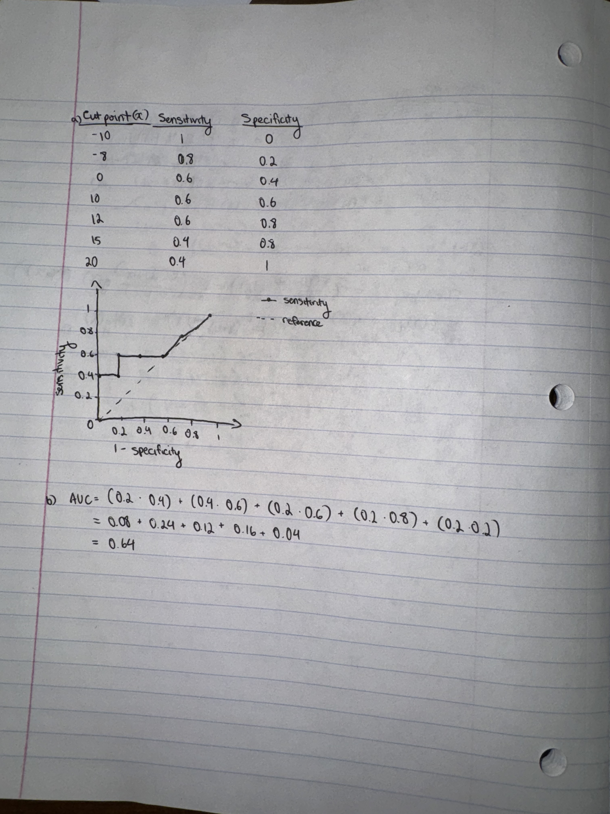

# A1

## Q1ab

| $X_0$ | $X_1$ | Y (part a) | Bayes Error (part b) |
| -- | -- | -- | -- |
| 0 | 0 | 3 | 0.8 |
| 0 | 1 | 2 | 0.7 |
| 1 | 0 | 2 | 0.6 |
| 1 | 1 | 1 | 0.4 |
| 2 | 0 | 3 | 0.8 |
| 2 | 1 | 3 | 0.7 |

## Q2

