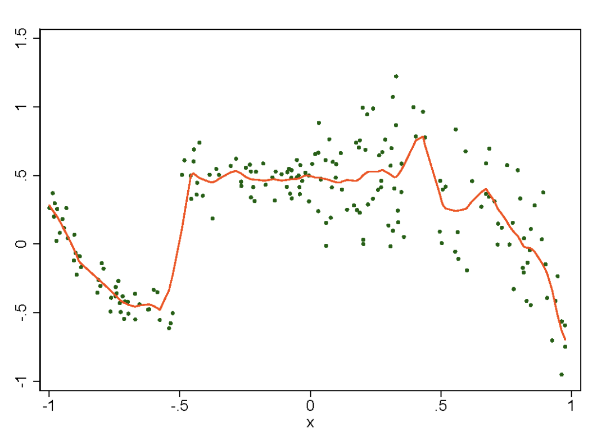
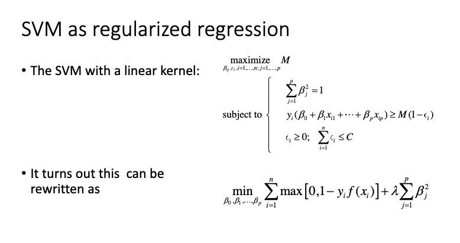
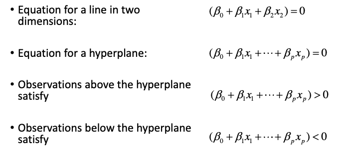

# STAT 441 - Statistical Learning - Classification

## Lecture 1

Supervised learning: Outcome is known

Regression and Classification

Classification:

* Categorical outcome
* Outcome is not usually ordered, but could be
* By far the most common is 2 outcome classes (True or false, yes or no)

### Supervised learning: Classification

When the space is non-contiguous, you may have to draw multiple boundary lines.

### Supervised learning: Regression

* The outcome is usually continuous
* Poisson regression would usually also be considered regression
* Why is linear regression not a good idea in this example?
  * Linear regression has constant variance, but this one is non-constant

Statistical Learning good for prediction, but making learning algorithms interpretable
is difficult. On the other hand, linear regression is good at prediction only if the
model is correct, and easily interpretable.

We cannot optimize for both interpretability and predictability.

### Bias-Variance Tradeoff

$$
E(y_0-\hat f(x_0))^2 = \text{Var}(\hat f(x_0)) + [\text{Bias}(\hat f(x_0))]^2 + \text{Var}(\varepsilon)
$$

where $y_0, x_0$ refer to test data. All 3 components are non-negative. $\text{Var}(\varepsilon)$ is a lower bound on the MSE, called irreducible error.

Variance refers to the variation we would get using different training data sets.

Bias refers to the error between the learning model and the true function.

We want to reduce both at the same time.

### Bayes Classifier

The test error is minimized on average, if each new observation is assigned to the most
likely class.

Choose class $j$ s.t. the probability is largest

$$
P(Y=j|x)
$$

when there are only 2 classes this corresponds to:

$$
P(Y=1|x)>0.5
$$

For a given observation $x$, the conditional Bayes error rate is:

$$
1-\max_j P(Y=j|x)
$$

Overall, the Bayes error rate is:

$$
1-E(\max_j P(Y=j|x))
$$

The Bayes error rate is the minimum error rate. In practice, this is never known.

## Lecture 2

Accuracy: $(TP + TN)/N$ where $N = TP + TN + FP + FN$  
Sensitivity: $TP/(TP+FN)$ True positive rate.  
Specificity: $TN/(TN+FP)$ False positive rate.  

### Evaluation Measures for Classification

When there are rare or uncommon events, accuracy is often maximizing by always
predicting "no"

The F-measure does not use correct prediction of "no event" at all:

$$
F=\frac{2\times TP}{2\times TP+FP+FN}
$$

Higher F-values are better. Can view it as a compromise function of "precision" and "recall"

Appropriate for single 0/1 classification. When multiple 0/1 classifications, we can macro
or micro average.  
Macro averaging refers to computing F values for each 2,2 classification
table and averaging afterwards.  
Micro averaging refers to pulling all 2,2 tables into a
single 2,2 table and computing the F based on the pooled table.

Macro averaging treats all categories equally.  
Micro averaging is dominated by frequent categories, giving them more weight.

### Variable Scaling (Standardization)

When variables have vastly different ranges, many statistical learning techniques give better
results when variables are scaled to make them more comparable.

#### Method 1

$$
x_{std} = \frac{x-\bar x}{sd_x}
$$

Indicator variables may be but do not have to be scaled.  
Indicator variables only take the values 0 and 1. This is not quite the same as mean zero
and a variance of 1, but close enough.

#### Method 2

Scale variables s.t. they have the same range, often [0,1]. Does not take indicator variables.

## Lecture 3: Logistic Regression

Appropriate for binary classification.

$$
y=\begin{cases}1 & \text{if event occurs} \\ 0 & \text{if event does not occur}\end{cases} \\
P(y=1)=p \implies E(y)=p
$$

We want to use a linear function to model $p$ as a function of $x$-variables

$$
f(p)=\beta_0+\beta_1x_1+\dots+\beta_px_p
$$
Using $f(p)=p$ is problematic because $p\in[0,1]$, but linear functions take values in $[-\infin,\infin]$. Thus, we can instead use:

$$
\text{logit}(p)=\log\frac{p}{1-p}
$$

Ex. Solve for $p$

$$
\log\frac{p}{1-p}=\beta_0+\beta_1 \\
p=\frac{e^{\beta_0+\beta_1x}}{1+e^{\beta_0+\beta_1x}} \\
p = \text{expit}(\beta_0+\beta_1x)
$$

$\text{expit}$ functions take on a sigmoidal shape.

So, logistic regression model is:

$$
\log\frac{p}{1-p}=\beta_0+\beta_1x_1+\dots+\beta_px_p
$$

No error, term, uncertainty is represented through the probability $p$.

Predicted probability can be computed using $p=\text{expit}(\beta_0+\beta_1x_1+\dots+\beta_px_p)$

### Odds

$$
odds = \frac{p}{1-p}
$$

### Interpretation of Coefficients

To interpret the slopes, consider increasing any one variable by one unit:

$$
\log\frac{p_i}{1-p_i}=\beta_0+\beta_1(x_1+1)+\dots+\beta_px_p \\
\log\frac{p_j}{1-p_j}=\beta_0+\beta_1x_1+\dots+\beta_px_p \\
$$

The difference in results is:

$$
\log\frac{p_i}{1-p_i}-\log\frac{p_j}{1-p_j}=0+\beta_1(x_1+1)-\beta_1x_1=\beta_1 \\
\log\frac{p_i}{1-p_i}-\log\frac{p_j}{1-p_j}=beta_1 \\
\beta_1=\log\frac{\frac{p_i}{1-p_i}}{\frac{p_j}{1-p_j}}=\log\frac{odds_i}{odds_j}
$$

This is pretty complicated.  
It is a little easier to interpret exponentiated coefficients as odds ratios (OR)

$$
e^{\beta_1}=\frac{odds_i}{odds_j}
$$

### Estimation of Coefficients

Maximum likelihood estimation.

$$
\begin{aligned}
L(\beta)&=\prod_{i=1}^N([p(x_i;\beta)]^{y_i}\times[1-p(x_i;\beta)]^{1-y_i}), \text{ where } p(x_i;\beta)=\frac{e^{\beta^Tx_i}}{1+e^{\beta^Tx_i}} \\
l(\beta)&=\sum_{i=1}^N\{y_i\log p(x_i;\beta)+(1-y_i)\log(1-p(x_i;\beta))\} \\
&=\sum_{i=1}^Ny_i\beta^Tx_i-y_i\log(1+e^{\beta^Tx_i})+(1-y_i)\log(\frac{1}{1+e^{\beta^Tx_i}}) \\
&=\sum_{i=1}^Ny_i\beta^Tx_i-y_i\log(1+e^{\beta^Tx_i})+(1-y_i)(-1)\log(1+e^{\beta^Tx_i}) \\
&= \sum_{i=1}^Ny_i\beta^Tx_i-\log(1+e^{\beta^Tx_i})
\end{aligned}
$$

Then we take the derivative w.r.t to $\beta$ vector and set it to zero.

$$
\begin{aligned}
\frac{\partial l(\beta)}{\partial\beta}&=\sum_{i=1}^Nx_i\Bigg\{y_i-\frac{e^{\beta^Tx_i}}{1+e^{\beta^Tx_i}}\Bigg\} \\
&=\sum_{i=1}^Nx_i\{y_i-p(x_i;\beta)\}=0
\end{aligned}
$$

This is non-linear equation in beta. We can use numerical optimization techniques, such as
Newton-Raphson.

When to use Logistic regression:

* Excels at explaining at how individual variables relate to the outcome. ([Estimation of Coefficients](#estimation-of-coefficients))
* Only works for two classes

## Lecture 4: Lasso and Friends

Recall linear regression models: Least squares are best linear unbiased variance estimator.

Sometimes we want to trade a bit of bias to reduce variance.

Underfitting: High bias, low variance  
Overfitting: Low bias, high variance

Low bias and low variance are mutually exclusive. We can make a trade off using regularization.

(Check STAT443, forecasting, notes for L1 and L2 regularization)

L2 regression works better in terms of accuracy/MSE, but L1 beats L2 when there are a lot 
of irrelevant variables in the data.

Coefficients in L1 can shrink to 0. Allows variable selection.

### Double Selection

When we specify a $y$-variable and $x$-variables, we can run a regression and make inferences.

When the procedure to select $x$-variables is data driven, then $x$-variables are not fixed.

Instead, we use double selection.

1. Identify key $x$-variables you know are needed. The rest are control variables.
2. Run a Lasso of $y$ on the control variables
3. Run a Lasso of each key $x$-variable on the control variables
4. Identify the union of all selected control variables
5. Regress $y$ on key $x$-variables and the union of control variables selected anywhere

### SVM as Regularized Regression

The formulation is a loss function with penalty:

$$
\min_{\beta_0,\beta_1,\ldots,\beta_p}\sum_{i=1}^N\max[0,1-y_if(x_i)]+\lambda\sum_{j=1}^p\beta_j^2 \\
\min_{\beta_0,\beta_1,\ldots,\beta_p}\sum_{i=1}^nLoss+\lambda Penalty
$$

The loss function is a hinge loss function that we have seen before.

The loss function for logistic regression is the negative binomial deviance.  
The hinge loss function is similar to the negative-binomial-deviance loss function.  
This explains why an SVM (with a linear kernel) and logistic regression often give similar
predictions.

### Conclusion:

It is hard to beat logistic regression in terms of prediction.  
Much easier to beat linear (Gaussian) regression or multi-class logistic regression

## Lecture 5: Working with text: $n$-gram variables

NLP tries to derive meaning from human language.

### Vector Space Model / ngram variables

There are three related terms:

* The representation of a set of documents (texts) as vectors is known as the 
**vector space model**
* The vector space model usually creates **ngram variables**
* The approach is also called **bag of words** approach

### Bag-of-words

Consider the text "The cat chased the mouse".  
Each word is a variable. Single word variables are called unigrams.

| text | the | cat | chased | mouse |
| --- | --- | --- | --- | --- |
| The cat chased the mouse | 2 | 1 | 1 | 1 |

#### Stemming

Reduce a word to its root. "Chased" -> "chase"

| text | the | cat | chase | mouse |
| --- | --- | --- | --- | --- |
| The cat chased the mouse | 2 | 1 | 1 | 1 |

#### Stopwords

Remove common words "stopwords" unlikely to add meaning

| text | cat | chase | mouse |
| --- | --- | --- | --- |
| The cat chased the mouse | 1 | 1 | 1 |

Bag-of-words ignores word order. Can use frequency, or just 0/1 indicator.

#### Bigrams

Two-word sequences. Partially recovers word order, but massively increases number of
variables.

Can be expanded to $n=3$ for trigrams etc.

#### Parts of Speech Tagging

This game can be expanded to grammar

A noun $NN$ appearing at the beginning of a line $BOL$ could be coded as $BOL_NN$.  
Can expand to verbs, prepositions, coordinating conjunctions etc.

Can also include punctuation e.g. "doctor_comma" is "doctor,"

#### Limitations

Works well on moderate size texts, but not on long texts due to overlap of words. LLM
based on neural networks predict much better. It is not state-of-the art.

#### Multicollinearity

Because most words do not appear in most documents, most entries in the $x$-matrix are zero.
This causes sever Multicollinearity.

One solution is to reduce the high dimensional space to a lower dimensional space with
uncorrelated variables. (latent semantic indexing)

### Term frequency: Inverse Document Frequency

When texts are short, indicator variables work well.  
When texts are long, it may be better to use word frequency instead.

Diminishing returns on frequency.

Tf-Idf is a function that dampens the effect of additional words.

Term Frequency:  
$$
TF=\begin{cases}1+\log(f_{t,d}) & \text{if } f_{t,d}>0 \\
0 & \text{o/w}
\end{cases}
$$

Rare words are more indicative than frequently used words. We should add more weight to them.

Inverse Document Frequency:  
$$
IDF=\log(N/N_t)
$$

where $N$ is the sample size (number of documents) and $N_t$ is the number of documents
in which word $t$ occurs

### Similarity

Similarity is important for:

* Nearest neighbour algorithm 
* Vector space model information retrieval

For texts, a good measure is the cosine of the angle between vector representations of
two documents.

$$
\cos(\theta)=\frac{\vec x_1}{|\vec x_1|}\frac{\vec x_2}{|\vec x_2|}
$$

where $\theta$ is the angle.

## Lecture 6: Nearest Neighbour

### K Nearest Neighbours (kNN)

Let $x_0$ be a new observation  
If we knew the class probabilities, the optimal (Bayes) decision rule will be:

$$
\argmax_{j}P(Y=j|X=x_0)
$$

For a new observation $x_0$, find the nearest $k$ observations in the training data.

Define probabilities for each class:

$$
P(Y=j|X=x_0)=\frac{1}{k}\sum_{i\in N_0}I(y_i=j)
$$

Finding the maximum probability is equivalent to classifying by majority vote. This is a
memory based algorithm (no training needed)

Accommodates nonlinear decision boundaries.

kNN does not require knowing the true density functions of the classifications.

Because only the point closes to the prediction point is used 1NN has low bias, but high variance.  
Increasing k makes the estimates more stable (less variance)  
also increases the average distance of the k training obs to $x_0$ (more bias)

It is sensitive to scaling. E.g. Distance measured in km vs miles may yield vastly different
results without standardization.

When there is a tie, we can:

* Randomly choose between tied classes
* Increase k until tie is broken
* Use 1NN as a tie breaker

#### Choice of k

Choose k that yield smallest error on the test data, better to choose an odd number to
reduce the chance of ties.

#### Distance

Usually uses Euclidian distance.

We can also use a similarity metric instead.  
E.g. $s(x_0,x_1)=1-d(x_0,x_1)/d_{max}$, where $d_{max}$ is the largest distance observed in data.

#### Leave-one-out crossvalidation (LOO)

For LOO the model has to be estimated N times. kNN does not use a model, so this is very efficient.

#### Nearest neighbour with a Caliper

In sparse regions, may be better to use a fixed distance away from point instead of kNN.

Conclusion:

Highly local behaviour  
Good when the decision boundary is highly irregular and training data is sufficiently large.  
Often one of the best performing ML techniques  
For huge data sets, extremely time intensive.  
Highly unstructured. Not good for learning how $x$-variables relate to outcomes.

## Lecture 7: Naive Bayes

Using Bayes rule:

$$
P(Y=k|X=x)=\frac{\pi_kf_k(x)}{\sum_{l=1}^K\pi_lf_l(x)}
$$

where conditional density $f_k(X)=P(X=x|Y=k)$  
prior probability of class k $\pi_k$  
$K$ classes

We assume the density is multivariate Gaussian and plug the densities into Bayes rule.

### Idiot's Bayes

Conditional on class $k$, assume the variables $x_j$ are independent.

$$
f_k(X)=\prod_{j=1}^p f_{kj}(x_j)
$$

Conditional on the outcome, there is no Multicollinearity. This assumption is wrong almost always.

Plugging this into Bayes rule:

$$
P(Y=k|X=x)=\frac{\pi_kf_k(x)}{\sum_{l=1}^K\pi_lf_l(x)}=\frac{\pi_k\prod_{j=1}^pf_{kj}(x_j)}{\sum_{l=1}^K(\pi_l\prod_{j=1}^pf_{lj}(x_j))}
$$

The denom does not depend on class $k$. It is a constant. To find the class that maximizes
the posterior probability:

$$
P(Y=k|X=x)\propto\pi_k\prod_{j=1}^pf_{kj}(x_j)
$$

Predict the class $k$ that maximizes the posterior probability by:

$$
\argmax_k\Bigg(\pi_k\prod_{j=1}^pf_{kj}(x_j)\Bigg)
$$

### Numerical Considerations

When there are many $x$-variables, multiplying many small probabilities may result in an "underflow"

i.e. numerically, all posterior probabilities are 0, unclear which 0 is largest.

To avoid this, we can apply the log function to the posterior distribution. This works because
log is monotone.

### Naive Bayes - Estimation

Typically, estimate the prior probability from the training data $\pi_k=n_k/n$. This is called
the proportional prior.

If x-variable is categorical, the density is a probability. Estimate the probability as

$$
f_{kj}(x_j)=P(X_j=x_j|Y=k)=n_{kj}/n_k
$$

Where $n_k$ is the number of obs in class $k$ and $n_{kj}$ is the number of obs in class $k$
taking the value $x_j$.

We can bin continuous variables into categorical variables e.g. low, medium, high

### Gaussian Naive Bayes - Estimation

If the x-variable is continuous, estimate the probability from a marginal density

Typically a Gaussian distribution is assumed. Estimate mean and variance from the data.

$$
f_{kj}(x_j)=\frac{1}{\sqrt{2\pi\sigma^2_{jk}}}exp\Bigg[-\frac{1}{2}\Bigg(\frac{x_j-\mu_{jk}}{\sigma_{jk}}\Bigg)^2\Bigg]
$$

### Problems

When many x-variables, some classes will have probabilities $f_{kj}=0$. A zero probability
for a single x-variable implies the probability of the class is zero also.

### LaPlace Smoothing

For a given x-variable, add one observation to each x-category.

$$
P(X_j=x_j|Y=k)=(n_{kj}+1)/(n_k+d_j)
$$

where $d_j$ is the number of categories of the corresponding x-variable.

Eliminates estimated probabilities of 0 and 1.

### Generalized LaPlace estimator

The probability estimates shrink towards an interior value (less extreme)

We can also add more than one observation, add $L$ number of obs to control amount
of shrinking.

$$
P(X=x_j|Y=k)=(n_{kj}+L)/(n_k+L\times d_j) \\
\lim_{L\to\infin}P(X=x_j|Y=k)=(n_{kj}+L)/(n_k+L\times d_j)\to L/(L\times d_j)=1/d_j
$$

$L$ does not have to be an integer. You can't add 3.2 obs, but you can use it as a tuning param.  
In this case, $L$ is chose by minimizing the error on validation data. In practice, this tuning
param can be very important for improving prediction.

### Computational Speed

Because this algorithm breaks a multivariate problem into univariate problems (independence assumption), it is very fast. Complexity scales linearly.

### Conclusion

Naive Bayes sometimes outperforms more sophisticated approaches. How can such an obviously
dumb assumption work so well?

Although individual class density estimates may be biased, this does not hurt the posterior
probabilities as much, especially near the decision regions. In fact, the problem may be
able to withstand considerable bias for the savings in variance such a "naive" assumption
earns. (Hastie et al., Section 6.6.3)

Basically it works through magic! ABRACADABRA!

## Lecture 8: Classification and Regression Trees (CART)

Classification and Regression trees are very similar, regression is continuous outcomes.

### The Regression Tree Model

$$
\hat y = f(x)=\sum_{m=1}^Mc_mI(x\in R_m)
$$

$M$ is the number of terminal leaves  
$c_m$ is the predicted value in terminal leaf $m$ (ore rectangle $R_m$)  
$I$ is an indicator of whether or not a test observation falls into that terminal leaf 
$x$ is a $p$ dimensional vector

### Strategy for Fitting

Computing optimal $M$ rectangles directly is not feasible. (Optimal refers to minimizing a criterion)  
Use recursive binary splitting to partition space.

What to split on? When to stop splitting? How many leaves $M$ should there be? How to compute
predicted values $c_m$?

#### Prediction Under Squared Loss

RSS can be used as a criterion. Then $\hat c_m = avg(y_i|x_i\in R_m)$. Similar to OLS,
the estimator is the average. In regression trees, we are basically fitting $\hat\beta_0=\bar y$.

#### Best Split

Split into two subregions on variable $x_j$ and splitting value $s$. Find the variable $j$
and splitting value $s$ that minimize:

$$
\min_{j,s}\Bigg[\min_{c_1}\sum_{i:x_i\in R_1}(y_i-c_1)^2+\min_{c_2}\sum_{i:x_i\in R_2}(y_i-c_2)^2\Bigg]
$$

$R_1(j,s)=\{X|X_j\leq s\}$  
$R_2(j,s)=\{X|X_j>s\}$

#### Stopping Criterion

When to stop growing our tree to avoid overfitting? Hard to do!

1. (BAD) Split only if the split reduces the RSS by at least some threshold.
    * Bad because sometimes there one split does not reduce enough, but the next split would have.
2. (GOOD) Over-build the tree, and then prune it.

Each leaf must contain at least a certain number of observations $n$.

#### Tree Pruning

After a tree is fully extended, remove one split at a time to minimize:

$$
\sum_{m=1}^{|T|}\sum_{i:x_i\in R_m}\Big(y_i-\hat y_{R_m}\Big)^2+\alpha|T|;\qquad\alpha\geq 0
$$

$m$ index es leaves; $i$ indexes obs within a leaf.  
$|T|$ is the number of leaves  
$\alpha|T|$ is the penalty for having too many leaves  
$\alpha$ is a tuning param a can be chosen via cross validation

The penalty is a form of regularization. Regulates bias-variance tradeoff

#### Missing Values: Surrogate Method

Evaluation of a split: When computing the reduction in RSS, include the missing values in the
parent node, but not the child nodes.

Finding a surrogate split:

* The split with the largest reduction in RSS is called primary split
* Suppose primary split is (age <= 40) vs (age > 40)
* Age has some missing values
* Fit a classification tree with a single split to (age <= 40) vs (age > 40)
* This split is the 1st surrogate split.
* If there are observations with missing values for both the primary and the surrogate split,
find the second-best surrogate split

#### Missing Values: Category

Can form a category for missing values. e.g. (age=missing)  
Elegant way to handle missing values.

## Lecture 9: Classification Trees

Label $K$ outcome values $1,2,\ldots,K$

* Not limited to 2 outcome classes in logistic regression

Relative to regression trees, we need to change:

* Criterion for splitting
* Prediction in a terminal leaf

### Prediction

For a given leaf, predict the most frequently occurring class:

$$
\max_k(\hat p_{mk})
$$

### Splitting Criterion

RSS cannot be used.

Classification error (E): $E=1-\max_k(\hat p_{mk})$. The fraction of the training data
incorrectly classified in that leaf.  
Gini Index (G): $G=\sum_{k=1}^K\hat p_{mk}(1-\hat p_{mk})$  
Entropy or Deviance: $D=-\sum_{k=1}^K\hat p_{mk}\log\hat p_{mk}$

$k$ indexes outcomes, $m$ indexes leaves

Both Gini and Deviance take smaller values if the leaf is more pure.  
Considered superior to classification error since more sensitive to purity.  
Classification error preferred for pruning if prediction is the goal

### Conclusion

Advantages:

* Highly interpretable
* Some claim emulates how humans think
* Appealing graphical display
* Handles missing values and categorical variables effortlessly
* Useful building block for other methods

Disadvantages:

* Not good at prediction (relative to other methods)
* High unstable to perturbations of the training data

## Lecture 10: Random Forests

### Bootstrap

Sample with replacement.  
Used to compute empirical standard errors.

### Bagging (Bootstrap Aggregation)

Make predictor less reliant on a particular sample. This reduces variance.

In principle, any learning algorithm can be bagged. Strength of bagging is variance reduction.  
Good for learning algorithms that have high variance like trees. Not as useful for low variance
algorithms like logistic regression.

#### Bagging for Regression

for $i=1,\ldots,B$ draw bootstrap sample $i$, learn and predict on bootstrap sample $i$.

Average the results $\hat f_{bag}(x)=\frac{1}{B}\sum_{b=1}^B\hat f_b(x)$

#### Bagging for Classification

Consider a classification problem with $K$ classes.

Option 1: Use the majority of votes (consensus estimate)

Option 2: Average the proportions from the individual classifiers and choose the
class with the greatest average proportion.

The bagged predictor is the class with the largest average proportion:

$$
\hat G_{bag}(x)=\argmax_{k}\hat f_k(x) \\
\hat f_k(x)=\frac{1}{B}\sum_{b=1}^B\hat p_b(x)
$$

where $\hat f_k(x)$ is the average proportion for class $K$ and $p_b$ is the proportion
in the corresponding terminal leaf for bag $b$.

Bagging is a precursor to random forests. Destroys the interpretability of trees.

### Random Forests

Build $m$ trees from $m$ bootstrapped samples.

Instead of finding the best split among $p$ variables for each split, find the best split
among a random subset of $p$ variables.

De-correlates the tree somewhat.

#### Algorithm

For $b=1,\ldots, B$:

1. Draw bootstrap sample.
2. Grow a tree to the bootstrap sample until desired node size is reached.
3. Output the ensemble of trees
4. Prediction for regression: Average predicted values over all trees
5. Prediction for classification: Majority vote

Only difference from bagging is splitting on a random subset of $p$ variables instead of all $p$
variables.

#### Tuning Parameters

Number of trees  
Number of split per tree  
Size of subset chosen at each split

#### Subset Size

Classification problems: $floor(\sqrt(p))$  
Regression problems: $p/3$

Start with this, then tune them.

#### Number of Splits

Classification: At least 1
Regression: At least 5

Start with this, then tune.

Can also just grow the full tree, then prune.

#### Number of Trees

The standard error of an average decreases with the square root of the number of summands.
SE will decrease with more trees in theory. In practice, stop after the test error settles down.

### Out of Bag Samples

Each bootstrap sample (one bag) on average only uses about 2/3 of their observations
leaving about 1/3 unused.

Proof:

$$
P(\text{selecting 1 of n obs})=\frac{1}{n} \\
P(\text{not selecting 1 of n obs n times in a row}) = \lim_{n\to\infin}\Big(1-\frac{1}{n}\Big)^n=e^{-1}\approx 0.368
$$

Each observation will be in an OOB sample at some point.

On average, an observation should be in about (n/3) OOB samples, but this
varies by observation.

The OOB prediction of an observation is based on the average OOB prediction for
that observation.

Unusually, you can sequentially add trees to the random forest, while at the same time
getting an out of bag estimator of the error.

#### OOB Variable Importance

For a given tree, compute OOB prediction accuracy  
For variable $j$, randomly permute the values in the OOB sample  
Compute the OOB prediction accuracy again.  
The decrease in prediction accuracy again  
Average this decrease over all trees and use as a measure of importance.

## Lecture 11: Boosting (1)

### Adaboost

Earliest boosting algorithm was Adaboost. 2 classes only.

### Weak Classifier

A classifier whose error rate is only slightly better than random guessing.

Boosting combines many weak classifiers to produce one powerful "committee".  
Weak classifiers do not have equal weight.

For classification into two categories labelled $\{-1,1\}$,

$$
G(x) = sign\Bigg(\sum_{m=1}^M\alpha_mG_m(x)\Bigg)
$$

where $G_m(x)$ is a weak learner and $\alpha_m$ are weights.

Algorithm:

1. Initialize weights $w_i = 1/N,i=1,\ldots N$
2. for $m=1$ to $M$:
    * Fit a classifier $G_m(x)$ to the training data
    * Compute $err_m=\frac{\sum_{i=1}^Nw_iI(y_i\neq G_m(x_i))}{\sum_i w_i}$
    * Compute $\alpha_m=\log((1-err_m)/err_m)$
    * Set $w_i:=w_i\exp[\alpha_mI(y_i\neq G_m(x_i))]$
3. Final Classification of:

$$
G(x) = sign\Bigg(\sum_{m=1}^M\alpha_mG_m(x)\Bigg)
$$

If classified correctly, the weight of an observation remains the same.  
Otherwise, weight is increased by multiplying with $\exp(\alpha_m)$.

### Forward Stagewise Additive Modeling

Generally, boosting fits an additive model:

$$
f(x)=\sum_{m=1}^M\beta_mb(x;\gamma_m)
$$

where $b()$ are basis functions (weak learners)  
where $\gamma_m$ is a parameter that tunes the basis functions

We can then rewrite our adaboost classifier as:

$$
f(x)=\sum_{m-1}^M\beta_mb(x;\gamma_m)
$$

by renaming $G_m$ to $b_m()$. G emphasizes interpreting boosting as a committee, $b$
as a successive use of basis functions.

Adaboost is restricted to 2-class classification, boosting is not.

$f(x)$ is more general than a 2-class classification. Since $sign()$ only
applies to 2-class classification it is not usually added.

For estimation, a loss function has to be minimized:

$$
\min_{\{\beta_m,\gamma_m\}}\sum_{i=1}^NL\Bigg(y_i,\sum_{m=1}^M\beta_mb(x;\gamma_m)\Bigg)
$$

where $L()$ is a loss function.

Finding optimal coefficients for all $M$ iterations simultaneously is difficult.  
Instead, at each iteration find the best fit to the residuals from the previous
iteration.

Algorithm:

1. Initialize $f_0(x) = 0$
2. For $m=1$ to $M$:
     * Add to the existing model s.t. the loss function is minimized
     * Minimize the loss function $\sum_{i=1}^NL[y_i,f_{m-1}(x_i)+\beta_mb(x_i;\gamma_m)]$
     * Update the function: $f_m(x)=f_{m-1}(x)+\beta_mb(x;\gamma_m)$

One can show that Adaboost is a forward stagewise additive model using an exponential
loss function.

$$
Loss(y,f(x)) = \exp(-y\times f(x))
$$

## Lecture 11: Boosting (2)

### Logit Boost

Exponential loss is similar to "deviance" loss used in binamial/logistic regression.  

The forward stagewise algorithm requires an estimate of $f_{m-1}(x_i)$.  
The loss function is the deviance (negative binomial likelihood).  
The likelihood is evaluated as a function of $f(x)$.

### Binomial Log Likelihood

$$
l(y)\propto \sum_{i=1}^n[y_i\log(p)+(1-y_i)\log(1-p)]
$$

Because we fit the model sequentially, it turns out to be useful to rewrite
the likelihood as a function of $f(x)$ rather than of $p$.

### Logit Boost

$$
\begin{aligned}
\log\Big(\frac{p}{1-p}\Big)&=f(x) \\
p&=(1-p)e^{f(x)} \\
p &= e^{f(x)} - pe^{f(x)} \\
p &= \frac{e^{f(x)}}{1+e^{f(x)}}
\end{aligned}
$$

This function is called the expit function.

Rewriting the log likelihood:

substitute $p$:

$$
\begin{aligned}
l(y)&\propto \sum_{i=1}^ny_i\log(p) + (1-y_i)\log(1-p) \\
&=\sum_{i=1}^ny_if(x_i)-y_i\log(1+e^{f(x_i)}) + (1-y_i)\log\Bigg(\frac{1}{1+e^{f(x_i)}}\Bigg) \\
&=\sum_{i=1}^ny_if(x_i)-y_i\log(1+e^{f(x_i)}) + y_i\log(1+e^{f(x_i)}) \\
&= \sum_{i=1}^n\big(y_if(x_i)-\log(1+e^{f(x_i)})\big)
\end{aligned}
$$

$y$ is coded as $0,1$

Forward additive modeling:

We approximate $f$ sequentially, using a greedy algorithm.

$$
f_m\approx f_{m-1}(x_i)+\beta_mb(x_i;\gamma_m)
$$

Now we can choose trees to fit our pseudo-residuals. Weak learners work best as a
basis function:

$$
\beta_mb(x_i;\gamma_m)=f_m(x_i)-f_{m-1}(x_i)
$$

Choose trees with $J$ terminal nodes to estimate $f_m(x_i)-f_{m-1}(x_i)$

### MART boosting algorithm

1. Initialize $f_0$
2. For $m=1$ to $M$:
    * Compute pseudo residuals
    * Fit a regression tree (with $J$ terminal nodes) to the pseudo-residuals
    * For each terminal node, compute fitted values
    * Update $f_m=f_{m-1}$ + fitted values
3. Output $f_m$ as estimate of $f$.

### MART: pseudo-residuals

Computing pseudo-residuals refers to computing the negative gradient loss function.

The loss function in this case is the negative log likelihood:

$$
r_{im}=-\Big[-\frac{\partial l(y_i,f(x_i))}{\partial f(x_i)}\Big]_{f=f_{m-1}}
$$

When the normal distribution is used, the familiar residual emerges.

### Logit Boost

The Multiple Additive Regression Trees (MART) algorithm did not rely on a particular distribution.  
Now use the algorithm for the 2-class classification problem

1. Initialize $f_0(x)=\argmin_{\gamma}\sum_{i=1}^nLoss(y_i;\gamma)$
     * The loss function is the negative log likelihood function.
     * Gamma is the constant to minimize the loss/maximizes log likelihood
     * We next show the constant is estimated as the logit of $p$
     * The function is $f_0=\gamma$

$$
\gamma=\log(\frac{p}{1-p})
$$
* Likelihood written as a function of $f$ as derived earlier:

$$
l(y)\propto\sum_{i=1}^n(y_if(x_i)-\log(1+e^{f(x_i)})) \\
\text{Substitute: } \\
f_0(x)=\argmin_\gamma\sum_{i=1}^nLoss(y_i;\gamma) \\
= \argmax_\gamma\sum_{i=1}^n(y_i\gamma-\log(1+e^\gamma)) \\
l'(y)=\sum_{i=1]}^n\Bigg(y_i-\frac{e^\gamma}{1+e^\gamma}\Bigg) = 0 \\
\leftrightarrow \sum_{i=1}^ny_i=n\frac{e^\gamma}{1+e^\gamma} \\
\leftrightarrow p=\frac{e^\gamma}{1+e^\gamma} \text{ where } p=\frac{1}{n}\sum_{i=1}^ny_i \\
\leftrightarrow \gamma=\log\Big(\frac{p}{1-p}\Big)
$$

2. pseudo-residuals:

$$
r_{im}=-\Bigg[-\frac{\partial l(y_i,f(x_i))}{\partial f(x_i)}\Bigg]_{f=f_{m-1}} \\
=\frac{\partial\Big(\sum_i[y_if(x_i)-\log(1+e^{f(x_i)})]\Big)}{\partial f(x_i)} \\
= \Big(y_i-\frac{e^{f(x_i)}}{1+e^{f(x_i)}}\Big)=y_i-p
$$

3. Fit Regression Tree

Unlike in CART, the number of leaves is fixed. (Not requirement, but for a
weak learner there is no need to sweat over leaf count)

For each new split, maximize over which variable to split on and which value to split on.

Fit a least squares regression tree. Fit tree to residuals. Residuals are continuous.
(Even when Bernoulli responses)

4. Compute Fitted Value in a Terminal Node

$$
\gamma_{jm}=\argmin_\gamma\sum_{x_i\in R_{jm}}Loss(y_i;f_{m-1}(x_i)+\gamma)
$$

The minimization involves only observations in a given node.
This minimization is different than the initialization because the loss is a function
of $\gamma$ + previous fit.

$$
f_{m-1}(x_i)+\gamma
$$

"jm" indexes the terminal node $j$ in iteration $M$.

$$
\gamma_{jm}=\argmin_\gamma\sum_{x_i\in R_{jm}}Loss(y_i;f_{m-1}(x_i)+\gamma) \\
l = \sum_{x_i\in R_{jm}}[y_i(f_{m-1}(x_i)+\gamma)-\log(1+e^{f_{m-1}(x_i)+\gamma})] \\
\frac{\partial l}{\partial\gamma}=\sum_{x_i\in R_{jm}}\Bigg[y_i-\frac{e^{f_{m-1}(x_i)+\gamma}}{1+e^{f_{m-1}(x_i)+\gamma}}\Bigg] \\
=\sum_{x_i\in R_{jm}}\Bigg[y_i-\frac{1}{1+e^{-f_{m-1}(x_i)-\gamma}}\Bigg] \\
$$

Setting this equation = 0, we cannot solve for $\gamma$ in closed form. Use numerical
optimization like gradient descent, or Newton-Raphson.

The constant in each leaf is:

$$
\gamma=\frac{\sum_{x_i\in R_{jm}}(y_i-p(x_i))}{\sum_{x_i\in R_{jm}}p(x_i)(1-p(x_i))}
$$

(Show this as practice!)

(Look at examples for this slide as PRACTICE)

## Lecture 12: Boosting (3)

So far, boosting has two tuning parameters:

* $m$, the number of iterations
* $J$, the number of leaves per regression

We now introduce two additional tuning parameters

* Shrinking (learning rate)
* Bagging

### Regularization/Shrinking

Adapting to fitting algorithm to avoid overfitting.  
Regularization can take several forms

* Adding a penalty to a loss function to penalize more complex models.
* Shrinking: avoid extreme (and more variable) estimates

In Naive Bayes, LaPlace Smoothing was introduced. It shrinks probability estimates
away from the extremes to a central value.

A simple way is to shrink the update by multiplying it with a constant $v$:

$$
f_m(x) = f_{m-1}(x) + \sum_{j=1}^{J_m}v\gamma_{jkm}I(x\in R_{jkm}),0\leq v\leq 1
$$

Shrinking slows down learning, but substantially increases $m$ and runtime.

Also called "learning rate" in recent years.

### Bagging

Build each tree with a random subset of observations (e.g. 50%). Sample
without replacement. The fraction of observations is our tuning parameter.

Strategies for tuning:

* Number of iterations ($m$), interactions, bag value, shrink value.

Optimal value of $m$ is usually found automatically based on performance of validation set.

Explore between 3-9 interactions and shrinking values of 0.1, 0.01, 0.001

### Influence

Boosting is a black box method. Unclear how variables are related to the
dependent variable and which ones are important.

For variable $l$, and Tree $m$, the influence of a variable in a single tree:

$$
I_l(T)=\sum_{j=1}^J\mathcal l_j^2 I_l (\text{variable } j = l)
$$

where $\mathcal l_j^2$ is the reduction in SS at split $j$.  
where the indicator variable turns of of the split was on variable $l$.

Average influence over all trees:

$$
I_l=\frac{1}{M}\sum_{m=1}^MI_l(T_m)
$$

Standardize influence s.t. the sum of influence = $100\%$, or the largest
influence = $100\%$

Influence gives an absolute contribution of a variable, but not the sign of
the contribution.

### Loss functions for 2-class classifiers

Let $y\in\{-1,1\}$.

Then:

* Correctly classified $yf>0$
* Boundary condition $yf=0$
* Incorrectly classified $yf<0$

Loss functions should penalize incorrect classifications more heavily.

Binomial and exponential losses both are smooth approximations of
the misclassification loss. Binomial is almost linear for large
negative values.

Thus, binomial loss is more robust than exponential loss. $\implies$ logit
boost is preferable to adaboost.

## Lecture 13: XGBoost

Makes two improvements:

* Regularizing boosting with a squared penalty.
* Engineering improvements.

Changes to MART algorithm:

1. Initialization in XGBoost is $f_0=0.5$
4. Instead of fitting a tree with $J$ leaves, XGBoost fits a regularized tree
with a specified depth and allows pruning.
5. Fitted values are now completely different because of regularization.

### Objective Function

$$
\Bigg[\sum_{i=1}^n l(y_i,f_{m-1}+\gamma_m)\Bigg]+0.5v\sum_{j=1}^T\gamma_{jm}^2+\alpha T
$$

### Approximate Loss Function with Taylor Series

2nd order Taylor Series expansion of the first term:

$$
l(y,f_{m-1}(x_i)+\gamma_{im})\approx l(y,f_{m-1}(x_i)) + \gamma_{im}g_i+0.5h_i\gamma_{im}^2
$$

* Expanded around $f_{m-1}(x_i)$
* $g_i$ are the first derivatives of the loss function w.r.t. $f_{m-1}(x_i)$
* $h_i$ are second derivatives

Subbing in, we get:

$$
\sum_{i=1}^nl(y_i,f_{m-1}(x_i))+\sum_{i=1}^n\gamma_{im}g_i+0.5h_i\gamma_{im}^2+0.5v\sum_{j=1}^{|T|}\gamma_{jm}^2+\alpha T
$$

### Derivations

Instead of enumerating over all observations, enumerate over all terminal leaves and all
observations within such leaves.

$$
\sum_{i=1}^nl(y_i,f_{m-1}(x_i))+\sum_{i=1}^T\Bigg[\sum_{x_i\in R_{jm}}\gamma_{im}g_i+0.5\Big(\sum_{x_i\in R_{jm}}h_i+v\Big)\gamma_{im}^2\Bigg]+\alpha T \\

\text{ Take derivative w.r.t } \gamma_{im}\text{, set to zero} \\
\sum_{x_i\in R_{jm}}g_i+\Big(\sum_{x_i\in R_{jm}}h_i + v\Big)\gamma_{im}=0 \\
\gamma_{im} = -\frac{\sum_{x_i\in R_{jm}}g_i}{\sum_{x_i\in R_{jm}}h_i+v}
$$

* Gaussian outcomes lead to a squared loss function:  
$l\propto 0.5(y_i-f_{m-1}(x_i))^2$
* Derivatives w.r.t $f_{m-1}(x_i)$:  
$g_i=-(y_i-f_{m-1}(x_i))$  Negative residuals  
$h_i=1$

Then, we get:

$$
\gamma_{im}=\frac{\sum_{x_i\in R_{jm}}(y_i-f_{m-1}(x_i))}{n_{jm}+v} = -\frac{\sum_{x_i\in R_{jm}}g_i}{\sum_{x_i\in R_{jm}}h_i + v} = \frac{\text{sum of residuals}}{\text{number of residuals} + v}
$$

Any proposed split splits a terminal node into two child nodes.  
To evaluate the proposed split, we can concentrate on the parent and the child nodes only.  
That is, we only need to evaluate the expression in square brackets of our loss function.

$$
\sum_{i=1}^nl(y_i,f_{m-1}(x_i))+\sum_{i=1}^T\Bigg[\sum_{x_i\in R_{jm}}\gamma_{im}g_i+0.5\Big(\sum_{x_i\in R_{jm}}h_i+v\Big)\gamma_{im}^2\Bigg]+\alpha T
$$

This term is called (negative) quality or (negative) similarity of the split.

We multiply by $(-1)$ to switch from minimizing similarity to maximizing similarity.

$$
\begin{aligned}
similarity &= -\gamma_{im}\sum_{x_i\in R_{jm}}g_i-0.5\Big(\sum_{x_i\in R_{jm}}h_i+v\Big)\gamma_{im}^2 \\
&=-\frac{-\sum_{x_i\in R_{jm}}g_i}{\sum_{x_i\in R_{jm}}h_i + v}\sum_{x_i\in R_{jm}}g_i-0.5\Big(\sum_{x_i\in R_{jm}}h_i+v\Big)\Bigg(\frac{\sum_{x_i\in R_{jm}}g_i}{\sum_{x_i\in R_{jm}}h_i + v}\Bigg)^2 \\
&= 0.5\frac{(\sum_{x_i\in R_{jm}}g_i)^2}{\sum_{x_i\in R_{jm}}h_i+v}
\end{aligned}
$$

For Gaussian outcomes, plugging in $g_i$ and $h_i$, the similarity is:

$$
similarity = 0.5\frac{\Bigg[\sum_{x_i\in R_{jm}}(y_i-f_{m-1}(x_i))\Bigg]^2}{n_{jm}+v} =0.5\frac{(\text{sum of residuals})^2}{\text{number of residuals} + v}
$$

The factor $0.5$ does not affect choosing the best split. However, it matters for 
pruning.

Thus, the objective function can be rewritten as:

$$
-\sum_{i=1}^nl+(similarity_{other}+similarity_{parent})-\alpha T
$$

After the split, there  is one additional leaf, increasing $T$

$$
-\sum_{i=1}^nl+similarity_{other} + similarity_{left}+similarity_{right}-\alpha(T+1)
$$

The difference is called gain:

$$
gain = (similarity_{left}+similarity_{right}-similarity_{parent})-\alpha
$$

### Pruning

The constant $\alpha$ does not affect finding out which split has the highest gain.

In practice, build a tree until stopping criteria (like depth).  
Then prune all leaves from bottom with negative alpha-adjusted gain

### Engineering Improvements

To determine the best split for a given tree, must check every threshold for every
variable. (slow)

Instead only consider the quantiles.

Suppose an $x$-variable has missing values. Find the split on that x-variable as
usual on non-missing values.

Evaluate the gain of two options: add the missing values (with non-missing $y$) to the left or right child.

Add missing values to the option leading to the greater gain.

For this x-variable, remember the left/right decision and always send the missing
values in the same direction.

Additional improvements:

* Parallel computing
* Quantile weighted sketch
* Cache-optimizations
* Subsampling of both observations and columns
* Quantile weighted sketch

## Lecture 14: Support Vector Machines

Classification of two classes, -1 and 1

### Linearly Separable

$$
y_i\in\{-1,1\},i=1,\ldots,n
$$

Observations below the hyper plane are -1, and vice versa.

As long as two groups are linearly separable, this holds:

$$
y(\beta_0+\beta_1x_1+\dots+\beta_px_p)\geq 0
$$

There exists a "margin" $M$ s.t.

$$
y(\beta_0+\beta_1x_1+\dots+\beta_px_p)\geq M
$$

$M$ is the distance to the closest observation.

Formally,

$$
\underset{\beta_j,j=0,\ldots,p}{\text{maximize }} M \\
\text{subject to}\begin{cases}
\sum_{j=1}^p\beta_j^2=1 \text{ or }||\beta||=1 \\
y_i(\beta_0+\beta_1x_{i1}+\dots+\beta_px_{ip})\geq M
\end{cases}
$$

Note: $j=0$ is not included in the first condition. $||\beta||=1$ will not include $\beta_0$

The first constraint is convenient but not required. With it, we can show $M$ is the euclidian
distance to the hyperplane.

Consider $\beta_0+\beta^Tx=0$ The Euclidian distance $d$ of $x$ from the hyperplane is:

$$
d=\frac{|\beta_0+\beta^Tx|}{||\beta||}
$$

If $||\beta||=1$ then, $d=|\beta_0+\beta^Tx|$.  
If $y\in\{-1,1\}$ is correctly classified, then $d=y(\beta_0+\beta^Tx)$

We can ensure the constraint $||\beta||=1$ is met by dividing by the norm.

$$
y_i(\beta_0+\beta_1x_{i1}+\dots+\beta_px_{ip})\geq M||\beta||
$$

If you multiply all $\beta$ with any positive constant this inequality still holds.

Thus, we can choose $||\beta||=1/M$. Convenient!

#### Optimization

The final optimization problem becomes:

$$
\min_{\beta_j,j=1,\ldots,p}\frac{1}{2}||\beta||^2 \\
\text{subject to }y_i(\beta_0+x_i^T\beta)\geq 1
$$

#### Lagrange Multipliers

Since this is a quadratic optimization with a linear constraint, we can use Lagrange multipliers.

Minimize:

$$
L=\frac{1}{2}||\beta||^2-\sum_{i=1}^N\alpha_i[y_i(\beta_0+x_i^T\beta)-1]
$$

where $\alpha_i$ are the Lagrange multipliers.

After getting derivatives w.r.t $\beta_0$ and $\beta_j$, you should get:

$$
\beta_j=\sum_{i=1}^N\alpha_iy_ix_{ij} \Leftrightarrow
\beta=\sum_{i=1}^N\alpha_iy_ix_i
$$

#### Kuhn-Tucker Conditions

Optimize $\max_xf(x)$ subject to $g(x)\leq0$.  
if $x^*$ is a local optimum, subject to regularity conditions, then there exists constant
multipliers $\alpha_i$ s.t.

$$
g(x^*)\leq 0 \\
\alpha_i\geq 0 \\
\alpha_ig(x^*)=0, \forall i
$$

In our case, the last Kuhn-Tucker condition implies $\alpha_i[y_i(\beta_)+x_i^T\beta)-1]=0,\forall i$

One of the factors must be zero. A point $x_i$ is on the boundary if the second factor = 0.
If $\alpha_i>0$ then $x_i$ must be on the boundary.

### Not Linearly Separable

Must accept some error.  
All observations within margin $M$ of the hyperplane are support vectors.  
All misclassified observations are also support vectors.

We introduce slack variables, $\epsilon_i$, to allow observations to lie on the wrong
side of the margin to our optimization problem before.

$$
\underset{\beta_j,j=0,\ldots,p}{\text{maximize }} M \\
\text{subject to}\begin{cases}
\sum_{j=1}^p\beta_j^2=1 \text{ or }||\beta||=1 \\
y_i(\beta_0+\beta_1x_{i1}+\dots+\beta_px_{ip})\geq M(1-\epsilon_i) \\
\epsilon_i\geq 0;\quad\sum_{i=1}^n\leq C
\end{cases}
$$

### Conclusion

The method presented corresponds to a linear kernel.  
This is only for 2 classes.  
SVM with linear kernel is fast. There is no random error.

## Lecture 15: SVM: Kernels

In [Lecture 14](#lecture-14-support-vector-machines), the estimated function was linear.

Sometimes the data cannot be separated into two classes using a linear function.

Problem remains the same with more features. Just introduce quadratic terms.

$$
\max_{\beta_{ij},\epsilon_i,i=1,\ldots,n,j=1,\ldots,p} M \\
\text{subject to}
\begin{cases}
\sum_{j=1}^p(\beta_{j1}^2+\beta_{j2}^2)=1 \\
y_i\Big(\beta_0+\sum_{j=1}^p\beta_{j1}x_{ij}+\sum_{j=1}^p\beta_{j2}x_{ij}^2\Big)\geq M(1-\epsilon_i) \\
\epsilon_i\geq 0; \sum_{i=1}^n\epsilon_i\leq C
\end{cases}
$$

Now there are $2\times p$ variables. 

### Predictions

From before,

$$
\hat\beta = \sum_{i\in S}\hat\alpha_iy_ix_i
$$

The predicted value is

$$
\hat f(x)=\hat\beta_0+\hat\beta^tx \\
=\hat\beta_0+\Big(\sum_{i\in S}\hat\alpha_iy_ix_i\Big)^tx
$$

where $x$ is a new vector we want to predict, $\alpha$'s are the Lagrange multipliers
from optimization, $S$ is the set of support vectos and $y$ is a scalar (1, or -1).

Can be rewritten as:

$$
\hat f(x)=\hat\beta_0+\sum_{i\in S}\hat\alpha_iy_i\lang x,x_i\rang
$$

$\lang .,.\rang$ is defined as $\lang x_i,x_i'\rang=\sum_{j=1}^px_{ij}x_{i'j}$

### Key Insight

Remakably, the solution depends only on the inner product of the observations,
not the observations themselves.

### Specify Derived Variables via $h()$

Instead of adding quadratic terms like before,

$$
\hat f(x)=\hat\beta_0+\sum_{i\in S}\hat\alpha_iy_i\lang h(x),h(x_i)\rang
$$

where $h(.)$ is a function that maps original $x$-variables to an expanded set.

$$
h(x)=(h_1(x),h_2(x),\dots,h_{p_{\text{new}}}(x))
$$

### Key Insight

This formulation also has the same key insight that the solution only depends on
the inner product of the expanded set of variables.

### Kernels

Expand on this idea of $h(.)$:

$$
f(x)=\hat\beta_0+\sum_{i\in S}\hat\alpha_iy_i\lang h(x),h(x_i)\rang \\
=\hat\beta_0+\sum_{i\in S}\hat\alpha_iy_iK(x,x_i)
$$

where $K$ is a Kernel function.

The solution to the optimization problem depends only on the inner product, not
the observations themselves.

Computing the kernel is sufficient, derived variables need not be explicitly computed.

### Linear Kernel

$$
K(x_i,x_{i'})=\sum_{j=1}^px_{ij}x_{i'j}
$$

Standard SVM.

Pros:  
No additional tuning parameters.  
Nonlinear kernels have more flexibility, but not always needed  
Often preferred choice in text mining applications with ngram variables

### Polynomial Kernel

$$
K(x_i,x_{i'})=\Bigg(\beta_0+\gamma\sum_{j=1}^px_{ij}x_{i'j}\Bigg)^d
$$

A polynomial kernel of order 2 corresponds to adding all possible quadratic variables

In practice, $\beta_0=0,d=2$ or $d=3$ and tune $\gamma$ and $C$.

### RBF Kernel

Radial Basis Function (RBF) kernel, or Gaussian Kernel

$$
K(x_i, x_{i'})=\exp\Bigg(-\gamma\sum_{j=1}^p(x_{ij}-x_{i]j})^2\Bigg)
$$

$\gamma>0$ is tuning parameter  
Kernel value is very small for points far apart.  
Popular choice, and corresponds to an infinite number of $x$-variables.

### Sigmoid Kernel

$$
K(x_i,x_{i'})=\tanh\Bigg(\beta_0+\gamma\sum_{j=1}^px_{ij}x_{i'j})
$$

Beta and gamma>0 are tuning parameters.  
Not commonly used because of undesirable theoretical properties. (not positive definite for
some parmeter settings)

### Normalization

SVM's are sensitive to how variables are scales. Continuous variables can be scaled
by subtracting the mean and dividing by standard deviation.

### Platt's Method for converting scores

Logsitic regression computes a proability which is rounded up or down for classification.

SVM's yield a score

Positive $\implies y=1$ more likely  
Negative $\implies y=-1$ more likely

$$
score = \hat f(x)=\hat\beta_0+\sum_{i\in S}\hat\alpha_iy_iK(x,x_i)
$$

Estimate probabilities using logistic regression on the score.

$$
\log\frac{p}{1-p}=\beta_0+\beta_1\hat f(x) \\

p = \frac{e^{\beta_0+\beta_1\hat f(x)}}{1+e^{\beta_0+\beta_1\hat f(x)}}
$$

In logistic regression, the response values (0/1) are plugged into log likelihood.

Instead of 1, use $(Pos + 1)/(Pos + 2)$ where $Pos$ is the number of positive
examples in training data.

Instead of 0, use $1/(Neg + 2)$

### SVM as Regression

This formulation is a loss function with penalty

$$
\min_{\beta_0,\beta_1,\ldots,\beta_p}\sum_{i=1}^n\max[0,1-y_if(x_i)]+\lambda\sum_{j=1}^p\beta_j^2 \\
\min_{\beta_0,\beta_1,\ldots,\beta_p}\sum_{i=1}^nLoss+\lambda Penalty
$$

Called hinge loss function.

### SVM as Regularized Regression

Loss function for logistic regression is the negative binomial deviance.

The hinge loss function is similar to the negative-binomial-deviance loss function.

### Conclusion

Advantages:

* Works well when the number of features is large
* Works well when number of features exceeds the number of observations
* Memory efficient for prediction because only support vectors are needed (not all observations)

Disadvantages:

* When data sets are really large, long training time
* For nonlinear kernels, may encounter convergence problems
* Does not work as well in the presence of a lot of noise variables
* Probability estimates are ad-hoc
* Sensitive to scaling $x$-variables

One of the best performing methods, deterministic, sometimes gets stuck in optimizations,
can go terribly wrong.

## Lecture 16: Feature Engineering

Refers to derving new $x$-variables (based on domain knowledge)

Can improve predictions more than trying different learning algorithms.

### Text Data

Matching patterns with regex, create variables from document structure, giving
different words different weights.

## Neural Networks

