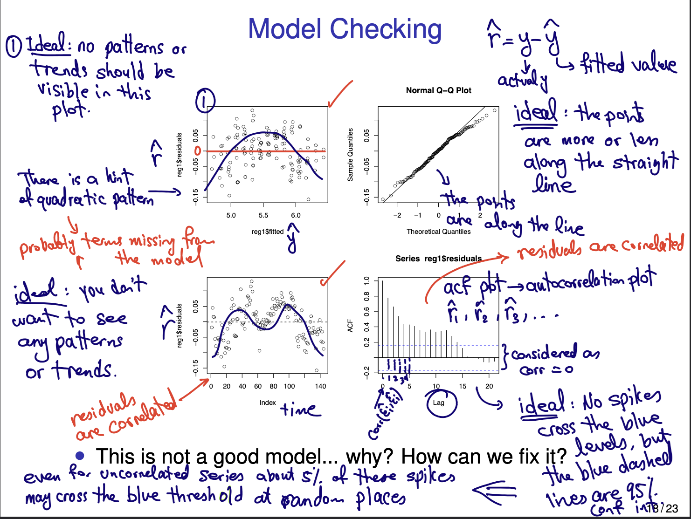

# STAT 443

## Lecture 1

Heteroscedastic: variability in the data increases as a function of time.  
Homoscedastic: variability is constant.

Periodicity, Trend (patterns that are not periodic), Variability, change point
(unpredictable)

## Tutorial 1

Data = Trend (non-periodic patterns) + seasonality (periodic pattern) + error (random component)

Kinda like linear regression $y = \alpha + \beta x + \varepsilon$

We want the random component to be stationary.
(No trend, seasonality and homoscedastic).

General Approach to modeling:

* Plot series and look for trend, seasonality, sharp change in behaviour and outlying
observations.
* Remove sources of non-stationarity
  * Stabilize the variance
  * Estimate and remove trend and/or seasonal components to get stationary data
* Choose a model for the "detrendized" and "deseasonalized" data.
* Forecasting achieved by forecasting stationarity data, then adding back trend and/or
seasonal parts or other sources of non-stationarity.

Forecasting is trying to predict future using the error term and determining if they
are correlated.

Confidence interval is a interval for an unknown but fixed interval.

Prediction interval is an interval covering the future value of a varying unknown.

A good model is one that removes/estimates the trend & seasonality well enough s.t.
the random component is stationary.

### Kolmogorov's Existence Theorem

The pdf $F_t(\cdot)$ are the distribution functions of some stochastic process iff for
any $n\in\{1,2,\ldots\}$ and $t=(t_1,\ldots,t_n)\in\mathcal T$ and $1\le i\le n$,
$$
\lim_{x_i\to\infty}F_t(x)=F_{t(i)}(x_{(i)})
$$
where $x=(x_1,x_2,\ldots,x_n),t_{(i)}$ and $x_{(i)}$ are the $(n-1)$-component vectors
obtained by deleting the $i$th components $t$ and $x$ respectively.

Intuition: If all finite dimensional distributions exists, and they are consistent with
one another under marginalization then we can say the stochastic process exists.

Hence, we can use finite dimensional models to define a general process.

## Lecture 2

### Time Series Models

A Time series model for the observed data $\{x_t\}$ is a specification of the joint
distributions of a sequence of random variables $\{X_t\}$.

We are interested in zero-mean time series models. E.g. iid noise, random walk,
white noise.

### i.i.d Noise

Consider the sequence of $X_1,X_2,\ldots$ of iid random variables where $E(X_i)=0,\forall i$.
The sequence $\{X_i,i=1,2,\ldots\}$ is called iid noise.

Since independent, we don't learn anything from the past.

### Random Walk

Define $S_t=\sum_{i=1}^tX_i$ in which $\{X_t,t=1,2,3,\ldots\}$ is iid noise. The sequence
$\{S_t,t=0,1,\ldots\}$ usually starting at $S_0=0$ is called a random walk.

Suppose $Var(X_i)=\sigma^2, \forall i$.  
$Var(S_t) = Var(\sum_{i=1}^t X_i) = \sum_{i=1}^t Var(X_i) = t\sigma^2$

### White Noise

Consider the sequence $X_1,X_2,\ldots$ of uncorrelated random variables where $E(X_i)=0$
and $Var(X_i)=\sigma^2<\infty,\forall i$. The sequence $\{X_i,i=1,2,\ldots\}$ is called 
white noise.

$X_i\sim WN(0,\sigma^2)$

Uncorrelated is only equal to independent if $X_1,X_2,\ldots X_n\sim MVN$

A random walk may be defined as the sum of white noise instead of iid noise.

Ex. (Practice Problem)

Suppose $X$ and $Y=X^2$ where $X\sim N(0,1)$. Show that $X$ and $Y$ are uncorrelated
but dependent.

Correlation: Strength of a linear relationship.

## Classical Decomposition

### Models with (non-periodic) trends

Consider the model $X_t=m_t+Y_t$ where $m_t$ is a slowly changing function (deterministic)
and $Y_t$ is the zero-mean random component, i.e. $E(Y_t)=0,\forall t$.

E.x Linear regression

### Models with seasonality (periodic) trends

Consider $X_t=S_t+Y_t$ where $S_t$ is a periodic function (deterministic) with period $d$,
$S_t=S_{t+d},\forall t$.

E.x. $S_t=\sin{\frac{\pi t}{2}}$

### Models with both trend and seasonality

Consider $X_t=m_t+S_t+Y_t$.

### Estimations of $m_t$ and $S_t$

If $m_t$ and $S_t$ are parametric, then can be estimated using maximum likelihood or least squares.

$S_t$ does not have to have a parametric form and may be modelled in regression using
indicator variables.

To model $S_t$ with period $d$ using indicator variables, one needs $d-1$ explanatory
variables in the model to estimate $S_t$. E.g. To model 12 months, we can use 11 indicator
variables and set them all to 0 for one of the months.

### Model Checking

## Loss Functions

Definition: A loss function $L(Y,f(X))$ is a real valued function which measures the error
in estimating $Y$ with the estimate $f(X)$.

We call the expected value $E_{X,Y}[L(Y,f(X))]$ risk.

Here, the expectation is over the joint distribution of $X,Y$, but if $X$ is assumed
to be given, then the expectation is relative to $Y|X=x$.

### Quadratic Loss

Common example is squared error loss.

$L_{SE}(Y,f(X))=(Y-f(X))^2$.

The expected value is called the MSE. $MSE(f):=E_{X,Y}(L_{SE}(Y,f(X))) = E_{X,Y}((Y-f(X))^2)$

#### Conditional Expectation Theorem

If $X$ and $Y$ are two random variables with $E(Y)=\mu$ and $Var(Y)<\infin$, then $f$,
which minimizes $MSE(f)$, for $X$, $Y$ is given by the conditional expectation.

### Absolute Error Loss

$L_{abs}(Y,f(X)):=|Y-f(X)|$ the function which minimizes $E_{X,Y}(L_{abs}(Y,f(X)))$ is
$\hat f(x)=\text{Median}(Y|X=x)$

### Zero-one loss

If $Y$ is a discrete or categorical RV, with sample space $\mathcal S$, then
$L_{01}(Y,f(X))=\begin{cases}0 & Y=f(X) \\ 1 & Y\neq f(X)\end{cases}$

### Bayes Classifier

The function which minimizes $E_{X,Y}(L_{01}(Y,f(X)))$ for $X,Y$ where $Y$ has sample space
$\mathcal S$ is $\hat f(x)=\argmax_{y\in\mathcal S}P(y|X=x)$

## Regression Review

$\hat\beta_{OLS}=(X^TX)^{-1}X^TY$

### Hat Matrix

$H:=X(X^TX)^{-1}X^T$ is an orthogonal projection matrix.

The fitted values $\hat y$ are the projection of the observed values in the training
set $Y$ onto the linear subspace spanned by the columns of $X$. $\hat y:=Hy$

The estimated residuals are the corresponding orthogonal complement
$hat y:=y-Hy=(I-H)y$

### Variance of OLS

The variance-covariance of the sampling distribution of $\hat\beta_{OLS}$
is given by $Var(\hat\beta_{OLS})=(X^TX)^{-1}\sigma^2$

Estimate $\sigma^2$ using $\tilde\sigma^2=\frac{SSE}{n-1-p}$

### Maximum Likelihood Estimation

The distribution of $Y$ is $MVN(X\beta,\Sigma)$ where $\Sigma=\sigma^2I_n$. The density
function of $Y$ is

$$
\frac{1}{(2\pi)^{n/2}}(det\Sigma)^{-\frac{1}{2}}exp\Big\{-\frac{1}{2}(y-X\beta)^T\Sigma^{-1}(y-X\beta)\Big\}
$$

Log-likelihood is the $\ell(\beta,\Sigma)$

$$
-\frac{1}{2}\log det\Sigma-\frac{1}{2}(y-X\beta)^T\sigma^{-1}(y-X\beta)
$$

The maximum likelihood estimator of $\beta$ is

$$
\tilde\beta_{ML}=(X^TX)^{-1}X^TY
$$

### Sampling Distributions

Assume we can write $y$ in terms of its means and an error term

$$
\begin{aligned}
Y|X&=E(Y|X)+\epsilon \\
&=\beta_0+\sigma_{i=1}^p\beta_iX_i+\epsilon
\end{aligned}
$$

where $\epsilon\sim N(0,\sigma^2I_{n\times n})$

i) The sampling distribution of $\tilde\beta_{OLS}$ is given by

$$
\tilde\beta_{OLS}\sim MVN(\beta,\sigma^2(X^TX)^{-1})
$$

ii) The distribution of $\tilde\sigma^2$ is determined by

$$
(n-1-p)\frac{\tilde\sigma^2}{\sigma^2}\sim\chi^2_{n-1-p}
$$
where $n$ is the number of data points

## Residual Diagnostics

### Normality

QQ Plot is a graphical method in testing Normality. Points should lie on the line.  
Histogram should be bell shaped.

#### Shapiro-Wilk Test of Normality

Formal non-parametric test of normality. $H_0:Y_1,\ldots,Y_n$ comes from a Gaussian
Distribution.  
Strong evidence against $H_0$ if the p-value of this test is small.

### Constant Mean/Variance

Residual vs Fitted values plot. No obvious trend should be exhibited in this graph.
Funnel shape trend $\implies$ non-constant variance.

Residuals vs time plot. No obvious trend should be exhibited in this graph. If
there is a trend, mean is non-constant. Same thing with funnel shape and variance
here.

#### Fligner-Killeen Test for Constant Variance

A formal non-parametric test of constant variance. $H_0:\sigma_1^2=\sigma_2^2=\ldots=\sigma_k^2$.  
Strong evidence against $H_0$ if the p-value of this test is small.

### Uncorrelatedness

Look at ACF plot.  

### Randomness

#### Difference Sign Test for Randomness

Count the number $S$ of values s.t. $y_i-y_{i-1}>0$.  
For large iid sequence:

$$
\mu_S=E(S)=\frac{n-1}{2}, \sigma_S^2=\frac{n+1}{12}
$$

for large $n$, $S$ is approximately $N(\mu_s,\sigma_S^2)$. Thus,

$$
\frac{S - \mu_S}{\sqrt{\sigma_S^2}}\sim N(0,1)
$$

Large positive (negative) value of $S-\mu_S$ indicates the presence of increasing
(decreasing) trend.

* $H_0:$ The data is random
* There is strong evidence against randomness if p-value is small. $p=2P(Z>|\frac{S-\mu_S}{\sqrt{\sigma_S^2}}|)$

#### Runs Test for Randomness

Checks randomness by looking at random scatter of data about its median.

* $n_1$: number of observations $>m$
* $n_2$: number of observations $<m$

Count $R$ the number of sequences of consecutive observations which are all
smaller (larger) than $m$

For large iid sequence

$$
\mu_R=E(R)=1+\frac{2n_1n_2}{n_1+n_2},\sigma_R^2=\frac{(\mu_R-1)(\mu_R-2)}{n_1+n_2-1}
$$

For large number of observations:

$$
\frac{R-\mu_R}{\sigma_R}\sim N(0,1)
$$

## Prediction Within Regression

### Multicollinearity

If two or more columns of the design matrix $X$ are highly correlated, we say that we
have multicollinearity. This means the correlated explanatory variables are essentially 
sharing the same information about $Y$. Does not add more info, but is statistically
expensive. Bias is not reduced much, but variance is increased.

Identify using correlation matrix, VIF, matrix plot.  
Check if including/excluding some of the variables change the coefficients of other variables.  
$SE(\hat\beta_j)$ may be large for some coefficients.  
Overall test does not match individual tests (F-test vs T-test).  

### Prediction Interval

$\hat\mu\pm c_\alpha\hat\sigma\sqrt{1 + x^T_0(X^TX)^{-1}x_0}$ where $c_\alpha$ is
the $1-\frac{\alpha}{2}$ quantile from the $_{N-1-p}$-distribution and $\hat\sigma^2$ is
$\frac{1}{N-1-p}\sum_{i=1}^N(y_i-\hat y_i)^2$

Confidence interval for $\mu=E(Y_0|X=x_0)$:

$$
\hat\mu\pm c_\alpha\hat\sigma\sqrt{x_0^T(X^TX)^{-1}x_0}
$$

### Model Complexity

We have so far mostly been choosing unbiased estimators. To take advantage of bias-variance
tradeoff we can improve the predictive performance of our model.

One method is the use only a subset of the explanatory variables.

* This may reduce the multicollinearity and reduce the variance of the estimator.
* This may come at the cost of some bias.

Which variables do we choose?

## Variable Selection

### Model Selection Criteria

1. $R^2$ and adjusted $R^2$
2. Akaike's Information Criterion (AIC, AICc)
3. Bayesian Information Criterion (BIC)
4. Stepwise Method in Variable Selection
5. Prediction SE
6. MSE prediction criterion (cross-validation)

1-4 focus on fit, 5-6 focus on prediction.

### $R^2$

$R^2=\frac{SS_{Reg}}{SS_{Total}}=1-\frac{SSE}{SS_{Total}}$

In SLR, $R^2$ measures the squared correlation between the fitted and observed values.

It is the amount of variability in $Y$ explained by the model.

Also the ratio of the explained variation to the total variation.

Adding explanatory variates always increases $R^2$, but does not always improve
forecasting. Hence, bigger does not mean better.

### Overfitting

Recall the prediction error.

The $\hat\sigma$ decreases with more explanatory variates, but the second can
increase if we have too many

### Adjusted $R^2$

To try to take into account the number of parameters we can use adjusted $R^2$.

$$
\bar R^2=1-(1-R^2)\frac{n-1}{n-1-p}
$$

Measures the fit of a model, does not measure prediction power of the model.

### Akaike's Information Criteria

AIC also tries to balance goodness of fit with number of parameters.

$$
AIC = -2\ell(\hat\beta)+2N_p
$$

where $\ell$ is the log-likelihood function of the parameters, $\hat\beta$ the MLE, and
$N_p$ is the number of params in the model.

Smaller is better.

More params causes $-2\ell(\hat\beta)$ to get smaller, but the penalty factor $2N_p$
penalizes the model for adding parameters.

If sample size is too small, AIC may not perform well. 

To address this problem, for a univariate linear regression model, if the residuals
are normally distributed, we use AICc.

$$
AICc = AIC + \frac{2N_p(N_p+1)}{n-N_p-1}
$$

where $n$ is the number of observations, and $N_p$ is the number of parameters in the model.

As $n\to\infin, AICc\to AIC$.

### Bayesian Information Criterion

Similar to AIC, harsher penalty factor.

$$
BIC = -2\ell(\hat\beta)+(\log(n))\times N_p
$$

### Model Selection

Including all regressors does not result in the best forecasting model.

Not possible to look at all possible subsets of covariates

Can use stepwise strat, build up one variable at a time, build down by subtracting one
at a time, or use a mixed strategy.

### APSE

$$
APSE=\frac{\sum_{\nu}(y-\hat y)^2}{|\nu|}
$$

where $\nu$ is the test set, and $|\nu|$ is the number of observations in the test set.

Smaller APSE provides better forecast, but not better fit necessarily!

### K-fold cross validation

Partition the data (randomly) into $k$ disjoint and equal size sets $T_1,\dots,T_k$,
each of size $n_k=[n/k]$ where $n$ is the original size.

Construct the training sets  
$T_{-i}=\$T_1\cup T_2\cup\dots\cup T_{i-1}\cup T_{i+1}\cup\dots\cup T_k$ and test set
$T_i$.

$$
sMSE_{i}=\frac{1}{n_k}\sum_{j\in T_i}(y_j-\hat f^{-i}(x_j))^2
$$

where $sMSE_i$ is APSE on $T_i$, and $f^{-i}(x_j)$ is the estimated value of $y_i$ based on
a model fitted on $T_{-i}$

The overall k-fold cross-validation error is:

$$
CV_{(k)}=\frac{1}{k}\sum_{i=1}^k sMSE_i
$$

Smaller is better.

### Subset Selection

This approach involves identifying a subset of $p$ predictors that we believe to be
related to the response. We then fit a model using least squares on the reduced set of
variables.

### Shrinkage/Regularization

Involves fitting a model involving all $p$ predictors.

Estimated coefficients are shrunken towards zero relative to the LSE. This shrinkage
also known as regularization reduces variance.

Can reduce coefficients to zero, can be used to perform model selection.

### Dimension Reduction

This approach involves projecting the $p$ predictors into $M$-dimensional subspace,
where $M<p$. This is achieved by computing $M$ different linear combinations, or projections
of the variables. Then these $M$ projections are used as predictors to fit a linear 
regression model by least squares.

## Shrinkage

$$
\boldsymbol{\hat\beta}_{\text{regularized}}=\argmin_{\boldsymbol\beta}\Big\{(\textbf{Y}-\textbf{X}\boldsymbol\beta)^T(\textbf Y-\textbf X\boldsymbol\beta)+\lambda\times Pen(\beta_1,\ldots,\beta_p)\Big\}
$$

$\lambda$ is a non-negative penalty factor controlling the contribution of the penalty
function.

How to choose penalty function? Usually an $\ell_p$ norm.

* $\ell_2\implies Pen(\beta_1,\ldots,\beta_p)=\sum_{j=1}^p\beta_j^2$ **Ridge** penalty.
* $\ell_1\implies Pen(\beta_1,\ldots,\beta_p)=\sum_{j=1}^p|\beta_j|$ **Lasso** penalty.
* Combining ridge and lasso, you get $Pen(\beta_1,\ldots,\beta_p)=\sum_{j=1}^p[(1-\alpha)\beta_j^2+\alpha|\beta_j|]$, called the **Elastic Net** penalty.

### Ridge Regression

$$
\boldsymbol{\hat\beta}^{\text{ridge}}:=\argmin_{\boldsymbol\beta} RSS(\lambda)
$$

where

$$
RSS(\lambda):=\Bigg\{\sum_{i=1}^n(y_i-\beta_0-\sum_{j=1}^px_{ij}\beta_j)^2+\lambda\sum_{j=1}^p\beta_j^2\Bigg\} = (\textbf{y}-\beta_0\textbf{1}-\textbf{X}\boldsymbol\beta)^T(\textbf{y}-\beta_0\textbf{1}-\textbf{X}\boldsymbol\beta)+\lambda\boldsymbol\beta^T\boldsymbol\beta
$$

where $\lambda > 0$ is a tuning parameter which determines the bias-variance tradeoff.  
The firs column of $X$ is NOT 1. 
This can be rewritten in equivalent form as

$$
(\beta_0,\boldsymbol{\hat\beta}^{\text{ridge}}):=\argmin_{\beta_0,\boldsymbol\beta}\sum_{i=1}^n(y_i-\beta_0-\sum_{j=1}^px_{ij}\beta_j)^2\qquad\text{s.t. }\sum_{j=1}^p\beta_j^2\leq t
$$

Taking derivative of $RSS(\lambda)$ w.r.t $\beta_0$ and setting it to 0, and solving
we get:

$\boldsymbol{\hat\beta}^{\text{ridge}}=(X^TX+\lambda I)^{-1}X^Ty, \hat\beta_0=\bar y-\frac{1}{n}\sum_{i=1}^n\sum_{j=1}^p\hat\beta_jx_{ij}$

If the intercept $\beta_0$ is included in the ridge regression model, it is unpenalized,
otherwise you can shift $y$ by a constant $\omega$ and the ridge solution will change.

If the columns of $\textbf{X}_{n\times p}$ are centralized ($x_{ij}\to x_{ij}-\bar x_j$),
the estimate of the intercept $\hat\beta_0=\bar y$. Thus, if centralized $\textbf{X, y}$,
$\beta_0$ will be dropped from the model.

The penalty is unfair if explanatory variates are not of the same scale.

Scale predictors/standardize them prior to performing ridge.

### Least Absolute Selection and Shrinkage Operator (LASSO) Regression

$$
(\hat\beta_0,\boldsymbol{\hat\beta}^{\text{lasso}}) := \argmin_{\beta_0,\boldsymbol\beta}\Bigg\{\sum_{i=1}^n\Big(y_i-\beta_0-\sum_{j=1}^px_{ij}\beta_j\Big)^2+\lambda\sum_{j=1}^p|\beta_j|\Bigg\}
$$

Note the lasso penalty function. $\lambda>0$ is a tuning parameter which determines
the bias-variance tradeoff.

Unlike ridge regression, LASSO does not have a closed form solution for the parameter
estimates $\hat\beta^{\text{lasso}}$. (bad)

The $L_1$ penalty used in LASSO works as a variable selection as the shrinkage forces
some of the parameter estimates to be exactly 0. $(\hat\beta_j=0\implies X_j$ is excluded from the model.)(good)

### Choice of $\lambda$

We use cross-validation: `cv.glmnet`

Due to the randomness involved in CV, every time you run the code, the optimum values of $\lambda$
will change.

We want the $\lambda$ that minimizes the Mean-squared error.

For Ridge, use `CV = cv.glmnet(X, Y, alpha=0)`  
For LASSO, use `CV = cv.glmnet(X,Y, alpha=1)`

### LASSO vs Ridge

#### LASSO

* Good when there are few predictors with large effects
* Variable selection
* If $p>n$, LASSO will include at most $n$ predictors in the chosen model, even if all are
relevant.
* Under two or more highly collinear variables, LASSO chooses one randomly
* Does not have closed-form solution
* May not have a unique solution, is not a strictly convex optimization problem

#### Ridge

* Good when most predictors have similar size coefficients
* Requires thresholding for variable selection
* Closed-form solution
* Unique solution

### Elastic Net Regression

$$
\boldsymbol{\hat\beta}^{EN}:=\argmin_{\boldsymbol\beta}\Bigg\{\sum_{i=1}^n\Big(y_i-\beta_0-\sum_{j=1}^px_{ij}\beta_j\Big)^2+\lambda\sum_{j=1}^p\Big[(1-\alpha)\beta_j^2+\alpha|\beta_j|\Big]\Bigg\}
$$

in practice, $\alpha\in\{0,0.25,0.5,0.75,1\}$, where $\lambda>0$ determines the overall complexity
of the model and $\alpha$ is the elastic net parameter.

Provides a mix of LASSO and ridge regression.

Using `glmnet`, $\alpha=0$ for ridge, $\alpha=1$ for LASSO, and $\alpha\in(0,1)$ for elastic net.

We use grid search to find $\alpha$ and $\lambda$, but can also use CV.

## Stationary Processes

### Stationarity

A discrete time series is a set of random variables, $\{X_t\}$, indexed by $t\in T\sube\Z$.
For any finite subset of $\{t_1,\ldots,t_n\}\sub T$ the finite dimensional distributions are the
joint distributions

$$
F(x_{t_1},\ldots,x_{t_n}):=P(X_{t_1}\leq x_{t_1}, \ldots, X_{t_n}\leq x_{t_n}), \forall n, \forall t_1,\ldots t_n
$$

$\{X_t\}_{t\in T}$ is strictly stationary if the finite dimensional vectors $(X_{t_1},\ldots,X_{t_n})$ and $(X_{t_1+h},\ldots,X_{t_n+h})$ have the same joint distribution.

Strict stationarity implies that all statistical properties of the random vector remains the
same under time-shift.

This is too limiting and rarely, true, in practice, we use weak stationarity.

We can use the fact that most of the information content of finite dimensional distributions 
is hopefully included in the first few moment $E(X_t), Var(X_t), and Cov(X_t,X_{t*}),\forall t,t*$

### Mean and Auto-Covariance Functions

The *mean function* of a time series is:
$$
\mu_X(t)=\mu_t=E(X_t),t\in T, \forall t
$$

$\mu_t$ is a mean function because it is a function of time $t$.

The auto-covariance function (acvf) is of a time series with $Var(X_t)<\infin$ for all $t\in T$
is defined by:

$$
\gamma(r,s)=Cov(X_r,X_s)=E(X_r\times X_s) - E(X_1)E(X_s)
$$

for $r,s\in T$

### Weak Stationarity

A time series $\{X_t\}_{t\in T}$ is said to be weakly stationary if:

1) $E(X_t^2)<\infty$ for all $t\in T$ (finite variance)
2) $E(X_t)=\mu$ for all $t\in T$ (constant mean)
3) The acvf satisfies: $\gamma(r,s)=\gamma(r + t, s + t)$ (acvf only depends on distance between r and s, and not $t$)

#### Corollary

A strictly stationary process with finite variance is weakly stationary, but the converse is not
true.

### Auto-correlation Function (acf)

Let $\{X_t,t\in T\}$ be a stationary time series with acvf $\gamma_X(h)=Cov(X_{t+h}, X_t)$jk.
The acf at lag $h$ is defined as:

$$
\rho_X(h)=\frac{\gamma_X(h)}{\gamma_X(0)}=Cor(X_{t+h}, X_t)
$$

Note: $\gamma_X(0)$ (or acvf with 0 lag) is simply $Var(X_t)=Cov(X_t,X_t)=\gamma_X(0)$

This lets us define correlation as a function of covariance.

### Properties of acvf $\gamma_X(h)$

Assume $\gamma(r,s)$ is the acvf of a **stationary process** $\{X_t\}$, then:

1) The acvf can be written as $\gamma_X(h):=\gamma(r+h,r)$ for all $r$
2) $\gamma(0)\geq 0$ ($(Var(X_t)\geq 0$)
3) $|\gamma(h)|\leq\gamma(0)$
4) The acvf is an even function $\gamma(h)=\gamma(-h)$

### Estimable but Flexible Models

Multivariate Normal Distribution: Let $\textbf{X}$ be a $n$-dimensional multivariate normal
random vector. Then the density of $\textbf{X}$ is given by:

$$
(2\pi)^{-n/2}|\text{det}\Sigma|^{-1/2}\exp\Big\{-\frac{1}{2}(\textbf{x}-\boldsymbol{\mu})^T\Sigma^{-1}(\textbf{x}-\boldsymbol{\mu}))\Bigg\}
$$

where $\boldsymbol\mu\in\textbf R^n$ is the mean and $\Sigma$ is the $n\times n$ positive-definite
variance-covariance matrix of $\textbf X$

In general, this will not fit commonly observed real data since the independence assumption is
too strong.

### Estimation of the ACF

In practice, we don't start a model, but instead, we study the observed data.

Use sample ACF to assess the degree of dependence in the data.

### Sample ACF

$$
\hat\gamma(h)=\frac{1}{n}\sum_{t=1}^{n-|h|}(x_{t+|h|}-\bar x)(x_t-\bar x) = \widehat{Cov}(X_{t+|h|},X_t), -n<h<n
$$

$$
\hat\rho(h)=\frac{\hat\gamma(h)}{\hat\gamma(0)}, -n<h<n
$$

in which $\bar x$ is the sample mean.

### Confidence Interval for ACF

Consider iid noise with finite variance. It can be shown that

$$
\hat\rho(h)\stackrel{\text{approx.}}{\sim}N(0,\frac{1}{n})
$$

for large $n$.

Therefore, we can expect that approximately 95% of the sample ACF values fall between the bounds
$\pm1.96/\sqrt{n}$.

If the data contains a trend, $|\hat\rho(h)|$ will exhibit a slow decay as $h$ increases.

If the data contains a substantial deterministic periodic term, $\hat\rho(h)$ will exhibit a
periodic behaviour with the same period.

When observing ACF graph, we expect only 5% of values to cross confidence limits for an
uncorrelated process, and that they occur at random places.

Significant ACF values at the first couple of lags must always be investigated. 

## Smoothing Methods

### Differencing

Eliminates trend and/or seasonality without estimating it.

Let $B$, the backwards shift operator, as follows:

$$
BX_t=X_{t-1}
$$

$B^k$ is defined by iteration, $B^kX_t=X_{t-k}$

Let $\nabla$ be the differencing operator, as follows:

$$
\nabla X_t=(1-B)X_t=X_t-X_{t-1}
$$

Also defined by iteration, e.g.

$$
\nabla^2X_t=\nabla\nabla X_t=(1-B)(1-B)X_t=(1-2B+B^2)X_t=X_t-2X_{t-1}+X_{t-2}
$$

Differencing can be used more than once until stationarity is achieved. Avoid
over-differencing.

#### Over-Differencing

Increases variance exponentially.  
Increases parameters (more complicated).  

**Theoretically**, if the trend is a polynomial degree $p$, then $p$ times
differencing will eliminate the trend.

The number of differencing in practice depends on the value of $\sigma^2$.

#### Seasonality Elimination

Differencing in lag $k$ is defined as $\nabla_kX_t=(1-B^k)X_t=X_t-X_{t-k}$

If $k$ is chosen close to the period, differencing in lag $k$ can remove
seasonality.

We can apply both seasonal and regular differencing using $W_t=\nabla_k\nabla Y_t$  
Is similar to how $\hat r_t=y_t-\hat y_t$ in a regression model: $\hat y_t=\hat\beta_0 + \hat\beta_1+\ldots+\hat\beta_p t^p + \text{ seasonality}$

### Smoothing

Consider $Y_t=m_t+S_t+R_t$. Smoothing refers to the process of estimating the
patterns in the data while leaving out noise.

The pattern part is also referred to as *signal*. It is often challenging to
separate signal from noise.

#### Trend Estimation/Elimination

Consider a non-seasonal model with trend: $X_t=m_t+Y_t, E(Y_t)=0$

We can deal with trend in 3 ways:

1) Differencing
2) Polynomial regression
3) Exponential smoothing

#### Polynomial Regression

Consider a polynomial model assumption about $m_t$. If it is a good fit, then
we can remove trend + seasonality from the model using $\hat r_t=y_t-\hat y_t$.

Sometimes we need to combine regression with other methods such as differencing.

Choice of polynomial degree: Variable selection problem. (Check [Variable Selection](#variable-selection))

#### Exponential Smoothing

For fixed $\alpha\in[0,1]$ define recursively:

$$
\hat m_t=\alpha X_t + (1 - \alpha)\hat M_{t-1} \\
\hat m_1=X_1
$$

This gives an exponential decreasing weighted moving average.

In general, for $t\geq 2$:

$$
\hat m_t=\sum_{j=0}^{t-2}\alpha(1-\alpha)^j X_{t-j}+(1-\alpha)^{t-1}X_1
$$

Higher $\alpha$ values gives more weight to current value. Lower $\alpha$ gives
less weight to current value and more weight on historic data.

### Holt-Winters Algorithm

Recall exponential smoothing $m_t=\alpha X_t+(1-\alpha)m_{t-1}$

* It cannot accommodate seasonal behaviour.
* It turns out that prediction based on exponential smoothing results
in constant value. (Trend is not projected into the future)

Holt-Winters algorithm generalizes exponential smoothing to the case where
there is a trend and/or a seasonal component.

Define trend as a long-term change in the mean level per unit time.

Have a local linear trend where lean level at time $t$ is:

$$
\mu_t=L_t+T_tt
$$

where $L_t$ and $T_t$ vary slowly through time.

$L_t$: the  "level", $T_t$: the "slope" of the trend at time $t$.

Holt's idea: $\hat Y_{t+h}|Y_1,\ldots,Y_t=L_t+(h\times T_t)$

Two forms of seasonality: Additive and multiplicative.

#### Additive Case

Define Level, Trend and seasonal index at time $t$ by $L_t,T_t,I_t$, where
seasonal effect is of period $p$.

The updated rules are:

$$
L_t=\alpha(X_t-I_{t-p}) + (1-\alpha)(L_{t-1}+T_{t-1}) \\
T_t=\beta(L_t-L_{t-1})+(1-\beta)T_{t-1} \\
I_t=\gamma(X_t-L_t)+(1-\gamma)I_{t-p}
$$

The forecast for $h$ steps ahead is then:

$$
\hat X_{t+h}=L_t+hT_t+I_{t-p+1+[(h-1)\%p]}
$$

#### Multiplicative Case

$$
L_t=\alpha(X_t/I_{t-p}) + (1-\alpha)(L_{t-1}+T_{t-1}) \\
T_t=\beta(L_t-L_{t-1})+(1-\beta)T_{t-1} \\
I_t=\gamma(X_t/L_t)+(1-\gamma)I_{t-p}
$$

The forecast for $h$ steps ahead is then:

$$
\hat X_{t+h}=(L_t+hT_t)I_{t-p+1+[(h-1)\%p]}
$$

### Holt-Winters Method

* Provide initial $L_t,T_t,I_t$.
* Provide $\alpha,\beta,\gamma$, (R minimizes the squared one-step prediction error
to estimate these parameters)
* Choose between additive and multiplicative models. (in practice, do both to see which one forecasts better)
* Other than these steps, not that H-W algorithm is quite automatic.

#### Special Cases

$\beta=\gamma=0$: This is the case with no trend and no seasonal updates.
It turns out that $T_t=I_t=0$ in the additive model and $T_t=0, I_t=1$ for
multiplicative model.

Thus, our trend is only, and this is exponential
smoothing with level $L$ playing the role "history" instead.

$$
L_t=\alpha X_t+(1-\alpha)L_{t-1}
$$

It turns out that this just predicts $\hat X_{t+h}=L_t$.

$\gamma=0$: This is the case with no seasonal updates.

Also called double exponential smoothing. Note:

$T_t$ is unaffected, and $L_t$ becomes $\alpha(X_t)+(1-\alpha)(L_{t-1} + T_{t-1})$  
$\hat X_{t+h}=L_t+hT_t$ which is just Holt's idea. Note that prediction becomes
linear.

#### Prediction Interval Based on HW Algorithm

Assuming that the one-step ahead prediction errors are normally distributed, then
a $100(1-\alpha)\%$ prediction interval for $X_{t+h}, h > 0$ is:

$$
\hat X_{t+h}\pm z_{\alpha/2}SE(X_{t+h}-\hat X_{t+h})
$$

For SE calculation and underlying conditions, refer to Yar and Chatfield (1990).

# Stationarity and Linear Processes

To perform any form of forecasting, there must be an assumption that some
things are constant over time.  
Real world data is almost always non-stationary, thus, to use stationarity
frameworks to develop forecast models, we transform/smooth the data
to reach stationarity, then add the souces of non-stationarity back after
the forecasting is performed.

## Linear Process

Linear time series models are designed to model covariance structure in time
series.

### Moving Average Process: $MA(q)$

Suppose $Z_t\sim WN(0,\sigma^2),t\in\Z$, and $\theta(B):=1+\theta_1B+\theta_2B^2+\dots+\theta_qB^q$. Where $B$ is the backwards shift operator. The series
defined by

$$
X_t:=\pmb{\theta}(B)Z_t=Z_t+\theta_1Z_{t-1}+\dots+\theta_qZ_{t-q}
$$

for all $t$, where $\theta_1,\ldots,\theta_q$ are constant, is called a
$q^{th}$-order moving average and denoted by $MA(q)$.

$X_t$ is a linear combination of the current and last $q$ innovations $Z_t$, where
these innovations are considered to be weakly stationary.

#### Stationarity of $MA(q)$

$$
Var(X_t)=Var(Z_t+\theta_1Z_{t-1}+\dots+\theta_qZ_{t-q}) \\
= (1+\theta_1^2+\dots+\theta_q^2)\sigma^2<\infin \\
E(X_t)=E(Z_t+\theta_1Z_{t-1}+\dots+\theta_qZ_{t-q}) = 0 \\
Cov(X_t,X_{t+h}) = Cov(Z_t+\theta_1Z_{t-1}+\dots+\theta_qZ_{t-q},Z_t+\theta_1Z_{t+h-1}\dots+\theta_qZ_{t+h-q}) \\
= \sum_{i=0}^q\sum_{j=0}^q\theta_i\theta_jCov(Z_{t-i}, Z_{t+h-j})
$$

Note, since $Z_t\sim WN(0,\sigma^2)$, then $Cov(Z_{t-i},Z_{t+h-j}) = \sigma^2$ 
if $t-i=t+h-j\to i=h+j$ and $0$ otherwise. This is not a function of $t$, thus
$MA(q)$ is a stationary process.

#### ACVF and ACF of $MA(q)$

$$
\gamma(h)=\sigma^2\sum_{j=0}^{q-|h|}\theta_j\theta_{j+|h|} \\
\rho(h)=\frac{\sum_{j=0}^{q-|h|}\theta_j\theta_{j+|h|}}{\sum_{j=0}^q\theta_j^2}
$$

## $q$-dependence

The process $\{X_t,t\in T\}$ is called q-dependent if $X_t$ and $X_s$ are dependent whenever
$|t-s|=q$ and are independent whenever $|t-s|>q$.

The stationary process $\{X_t, t\in T\}$ is called $q$-correlated if $\gamma(h)\neq 0$ for $h=\pm q$
and $\gamma(h)=0$ for $|h|>q$. For $|h|<q, X_t$ and $X_s$ may or may not be correlated.

This implies that:

* $q$-dependent process, $q=\min\{h:X_t\perp X_s, |t-s|>h\}$
* $q$-correlated process, $q=\max\{h^*:\gamma(h^*)\neq 0\}$

Under general cases, $q$-dependent does not imply $q$-correlated.

If $\{X_t, t\in T\}$ is a stationary $q$-correlated time series with mean $0$, then it can
be represented as an $MA(q)$ process.

$$
q\text{-correlated}\Longleftrightarrow MA(q)
$$

This means if the sample acf is 0 after lag $q$ you can propose $MA(q)$ for that data.

## The Autoregressive Process: $AR(p)$

Consider $\{X_t,t\in T\}$ defined by $X_t=\phi X_{t-1}+Z_t$ in which $t=0,\pm1,\pm2,\ldots$ and
$Z_t\sim WN(0,\sigma^2)$. This process is called first order autoregressive process, $AR(1)$.

The $AR(1)$ process can be shown as $(1-\phi B)X_t=Z_t$

The stationarity of the process defined above depends on $\phi$.

$|\phi|=1$ results in a random walk, which is non-stationary.

## The $MA(\infin)$ Process

Let $\{Z_t\}\sim WN(0,\sigma^2),t\in\Z$. Let $\{\psi_j\},j=0,1,\ldots$ be a sequence which is
absolutely convergent,

$$
\sum_{j=0}^\infty|\psi_j|<\infin
$$

Then, the process defined by

$$
X_t:=\sum_{j=0}^\infty\psi_jZ_{t-j}
$$

for all $t$, is called an infinite-order moving average $MA(\infty)$ process.

Why MA representation?

1. Make it easier to derive $\gamma(h)$.
2. It helps with understanding the correlation structure of the process.

Note: $MA(\infty)$ is not $q$-correlated. $\rho(h)=0,\forall h>q$

## Wold Decomposition Theorem

Any stationary process can be written as the sum of $MA(\infty)$ process and an independent
deterministic process is any process whose complete realization is a deterministic function of
a finite number of its values

$$
X_t=\sum_{j=0}^\infty\psi_jZ_{t-j}+\mu_t
$$

where:

* $\psi_0=1,\sum_{j=1}^\infty\psi_jZ_{t-j}+\mu_t$
* $Z_t\sum WN(0,\sigma^2)$
* $\{\psi_j\}$ and $\{\mu_t\}$ are unique
* $\{\mu_t,t\in\Z\}$ is a deterministic process and can be described by a linear combination
of its own past.
* $Z_t$ is the limit of linear combinations of $X_s,s\leq t$
* $Cov(\mu_t,Z_s)=0,\forall t,s$

Note: $AR(1)$ can be written as a $MA(\infty)$ process, iff $|\phi|<1$.

## $AR(p)$ Process

Define the polynomial operator $\phi(B)$:

$$
\phi(B):=1-\phi_1B-\phi_2B^2-\dots-\phi_pB^p
$$

where $B$ is the backwards shift operator. The $AR(p)$ process is the process
which is the stationary solution to the difference equations.

$$
\phi(B)X_t=Z_t
$$

for $\{Z_t\}\sim WN(0,\sigma^2)$ when such a solution exists.

Note that $\phi(B)X_t=Z_t$ can be written as:

$$
AR(p):X_t=\phi_1X_{t-1}+\dots+\phi_pX_{t-p} + Z_t
$$

Note: All $AR(p)$ processes have either exp decay or damped sine wave.

### ACVF and ACF of $AR(p)$ process

Under certain conditions, the stationary $AR(p)$ process

$$
X_t=\phi X_{t-1}+\dots+\phi_pX_{t-p}+Z_t,Z_t\sim WN(0,\sigma^2)
$$

can be written as:

$$
X_t=\sum_{j=0}^\infty \psi_jZ_{t-j}
$$

where $\psi_j$'s are defined on $\phi_1,\dots,\phi_p$.

$$
\gamma(h)=\sigma^2\sum_{j=0}^\infty\psi_j\psi_{j+h}, h\geq 0 \\
\rho(h)=\frac{\sum_{j=0}^\infty\psi_j\psi_{j+|h|}}{\sum_{j=0}^\infty\psi_j^2}
$$

## Linear Processes

A time series $\{X_t,t\in T\}$ is called to be a linear process if $X_t$ can be written as

$$
X_t=\sum_{j=-\infty}^\infty \psi_jZ_{t-j}
$$

for all $t$, in which $\{Z_t\}\sim WN(0,\sigma^2)$ and $\{\psi_j\}$ is a sequence of constants
such that $\sum_{j=-\infty}^\infty|\psi_j|<\infty$.

Or, in english, as a linear combination of white noise subject to convergence.

The summation in $X_t$ has infinite number of terms, so a convergence criterion is needed.

* $\sum_{j=-\infty}^\infty a_j$ is called absolutely convergent if $\sum_{-\infty}^\infty|a_j|<\infty$

All $MA(q)$ processes are linear.

### Causality

For practical processes, we may want that the model only have dependence on past innovations.
However, the general definition of linear processes include future innovations.

A causal process $\{X_t\}$ generated $\{Z_t\}\sim WN(0,\sigma^2)$ is one where each $X_t$ is only
a function of those $Z_s$ where $s\leq t$.

A linear process is called causal if $\psi_j=0,\forall j<0$.

Ex.

Stationary $AR(1)$ and $MA(q)$ processes are causal processes.

### Gaussian Process

A process $\{X_t,t\in T\}$ is called a discrete Gaussian time series if all its finite
dimensional distributions are multivariate normal, i.e. for all $n\in\N$ and $i_1,\ldots, i_n$, the
random vector $(X_{i1},\ldots,X_{in})$ has an $n$-dimensional normal distribution.

If

$$
X=\begin{pmatrix}X_1\\X_2\end{pmatrix}\sim N\Bigg[\begin{pmatrix}\mu_1\\\mu_2\end{pmatrix},
\begin{pmatrix}\sigma_1^2 & \sigma_{12} \\ \sigma_{12} & \sigma_2^2 \end{pmatrix}\Bigg]
$$

where $\sigma_1^2=Var(X_1),\sigma_{12}=Cov(X_1,X_2)=\rho\sigma_1\sigma_2,\sigma_2^2=Var(X_2)$  
then,

$$
\begin{aligned}
X_1|X_2=x_2&\sim N\Big(\mu_1+\frac{\sigma_{12}}{\sigma_2^2}(x_2-\mu_2),\sigma_1^2-\frac{\sigma_{12}^2}{\sigma_2^2}\Big) \\
&= N\Big(\mu_1+\frac{\sigma_{12}}{\sigma_2^2}(x_2-\mu_2),\sigma_1^2(1-\rho^2)\Big)
\end{aligned}
$$

## Linear Prediction

### Motivation

Predictors of the form $\hat X_{n+h}=aX_n+b$, which predict the future as a linear function of
history, are interesting. $\hat X_{n+h}$ is a linear predictor.

Even if the normality assumption does not hold, we can still derive $m(X_n)=aX_n+b$ in which
$a,b$ are computed from:

$$
\min_{a,b}E\Big[(X_{n+h}-aX_n-b)^2\Big]
$$

---

We now consider the problem of predicting $X_{n+h},h>0$ for a stationary time series with known mean
$\mu$ and ACVF $\gamma(h)$ based on historical values $\{X_n,X_{n-1},\ldots,X_1\}$.

Showing the linear predictor of $X_{n+h}$ by $P_nX_{n+h}$, we are interested in

$$
Pred(X_{n+h}|X_n,X_{n-1},\ldots,X_1)=P_nX_{n+h}=a_0+a_1X_n+\dots+a_nX_1
$$

which minimizes

$$
S(a_0,\ldots,a_n)=E\Big[(X_{n+h}-P_nX_{n+h})^2\Big]
$$

Best Linear Prediction
: The best linear predictor of $X_{n+h}$ based on the history $X_1,\ldots, X_n$ is:

$$
\underbrace{P_nX_{n+h}}_{\hat X_{n+h}}=\mu+\sum_{j=1}^na_j(X_{n+1-j}-\mu) = a_0+a_1X_n+\dots+a_nX_n
$$

where $\mu=E(X_t),a_0=\mu(1-\sum_{i=1}^na_i)$, and $\Gamma_n\textbf{a}_n=\gamma_n(h)$

where $\textbf{a}_n=(a_1,a_2,\ldots,a_n)^T$,

$$
\Gamma_n=\begin{pmatrix}
\gamma(0) & \gamma(1) & \dots & \gamma(n-1) \\
\gamma(1) & \gamma(0) & \dots & \gamma(n-2) \\
& & \ddots & \vdots \\
& & & \gamma(0)
\end{pmatrix}_{n\times n}
,\;\;\gamma_n(h)=\begin{pmatrix}
\gamma(h) \\
\gamma(h+1) \\
\gamma(n + h - 1)
\end{pmatrix}_{n\times 1}
$$

#### Properties

1. $P_nX_{n+h}=\mu+\textbf{a}_n^T(\textbf{X} - \mu)$
2. $\overbrace{E([X_{n+h}-P_nX_{n+h}]^2)}^{MSE}=\gamma(0)-\textbf{a}_n^T\gamma_n(h)$
3. $\underbrace{E(X_{n+h}-\overbrace{P_nX_{n+h}}^{\hat X_n+h})}_{\text{prediction error}}=0$
4. $E([X_{n+h}-P_nX_{n+h}]X_j)=0$, for $j=1,2,\ldots,n$. Prediction error is uncorrelated with history.
5. For constants $\alpha_i,i=1,2$ and $\beta$:  
$$
P_n[\alpha_1X_{n+h_1}+\alpha_2X_{n+h_2}+\beta]=\alpha_1P_nX_{n+h_1}+\alpha_2P_nX_{n+h_2}+\beta
$$
6. For constants $\alpha_1,\ldots,\alpha_n$ and $\beta$:  
$$
Pred(\sum_{i=1}^n\alpha_iX_i+\beta|X_1,\ldots,X_n)=\sum_{i=1}^n\alpha_iX_i+\beta
$$
7. $P_nX_{n+h}=\mu$ iff $\gamma_n(h)=Cov(X_{n+h},\textbf{X})=0$.
8. You can replace $X_{n+h}$ with any other random variable $Y$. i.e. you may use the history of $X$
to predict the value of another variable $Y$.

* While linear predictors are not always optimal in a general case, they are optimal for linear
processes.

# Box and Jenkins Models

"All models are wrong, but some are useful."

AutoRegressive (Integrated/Differencing) Moving Average (ARMA) and (ARIMA) models for forecasting time series.

SARIMA model = Seasonal ARIMA model.

Relies on two key functions: ACF and PACF

### ARMA Process

$\{X_t,t\in T\}$ is an $ARMA(p,q)$ if:

1. $X_t-\phi_1X_{t-1}-\dots-\phi_pX_{t-p} = Z_t+\theta_1Z_{t-1}+\dots+\theta_qZ_{t-q}, \forall t$ where $Z_t\sim WN(0,\sigma^2)$
2. $\{X_t,t\in T\}$ is stationary
3. Polynomials $\Phi(z)=1-\phi_1z-\dots-\phi_pz^p$ and $\Theta(z)=1+\theta_1z+\dots+\theta_qz^q$ have no common factors.
4. $\{X_t,t\in T\}$ is an ARMA process with mean $\mu$ if $\{X_t-\mu,t\in T\}$ is
an ARMA process.

Equivalently, the $ARMA(p,q)$ process can be written as:

$$
\Phi(B)X_t=\Theta(B)Z_t,Z_t\sim WN(0,\sigma^2)
$$

where 

$$
\begin{cases}
\Phi(B)=1-\phi_1B-\dots-\phi_pB^p \\
\Theta(B)=1+\theta_1B+\dots+\theta_qB^q
\end{cases}
$$

The general model in equation (1) has a unique stationary solution for $X_t$
if none of the roots of $\phi(z)$ are on the unit root circle, i.e.

$$
\Phi(z)\neq 0\;\forall z\in\Complex:\;|z|=1
$$

#### Special Cases

1. $\Phi(B)=1$ implies $MA(q)=ARMA(0,q)$
2. $\Theta(B)=1$ implies $AR(p)=ARMA(p,0)$
3. $\Phi(B)=\Theta(B)=1$ implies white noise = $ARMA(0,0)$

#### Causality

An $ARMA(p,q)$ process $\Phi(B)X_t=\Theta(B)Z_t$ where $Z_t\sim WN(0,\sigma^2)$
is causal if there exists constants $\{\psi_j\}$ such that:

1. $\sum_{j=0}^\infty|\psi_j|<\infty$
2. $X_t=\sum_{j=0}^\infty \psi_jZ_{t-j},\forall t$

---

There two conditions are equivalent to

$$
\Phi(z)=1-\phi_1z-\dots-\phi_pz^p\neq 0\;\forall z\in\cnums : |z|\leq 1
$$

In other words, causality = $\Phi(z)$ has no roots on or inside the unit circle.  
causality $\implies$ stationarity.

Causality and stationarity for $ARMA$ processes is checking roots of $\Phi(z)$.

Defining $\frac{\Theta(z)}{\Phi(z)}=\Psi(z)$, we get $\Theta(z)=\Phi(z)\Psi(z)$.  
That is:

$$
1+\theta_1z+\dots+\theta_qz^q=(1-\phi_1z-\dots\phi_pz^p)(\psi_0+\psi_1z\dots),\forall z
$$

$\implies \psi=1,\psi_1-\psi_0\phi_1=\theta_1,\dots\implies$ all coefs
of same degrees are equal on both sides. We will use this equality to find
the causal solution or the MA representation of a process.

The causal solution (MA representation) is:

$$
X_t=\sum_{j=0}^\infty\psi_jZ_{t-j}
$$

and is also referred to as the MA representation of the stationary process
$\{X_t\}$.

#### Invertibility of $ARMA(p,q)$

Causal solution of an $ARMA$ process is writing it as an MA process.  
Similarly, one may ask if there exists an AR representation of an $ARMA$ process.
This is called the invertibility condition.

An $ARMA(p,q)$ process $\Phi(B)X_t=\Theta(B)Z_t$ where $Z_t\sim WN(0,\sigma^2)$
is invertible if there exist constants $\{\pi_j\}$ s.t.

1. $\sum_{j=0}^\infty |\pi_j|<\infty$
2. $Z_t=\sum_{j=0}^\infty \pi_jX_{t=j},\forall t$

---

Equivalently,

$$
\Theta(z)=1+\theta_1z+\dots+\theta_qz^q\neq 0\;\forall z\in\cnums : |z|\leq 1
$$

Invertibility = $\Theta(z)$ has no roots on or inside the unit circle.

$$
\Phi(B)X_t=\Theta(B)Z_t \\
\implies Z_t=\frac{\Phi(B)}{\Theta(B)}X_t\implies Z_t=\pi(B)X_t\implies Z_t=\sum_{j=0}^\infty \pi_jX_{t-j}
$$

This is called the invertible solution (AR representation) of the stationary
process $\{X_t\}$.

We use the causal solution t o derive acf.  
We use the invertible solution to derive pacf.

### ACVF of $ARMA(p,q)$

Consider a causal and stationary process:  
$\Phi(B)X_t=\Theta(B)Z_t,Z_t\sim WN(0,\sigma^2)$ with the $MA(\infty)$
representation $X_t=\sum_{j=0}^\infty\psi_jZ_{t-j}$.

Note that $E(X_t)=0,\forall t$. Then,

$$
\begin{aligned}
\gamma(h)&=E(X_tX_{t+h}) & \text{recall: } Cov(X,Y)=E[XY]-E[X]E[Y] \\
&=E\Bigg(\sum_{j=0}^\infty\psi_jZ_{t-j}\sum_{i=0}^\infty\psi_iZ_{t+h-i}\Bigg) \\
\forall |h|>=0 : \gamma(h)&=\sum_{j=0}^\infty \psi_j\psi_{j+|h|}E(Z_j^2) + 0 = \sigma^2\sum_{j=0}^\infty\psi_j\psi_{j+|h|} \\
\rho(h)&=\frac{\gamma(h)}{\gamma(0)} = \frac{\sum_{j=0}^\infty\psi_j\psi_{j+|h|}}{\sum_{j=0}^\infty\psi_j}
\end{aligned}
$$

### Partial Auto-covariance

$MA(q)$ being q-correlated, its ACF cuts off after lag $q$. This is a
signature of $MA(q)$.  
All we could say about the ACF of an AR process is that it decays exponentially
(direct or damped sine wave)  
This shows the shortcomings of ACF in identifying the order $p$ in an $AR(p)$
process.  
A function which shows a similar trend for $AR$ processes as ACF shows for $MA$
processes is necessary. These are called Partial autocorrelation function (PACF).

Covariance $\rightarrow$ Auto-covariance $\rightarrow$ Auto-correlation  
Partial Covariance $\rightarrow$ Partial Auto-covariance $\rightarrow$
Partial Auto-correlation

## Partial Autocorrelation Function

The ACF of a stationary process measures the correlation between $X_n$ and
$X_{n+h}$. This correlation can be:

* Direct connection between $X_n$ and $X_{n+h}$
* Through the intermediate steps.

ACF does not tell us which one.

The PACF looks at the direct correlation between $X_n$ and $X_{n+h}$ once
the effect of intermediate steps $X_{n+1},\dots+X_{n+h-1}$ are removed.

The effect or information in the intermediate steps can be quantified by
$Pred(X_{n+h}|X_{n+1},\ldots,X_{n+h-1})$ and $Pred(X_n|X_{n+1},\ldots,X_{n+h-1})$.
(Best linear predictors of $X_{n+h}, X_n$.

Partial AUtocorrelation Function (PACF)
: The PACF for a stationary process $\{X_t\}$ is defined by:

$$
\alpha(h)=\begin{cases}
1 & h=0 \\
Cor(X_{n+1},X_n) & |h|=1 \\
\rho_{x_{n+h}},x_n\cdot\{X_{n+1}\dots X_{n+h-1} & |h| > 1
\end{cases}
$$

where $\rho_{x_{n+h}},x_n\cdot\{X_{n+1}\dots X_{n+h-1}$ is the partial correlation
of $X_{n+h}$ and $X_n$ given the set $\{X_{n+1}\ldots X_{n+h-1}\}$, i.e.

$$
\begin{aligned}
\rho_{x_{n+h}},x_n\cdot\{X_{n+1}\dots X_{n+h-1}&=Cor(X_n,X_{n+h}|X_{n+1}\dots X_{n+h-1}) \\
&= Cor(X_n - Pred(X_n|X_{n+1},\ldots,X_{n+h-1}), \\
& \qquad\qquad X_{n+h}-Pred(X_{n+h}|X_{n+1},\ldots,X_{n+h-1}))
\end{aligned}
$$

### Deriving PACF

$$
\alpha(0) = 1, \alpha(h)=\Phi_{hh} \qquad h\geq 1
$$

where $\Phi_{hh}$ is the last component of the vector $\phi_h=\Gamma_h^{-1}\gamma_h$ in which $\Gamma_h=\Bigg[\gamma(i-j)\Bigg]^h_{i,j=1}$ and
$\gamma_h=(\gamma(1),\gamma(2),\ldots,\gamma(h))$.

Given the data $\{x_1,\ldots,x_n\}$, the sample PACF is estimated by

$$
\hat\alpha(0)=1,\hat\alpha(h)=\hat\phi_{hh} \qquad h\geq 1
$$

where $\hat\phi_{hh}$ is the last component of the vector $\hat\phi_h=\hat\gamma_h^{-1}\hat\gamma_h$

This takes many steps: We can actually combine/summarize the calculations in
a recursive manner.

#### Recursive Formula for PACF

For a stationary time series with autocorrelation function $\rho(h)$, the
following recursive formula can be used to compute the PACF $\alpha(h)$:

$$
\alpha(h)=\phi_{hh}=\frac{\rho(h)-\sum_{j=1}^{h-1}\phi_{h-1,j}\rho(h-j)}{1-\sum_{j=1}^{h-1}\phi_{h-1,j}\rho(j)}
$$

where $\phi_{11}=\rho(1)$ and $\phi_{hj}=\phi_{h-1,j}-\phi_{hh}\phi_{h-1,j},j=1,2,\ldots,h-1$.

Theorem
: Consider a $\{X_t,t\in T\}$ with the PACF $\alpha(\cdot)$. This process
is a causal $AR(p)$ process iff $\alpha(p)\neq 0$ and $\alpha(h)=0.\forall h>p$.
Furthermore, $\alpha(p)=\phi_p$.

| | ACF | PACF |
| --- | --- | --- |
| $MA(q)$ | cuts off after lag $q$ | exponential decay and/or damped sinusoid |
| $AR(p)$ | exponential decay and/or damped sinusoid | cuts off after lag $p$ |
| $ARMA(p,q)$ | exponential decay and/or damped sinusoid | exponential decay and/or damped sinusoid |

## $ARIMA(p,d,q)$ Process

Let $d$ be a non-negtive integer. $\{X_t,t\in T\}$ is an $ARIMA(p,d,q)$ process
if $Y_t:=(1-B)^dX_t$ is a causal $ARMA(p,q)$ process.

$X_t$ satisfies the equation:

$$
\underbrace{\Phi(B)(1-B)^d}_{\Phi^*(B)}X_t=\Theta(B)Z_t, Z_t\sim WN(0,\sigma^2)
$$

where $\Phi^*(B)\to \Phi^*(z)=\Phi(z)(1-z)^d$. Note that if $d\neq 0$, then
$\Phi^*(z)=0$ for $z=1$ which implies non-stationarity of $X_t$.

This model only deals with non-stationarity due to non-constant mean.

For non-stationarity due to non-constant variance, one should use transformations
and/or other types of models (ARCH/GARCH).

We can also remove seasonality by seasonal differencing in lag $s$, and the
remaining series is stationary. The stationary series can be then modelled
using an $ARMA$ process.

Fitting an $ARMA(p,q)$ model to the differenced series $Y_t=(1-B^s)X_t$ is 
the same as fitting the model.

$$
\Phi(B)(1-B^s)X_t=\Theta(B)Z_t,Z_t\sim WN(0,\sigma^2)
$$

## Seasonal $ARIMA$ Model (SARIMA)

If $d$ and $D$ are non-negative integers, then $\{X_t,t\in T\}$ is a
$SARIMA(p,d,q)\times (P,D,Q)_s$ process with period $s$ if the differenced
series

$$
Y_t:=\nabla^d\nabla_s^DX_t=(1-B)^d(1-B^s)^DX_t
$$

is a causal $ARMA$ process defined by

$$
\Phi(B)\Phi^*(B^s)Y_t=\Theta(B)\Theta^*(B^s)Z_t, Z_t\sim WN(0,\sigma^2)
$$

where,

* $\Phi(z)=1-\phi_1z-\phi_2z^2-\dots-\phi_pz^p$
* $\Phi^*(z)=1-\phi_1^*z-\phi_2^*z^2-\dots-\phi_P^*z^P$
* $\Theta(z)=1+\theta_1z+\theta_2z^2+\dots+\theta_qz^q$
* $\Theta^*(z)=1+\theta_1^*z+\theta_2^*z^2+\dots+\theta_Q^*z^Q$

A $SARIMA$ model is superimposing two $ARIMA$ models: one of regular lags,
and the other on the seasonal lags. Note that the correlation among
observations apart by lags of the season does not necessarily imply a seasonal
trend and can itself by modelled using an $ARMA$ process. This is the
seasonal part of $SARIMA$ models.

Note that the process $\{Y_t,t\in T\}$ is causal iff

$$
\Phi(z)\neq 0 \text{ AND } \Phi^*(z^s)\neq 0\qquad \forall z: |z|\leq 1
$$

In practice $d$ is at most 3 (usually 1 or 2) and $D$ is rarely more than 1.
$P$ and $Q$ are typically less than 3.

### Box-Jenkins Methodology and Fitting to Data

1. Plot the data and its ACF to check for stationarity (variance, trend, seasonality). Fix non-constant variance first.
2. Difference (regular and seasonal) to achieve stationarity. This step
identifies $d,s, D$ (s might be from step 1).
3. Pick some potential values for $p,q,P$ and $Q$ based on acf and pacf plots
of the differenced data.
4. Using model selection techniques, choose the most appropriate model among
those in step 3.

## Parameter Estimation

Estimating:  
AR parameters $\phi_1,\ldots,\phi_p$  
MA parameters $\theta_1,\ldots,\theta_q$  
Variance of white noise $\sigma^2$

Need to estimate $p+q+1$ parameters. Can use Maximum likelihood, (partial) least
squares, Yule-Walker (for AR processes only)

For simplicity, assume that $E(X_t)=\mu=0$. If this assumption is incorrect,
then one can work with the centralized process $Y_t=X_t-\hat\mu$.

### Likelihood Methods

We must assume $Z_t\stackrel{iid}{\sim} N(0,\sigma^2)$. This implies that
the data is multivariate Normal.  
Causal Processes $\to X_t=\sum_{j=0}^\infty\theta_jZ_{t-j}$ (Gaussian Process)

### Gaussian Likelihood Function

The likelihood function for a mean zero, stationary Gaussian $ARMA(p,q)$ process
is:

$$
Lik(\phi_1,\ldots,\phi_p,\theta_1,\ldots,\theta_q,\sigma^2)=\frac{1}{(2\pi)^{n/2}det(\Gamma_n)^{1/2}}exp\Bigg(-\frac{1}{2}\textbf{X}^T\Gamma_n^{-1}\textbf{X}\Bigg)
$$

where $\Gamma_n$ is a variance-covariance matrix for $\textbf{X}$ of the form:

$$
\begin{pmatrix}
\gamma(0) & \gamma(1) & \dots & \gamma(n-1) \\
\gamma(1) & \gamma(0) & \dots & \gamma(n-2) \\
\vdots & \vdots & \vdots & \vdots \\
\gamma(n-1) & \gamma(n-2) & \dots & \gamma(0)
\end{pmatrix}_{n\times n}
$$

To obtain the MLE of the parameters, the likelihood function will be maximized
relative to the parameters. Note that $\gamma(h)$ and hence $\Gamma_n$ depends
on these parameters.

#### Steps to Obtain MLEs of $ARMA(p,q)$

* Writing $\gamma(h)$ (hence $\Gamma_h$) as a function of $\phi_1,\ldots,\phi_p,\theta_1,\ldots,\theta_q$ and $\sigma^2$
* Inverting the $\Gamma_n$
* Optimizing the likelihood function to get $MLE(phi_1,\ldots,\phi_p,\theta_1,\ldots,\theta_q)$. We will also estimate $\sigma^2$ with the mean squares of
residuals, similar to what was done in regression.

### Yule-Walker Estimation for $AR(p)$

Consider the causal $AR(p)$ process

$$
X_t-\phi_1X_{t-1}-\dots-\phi_pX_{t-p}=Z_t
$$

with the causal solution $X_t=\sum_{j=0}^\infty\psi_jZ_{t-j}$ in which
$Z_t\sim WN(0,\sigma^2)$. Interest lies in estimating $\Phi=(\phi_1,\ldots\phi_p)$
and $\sigma^2$.

This is a moment method starting by multiplying both sides of the $AR$ process
by $X_{t-j},j=0,1,\ldots, p$ and taking the expectation.

#### Sample Yule-Walker Equations for $AR(p)$

Using the sample estimate of ACVF, we get:

$$
\hat\Phi=\hat\Gamma_p^{-1}\hat\gamma_p,\hat\sigma^2=\hat\gamma(0)-\hat\Phi^T\hat\gamma_p
$$

equivalently, diving both sides of $\Gamma_p\Phi=\gamma_p$ by $\gamma(0)$, we get

$$
\hat\Phi=\hat R_p^{-1}\hat\rho_p,\hat\sigma^2=\hat\gamma(0)(-\hat\Phi^T\hat\rho_p)
$$

where:

$$
\hat\gamma_p=\begin{pmatrix}\hat\gamma(1) \\ \hat\gamma(2) \\ \vdots \\ \hat\gamma(p) \end{pmatrix},\hat\Gamma_p^{-1}=\begin{pmatrix}\hat\gamma(0) & \hat\gamma(1) & \dots & \hat\gamma(p-1) \\ & \hat\gamma(0) & \dots & \hat\gamma(p-2) \\ & & \ddots & \vdots \\ & & & \hat\gamma(0) \end{pmatrix}
$$

and $\hat R_p=\hat\Gamma_p/\hat\gamma(0)=[\hat\rho(i-j)]^p_{i,j=1}$

For a large sample size,

$$
\text{Yule-Walker estimator}=\tilde\Phi=\begin{pmatrix}\tilde\phi_1 \\ \tilde\phi_2 \\ \vdots \\ \tilde\phi_p \end{pmatrix}\sim MVN(\Phi,\frac{\sigma^2}{n}\Gamma^{-1}_p)
$$

For large sample sizes, we can even replace $\sigma^2$ and $\Gamma_p$ with 
their sample estimates and use this result for large-sample confidence intervals
for $\Phi$.

## Forecasting in ARMA

Want to minimize $MSE=E[(X_{n+h}-\hat X_{n+h})^2|X_1,\ldots,X_n]$ where
we have shown that $\hat X_{n+h}=E(X_{n+h}|X_1,\ldots,X_n)$.

Since ARMA processes are linear, we will see that this conditional expectation
turns into the best linear predictor, $\hat X_{n+h}=P_nX_{n+h}$.

