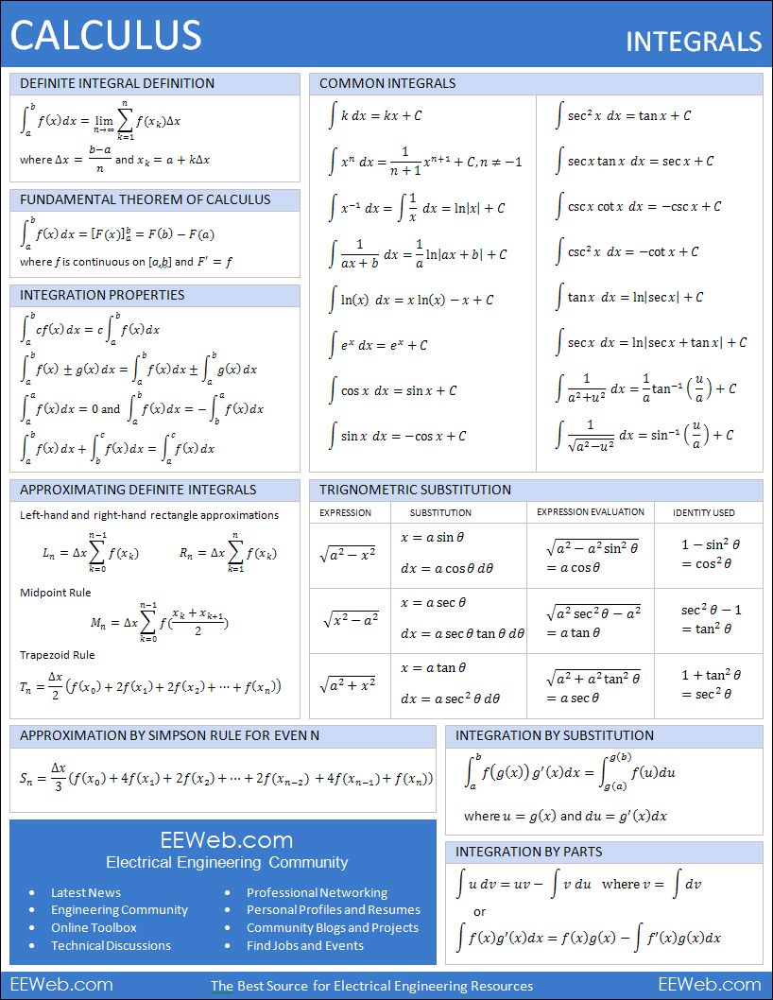

# STAT 450 Notes

## Prerequisite Review

### Random Variable
A Random variable is a function that assigns a real number to each outcome in the **sample space** of a random experiment.

Formally, for **sample space $\Omega$**, a random variable $X$ is a function $X:\Omega \to \R$. We write $X(\omega) = x_{\omega}$ s.t. $x_{\omega} \in \R, \omega \in \Omega$

Note: The random variable is not random, but it is the outcome of the experiment mapped through $X$, that is random. That is, $C(\omega)$ is not random, but $\omega \in \Omega$ is random. The function $X$ just maps the random outcome $\omega$ to a numerical value.

i.e. The outcome ($\omega$) is random, the way it is mapped ($X$) to its **realization** ($x$), is not random.

#### Discrete Random Variable
A random variable $X$ is **discrete** if it can take on a countable number of distinct values.

#### Continuous Random Variable
A random variable $X$ is **continuous** if it can take on an uncountable number of values.

Random variables are characterized by their probability distributions. These functions assign probabilities to the variable's possible outcomes.

### PDFs and CDFs

#### PMF for DRV
For a discrete random variable $X$, the **PMF** $f_{X}(x)$ gives the probability that $X$ is *exactly equal* to some value $x$. We write

$$
P[\{\omega \in \Omega|X(\omega) = x\}] = P[X=x_{i}] = f_{X}(x_{i})
$$

#### CDF for DRV
The **CDF** for a discrte random variable $X$ is defined as $F_{X}(x) = P[X \leq x]$. For discrete RV, the CDF is the sum of probabilities.

$$
F_{X}(x) = \sum_{x_{i} \leq x}f_{X}(x_{i})
$$

#### PDF for CRV
For  continuous random variable $X$, the **PDF** $f_{X}(x)$ is a function that describes the relative likelihood fo $X$ taking on a value at any point $x$. The PDF is such that for any interval [a, b],

$$
P[a \leq X \leq b] = \int_{a}^{b}f_{X}(x) dx
$$

#### CDF for CRV
The CDF for a CRV $X$ is defined as $F_{X}(x) = P[X \leq x]$.

$$
F_{X}(x) = \int_{-\infty}^{x}f_{x}(t)dt
$$

Two properties:
- Non-Negativity
- Boundedness

### Expectation
#### Discrete Function
$$
E[g(X)] = \sum_{i} g(x_{i})I\!P[X = x_{i}]
$$

#### Continuous Function
$$
E[g(X)] = \int_{-\infty}^{\infty}g(x)f(x)dx
$$

#### Expectation, Variance and Moments of RV
- $E[X]$ is the expectation of $X$.
- $E[(X - E[X])^2]$ is the variance of $X$ often denoted $Var[X] = E[X^2] - (E[X])^2$.
- $E[X^n]$ is the n-th moment of $X$.

Ex.
Show that $Var[X] = E[X^2] - (E[X])^2$
$$
Var[X] = E[(X-E[X])^2] \\
Var[X] = E[X^2 - 2XE[X] + E[X]^2] \\
Var[X] = E[X^2] - 2E[X]^2 + E[X]^2
Var[X] = E[X^2] - E[X]^2
$$

Ex.
Find the expectation and variance of a Bernoulli random variable $X ~ Ber(p), p \in (0, 1).$

$$
E[X] = 0.5 * 0 + 0.5 * 1 = 0.5 \\~\\
Var[X] = E[X^2] - E[X]^2 \\
Var[X] = 0.5 - 0.25 = 0.25
$$

Ex.
Find the expectation and variance of a uniform random variable $X ~ (a, b), a < b$

$$
E[X] = \int_{a}^{b} \frac{x}{b-a} dx \\
E[X] = \frac{1}{b-a} \times (\frac{b^2}{2} - \frac{a^2}{2}) \\
E[X] = \frac{b^2 - a^2}{2(b-a)} \\
E[X] = \frac{(b-a)(b+a)}{2(b-a)} \\
E[X] = \frac{b+a}{2} \\~\\
E[X^2] = \int_{a}^{b} \frac{x^2}{b-a}dx \\
E[X^2] = \frac{1}{b-a} \times (\frac{b^3}{3} - \frac{a^3}{3}) \\
E[X^2] = \frac{b^3 - a^3}{3(b-a)} \\
E[X^2] = \frac{b^2+ba+a^2}{3} \\~\\

Var[X] = \frac{b^2+ba+a^2}{3} - \frac{b+a}{2}^2
$$

Note: The following definitions can be extended to n variables. For the sake of simplicity, we will only use 2.

For continuous random variables $X$ and $Y$, the **joint PDF** $f_{X, Y}(x, y)$ gives the density of probability at each point (x, y). It is defined such that the probability that $X$ and $Y$ fall into a region A $\sube \R$ in the xy-plane is:
$$
P[(X, Y) \in A] = \int \int_{A}f_{X, Y}(x, y)dxdy
$$

The **joint cumulative distribution function** of random variables $X$ and $Y$ is defined as
$$
F_{X,Y}(x,y) = P[X\leq x, Y\leq y]
$$

#### Properties
If $X$ and $Y$ are independent, 
$$
f_{X,Y}{x,y} = f_{X}(x)f_{Y}(y)
$$

#### Joint Expectation
For continuous:
$$
E[g(X, Y)] = \int \int g(x,y)f_{X, Y}(x, y) dx dy
$$

For discrete:
$$
E[g(X, Y)] = \sum \sum g(x,y)f_{X, Y}(x, y)
$$

#### Joint Expectation of Independent Variables
$E[XY] = E[X]E[Y] = \mu_{X} \mu_{Y}$

#### Marginal Distributions (Continuous)
For a joint probability density function (PDF) $f_{X, Y}(x, y)$ of two continuous variables $X$ and $Y$, the marginal distributions are obtained by integrating out the other variable.

$$
f_{X}(x) = \int_{-\infty}^{\infty} f_{X, Y}(x,y) dy \\~\\
f_{Y}(y) = \int_{-\infty}^{\infty} f_{X, Y}(x,y) dx
$$

#### Marginal Distributions (Discrete)
For a probability mass function (PMF) $P_{X,Y}(x,y)$ of two discrete variables $X$ and $Y$, the marginal distributions are obtained by summing it over the other variable.

$$
P_{X}(x) = \sum_{y}P_{X,Y}(x,y) \\~\\
P_{Y}(y) = \sum_{x}P_{X,Y}(x,y)
$$

#### Conditional Distributions
Usually, you use marginal distributions to derive the conditional distribution.

The conditional PDF of $Y$ given $X$ = x is defined by:

$$
f_{Y|X}(y|x) = \frac{f_{X,Y}(x,y)}{f_{X}(X)}
$$

with $f_{X,Y}$ joint PDF of $X$ and $Y$, and $f_{X}$ marginal PDF of $X$

#### Conditional Expectation
For continuous variables:
$$
E[Y|X] = \int y \sdot f_{Y|X}(y|X)dy
$$

For discrete variables
$$
E[Y|X] = \sum_{y} y \sdot f_{Y|X}(y|X)
$$

Conditional expectation is used in the following incredibly useful result.

#### Theorem (Tower Property of Expectation)
If $X$ and $Y$ are random variables (on the same probability space), then
$$
E[X] = E[E[X|Y]]
$$

#### Theorem (Decomposition of Variance)
The variance of $Y$ can be decomposed into the expected conditional variance and the variance of the conditional expectation:
$$
Var(Y) = E[Var(Y|X)] + Var(E[Y|X])
$$

Proof:
$$
Var(Y) = E[Y^2] - E[Y]^2 \\
E[Y^2] = Var(Y) - E[Y]^2 \\
E[Y^2] = E[Var(Y|X) + E[Y|X]^2] \\
E[Y^2] - E[Y]^2 = E[Var(Y|X) + E[Y|X]^2] - E[Y]^2 \\
E[Y^2] - E[Y]^2 = E[Var(Y|X) + E[Y|X]^2] - E[E[Y|X]]^2 \\
E[Y^2] - E[Y]^2 = E[Var(Y|X)] + Var(E[Y|X]) \\
Var(Y) = E[Var(Y|X)] + Var(E[Y|X])
$$

### Moment Generating Functions

#### Moment Generating Function
Given a random variable $X$, its **moment generating function (MGF)** $M_{X}(t)$ is defined as the expected value of $e^(tX)$, where *t* is a real number.

$$
M_{X}(t) = E[e^(tX)] = \begin{cases}\int_{-\infty}^{\infty}e^{tx}f_{X}(x)dx \\ \sum_{x}e^{tx}P(X=x) \end{cases}
$$
$f_{X}(x)$ is the PDF for continuous random variables, and $P(X=x)$ is the PMF for discrete random variables.

#### Property (Obtaining moments using MGF)
the n-th moment of a distribution can be obtained by differentiating the MGF n times with respct to t and then evaluating at t= 0. The n-th moment is thus given by:

$$
\mu_{n}' = E[X^{n}] = M_{X}^{(n)}(0) = \frac{d^n}{dt^n}M_{X}(t) \Bigg|_{t=0}
$$

For example, the expected value is the first moment of a distribution and the variance of the distribution is the second moment - the first moment squared.

#### Property (Uniqueness)
If two distributions have the same MGF, they are the same distribution.

#### Property (Additivity)
If $X$ and $Y$ are independent RV, then the MGF of their sum $X + Y$ is the product of their individual MGFs:

$$
M_{X+Y}(t) = M_{X}(t)M_{Y}(t)
$$
More generally, if $X_{1}, \dots, X_{n}$ are independent RV, let $S = \sum_{i=1}^{n}X_{i}$, then the MGF of S is given by:

$$
M_{S}(t) = E[e^{tS}] = E[e^{tX_{1} + \dots + tX_{n}}] = \prod_{i=1}^{n}E[e^{tX_{i}}] = \prod_{i=1}^{n}M_{Xi}(t)
$$

### Convergence of RV
Suppose for an I.I.D. sample of n random variables $X_{1}, \dots, X_{n}$ we define $X_{n} = \frac{1}{n}\sum_{i=1}^{n}X_{i}$. Nowe we ask, what happens to $X_{n}$ as $n \to \infty$?

This is similar to convergence in calculus. In probability theory, we too can develop a notion (in fact many) of convergence for random variables.

These results are incredibly important in statistical inference, hypothesis testing and estimation theory.

In probability theory, there are many different ways in which $X_{n}$ can 'converge' to $X$, we define four important modes of convergence in the following slides.

### Modes of Convergence

#### Convergence in Probability
A sequence of RV $X_{n}$ **converges in probability** to the random variable $X$ if, for every $\epsilon > 0$,

$$
\lim_{n \to \infty} P[|X_{n} - X| > \epsilon] = 0
$$
This mode of convergence is denoted by $X_{}n \xrightarrow{P} X$

#### Convergence in Distribution
A sequence of random Variables $\{X_{n}\}$ **converges in distribution** to the random variable $X$ if:

$$
\lim_{n \to \infty}F_{X_{n}}(n) = F_{X}(x)
$$
for all continuity points.
This is denoted by $X_{n} \xrightarrow{D} X$.

Note: Convergence in probability is stronger than convergence in distribution.
(not sure why)

#### Convergence in $L^{p}$ (Using Expectation)
For p $\ge$ 1, a sequence of random variables $\{X_{n}\}$ **converges in $L^{p}$ to the random variable $X$ if

$$
lim_{n\to\infty}E[|X_{n} - X|^{p}] = 0
$$

This is known as convergence in $L^{p}$ norm, where the $L^{p}$ norm of $X$ is defined as $(E[|X]^{p})^{\frac{1}{p}}$. This is denoted as $X_{n} \xrightarrow{L^{p}} X$.

Ex. Convergence in $L^{2}$

Consider $X_{n}$ as a sequence of random variables where $X_{n} \sim \textit{N}(0, \frac{1}{n})$ and let $X$ be a random variable that is identically zero.

We have:
$$
E[|X_{n} - X|^2] = E[X_{n}^{2}] = \frac{1}{n}
$$
This works, because E[X] is 0, so it is just the variance.

And as $n \to \infty$:

$$
lim_{n\to\infty}E[|X_{n} - X|^2] = \lim_{n\to\infty}\frac{1}{n} = 0
$$

#### Almost Sure Convergence
A sequence of random variables $\{X_{n}\}$ **converges almost surely** to the random variable $X$ if:
$$
P\Big[\lim_{n\to\infty} X_{n} = X\Big] = 1
$$
This is denoted by $X_{n} \xrightarrow{a.s.} X$ and implies that the sequence $\{X_{n}\}$ converges to $X$ with probability 1.

Ex. Almost Sure Convergence
Consider the sequence of random variables $\{X_{n}\}$ where $X_{n}$ takes the value $\frac{1}{n}$ with probability $1 - \frac{1}{n^{2}}$ and n with probability $\frac{1}{n^2}$. The random variable $X$ is identically xero.

For any $\epsilon > 0$, no matter how small, there exists an N s.t. for all n $\ge$ N, $\frac{1}{n} < \epsilon$. Then we have

$$
P[|X_{n} - 0| < \epsilon] \ge 1 - \frac{1}{n^2}
$$

As $n \to\infty$, $\frac{1}{n^2}\to0$, hence

$$
P\Big[\lim_{n\to\infty}|X_{n} - 0| < \epsilon\Big] = 1
$$

This implies that $X_{n}$ converges to 0 almost surely i.e. $X_{n}\xrightarrow{a.s.}X$.

### Convergence Results

#### Weak Law of Large Numbers
Let $X_{1}, X_{2}, \dots, X_{n}$ be a sequence of iid random variables with a common expected value $\mu$ and finite variance. Then, for any $\epsilon > 0$,

$$
\lim_{n\to\infty}P\Bigg[|\frac{1}{n}\sum_{i=1}^{n}X_{i} - \mu| > \epsilon\Bigg] = 0
$$

This theorem simply states that the sample mean converges in probability to the expected value as the sample size increases.

#### Strong Law of Large Numbers
Let $X_{1}, X_{2}, \dots, X_{n}$ be a sequence of iid random variables with a common expected value $\mu$. Then, with probability 1,

$$
\lim_{n\to\infty}\frac{1}{n}\sum_{i=1}^{n}X_{i} = \mu
$$

This theorem simply states that the sample mean converges almost surely to the expected value as the sample size increases.

#### Central Limit Theorem
Let $X_{1}, X_{2},\dots,X_{n}$ be a sequence of iid random variables with a common expected value $\mu$ and finite variance $\sigma^{2}$. Define the sample mean as $\bar{X_{n}} = \frac{1}{n}\sum_{i=1}^nX_{i}$. Then, as n approaches infinity, the distribution of the standardized mean $\frac{\bar{X_{n}} - \mu}{\sigma / \sqrt{n}}$ converges in distribution to a standard normal distribution N(0, 1).

$$
\lim_{n\to\infty}P\Big[\frac{\bar{X_{n}} - \mu}{\sigma / \sqrt{n}} \leq x] = \phi(x)
$$

where $\phi(x)$ is thr CDF of a standard normal distribution.

The CLT is essential in statistics as it guarantees that the sample mean of iid random variables always approximates a normal distribution when the sample size is large.

#### One-to-One Transformations
It is often useful (and required) to transform random variables $X:\Omega \mapsto \R$ via a one-to-one mapping $g: \R \mapsto \R$. We are therefore interested in the distribution of the random variable $Y = g \circ X : \Omega\mapsto\R$ where g is one-to-one.

#### Defintion
A function $f: A\to B$ is said to be a **one-to-one mapping** (or **injective**) if and only if for every $a_{1}, a_{2} \in A$, if $f(a_{1}) = f(a_{2})$, then $a_{1} = a_{2}$.

In other words, no two different elements of A map to the same element of B.

#### Theorem
If X has a pdf $f_{X}(x)$ for $x \in \R_{X}$ and u is a one-to-one function for $x\in\R_{X}$, then the random variable $Y = u(X)$ has pdf

$$
f_{Y}(yt) = f_{X}(x)\Bigg|\frac{dx}{dy}\Bigg|
$$

where the RHS is expressed as a function of y. The term $\big|\frac{dx}{dy}\big|$ is called the Jacobian of the transformation.

#### Theorem
Given continuous random variables $X$ and $Y$ with joint PDF $f(x,y)$, consider a transformation S defined by:
$$
U = h_{1}(X,Y), V=h_{2}(X,Y),
$$

which is one-to-one with inverse given by $X = w_{1}(U,V)$ and $Y = w_{2}(U,V)$. If S maps support $R_{XY}$ to $R_{UV}$, the joint PDF of U and V is:

$$
g(u,v) = f(w_{1}(u,v), w_{2}(u,v))\Bigg|\frac{\partial(x,y)}{\partial(u,v)}\Bigg|
$$

for all $(u,v)\in R_{UV}$

### Basic Statistics

#### Data
We write **data** as an n-tuple $X=(X_{1},\dots,X_{n})$ which represents the data collected. This is an n-dimensional random variable (random vector).

#### Parameter
The **unknown parameters** $\theta = (\theta_{1},\dots,\theta_{n})$ are estimated using the data X. Ideally, $n \gg p$, an example is estimating $\beta$ in OLS estimation.

#### Statistical Model
A **statistical model** $\{f(x;\theta):\theta\in\Omega\}$ is proposed that "links" the data X to the unknown parameters $\theta$ where $\Omega$ is the paramter space and $f_{\theta}(x)\colonequals f(x;\theta)$ is a probability/density function.

#### Statistic
A **statistic**, T = T(*X*), is a function of the data *X* which does not depend on any unknown paremters.

#### Estimator and Estimate
A statistic $T = T(*X*)$ that is used to estimate a $\tau(\theta)$, a function of $\theta$ is called an **estimator** of $\tau(\theta)$ and an observed value of the statistic $t-t(*x*)$ is called an **estimate** of $\tau(\theta)$

Basically, the random variable is the estimator, and the realization/observation is the estimate.

### Maximum Likelihood Framework
We assume that some observed data x follows some model with parameters $\theta$, we then try to find an estimate of $\theta$ that maximizes the "probability" of the observed data. That "probability" we were trying to maximise above has a special name.

#### Likelihood Function, Log-Likelihood Function
Suppose $X = (X_{1}, \dots, X_{n})$ is an iid sample from a population with density $f_{\theta}(x)$, the **likelihood function** is defined by:
$$
L(\theta)=\prod_{i=1}^{n}f_{\theta}(x_{i})
$$
The **log-likelihood function** is defined as
$$
\ell(\theta)=\log L(\theta)
$$
**Note:** that L, $\ell$ are not necessarily probability functions in the sense that $\int_{\Omega}L=1$ or $\int_{Omega}\ell=1$.
This is a function of the parameter $\theta$, some of the values this parameter have special names.

#### Maximum Likelihood Estimator
For a fixed sample X, the MLE is defined as
$$
MLE(\theta) = \hat\theta = \argmax_{\theta\in\Omega}L(\theta|x)
$$
Since $\ell$ is a monotone transformation of L
$$
\argmax_{\theta\in\Omega}L(\theta|x) = \argmax_{\theta\in\Omega}\ell(\theta|x)
$$

Since neither L, $\ell$ need to be differentiable then its not always possible to use calculus to solve these maximization problems.

#### Score Function, Information Function, Fisher Information
Suppose $\ell\in C^{2}$, where $C^{2}$ means twice continuous differentiable, w.r.t. $\theta$, we define the **score function** as

$$
\forall\theta\in\Omega,S(\theta)=\frac{d}{d\theta}\ell(\theta)
$$

We define the **information function** as

$$
\forall\theta\in\Omega,I(\theta)=-\frac{d^2}{d\theta^2}\ell(\theta)
$$
If the $\hat\theta_{MLE}$ is the MLE then we say $I(\hat\theta_{MLE})$ is the **observed information**. If $\theta$ is a scaler, then the **expected** or **Fisher information** function is

$$
J(\theta) = E[I(\theta;X)],\forall\theta\in\Omega
$$

Note that score function and information function is actually just a second derivative test, but the information function has a - sign, so you are actually checking for a minimum there (< 0).

Everything above is for the case $\theta\in\R$ is a scalar. Analogous definitions for all the terms defined above can be given using slightly -more involved matrix notation. All of these extended definitions for the n-dimensional case for $\theta\in\R^n$ are quite natural and will be covered later in the course.

## Chapter 1

### Properties of Estimators

#### Statistic

A statistic $T(X)$ is a function of the data $X$ which does not depend on the
unknown parameter $\theta$.

#### Location and Scale Parameters

Suppose $X$ is a continuous rv with pdf $f(x;\theta)$. Let $F_0(x) = F(x;\theta=0)$ and
$f_0(x) = f(x;\theta=0)$. The parameter $\theta$ is a *location parameter* of the
distribution if
$$
F(x;\theta)=F_0(x-\theta),\;\theta\in\R
$$
or
$$
f(x;\theta)=f_0(x-\theta),\;\theta\in\R
$$
Let $F_1(x)=F(x;\theta=1)$ and $f_1(x)=f(x;\theta=1)$. $\theta$ is called a scale
parameter of the distribution $X$ if
$$
F(x;\theta)=F_1(\frac{x}{\theta}),\;\theta>0
$$
or
$$
f(x;\theta)=\frac{1}{\theta}f_1(\frac{x}{\theta}),\;\theta>0
$$

### Unbiasedness and MSE

How do we ensure that a statistic $T(X)$ is estimating the correct parameter?
How do we ensure that it is not consistently too large or too small, and that
as much variability as possible has been removed?

#### Expected Value

If $X$ is a discrete random variable with pdf $f(x;\theta)$ and support set $A$,
then
$$
E[h(X);\theta]=\sum_{x\in A}h(x)f(x;\theta)
$$
provided the sum converges absolutely
$$
E[|h(X)|;\theta]=\sum_{x\in A}|h(x)|f(x;\theta)dx < \infin
$$

If $X$ is a continuous rv with pdf $f(x;\theta)$, then
$$
E[h(X);\theta]=\int_{-\infin}^\infin h(x)f(x;\theta)dx
$$
provided that this integral converges absolutely.

#### Unbiased Estimator

A statistic $T(X)$ is an unbiased estimator of $\theta$ if $e[T(X);\theta]=\theta$
for all $\theta\in\Omega$

Unbiased estimation is not preserved under general transformation (e.g. power
transformations)

#### Loss Function
The distance between $T(X)$ and $\theta$ is measured by a loss function $L(\theta,T(X))$
where:

* $L:\Omega\times D\rightarrow[0,+\infin)$
* $L(\theta, T)\geq0,\;\forall\theta,T$
* $L(\theta, T)=0,\;\text{ if } T=\theta

Common loss functions are squared error loss function and Absolute error loss function
$$
L(\theta,T)=(T-\theta)^2 \\
L(\theta,T) = |T-\theta|
$$

#### Risk

The expected value of loss functions is called the risk:
$$
R(\theta,T(X))=E[L(\theta,T(X)),\theta]
$$
which depends on $\theta$

The corresponding risk of the two previously mentioned loss functions are:
$$
MSE(T;\theta)=E[(T-\theta)^2;\theta] \\
ASE(T;\theta)=E(|T-\theta|;\theta)
$$

#### Bias

The bias of an estimator $T$ is
$$
Bias(T;\theta)=E(T;\theta) - \theta
$$

#### UMVUE

An estimator $T=T(X)$ is said to be a uniformly minimum variance unbiased estimator
(UMVUE) of the parameter $\theta$ if (i) it is an unbiased estimator of $\theta$ and
(ii) among all unbiased estimators of $\theta$ it has the smallest MSE and therefore
the smallest variance.

### Sufficiency

A statistic $T(X)$ is sufficient for a statistical model $\{f(x;\theta);\theta\in\Omega\}$
if the distribution of the data $X_1,\ldots,X_n$ given $T=t$ does not depend on the
unknown parameter $\theta$.

#### The Sufficiency Principle

Suppose $T(X)$ is a sufficient statistic for a model. Suppose $x_1, x_2$ are
two different possible observations that have identical values of the sufficient
statistic:
$$
T(x_1) = T(x_2)
$$
Then whatever inference we would draw from observing $x_1$ we should draw exactly
the same inference from $x_2$.

Data reduction adopts the sufficiency principle by partitioning the sample space
into mutually exclusive sets of outcomes in which all outcomes in a given set 
lead to the same inference about $\theta$.

#### Partition of the Sample Space

The partition of the sample space induced by given statistic $T(X)$ is the partition
or class of sets of the form $\{x;T(X) = t\}$ as $t$ ranges over its possible values.

#### Theorem: Factorization Criterion for Sufficiency

Suppose $X$ has a pdf $\{f(x;\theta);\theta\in\Omega\}$ and $T(X)$ is a statistic.
Then $T(X)$ is a sufficient statistic for $\{f(x;\theta);\theta\in\Omega\}$ iff
there exists two non-negative functions $g(\cdot)$ and $h(\cdot)$ s.t.
$$
f(x;\theta)=g(T(x);\theta)h(x),\;\text{ for all } x,\;\theta\in\Omega
$$
This only needs to hold true on a set $A$ of possible values of $X$ which carries
the full probability, where $P(X\in A;\theta) = 1$ for all $\theta\in\Omega$.

### Minimal Sufficiency

Suppose the function $g$ is a many-to-one function which is not invertible.
Suppose further that $g(X_1,\ldots,X_n)$ is a sufficient statistic
Then the reduction from $(X_1,\ldots, X_n)$ to $g(X_1,\ldots,X_n)$ is a
non-trivial reduction of the data.

#### Minimal Sufficient Statistics

A statistic $T(X)$ is a minimal sufficient statistic for $\{f(x;\theta);\theta\in\Omega\}$
if it is sufficient and if for any other sufficient statistic $U(X)$, there exists a
function $g(\cdot)$ such that $T(X)=g(U(X))$

This definition says that a minimal sufficient statistic is a function of every other
sufficient statistic. In terms of the partition induced by the minimal sufficient,
this implies that the minimal sufficient statistic induces the coarsest partition
possible of the sample space among all the sufficient statistics. This partition is
called the minimal sufficient partition.

#### Theorem: Minimal Sufficient Statistic

Suppose the model is $\{f(x;\theta);\theta\in\Omega\}$ and let $A =$ support of $X$.
Suppose that there exists a function $T(x)$ such that for every $x\in A,\;y\in A$,
$$
\frac{f(x;\theta)}{f(y;\theta)}\text{ is constant as a function of }\theta,
$$
iff
$$
T(x)=T(y)
$$
The statistic $T(X)$ is a minimal sufficient statistic of $\theta$.

### Completeness

Useful for determining the uniqueness of estimators, for verifying MSS,
and for finding UMVUE.

Let $(X_1,\ldots,X_n)$ denote the observations from a distribution with pdf
$\{f(x;\theta);\theta\in\Omega\}$. Suppose $T(X)$ is a statistic and $u(T)$,
a function of $T$ is an unbiased estimator of $\theta$. Under what circumstances is
this the only unbiased estimator of $T$? To answer this, suppose $u_1(T)$ and $u_2(T)$
are both unbiased estimators of $\theta$ and consider $h(T) = u_1(T) - u_2(T)$. Since
they're both unbiased estimators, we have $E(h(T)) = 0$ for all $\theta\in\Omega$.
If the only function $h(T)$ which satisfies $E(h(T)) = 0$ for all $\theta\in\Omega$ is
the function $h(t) = 0$, then the two unbiased estimators must be identical. This
statistic $T$ is then said to be complete.

#### Completeness

The statistic $T=T(X)$ is a complete statistic for $\{f(x;0);\theta\in\Omega\}$ if
$$
E[h(T);\theta]=0,\text{ for all }\theta\in\Omega
$$
implies
$$
P[h(T)=0;\theta]=1\text{ for all }\theta\in\Omega
$$

#### Theorem

If $T(X)$ is a complete sufficient statistic for the model $\{f(x;\theta);\theta\in\Omega\}$
then $T(X)$ is a minimal sufficient statistic for $\{f(x;\theta);\theta\in\Omega\}$

The converse for this is **NOT TRUE**.

#### Theorem

For any rv $X$ and $Y$
$$
E(X) = E[E(X|Y)] \\
\text{and} \\
Var(X) = E[Var(X|Y)] + Var[E(X|Y)]
$$

#### Theorem

If $T = T(X)$ is a complete statistic for the model $\{f(x;\theta);\theta\in\Omega\}$,
then there is at most one function of $T$ that provides an unbiased estimator of the
parameter $\tau(\theta)$.

#### Lehmann-Scheffeé Theorem

If $T=T(X)$ is a complete sufficient statistic for the model $\{f(x;\theta);\theta\in\Omega\}$ and $E[g(T);\theta]=\tau(\theta)$, then $g(T)$ is the unique UMVUE of $\tau(\theta)$.

#### Rao-Blackwell Theorem

If $T=T(X)$ is a complete sufficient statistic for the model $\{f(x;\theta);\theta\in\Omega\}$ and $U=U(X)$ is any unbiased estimator of $\tau(\theta)$, then $E(U|T)$ is the UMVUE of
$\tau(\theta)$.

### The Exponential Family

#### Definition

Suppose $X=(X_1,\ldots,X_p)$ has a joint pdf of the form
$$
f(x;\theta)=C(\theta)\exp\Big[\sum_{j=1}^kq_j(\theta)T_j(x)\Big]h(x)\quad(1)
$$
for functions $q_j(\theta),h(x),C(\theta)$. Then we say that $f(x;\theta)$ is a member
of the exponential family of densities. We call $T_1(X),\ldots,T_k(X)$ the natural
sufficient statistic.

#### Theorem

Let $X_1,\ldots,X_n$ be a random sample from the distribution with pdf given by (1).
Then $(X_1,\ldots,X_n)$ also has an exponential family form with joint pdf
$$
f(x_1,\ldots,x_n;\theta) = \prod_{i=1}^nf(x_i;\theta)=[C(\theta)]^n\exp{\Bigg\{\sum_{j=1}^kq_j(\theta)\Big[\sum_{i=1}^nT_j(x_i)\Big]\Bigg\}}\prod_{i=1}^nh(x_i)
$$
In other words, $C$ s replaced by $C^n$ and $T_j(x)$ by $\sum_{i=1}^nT_j(x)$.
The natural sufficient statistic is
$$
\Big(\sum_{i=1}^nT_1(X_i),\ldots,\sum_{i=1}^nT_k(X_i)\Big)
$$

#### Canonical Form of the Exponential Family

It is usual to reparameterize equation (1) by replacing $q_j(\theta)$ by a new
parameter $\eta_j$. This results in the canonical form of the exponential family
$$
f(x;\eta)=C(\eta)\exp\Big[\sum_{j=1}^k\eta_jT_j(x)\Big]h(x)
$$
The natural parameter space in this form is the set of all values of $\eta$ for which
the above function is integrable; that is
$$
\Big\{\eta;\int_{-\infin}^\infin f(x;\eta)dx<\infin\Big\}
$$
If $X$ is discrete the integral is replaced by the sum over all $x$ s.t. $f(x;\eta)>0$

#### Identifiability

The parameter $\theta$ for model $\{f(x;\theta);\theta\in\Omega\}$ is identifiable
if $\theta_1,\theta_2\in\Omega$ s.t.
$$
f(x;\theta_1)=f(x;\theta_2)\text{ for all }x\in A
$$
it must be true that $\theta_1=\theta_2$.

#### Regular Exponential Family

We will say that $X$ has a regular exponential family distribution if it is in
canonical form, is of full rank in the sense that neither the $T_j$ nor the $\eta_j$
satisfy any linear constraints, and the natural parameter space contains a $k$-dimensional
rectangle.

There is no vector $a\in\R^k$ s.t.
$$
a^T\eta=a_1\eta_1+\dots+a_k\eta_k=0
$$
There is no vector $b\in\R^k$ s.t.
$$
b^TT(x)=b_1T_1(x)+\dots+b_kT_k(x)=0,\forall x
$$

#### Theorem

If $X$ has a regular exponential family distribution with natural sufficient
statistic $T(X)=(T_1(X),\ldots,T_k(X))$ then $T(X)$ is a complete sufficient
statistic.

1. Useful to find CSS
2. REF is closed under repeated independent sampling
3. If $X$ has a REF distribution of the canonical form $f(x;\eta)$
$$
\frac{\partial^m}{\partial\eta_i^m}\int f(x;\eta)dx = \int\frac{\partial^m}{\partial\eta_i^m}f(x;\eta)dx
$$
for any $m=1,2,\ldots$ and any $i=1,\ldots,k$. "differentiation under the integral" useful
in chapter 2.

### Ancillarity

Let $X=(X_1,\ldots,X_n)$ denote observations from a distribution with pdf
$\{f(x;\theta);\theta\in\Omega\}$ and let $U(X)$ be a statistic.

The information on the parameter $\theta$ is provided by the sensitivity of the
distribution of a statistic to changes in the parameter.

For example, suppose a modest change in the parameter value leads to a large change
in the expected value of the distribution resulting in a large shift in the data.
Then the parameter can be estimated fairly precisely.

On the other hand, if a statistic $U$ has no sensitivity at all in distribution to
the parameter, then it would appear to contain little information for point estimation
of this parameter.

A statistic of the second kind is called an ancillary statistic.

#### Ancillary Statistic

$U(X)$ is an ancillary statistic if its distribution does not depend on the unknown
parameter $\theta$.

Comments:

1. Its distribution is fixed and known, unrelated to $\theta$.
2. It alone contains little information about $\theta$, but when used in conjunction
with other statistics, sometimes it does contain valuable information for inference
about $\theta$.
3. It is not unique.

#### The Conditionality Principle

Suppose the MSS can be written in the form $T=(U,A)$ where $A$ is an ancillary
statistic. Then all inference should be conducted using the conditional distribution
of the data given the value of the ancillary statistic, that is, using the distribution
$X|A$.

#### Basu's Theorem

Consider $X$ with pdf $\{f(x;\theta);\theta\in\Omega\}$. Let $T(X)$ be a CSS. Then
$T(X)$ is independent of every ancillary statistic $U(X)$.

## Chapter 2

### Maximum Likelihood Estimation

Best known, most widely used and important methods of estimation.

#### Likelihood function for discrete distribution

Suppose $X$ is a random variable with pf $P(X=x;\theta)=f(x;\theta)$, where $\theta\in\Omega$
is a scaler and suppose $x$ is the observed data. The likelihood function for $\theta$ is
$$
L(\theta;x)=L(\theta)=P(\text{observing the data }x;\theta) \\
=P(X = x;\theta) \\
= f(x;theta),\;\theta\in\Omega
$$

1. $L(\theta)$ describes the prob that different parameter values produce our data.
2. Justification: The values of $\theta$ which make $L(\theta)$ larger are more
plausible than the values of $\theta$ which make it smaller in light of the observed
data.

#### ML Estimate and ML Estimator

The value $\theta$ that maximizes the likelihood function $L(\theta)$ or equivalently
the log likelihood function $l(\theta)$ is called the ML estimate. The ML estimate
is a function of the data $x$ and we write $\hat\theta=\hat\theta(x)$. The corresponding
ML estimator is denoted $\hat\theta=\hat\theta(X)$.

#### Log Likelihood Function

The log likelihood function is defined as
$$
l(\theta)=\log L(\theta),\;\theta\in\Omega
$$

#### Score Function

The score function is defined as
$$
S(\theta)=S(\theta;x)=\frac{d}{d\theta}l(\theta)=\frac{d}{d\theta}\log L(\theta),\;
\theta\in\Omega
$$

#### Information Function
$$
I(\theta)=I(\theta;x)=-\frac{d^2}{d\theta^2}l(\theta)=-\frac{d^2}{d\theta^2}\log L(\theta),
\;\theta\in\Omega
$$
I(\hat\theta) is called the observed information

#### Fisher Information Function

If $\theta$ is a scalar then the expected or Fisher Information Function is given by
$$
J(\theta)=E[I(\theta;X);\theta],\;\theta\in\Omega
$$

We usually find $\hat\theta$ by solving $S(\theta) = 0$ when the support set does not
depend on $\theta$.

It is important to verify that $\theta$ is the value of $\theta$ that maximizes
$L(\theta)$ or equivalently $l(\theta)$.

#### Newton's Method

A fundamental problem in maximum likelihood estimation is solving $S(\theta) = 0$ for
the MLE $\hat\theta$ to maximize $l$. Often times $\hat\theta$ does not have an
analytical solution. To solve this issue we can use numerical methods.

First, the basic idea. More generally, suppose you wish to maximize $f(x)$ where
$f$ is twice differentiable. The Taylor expansion of $f$ at $x=x_i$ is given by
$$
f(x)\approx f(x_i)+(x-x_i)f'(x_i) +\frac{1}{2}(x-x_i)^2f''(x_i)=P_2(X)
$$
Note that $P_2$ is maximized when $P_2'(x)=f'(x_i)+f''(x_i)(x-x_i)$ Solving for $x$
in terms of $x_i$, this suggests the following iterative scheme known as Newton's
Method:
$$
x_{i+1}=x_i=\frac{f'(x_i)}{f''(x_i)}
$$

In MLE, $f'$ and $f''$ are $(S,-I)$ so we can write two commonly used methods 
as follows:

1. **Newton-Raphson Method**
$$
\theta_{i+1}=\theta_i+\frac{S(\theta)}{I(\theta)},\;i=0,1,\ldots
$$

2. **Fisher Method of Scoring**
$$
\theta_{i+1}=\theta_i+\frac{S(\theta)}{J(\theta)},\;i=0,1,\ldots
$$

The difference is that $I(\theta)$ is asymptotically equivalent to $J(\theta)$ and
often time s$J(\theta)$ can be computed much faster as there is no dependence on
the data.

#### Relative Likelihood Function

The relative likelihood function $R:\Omega\mapsto[0,1]$ is given by
$$
R(\theta)=\frac{L(\theta)}{L(\hat\theta)}
$$

#### Likelihood Region & Intervals

A $100p\%$ likelihood region for $\theta$ is the set $\{\theta:R(\theta)\geq p\}$  
If the region is an interval in $\R$ then it is a $100p\%$ likelihood interval for
$\theta$.

#### Log Relative Likelihood Function

The log relative likelihood function $r:\Omega\mapsto(-\infin,0]$ is given by
$$
r(\theta)=R(\theta;x)=\log\frac{L(\theta)}{L(\hat\theta)}=\log L(\theta)-\log L(\hat\theta)
= l(\theta)-l(\hat\theta),\;\theta\in\R
$$

* $r(\theta)\leq 0$
* $\{\theta:R(\theta)>p\} = \{\theta:r(\theta)>\log p\}$

How can we find the $100p\%$ Likelihood region or interval? Crudely, draw $R(\theta)=p$
on the graph of $R(\theta)$ and read off the values on the $x$-axis.

#### The Weak Likelihood Principle

Suppose for two different observations $x_1,x_2$, the likelihood ratios
$$
\frac{f(x_1;\theta)}{f(x_1;\theta_0)} = \frac{f(x_2;\theta)}{f(x_2;\theta_0)}
$$
for all values of $\theta, \theta_0\in\Omega$. Then the two observations $x_1,x_2$
should lead to the same inference about $\theta$.

#### Invariance Principle

Suppose for two different observations $x_1,x_2$,
$$
f(x_1;\theta)=f(x_2;\theta)
$$
for all values of $\theta\in\Omega$. Then the two different observations $x_1,x_2$
should lead to the same inference about $\theta$.

In other words, the order of the data does not matter.

#### Regular Model

Regular models are the ones which satisfy the following conditions:

* (R1) The parameter space $\Omega$ is an open interval in the real line.
* (R2) The densities $f(x;\theta)$ have common support, so that the set
$A=\{x;f(x;\theta)>0\}$ does not depend on $\theta$.
* (R3) For all $x\in A, f(x;\theta)$ is a continuous, three times differentiable
function of $\theta$.
* (R4) The integral $\int_Af(x;\theta)dx$ can be twice differentiated with respect
to $\theta$ under the integral sign, that is
$$
\frac{\partial^k}{\partial\theta^k}\int_Af(x;\theta)dx=\int_A\frac{\partial^k}{\partial\theta^k}f(x;\theta)dx,k=1,2\text{ for all }\theta\in\Omega
$$
* (R5) For each $\theta_0\in\Omega$ there exist a positive number $c$ and function
$M(x)$ (both which depend on $\theta_0$) s.t. for all $\theta\in(\theta_0-c,\theta_0+c)$
$$
\Big|\frac{\partial^3\log f(x;\theta)}{\partial\theta^3}\Big|<M(x)
$$
holds for all $x\in A$ and,
$$
E[M(X);\theta]>\infin\text{ for all }\theta\in(\theta_0-c,\theta_0+c)
$$
* (R6) For each $\theta\in\Omega$
$$
0<E\Bigg\{\Big[\frac{\partial^2\log f(X;\theta)}{\partial\theta^2}\Big]^2;\theta\Bigg\}<\infin
$$

#### Theorem Expectation and Variance of the Score Function

If $X=(X_1,\ldots,X_n)$ is a random sample from a regular model $\{f(x;\theta);\theta\in\Omega\}$ then
$$
E[S(\theta;X);\theta]=0
$$
and
$$
Var[S(\theta;X);\theta]=E\{[S(\theta;X)]^2;\theta\}=E[I(\theta;X);\theta]=J(\theta)<\infin
$$
for all $\theta\in\Omega$.

### Multiparameter

The case of several parameters is exactly analogous to the one parameter case.
Suppose $\theta=(\theta_1,\ldots,\theta_k)^T$. In this case  the parameter can be
thought of as a column vector of $k$ scalar parameters. The likelihood function
$l(\theta_1,\ldots,\theta_k)=\log L(\theta_1,\ldots,\theta_k)$ is a function of $k$
parameters. The ML estimate $\theta,\hat\theta=(\hat\theta_1,\ldots,\hat\theta_k)^T$
is usually solved by solving $\frac{\partial l}{\partial\theta_j} = 0$, $j=1,\ldots,k$
simultaneously. The invariance property also holds for the multiparameter case.

#### Score Vector

$$
S(\theta) = \begin{bmatrix}
\frac{\partial l}{\partial\theta_1} \\
\vdots \\
\frac{\partial l}{\partial\theta_k}
\end{bmatrix}
,\theta\in\Omega
$$

#### Information Matrix

A $k\times k$ symmetric matrix whose $(i,j)$ entry is given by:
$$
-\frac{\partial^2}{\partial\theta_i\partial\theta_j}l(\theta),\theta\in\Omega
$$
$I(\hat\theta)$ is called the observed information matrix.

#### Fisher Information Matrix

A $k\times k$ symmetric matrix whose $(i,j)$ entry is given by
$$
E\Big[-\frac{\partial^2}{\partial\theta_i\partial\theta_j}l(\theta;X)\Big],\theta\in\Omega
$$

#### Properties of the ML Estimator and Score Vector

For a regular family of distributions
$$
E[S(\theta;X);\theta]=\begin{bmatrix}
0 \\
\vdots \\
0
\end{bmatrix}
$$
and
$$
Var[S(\theta;X);\theta]=E[S(\theta;X)S(\theta;X)^T;\theta]=E[I(\theta;X);\theta]=J(\theta)
$$

#### Likelihood Regions

The set of $\theta$ values for which $R(\theta)\geq p$ is called $100p\%$ likelihood
region for $\theta$.

#### Newton's Method

In the multiparameter case $\theta=(\theta_1,\ldots,\theta_k)^T$ Newton's method
is given by:
$$
\theta_{i+1}=\theta_i+[I(\theta_i)]^{-1}S(\theta_i),\;i=0,1,2,\ldots
$$

### Incomplete Data and the E.M. Algorithm

The E.M. algorithm is a useful method for finding ML estimates when some of the data
are incomplete but can also be applied to many other contexts such as grouped data,
mixtures of distributions, variance components and factor analysis.

The following two are examples of incomplete data:

#### Censored Exponential Data

Suppose $X_i\sim Exp(\theta),\;i=1,\ldots,n$. Suppose we only observe $X_i$ for some
$m$ observations and the remaining $n-m$ observations are censored at a fixed time
$c$. The observed data are of the form $Y_i=min(X_i,c),\;i=1,\ldots,n$. Note that
$Y=Y(X)$ is a many-to-one mapping. $(X_1,\ldots,X_n)$ are called the complete data
and $(Y-1,\ldots,Y_n)$ is called incomplete data.

#### Theorem

Suppose $X$, the complete data has pdf $\{f(x;\theta)\}$ and $Y=Y(X)$,
the complete data, has pdf $g(y;\theta)$. Suppose further that $f(x;\theta)$ and
$g(x;\theta)$ are regular models. Then,

$$
\frac{\partial}{\partial\theta}\log g(y;\theta)=E[S(\theta;X)|Y=y]
$$

#### The E.M. Algorithm

The  E.M. algorithm takes $E[S(\theta;X)|Y=y]=0$ using an iterative two-step method.
Let $\theta_i$ be the estimate of $\theta$ from the $ith$ iteration.

1. E-Step (Expectation Step)  
Calculate
$$
E[\log f(X;\theta)|Y=y;\theta_i]=Q(\theta,\theta_i)
$$

2. M-step (Maximization Step)  
Find the value of $\theta$ which maximizes $Q(\theta,\theta_i)$ and set $\theta_{i+1}$
equal to this value.

$$
\frac{\partial}{\partial\theta}Q(\theta,\theta_i)=E\Big[\frac{\partial}{\partial\theta}\log f(X;\theta)|Y=y;\theta_i] = E[S(\theta;X)|Y=y;\theta_i]=0
$$

#### E.M. Algorithm and the Regular Exponential Family

Suppose $X$, the complete data, has a regular exponential family distribution with
pdf
$$
f(x;\theta)=C(\theta)\exp\Big[\sum_{j=1}^kq_j(\theta)T_j(\theta)\Big]h(x),\;\theta=(\theta_1,\ldots,\theta_k)^T
$$
and let $Y=Y(X)$ be the incomplete data. Then the M-step of the E.M. algorithm is given
by
$$
E[T_j(X);\theta_{i+1}]=E[T_j(X)|Y=y;\theta_i],\;j=1,\ldots,k
$$

#### Information Inequality

Suppose $T(X)$ is an unbiased estimator of the parameter $\tau(\theta)$ in a
regular statistical model $\{f(x;\theta);\theta\in\Omega$. Then
$$
Var(T)\geq\frac{\tau'(\theta)^2}{J(\theta)}
$$
Equality holds iff $X$ has a regular exponential family with SS $T(X)$.

Comments:

1. If $T(X)$ is a estimator of $\theta$
$$
E(T(X);\theta)=\theta + b(\theta)=\tau(\theta)
$$
where $b(\theta)$ is bias.
$$
Var(T;\theta)\geq\frac{[1+b'(\theta)]^2}{J(\theta)} \\
MSE(T) = \text{Bias}(T)^2+Var(T) \geq b(\theta)^2+\frac{[1+b'(\theta)]^2}{J(\theta)}
$$

#### Information Inequality (Multiple Parameter)

$$
Var(T)\geq[D(\theta)]^T[J(\theta)]^{-1}D(\theta),\text{ for all }\theta\in\Omega
$$
where $[D(\theta)]^T$ is a $1\times k$ row vector, $J(\theta)$ is a $k\times k$ matrix

#### Consistency

Consider a sequence of estimators $T_n$ where the subscript $n$ indicates that the 
estimator has been obtained from data $X_1,\ldots,X_n$ with sample size $n$. Then
the sequence is said to be a consistent sequence of estimators of $\tau(\theta)$ if
$T_n\rightarrow_p\tau(\theta)$ for all $\theta\in\Omega$.

#### Theorem (Consistency of the ML Estimator (Regular Model))

Suppose $X_1,\ldots,X_n$ is a random sample from a model $\{f(x;\theta);\theta\in\Omega\}$
satisfying regularity conditions (R1) - R(7). Then with probability tending to
$1$ as $n\rightarrow\infin$, the score equation/likelihood equation
$$
\sum_{i=1}^n\frac{\partial}{\partial\theta}\log f(X_i;\theta)=0
$$
has a root $\hat\theta_n$ such that $\hat\theta_n$ converges in probability
to $\theta_0$, the true value of the parameter, as $n\rightarrow\infin$.

#### Asymptotic Distribution of the ML Estimator (Regular Model)

Suppose (R1) - (R7) hold. Suppose $\hat\theta_n$ is a consistent root of the
likelihood equation as in Theorem 2.7.2. Then
$$
\sqrt{J(\theta)}(\hat\theta_n-\theta_0)\rightarrow_DZ\sim N(0,1)
$$
where $\theta_0$ is the true value of the parameter.

#### Interval Estimate and Interval Estimator

Suppose $X$ is a random variable whose distribution depends on $\theta$. Suppose that
$A(x)$ and $B(x)$ are functions s.t. $A(x) \leq B(x)$ for all $x\in$ support of $X$
and $\theta\in\Omega$. Let $x$ be the observed data. Then $(A(x),B(x))$ is an interval
estimate for $\theta$. The interval $(A(X),B(X))$ is an interval estimator for $\theta$.

#### Pivotal Quantity and Asymptotic Pivotal Quantity

Suppose $X$ is a rv whose distribution depends on $\theta$. The rv $Q(X;\theta)$ is
called a pivotal quantity if the distribution $Q$ does not depend on $\theta$.
$Q(X;\theta)$ is called an asymptotic pivotal quantity if the limiting distribution
$Q$ as $n\rightarrow\infin$ does not depend on $\theta$.

#### $100p\%$ Confidence Interval

Suppose $A(X)$ and $B(X)$ are statistics. If $P[A(X)<\theta<B(X)]=p, 0 < p < 1$ then
$(a(x),b(x))$ is called a $100p\%$ CI for $\theta$.

#### Theorem

Let $X=(X_1,\ldots,X_n)$ be a random sample from the model $\{f(x;\theta);\theta\in\Omega\}$
and let $\hat\theta=\hat\theta(X)$ be the ML estimator for the scalar parameter $\theta$
based on $X$.

1. If $\theta$ is a location parameter then $Q(X)=\hat\theta - \theta$ is a pivotal
quantity.
2. If $\theta$ is a scale parameter then $Q = Q(X)=\frac{\hat\theta}{\theta}$ is a
pivotal quantity.

#### Asymptotic Pivotal Quantities and Approximate CI

In cases in which an exact pivotal quantity cannot be constructed we can use the
limiting distribution of $\hat\theta_n$ to construct approximate CI's. Since
$$
[J(\hat\theta_n)]^{1/2}(\hat\theta_n-\theta_0)\rightarrow_DZ\sim N(0,1)
$$
then $[j(\hat\theta_n)]^{1/2}(\hat\theta-\theta_0)$ is an asymptotic pivotal quantity
and an approximate $100p\%$ CI based on this asymptotic quantity given by
$$
\Big[\hat\theta_n - a[J(\hat\theta_n)]^{-1/2},\hat\theta_n+a[J(\hat\theta_n)]^{-1/2}\Big]
$$
We also have
$$
[I(\hat\theta_n;X)]^{1/2}(\hat\theta_n-\theta_0)\rightarrow_DZ\sim N(0,1)
$$
gives us
$$
\Big[\hat\theta_n - a[I(\hat\theta)]^{-1/2},\hat\theta_n+a[I(\hat\theta)]^{-1/2}]
$$
where $I(\hat\theta_n)$ is the observed information.

Finally, we also have
$$
-2\log R(\theta_0;X)\rightarrow_DW\sim \chi^2(1)
$$
gives us
$$
\{\theta : -2\log R(\theta;x)\leq b\}
$$

## Chapter 3: Other Methods of Estimation

### Best Linear Unbiased Estimator (BLUE)

Suppose we have $Y=(Y_1,Y_2,Y_3)^T$.

We want an estimator of the form $\sum_{i=1}^nc_iY_i$ s.t. $E[\sum_{i=1}^3c_iY_i]=0$ and
$Var[\sum_{i=1}^3c_iY_i]$ is a minimum.

#### Gauss-Markov Theorem

Suppose $Y=(Y_1,\ldots,Y_n)^T$ is a vector of random variables such that
$$
Y_{n\times1}=X_{n\times k}\beta_{k\times1}+\epsilon_{n\times1}
$$
where $E[\epsilon_i]=0,\;i=1,\ldots,n$ and
$$
Var(\epsilon)=\sigma^2B
$$
where $B$ is a known non-singular matrix and $\sigma^2$ is a possibly unknown scalar
parameter. Let $\theta=a^T\beta$ where $a$ is a known $k\times1$ vector. The unbiased
estimator of $\theta$ having smallest variance among all unbiased estimators that are
linear combinations of the compoenents of $Y$ is
$$
\tilde\theta=a^T(X^TB^{-1}X)^{-1}X^TB^{-1}Y
$$
^BLUE of $\beta$.

Comments:

1. No normal assumption (first and second moment only)
2. No independent assumption
3. $\beta=I_n$ (Y_i's uncorrelated)

### Equivariant Estimators

#### Location Invariant Family and Location Parameters

A model $\{f(x;\theta);\theta\in\Re\}$ such that $f(x;\theta)=f_0(x-\theta)$ with
$f_0$ known is called a location invariant family and $\theta$ is called a location
parameter.

#### Location Equivariant

The estimator $\tilde\theta(X_1,\ldots,X_n)$ is location equivariant if
$$
\tilde\theta(x_1 + a,\ldots,x_n+a)=\tilde\theta(x_1,\ldots,x_n) + a
$$
for all values of $(x_1,\ldots,x_n)$ and real constants $a$.

#### Minimum Risk Equivariant

An estimator is minimum risk equivariant (MRE) if it has the smallest MSE among
all location equivariant estimators.

#### Theorem (Pitman 1939)

Suppose $X_1,\ldots,X_n$ is a random sample from a location invariant family
$\{f(x;\theta)=f_0(x-\theta),\theta\in\Re\}$ with known density $f_0$. Then
among all location equivariant estimators, the one with the smallest MSE is the
**Pitman location equivariant estimator** give by
$$
\tilde\theta(X_1,\ldots,X_n)=\frac{\int_{-\infin}^\infin u\prod_{i=1}^nf_0(X_i-u)du}{\int_{-\infin}^\infin\prod_{i=1}^nf_0(X_i-u)du}
$$

### Estimating Equations

An estimating function is a function of $\theta$ and $X$, denoted by $\varPsi(\theta,X)$.
$\varPsi(\theta,X)=0$ is an estimating equation.

Often $\varPsi(\theta,X)=\sum_{i=1}^n(\varPsi(\theta,X_i))$ where $X_i$ are iid rvs.

If $E(\varPsi(\theta,X);\theta)=0$ for $\theta\in\Omega$ then $\varPsi$ is an unbiased
estimating function.

$E[S(\theta;X);\theta)]=0$ so $S(\theta;X)$ is an unbiased estimating function.

#### Theorem

Among all unbiased estimating functions satisfying the usual regularity conditions,
an estimating function which maximizes the Godambe information is of the form
$c(\theta)S(\theta;X)$ where $c(\theta)$ is non-random.

### Bayes Estimation

#### Bayes Theorem

$$
P(A|B) = \frac{P(AB)}{P(B)}=\frac{P(A)P(B|A)}{P(B)}
$$

#### Posterior Distribution

Suppose the parameter is initially chosen at random according to the prior distribution
$\pi(\theta)$ and then given the value of the parameter the observations are iid. each
with conditional pdf $f(x;\theta)$. Then the posterior distribution of the parameter
is the conditional distribution of $\theta$ given the data $x=(x_1,\ldots,x_n)$
$$
\pi(\theta|x)=c\pi(\theta)\prod_{i=1}^nf(x_i;\theta) = c\pi(\theta)L(\theta)
$$
where
$$
c^{-1}=\int_{\infin}^\infin\pi(\theta)L(\theta)d\theta
$$
is independent of $\theta$ and $L(\theta)$ is the likelihood function. Since
Bayesian inference is based on the posterior distribution it depends only on the
data through the likelihood function.

#### Conjugate Prior Distribution

If a prior distribution has the property that the posterior distribution is in the
same family of distributions as the prior then the prior is called the conjugate prior.

#### Conjugate Prior Distribution for the Exponential Family

Suppose $X_1,\ldots,X_n$ is a random sample from the exponential family
$$
f(x;\theta)=C(\theta)\exp[q(\theta)T(x)]h(x)
$$
and $\theta$ is assumed to have the prior distribution with parameters $a,b$ given by
$$
\pi(\theta)=\pi(\theta;a,b)=k[C(\theta)]^a\exp[bq(\theta)]
$$
where
$$
k^{-1}=\int_{-\infin}^\infin[C(\theta)]^a\exp[bq(\theta)]d\theta
$$
Then the posterior distribution of $\theta$, given the data $x=(x_1,\ldots,x_n)$ is
easily seen to be given by
$$
\pi(\theta|x)=c[C(\theta)]^{a+n}\exp\{q(\theta)[b+\sum_{i=1}^nT(x_i)]\}
$$

#### Empirical Bayes

In the conjugate prior given in (3.8) there are two parameters, $a$ and $b$, whuch
must be specified. In an empirical Bayes approach the parameters of the prior are
assumed to be unknown constants and are estimated from the data. Suppose the prior
distribution for $\theta$ is $\pi(\theta;\lambda)$ where $\lambda$ is an unknown
parameter (possibly a vector) and $X_1,\ldots,X_n$ is a random sample from $f(x;\theta)$.
The marginal distribution of $X_1,\ldots,X_n$ is given by
$$
f(x_1,\ldots,x_n;\lambda)=\int_{-\infin}^\infin\pi(\theta;\lambda)\prod_{i=1}^nf(x_i;\theta)d\theta
$$
which depends on the data $X_1,\ldots,X_n$ and $\lambda$ and therefore can be used to 
estimate $\lambda$.

#### Noninformative Prior Distributions

The choice of the prior distribution to be the conjugate prior is often motivated
by mathematical convenience. However, a Bayesian would also like the prior to
accurately represent the preliminary uncertainty about the plausibly values of the
parameter, and this may not be easily translated into one of the conjugate prior
distributions. Noninformative priors are the usual way of representing ignorance about
$\theta$ and they are frequently used in practice.

It can be argued that tehy are more objective than a subjectively assessed prior
distribution since the latter may contain personal bias as well as background knowledge.

In some applications the amount of prior information is far less than the information
contained in the data. In this case there is little point in worrying about a precise
specification of the prior distribution.

Improper priors is when the prior distribution is not a proper density.  
In this case, we could consider a sequence of prior distributions such as the
$UNIF(-M, M)$ which approximates this prior as $M\rightarrow\infin$.  
Suppose we call such a prior density function $\pi_M$. Then the posterior
distribution of the parameter is given by:
$$
\pi_M(\theta|x)=c\pi_M(\theta)L(\theta)
$$

#### Jeffrey's Prior

A problem with noninformative prior distributions is whether the prior distribution
should be uniform for $\theta$ or some function of $\theta$. It is common
to use a uniform prior for $\tau=h(\theta)$ where $h(\theta)$ is the function
of $\theta$ whose Fisher Information does not depend on the unknown parameter.
This idea is due to Jeffreys and leads to a prior distribution which is proportional
to $[J(\theta)]^{1/2}$.

#### Bayes Point Estimators

One method of obtaining a point estimator is $\theta$ is to use the posterior
distribution and a suitable loss function.

In general, Bayesian estimators do NOT satisfy the invariance property.

#### Thoerem

Suppose $X$ has pdf $f(x;\theta)$ and $\theta$ has prior distribution $\pi(\theta)$.
The *Bayes Estimator of $\theta$ for squared error loss* with respect to the prior
$\pi(\theta)$ given $X$ is
$$
\tilde\theta=\tilde\theta(X)=\int_{-\infin}^\infin\theta\pi(\theta|X)d\theta=E(\theta|X)
$$
which is the mean of the posterior distribution $\pi(\theta|X)$. This estimator
minimizes
$$
E[(\tilde\theta)^2]=\int_{-\infin}^\infin\Bigg[\int_{-\infin}^\infin(\tilde\theta-\theta)^2f(x;\theta)dx\Bigg]\pi(\theta)d\theta
$$

#### Bayesian Intervals

$$
\int_{c_1}^{c_2}\pi(\theta|x)d\theta=0.95
$$
gives us $(c_1,c_2)$ as a $95\%$ bayesian confidence interval for the parameter.
In Bayesian statistics, this means there is a $95\%$ chance that the parameter
falls inside this interval unlike fundamentalism.

Suppose $\pi(\theta|x)$ is the posterior distribution of $\theta$ and the given
data $x$ and $A$ is a subset of $\Omega$. If
$$
P(\theta\in A|x)=\int_A\pi(\theta|x)d\theta=p
$$
then $A$ is called a $p$ credible region for $\theta$. A **credible region**
can be formed in may ways. If $(a,b)$ is an interval s.t.
$$
P(\theta<a|x)=\frac{1-p}{2}=P(\theta>b|x)
$$
then $(a,b)$ is called a $p$ equal-tailed credible region. A highest posterior
density (HPD) credible region is constructed in a manner similar to likelihood regions.

The $p$ HPD credible region is given by $\{\theta:\pi(\theta|x)>c\}$ where $c$ is
chosen s.t

$$
p=\int_{\{\theta:\pi(\theta|x)>c\}}\pi(\theta|x)d\theta
$$

A HPD cr is optimal because it gives the shortest interval for a given value of $p$.

## Chapter 4: Hypothesis Tests

### Hypothesis Tests

A hypothesis is a statement about an unknown population parameter.

A hypothesis testing problem involves two complementary hypotheses: $H_0$ and $H_a$.

If $\theta$ denotes the population parameter being hypothesized and $\theta\in\Omega$,
then $H_0:\theta\in\Omega_0$ and $H_a:\theta\in\Omega-\Omega_0$ where $\Omega_0\subset\Omega$.

#### Hypothesis Testing

A hypothesis test is a rule that specifies

1. For which samples $H_0$ is accepted as true
2. For which sample values $H_0$ is rejected.

#### Rejection (Critical) Region

 A rejection or critical region $R$ is the subset of sample space for which $H_0$
will be rejected.

#### Acceptance Region

A acceptance region $\bar R$ is the subset of sample space for which $H_0$ will be
accepted.

Type 1 error is when we reject $H_0$ when it is true and a type 2 error is when
we accept $H_a$ when its false.

We want to minimize the prob of both types of errors, but this is not possible.  
Compromise:

* Fix the probability of type 1 error
* Choose $R$ (rejection region) to minimize the prob of type 2 error

#### Power Function

The power function of a test with rejection region $R$ is the function
$$
\beta(\theta)=P(X\in R;\theta)=P(\text{reject } H_0;\theta),\theta\in\Omega
$$

#### Level of Significance

A test has a level of significance $\alpha$ if $\beta(\theta)\leq\alpha$ for all $\theta\in\Omega_0$.

#### Size

The size of a test is equal to $\sup_{\theta\in\Omega_0}{\beta(\theta)}$

#### Uniformly Most Powerful Test (UMP Test)

A test with power function $\beta(\theta)$ is a UMP test of size $\alpha$ if, for
all other tests of the same size $\alpha$ having power function $\beta^*(\theta)$,
we have $\beta(\theta)\geq\beta^*(\theta)$ for all $\theta\in\Omega-\Omega_0$.

#### Neyman-Pearson Lemma

Let $X$ have pdf $f(x;\theta),\theta\in\Omega$. Consider testing a simple null
hypothesis $H_0:\theta=\theta_0$ against a simple alternative $H_1:\theta=\theta_1$.
For a constant $c$, suppose the rejection region defined by
$$
R = \{x;\frac{f(x;\theta_1)}{f(x;\theta_0)}>c\}
$$
corresponds to a test of size $\alpha$. Then the test with this rejection region is
a most powerful test of size $H_0:\theta=\theta_0$ against $H_1:\theta=\theta_1$.

#### Locally Most Powerful Tests
A test of $H_0:\theta=\theta_0$ against $H_1:\theta>\theta_0$ with power function
$\beta(\theta)$ is locally most powerful if, for any other test having the same
size and having power function $\beta^*(\theta)$, there exists an $\epsilon>0$ s.t.
$\beta(\theta)\geq\beta^*(\theta)$ for all $\theta_0<\theta<\theta_0+\epsilon$.
